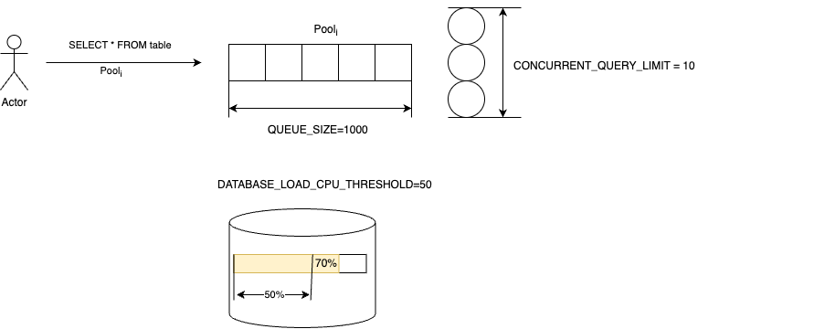
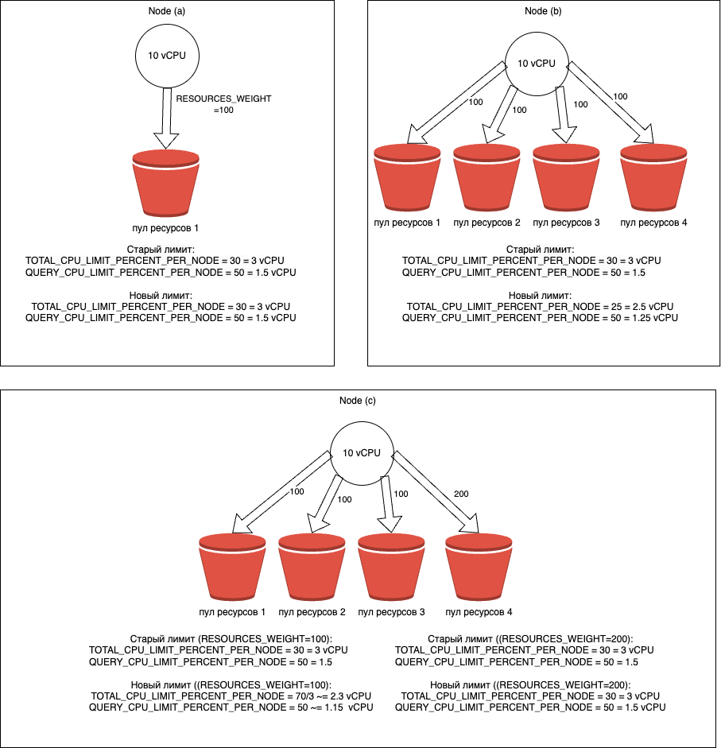

# Управление потреблением ресурсов

Описание сущностей для управления потреблением ресурсов может быть найдено в [пул ресурсов](../concepts/glossary.md#resource-pool) и [классификатор пулов ресурсов](../concepts/glossary#resource-pool-classifier.md)

## Общее описание

Пулы ресурсов позволяют изолировать ресурсы между потребителями или же настраивать стратегии раздачи ресурсов в случае переподписки. Часть из параметров являются глобальными на всю базы данных (`CONCURRENT_QUERY_LIMIT`, `QUEUE_SIZE`, `DATABASE_LOAD_CPU_THRESHOLD`), а другие же применяются только на один вычислительный узел (`QUERY_CPU_LIMIT_PERCENT_PER_NODE`, `TOTAL_CPU_LIMIT_PERCENT_PER_NODE`, `QUERY_MEMORY_LIMIT_PERCENT_PER_NODE`). Сами пулы ресурсов находятся на одном уровне иерархии, подвязывать одни пулы к другим невозможно. Между всеми пулами может разделяться CPU в случае переподписки на одном вычислительном узле с помощью `RESOURCES_WEIGHT`. Подробное описание поведения этих параметров можно найти ниже

## Создание пула ресурсов

В примере ниже приведен синтаксис для создания отдельного пула ресурсов в котором будут выполняться аналитические запросы.
```yql
CREATE RESOURCE POOL olap WITH (
    CONCURRENT_QUERY_LIMIT=10,
    QUEUE_SIZE=1000,
    DATABASE_LOAD_CPU_THRESHOLD=80,
    RESOURCES_WEIGHT=100,
    QUERY_CPU_LIMIT_PERCENT_PER_NODE=50,
    TOTAL_CPU_LIMIT_PERCENT_PER_NODE=70
)
```

Ознакомиться с параметрами пула ресурсов можно [здесь](../yql/reference/syntax/create-resource-pool.md#parameters)



Рассмотрим на примере выше, что же на самом деле означают эти параметры и как они будут влиять на распределение ресурсов. Допустим в базе данных {{ ydb-short-name }} выделено $10$ узлов по $10 vCPU$. В сумме в такой базе данных $100 vCPU$. Тогда на одном хосте для пула ресурсов с именем `olap` будет выделено $\frac{10 vCPU \cdot TOTAL\_CPU\_LIMIT\_PERCENT\_PER\_NODE}{100} = 10 vCPU \cdot 0.7 = 7 vCPU$. В сумме при равномерном распределении ресурсов на всю базу данных будет выделено $7 vCPU \cdot 10 (nodes) = 70 vCPU$. На один запрос в этом пуле ресурсов будет выделено $\frac{10 vCPU \cdot TOTAL\_CPU\_LIMIT\_PERCENT\_PER\_NODE}{100} \cdot \frac{QUERY\_CPU\_LIMIT\_PERCENT\_PER\_NODE}{100} = 10 vCPU \cdot 0.7 \cdot 0.5 = 3.5 vCPU$. Что касается `RESOURCES_WEIGHT`, то он начинает работать только в случае переподписки и когда число пулов в системе $> 1$, подробное описание этого параметра приведено ниже. Перейдем к рассмотрению `CONCURRENT_QUERY_LIMIT`, допустим что в пуле ресурсов `olap` работают уже $9$ запросов, тогда при появлении нового запроса он сразу же перейдет в состояние выполнения параллельно с другими 9-ю запросами. Теперь в пуле уже работает 10 запросов, если же в пул ресурсов будет отправлен 11-й запрос, то он не начнет выполняться, он будет отправлен в очередь ожидания. Когда хотя бы 1 из 10 выполняющихся запросов завершит свое выполнение, то из очереди будет извлечен 11-й запрос и отправлен на выполнение незамедлительно. Если же в очереди уже находится $QUEUE_SIZE = 1000$ запросов, то при отправке на выполнение 1001-ого запроса будет получена ошибка и запрос не будет выполнен. На число параллельно выполняемых запросов влияет не только `CONCURRENT_QUERY_LIMIT`, но еще и `DATABASE_LOAD_CPU_THRESHOLD`

## Как работает DATABASE_LOAD_CPU_THRESHOLD

Когда запрос приходит в пул ресурсов для которого установлен `DATABASE_LOAD_CPU_THRESHOLD`, то для него сразу же резервируется 10% от доступного CPU на узле, в предположении что как минимум столько ресурсов будет потреблено запросом. Дальше на 10-и секундных окнах происходит перерасчет потребляемых ресурсов глобально по всей базе данных, который позволяет уточнить 10% оценку. Это означает, что если на узел кластера одновременно придет больше чем 10 запросов, то не больше 10 запросов будут поставлены на выполнение, а остальные запросы будут ожидать уточнение потребления CPU.


## Пул ресурсов по умолчанию

Даже если ни одного пула ресурсов не было создано, то в системе всегда существует `default` пул ресурсов, который не может быть удален. Любой запрос который выполняется в системе всегда выполняется в некотором пуле, не бывает ситуации когда запрос не принадлежит никакому пулу ресурсов. По умолчанию настройки `default` пула ресурсов выглядят следующим образом:

```yql
CREATE RESOURCE POOL default WITH (
    CONCURRENT_QUERY_LIMIT=-1,
    QUEUE_SIZE=-1,
    DATABASE_LOAD_CPU_THRESHOLD=-1,
    RESOURCES_WEIGHT=-1,
    QUERY_MEMORY_LIMIT_PERCENT_PER_NODE=-1,
    QUERY_CPU_LIMIT_PERCENT_PER_NODE=-1,
    TOTAL_CPU_LIMIT_PERCENT_PER_NODE=-1
)
```

Это означает что никакие ограничения в этом пуле ресурсов не применимы, он живет полностью независимо от других пулов ресурсов, а также не имеет ограничений на потребляемые ресурсы. В `default` пуле ресурсов возможно с помощью конструкции `ALTER RESOURCE POOL` менять параметры за исключением `CONCURRENT_QUERY_LIMIT`, `DATABASE_LOAD_CPU_THRESHOLD` и `QUEUE_SIZE`. Это ограничение было введено преднамеренно для минимизации проблем связанных с некорректной настройкой пула ресурсов по умолчанию.

## Распределение ресурсов в соответствии с RESOURCES_WEIGHT {#resources_weight}



В текущей реализации `RESOURCES_WEIGHT` влияют только на распределение ресурсов `vCPU`. Когда в пуле ресурсов появляются запросы, тогда он начинает участвовать в распределении ресурсов. Для этого в пулах ресурсов происходит перерасчет лимитов в соответствии с алгоритмом [Max-min fairness](https://en.wikipedia.org/wiki/Max-min_fairness) Само перераспределение ресурсов учитывается на каждом вычислительном узле индивидуально. Как показано на рисунке выше. Допустим у нас есть узел в системе для которого доступно $10 vCPU$. И установлены ограничения $TOTAL\_CPU\_LIMIT\_PERCENT\_PER\_NODE = 30$ и $QUERY\_CPU\_LIMIT\_PERCENT\_PER\_NODE = 50$. В этом случае у пула ресурсов будет ограничение $3 vCPU$ на узел и $1.5 vCPU$ на один запрос в этом пуле ресурсов (рисунок а). Если же в системе существует 4 таких пула ресурсов и они все хотят потреблять максимальные ресурсы, то в сумме это $12 vCPU$ что превышает предел доступных ресурсов на узле $10 vCPU$. В этом случае начинают работать `RESOURCES_WEIGHT`. Тогда из $10 vCPU$ пулу будет выделено $2.5 vCPU$ (рисунок b). Если нужно увеличить выделяемые ресурсы для конкретного пула ресурсов, то можно изменить вес для пула, например на 200. Тогда получим $3 vCPU$, а все остальные пулы поделят поровну оставшиеся ресурсы $\frac{7}{3} vCPU$ (рисунок c )



Текущий алгоритм распределения ресурсов может быть изменен в будущем без поддержки обратной совместимости.



## Управление ACL пула ресурсов

Для создания/изменения/удаления пула ресурсов необходимо выдать права доступа в соответствии с разрешениями описанными в [SQL](../yql/reference/syntax/create-resource-pool.md). Например, для возможности создания пулов ресурсов нужно иметь `CREATE TABLE` на директорию `.metadata/workload_manager/pools`

```yql
GRANT CREATE TABLE ON `.metadata/workload_manager/pools` TO user1;
```

## Создание классификатора пула ресурсов

В примере ниже приведен пример классификатора пула ресурсов, который отправляет запросы от всех пользователей в пул ресурсов с именем `olap`
```yql
CREATE RESOURCE POOL CLASSIFIER olap_classifier
WITH (
    RESOURCE_POOL = 'olap',
    MEMBERNAME = 'all-users@well-known'
);
```

*RESOURCE_POOL* - имя пула ресурсов в который будет отправлен запрос, удовлетворяющий требованиям заданным в классификаторе пула ресурсов
*MEMBERNAME* - группа пользователей или пользователь, которые будут отправлены в *RESOURCE_POOL*

## Управление ACL классификатора пула ресурсов

На использование классификатора пула ресурсов нет ограничений, они глобальные на всю базу данных и доступны всем пользователям. Для возможности создавать/удалять/изменять классификатор пула ресурсов необходимо иметь разрешение `ALL` на всю базу.

```yql
GRANT ALL ON `/my_db` TO user1;
```

Для использования классификатора пула ресурсов необходимо чтобы у пользователя был доступ к пулу ресурсов на который ссылается этот классификатор пула ресурсов. Необходимые права доступа для пула ресурсов описаны в разделе выше

## Порядок выбора классификатора пула ресурсов в случае конфликтов

```yql
CREATE RESOURCE POOL CLASSIFIER olap1_classifier
WITH (
    RESOURCE_POOL = 'olap1',
    MEMBERNAME = 'user1@domain'
);

CREATE RESOURCE POOL CLASSIFIER olap2_classifier
WITH (
    RESOURCE_POOL = 'olap2',
    MEMBERNAME = 'user1@domain'
);
```

Допустим имеется два классификатора пулов ресурсов, которые имеют конфликтующие условия. В этом случае один пользователь `user1@domain` подходит под два пула ресурсов: `olap1`, `olap2`. Если в системе до этого не существовало ни одного классификатора пулов ресурсов, то `olap1` выдается `RANK=1000`, а `olap2` выдается `RANK=2000`. Классификаторы пулов ресурсов с меньшим значением имеют более высокий приоритет. В данном примере, так как у `olap1` `RANK` более приоритетный чем у `olap2`, то он и буден выбран. В системе не может существовать два классификатора пула ресурсов с одинаковым `RANK` поэтому эта схема позволяет однозначно определить какой пул ресурсов будет выбран в случае конфликтующих условий.

## Пример CEO пула ресурсов

Рассмотрим задачу распределения ресурсов между командой аналитики и CEO. CEO может потребоваться иметь приоритет над вычислительными ресурсами для аналитических вычислений, при этом полезно иметь возможность утилизировать больше ресурсов кластера, в момент когда CEO не нужны вычислительные ресурсы. Для этого сценария конфигурация может выглядеть следующим образом:

```
CREATE RESOURCE POOL olap WITH (
    CONCURRENT_QUERY_LIMIT=20,
    QUEUE_SIZE=100,
    DATABASE_LOAD_CPU_THRESHOLD=80,
    RESOURCES_WEIGHT=20,
    QUERY_CPU_LIMIT_PERCENT_PER_NODE=80,
    TOTAL_CPU_LIMIT_PERCENT_PER_NODE=100
);

CREATE RESOURCE POOL the_ceo WITH (
    CONCURRENT_QUERY_LIMIT=20,
    QUEUE_SIZE=100,
    RESOURCES_WEIGHT=100,
    QUERY_CPU_LIMIT_PERCENT_PER_NODE=100,
    TOTAL_CPU_LIMIT_PERCENT_PER_NODE=100
);
```

В примере выше создается два пула ресурсов, один `olap` для команды аналитиков, который имеет вес `20` и ограничения на запускаемые запросы при перегрузке базы данных равный 80 процентам. В то же время пул `the_ceo` не имеет таких ограничения и имеет больший вес `80`, который фактически означает что при конкуренции за ресурсы `the_ceo` пул будет получать приоритет больше в `4` раза. Если в оба пула ресурсов поступают запросы, то для них будут рассчитываться новые лимиты, которые для olap подвинут лимит `TOTAL_CPU_LIMIT_PERCENT_PER_NODE` до `20`, а для the_ceo до `80`. В соответствии с распределением весов описанным [выше](resource-pools-and-classifiers.md#resources_weight)

## Диагностика

### План запроса

Подробную информацию о планах запросов можно найти на странице [структура планов запросов](../yql/query_plans.md). Для получения информации о пуле запросов нужно запустить команду с форматом `json-unicode`. Пример команды:

```bash
ydb -p <profile_name> sql -s 'select 1' --stats full --format json-unicode
```

В теле плана запроса от выше приведенной команды можно найти полезные аттрибуты для диагностики работы с пулом ресурсов. Пример такой информации приведен ниже
```json
"Node Type" : "Query",
"Stats" : {
  "TotalDurationUs": 28795,
  "ProcessCpuTimeUs": 45,
  "Compilation": {
    "FromCache": false,
    "CpuTimeUs": 7280,
    "DurationUs": 21700
  },
  "ResourcePoolId": "default",
  "QueuedTimeUs": 0
},
"PlanNodeType" : "Query"
```

Полезные аттрибуты:
    - `TotalDurationUs` - общее время выполнения запроса с учетом ожидания в очереди
    - `ResourcePoolId` - имя пула ресурсов к которому был привязан запрос
    - `QueuedTimeUs` - общее время ожидания в очереди

### Метрики

Информацию о метриках пулов ресурсов можно найти в [справке по метрикам](../reference/observability/metrics/index.md#resource_pools)