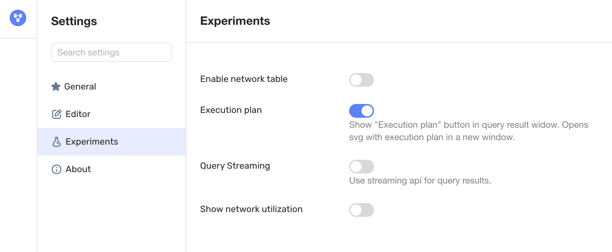
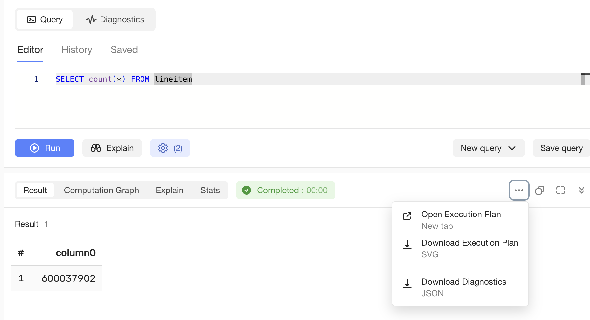

# Как получить графическое представление плана

## UI {#ui}

Для получения графического плана выполнения запроса в [{{ ydb-short-name }} UI](../../reference/embedded-ui/ydb-monitoring.md) необходимо включить настройку ```Experiments | Execution plan```



Если после этого выполнить какой-нибудь запрос, например

```sql
SELECT count(*) FROM lineitem
```

В дополнительном меню в правой части экрана, которое открывается по кнопке [...], появятся новые пункты меню

- ```Open Execution Plan``` открывает план выполнения в новой вкладке браузера
- ```Download Execution Plan``` сохраняет план в виде файла на диск

В этом же меню находится ещё один полезный пункт

- ```Download Diagnostics``` о котором речь пойдёт ниже



План выполнения приведённого запроса будет выглядеть примерно следующим образом (конкретные значения отдельных метрик могут меняться в зависимости от мощности и настроек вашего кластера):

{inline=false}

Вы получили первый план выполнения запроса. Это станет вашим надёжным инструментом быстрого понимания того, как выполняется запрос и диагностики возможных проблемы. Если вам не терпится приступить к исследованию полученного плана, то вы можете перейти в раздел [Структура плана запроса](structure.md). Остаток данного раздела объясняет, как можно получить план, если графический интерфейс недоступен и в вашем распоряжении есть только командная строка.

## ydb cli {#cli}

Если вы используете утилиту командной строки, то вам доступны следующие варианты:

- Для стандартных тестов, например [TPC-H](../../reference/ydb-cli/workload-tpch.md), можно использовать [команду workload](../../reference/ydb-cli/commands/workload/_includes/index.md) с опцией ```--plan``` - ```ydb workload tpch run --plan filename```, в результате чего на локальном диске будут созданы файлы с названием ```filename``` в различных форматах, расширение ```.svg``` соответствует графическому формату

- Для своих собственных запросов можно использовать формат ```ydb workload query run --plan filename```

- Cохранить статистику выполнения в режиме [EXPLAIN ANALYZE](../../reference/ydb-cli/sql.md#options)

```bash
ydb sql --explain-analyze --format json-unicode > filename.json
```

- Собрать расширенную диагностику выполнения запроса

```bash
ydb sql --stats full --diagnostics-file filename.json
```

и использовать эти файлы для преобразование в графический формат SVG как описано ниже

## ydb_int {#ydb_int}

Если у вас есть статистика выполнения вашего запроса в [формате JSON](https://ru.wikipedia.org/wiki/JSON), то вы можете использовать её для преобразования в графический формат. Это может быть

- план + статистика, которые выдаёт EXPLAIN ANALYZE
- план + статистика, который вы сохранили программно из вашего SDK
- расширенная диагностика которую сохраняет ydb cli
- аналогичная расширенная диагностика, которую можно сохранить из UI (показанный выше пункт меню ```Download Diagnostics```)

Преобразование выполняется внутренней утилитой ydb_int

```bash
ydb_int exp json2svg -i filename.json -o filename.svg
```

Такой способ удобен, если вы помогаете исследовать проблему клиенту и при этом не имеете доступа к его кластеру. Следует попросить его собрать расширенную диагностику (через cli или UI) и прислать для изучения.

Аналогичная функциональность скоро появится и в публичном ydb cli

## kqprun {#kqprun}

Если вы используете для разработки утилиту kqprun (это примерно как весь кластер ydb в одном процессе с крайне простым способом запуска), то она тоже поддерживает опцию выдачи и статистики в формате JSON, и сразу же генерацию графического представления плана.
