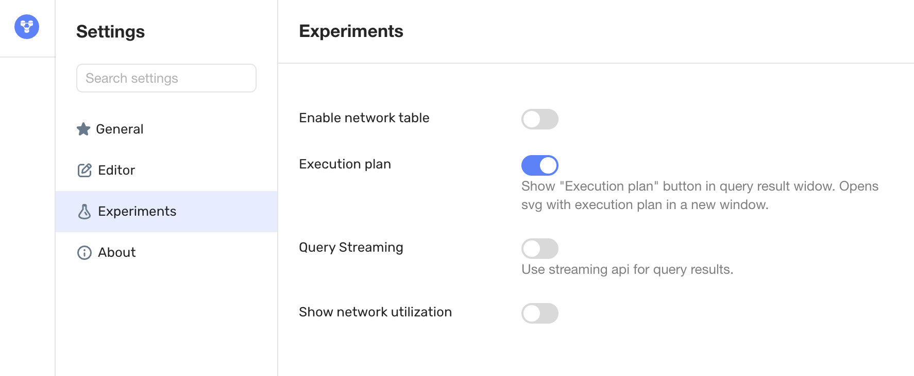
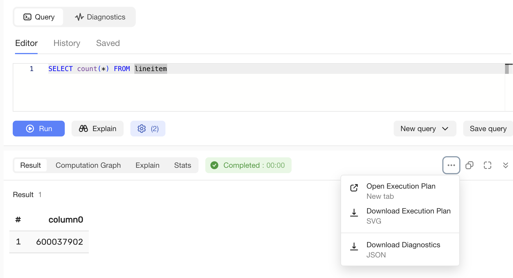

# Как получить графическое представление плана

## UI {#ui}

Чтобы в [{{ ydb-short-name }} UI](../../reference/embedded-ui/ydb-monitoring.md) отображался графический план выполнения запроса, включите настройку ```Experiments | Execution plan```.



Графический план в UI пока относится к экспериментальным возможностям (раздел `Experiments`). Со временем он должен перейти в обычные настройки интерфейса.





После этого выполните запрос, например:

```sql
SELECT count(*) FROM lineitem
```

В дополнительном меню справа (кнопка [...], отображается на всех вкладках интерфейса) появятся пункты:

- ```Open Execution Plan``` — открыть план в новой вкладке браузера;
- ```Download Execution Plan``` — сохранить план в файл.

Там же есть пункт ```Download Diagnostics```.



Для этого запроса план будет выглядеть примерно так (конкретные значения метрик зависят от конфигурации и нагрузки кластера):

{inline=false}

Об элементах диаграммы и их назначениях подробнее написано в статье [Расположение информации на плане](layout.md). Чтобы разобраться в структуре плана и прохождении данных по стадиям, перейдите к разделу [Структура плана запроса](structure.md). Ниже описан альтернативный способ получения плана через ydb cli из командной строки.

## ydb cli {#cli}

Чтобы сохранить графическое представление плана в файл через {{ ydb-short-name }} CLI:

- В сценариях [TPC-H](../../reference/ydb-cli/workload-tpch.md) удобно вызывать [команду workload](../../reference/ydb-cli/commands/workload/index.md) с опцией ```--plan```, например ```ydb workload tpch run --plan filename```. На диске появятся файлы с базовым именем ```filename``` в нескольких форматах; расширение ```.svg``` соответствует графическому представлению.

- Для произвольного запроса в рамках workload: ```ydb workload query run --plan filename```.
