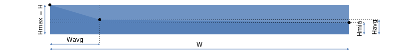
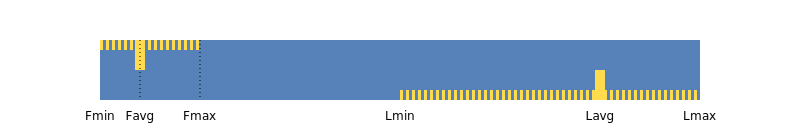
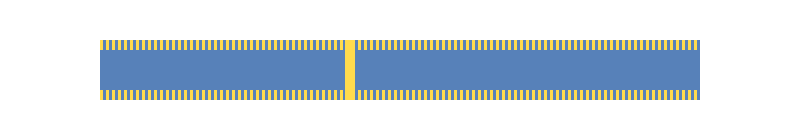

# Визуализация метрик

{{ ydb-short-name }} - это распределённая система, способная обрабатывать данные большого объёма. Для этого [кластер](../../concepts/glossary.md#cluster) может состоять из многих [узлов](../../concepts/glossary.md#node), соответственно, вычислительный граф будет тоже состоять из большого количества (сотен и тысяч) отдельных задач, каждая из которых собирает и выдаёт некоторое количество метрик. Показать все метрики по отдельности, а тем более делать выводы на основании такого объёма данных невозможно, поэтому метрики отдельных задач агрегируются (по каждой стадии) и сообщаются в ответе, а также визуализируются в агрегированном виде. В данном разделе мы познакомим с основными принципами агрегации и визуализации, которые позволяют быстро оценить диаграмму и выделить проблемные места в запросе.

## Параллельность {#parallelism}

Уровень параллельности (количество одновременно работающих) задач на графической диаграмме показывается в столбце ```Tasks```. Для [стадий](../../concepts/glossary.md#processing-stage) хранения данный параметр соответствует количеству [шардов](../../concepts/glossary.md#data-shard). Полосатый шаблон "зебра" в левой части этого столбца показывает количество финишировавших задач в пропорции к их общей численности. На графике финишировавшего запроса этот шаблон закрашивает всю высоту стадии, но для промежуточных графиков, показываемых во время работы запроса, он будет другим. Понять точно количество завершенных задач можно, если навести курсор на эту область.

{inline=false}



Цветовая раскраска столбца обусловлена интенсивностью потребления CPU и возможными простоями задач в стадии, как это обсуждается в [следующем разделе](#aggregates).



## Агрегаты {#aggregates}

Для всех метрик, которые показываются в статистике, вычисляются и репортятся следующие агрегаты (имеющие точные соответствия одноимённным агрегатам SQL):
- минимальное значение ```MIN```;
- максимальное значение ```MAX```;
- количество метрик ```COUNT```;
- сумма всех значений ```SUM```;
- среднее значение ```AVG``` как производное от ```COUNT``` и ```SUM```.

Если количество каких-то метрик меньше, чем количество задач в стадии (некоторые задачи не сообщили данную метрику), то такая ситуация считается подозрительной. На графической диаграмме рядом с соответствующей метрикой появляется красный круг с количеством ```COUNT```. При наведении на него курсора во высплывающем окне будут показаны подробности расхождения.

Когда ```COUNT``` совпадает с количеством задач (это считается основным случаем), отдельно ничего нигде не показывается, чтобы не занимать полезное место и не отвлекать внимание. По умолчанию показывается суммарное значение (SUM), а если навести курсор, то всплывёт детализация в формате ```SUM, MIN | AVG | MAX```. Если же метрику сообщила только 1 задача, то ```MIN```, ```AVG``` и ```MAX``` тоже опускаются за ненадобностью, остаётся только ```SUM```, которая, очевидно, совпадает со значением метрики.

Кроме того приняты следующие соглашения

- численные метрики (количество строк) показываются со стандартными суффиксами ```K```, ```M``` и соответствуют множителям 10^3, 10^6 и так далее;
- объём (переданных данных или потреблённой памяти) дополняется суффиксами ```KB```, ```MB``` и соответствуют множителям 2^10 == 1024, 2^20 == 1024^2 и так далее;
- время форматируется в близком к натуральному восприятию часы-минуты-секунды.

## Масштаб метрик {#scale}

В колонке ```Stages``` для каждой стадии отображаются последовательно сверху вниз следующие метрики:

- ```Egress``` (тёмно-синего цвета) - передача данных "через границу подсистемы" (из хранилища в вычислительную стадию и наборот);
- ```Output``` (синего цвета) - передача данных в следующую вычислительную стадию или выдача готового результата;
- ```Memory``` (тёмно-песочно-красного цвета) - потребление памяти;
- ```CPU``` (песочно-красного цвета) - потребление вычислительной мощности;
- ```Input``` (зелёного цвета) - приём данных из другой вычислительной стадии;
- ```Ingress``` (тёмно-зелёного цвета) - приём данных "через границу подсистемы".

Не у всех стадий доступны все метрики. Вычислительные стадии в обязательном порядке содержат ```Memory``` и ```CPU```. Также они могут содержать не более одной из стадий ```Egress``` и ```Ingress```. Вычислительная стадия может содержать несколько входов ```Input``` - они все будут перечислены отдельно и несколько выходов ```Output```, но на графике будет показан только один из выходов, а оставшиеся будут визуализированы в связанных с этой стадией "клонах", как это обсуждалось в разделе [Множественные выходы](structure.md#multiout)

Кроме того, что для метрики показывается её суммарное значение, для облегчения визуального восприятия каждая метрика иллюстрируется полосой соответствующего цвета. При этом одинаковые суммарные метрики для всех стадий одного вычислительного графа сравниваются между собой. У той стадии, у которой эта метрика имеет максимальное значение, полоса занимает всю ширину колонки ```Stages```, а размер полос остальных стадий рисуется пропорционально максимуму. Такой способ показа позволяет быстро понять, какая стадия вычислений потребила больше всех памяти или процессорного времени, сгенерировала больше всех данных и так далее.



Масштаб визуализации разных метрик не кореллирует между собой. То есть размеры цветовых полосок, например, для исходящего трафика ```Output```, общем случае, могут быть не связаны с размером входящего трафика ```Input```, они нормируются и масштабируются независимо друг от друга. Чаще всего они показаны в одинаковом масштабе по причине того, что максимальный трафик на выходе одной стадии является максимальным трафиков на входе другой стадии, но допустимы и другие ситуации.



## Перекос данных {#dataskew}

При параллельной обработке важно, чтобы задачи, которые работают вместе начинали и заканчивали своё выполнение примерно одинаково. Если одна или несколько задач занимают больше времени, то, скорее всего, граф вычислений не сможет продолжить работу, пока не финиширует самая последняя задача в стадии. Время работы стадии определяется "самой медленной задачей".

Поэтому при визуализации метрик, кроме собственно ```SUM```, которая определяет размер цветной полоски, на основании остальных агрегатов рассчитывается ломаная линия и часть полосы выше ломаной линии рисуется более светлого цвета

- ```MAX``` задаёт масштаб общий, ломаная линия всегда начинается из левого верхнего угла
- ```MIN``` определяет высоту на правой границе полоски, расстояние от нижнего угла до этой точки пропорционально соотношению ```MIN/MAX```, например, если ```MIN``` в 2 раза меньше чем ```MAX```, то конечная точка ломаной будет ровно посередине правой границы полоски
- ```AVG``` одновременно задаёт горизонтальную и вертикальную координаты в диапазоне между ```MIN``` и ```MAX```

{inline=false}

```
Hmax = H
Hmin = MIN * H / MAX
Havg = AVG * H / MAX
Wavg = (AVG – MIN) * W / (MAX – MIN)
```

Проиллюстрируем сказанное на конкретных примерах

1. Все метрики одинаковы между собой, поэтому ```MIN == AVG == MAX```, поэтому ломаная линия превращается в горизонтальную линию, совпадающую с верхним краем цветной полоски, светлой области, которая должна быть выше данной линии не будет совсем. Это идеальный вариант, все задачи получили одинаковый объём данных, или проработали одинаковое время или потребили одинаковое количество памяти.

{inline=false}

```
MAX = 100
AVG = 100
MIN = 100
```

2. ```MIN < MAX```, но разница между ними невелика. То есть разброс есть, но он относительно небольшой. В этом случае значение ```AVG``` тоже не важно, разброс считается несущественным, а на цветной полоске будет небольшой светлый участок в правом верхнем углу.

{inline=false}

```
MAX = 100
AVG = 90
MIN = 80
```

3. ```MIN << MAX```, то есть между минимумом и максимумом большой разброс, и тут уже важно значение ```AVG```. Если оно ближе к максимуму, то большинство задач были загружены примерно одинаково, только лишь одна или несколько оказались более свободны, то это тоже несущественный перекос, потому что даже если бы мы и смогли перераспределлить нагрузку свободным задачам, они не сильно ускорили бы общее время работы всей стадии.

{inline=false}

```
MAX = 100
AVG = 90
MIN = 20
```

4. А вот если ```MIN << MAX``` и при этом ```AVG``` гораздо ближе к минимальному значению, то это явный признак наличия небольшого количества перегруженных задач, и устранение перекоса (перераспределение нагрузки от этих задач в пользу большого количества простаивающих) должно существенно сократить общее время работы всей стадии.

{inline=false}

```
MAX = 100
AVG = 30
MIN = 20
```

Изложенные сценарии можно сократить до очень простого критерия - чем большую площадь светлой части полоски вы наблюдаете на диаграмме, тем хуже у вас ситуация с неравномерностью данных, и тем больше внимания она заслуживает. Значительные перекосы автоматически выделяются на графике красным кругом с надписью ```S``` (data skew).



Численное суммарное значение метрики выводится поверх обсуждаемого прямоугольника и загораживает его часть. Но при этом либо весь прямоугольник небольшого размера, то есть он вносит критическую составляющую в общее поведение графа вычислений, либо закрытой оказывается его правая часть, которая не важна для быстрой оценки. Способ визуализации был специально выбран такой, чтобы основная информационная нагрузка оказалась бы в свободной правой части.



## Перекос времени {#timeskew}

Аналогичная неравномерность может наблюдаться и в разрезе времени выполнения. Если задачи получили одинаковый объём данных и потребили одинаковое количество памяти и процессорного времени, но имели разную продолжительность, например из-за того, что какая-то задача попала на перегруженный узел и была вытеснена другими задачами, то это тоже проблема неравномерного выполнения, которая, однако, не будет заметна на обсуждаемых в [предыдущем разделе](#dataskew) метриках.

Обнаружить подобную ситуацию можно только изучив сенсоры о времени работы задач, отображаемых в самой правой колонке графика. Эта колонка отображает состояние графа вычислений во времени - когда каждая стадия начала работу, когда закончила, и так далее. Строго говоря, описанная ситуация перекоса по времени без перекоса по данным - это скорее исключение. Обычно оба вида неравномерности наблюдаются одновременно. По этой причине сначала следует диагностировать перекос по данным.

Визуализация перекоса на временной шкале проще для понимания, чем визуализация перекоса данных. Например, для каждого [канала](../../concepts/glossary.md#channels) каждая задача сообщает метрики ```FirstMessage``` (сокращённо ```F```) и ```LastMessage``` (```L```) - времена обработки первого и последнего сообщения соответственно. Минимальное значение ```FirstMessage``` или ```Fmin``` задаёт начало активности всех задач в стадии, а максимальное значение ```LastMessage``` или ```Lmax``` - соответственно окончание активности всех задач в стадии. Но кроме них остаются другие агрегаты. Поэтому на схеме дополнительно показываются две "зебры" жёлтого цвета - от ```Fmin``` до ```Fmax``` по верхнему краю прямоугольника и от ```Lmin``` до ```Lmax``` по нижнему. А в точках, соответствующих ```Favg``` и ```Lavg``` добавляются вертикальные штрихи до середины прямоугольника.

{inline=false}

Такой формат сам по себе является достаточно естественным для восприятия и не требует такого подробного объяснения как формат визуализации перекоса по данным.

У этого формата есть один специальный случай, который может представлять дополнительный интерес, когда обе зебры растягиваются на всю ширину полосы, а вертикальные штрихи попадают точно друг под друга (и это не обязательно строго середина диапазона). Что такого особенного в этом графике?

{inline=false}



Такое случается, когда для каждой задачи внутри стадии ```FirstMessage == LastMessage```, то есть было отправлено или принято ровно одно сообщение. Это может наблюдаться при обмене небольшим количеством данных, когда для пересылки всего объёма данных от одной задачи к другой хватает одного сообщения.



## Потребление CPU {#cpu}

Рассмотрим более внимательно потребление процессорного времени на примере запроса, исследованного в разделе [Структура плана запроса](structure.md), а именно стадии ```0```. Потребление — это утилизация ресурсов процессора (либо нескольких) во время выполнения полезной работы. Если стадия простаивает, то она не потребляет CPU. Если она работает, то потребление всех задач в стадии агрегируется обычным образом.

{inline=false}

Понятие "степени загруженности" отдельной стадии и всего вычислительного графа в целом достаточно сложное, так как зависит от большого количества факторов, включая даже нагрузку на кластере от параллельно работающих других запросов. Чтобы лучше понимать, что происходит с потреблением процессорного времени, используется несколько метрик.

Кроме потребления в колонке ```Stages```, в самой правой колонке показывается график потребления во время работы запроса. На нём видны те промежутки времени, когда задачи потребляли больше процессорного времени, а когда меньше (песочно-красного цвета) или даже простаивали в ожидании данных (области зелёного цвета). Если бы задачи стояли по back pressure, то могли бы еще быть и области синего цвета, сейчас нам интересно именно потребление.

Стадия ```0``` в итоге потребила 5.35 секунд процессорного времени. При этом стадия ```1``` потребила чуть меньше, 4.05 секунд, но при этом она работала гораздо меньше по времени. Чтобы уметь сопоставлять уровни нагрузки разных стадий, для них вычисляется пропускная способность (throughput) как количество строк на входе (или их сумма если входов несколько) в астрономическую секунду. В зависимости от этого показателя, фон столбца ```Tasks``` окрашивается более интенсивно. На диаграмме мы сразу видим разницу в пропускной способности между стадией ```1``` у которой она составляет 466 миллионов строк в секунду и стадией ```0``` которая обрабатывала данные с существенно более низкой скоростью 58 миллионов строк в секунду.

В данном случае мы наблюдаем соответствие между двумя разными метриками - количеством потреблённых тактов процессора и количеством обработанных строк, отнормированными относительно продолжительности работы каждой стадии и можем делать выводы об уровне загрузке стадий, что важно при определении узкого места в графе вычислений.

А пока стоит заметить что графики потребления CPU различных стадий имеют разный масштаб, они всегда автоматически маштабируются, чтобы самые высокие пики заполнили всю высоту доступной для этого области. За этим стоит всё то же соображение полезности, потребление между стадиями может отличаться на несколько порядков, если бы мы все отображали в едином масштабе, то скорее всего для большинства ненагруженных стадий эти графики оказались бы бесполезны.

Это хорошо иллюстрируется графиком суммарного потребеления по кластеру, который выводится в верхней области. Достаточно большие всплески в стадии ```0``` в районе второй секунды работы на суммарном графике видны как еле заметный выступ. А всё потому что в момент окончания запроса основным потребителем была стадия ```1```. Если бы график потребления стадии ```0``` имел бы тот же самый масштаб, то он весь был бы похож на этот небольшой выступ.

## Потребление памяти {#memory}

Потребление памяти является, вероятно, самой простой в понимании метрикой, потому что этот ресурс гораздо менее эластичный, чем потребление процессорного времени, и в большинстве случае задачи освобождают занятую память только в конце своего выполнения. Точно так же как и потребление CPU, график каждой стадии имеет свой собственный масштаб.
