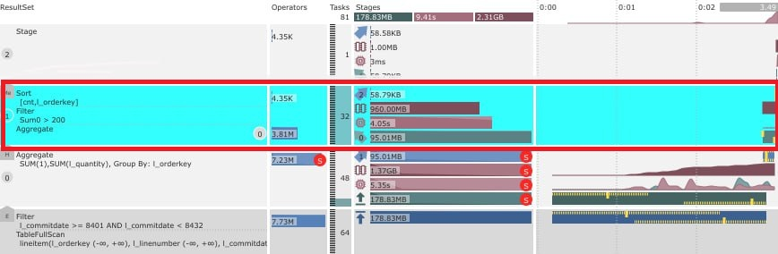
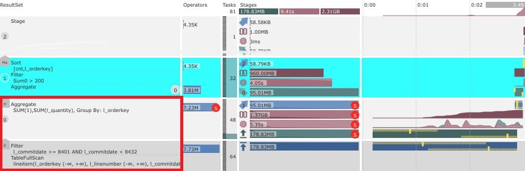
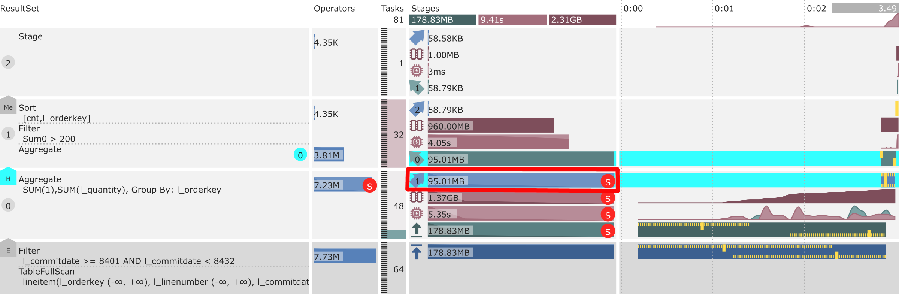
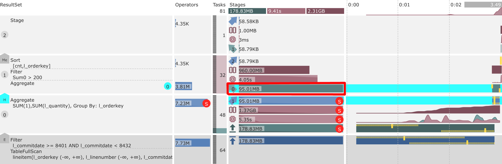
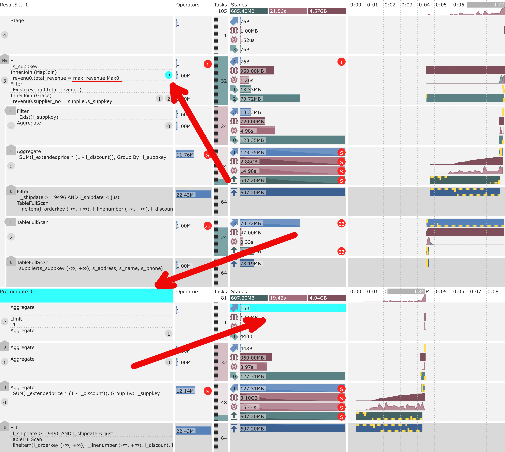

# Структура плана запроса

## Стадии {#stages}

Возьмём более сложный запрос и посмотрим, как это будет выглядеть в графическом представлении

```sql
SELECT count(*) cnt, l_orderkey, sum(l_quantity)
  FROM lineitem
  WHERE l_commitdate >= date("1993-01-01") and l_commitdate < date("1993-02-01")
  GROUP BY l_orderkey
  HAVING sum(l_quantity) > 200
  ORDER BY cnt DESC, l_orderkey
```

{inline=false}

В приведённом примере есть три вычислительные [стадии](../../concepts/glossary.md#processing-stage) ```0```, ```1``` и ```2```, а также стадия, связанная с таблицей ```lineitem``` (такие стадии не нумеруются). Кроме того, любая стадия может быть временно выделена для удобства исследования. В приведённом примере выделена стадия ```1```.



Интерактивное выделение стадий недоступно для планов, встроенных в документацию. Можно открыть любой из приведённых здесь планов в отдельной вкладке или странице, тогда эти возможности станут доступны.



На рисунке показана структура графа вычислений, который получился в результате компиляции запроса. При компиляции запрос структурно разбивается на логические операторы. Для каждого логического оператора создаётся один или несколько физических операторов, которые объединяются в стадии выполнения запроса.

Стадия представляет собой неделимую программу, но в силу распределённого характера {{ ydb-short-name }} обычно включает несколько параллельно выполняемых задач — возможно, на разных узлах. Поток данных передаётся от стадии к стадии и, в общем случае, образует [DAG](https://ru.wikipedia.org/wiki/Ориентированный_ациклический_граф), но пока что представлен более простой случай, все стадии обрабатывают данные последовательно. Поток данных направлен снизу вверх, от хранилища данных до результата выполнения запроса.



На графе отображаются стадии двух типов

1. Часть которая выполняется непосредственно в системе хранения ([колоночные таблицы](../../concepts/glossary.md#column-oriented-table) или [шарды](../../concepts/glossary.md#data-shard)) выделяется более тёмным цветом
2. Часть, которая не хранит, а только обрабатывает данные (компьют) выделяется более светлым цветом, такие стадии нумеруется последовательно, начиная с ```0```.



Если кратко описать, что происходит на этом плане, то получится следующее (напоминаем, что список на этой странице идёт сверху вниз, но данные на графике, а также операторы и стадии расположены в обратном порядке и сопоставлять этот перечень следует начиная с самого низа графика):

1. Таблица ```lineitem``` полностью сканируется (перебираются все строки), потому что условие ```WHERE``` не использует [первичный ключ](../../concepts/glossary.md#primary-key) данной таблицы;
2. Данные фильтруются по условия относительно поля ```l_commitdate```, это происходит непосредственно в месте хранения (пушдаун предиката) для экономии объема передаваемых данных
3. В стадии ```0``` выполняется предварительная агрегация данных с группировкой по полю ```l_orderkey``` (как это и указано в части ```GROUP BY```)
4. Далее данные перераспределяются (шаффл) в стадию ```1```, подробнее это обсуждается в следующем разделе
5. В стадии ```1``` выполняется финальная агрегация данных, дополнительная фильтрация (согласно условию ```HAVING```) и локальная сортировка
6. Последняя стадия ```2``` объединяет отсортированные потоки данных в одну глобально отсортированную последовательность, которая и возвращается в качестве результата



Если непонятно, что означает тот или иной графический элемент, поместите над ним указатель мыши. Большинство элементов имеют соответствующие подсказки с дополнительными пояснениями или уточнениями, которые будут показаны во всплывающем окне. Это не полноценная замена детального описания, но помогает быстро вспомнить суть и основные метрики.



## Каналы связи {#connections}

Теперь рассмотрим тот же самый запрос, но с точки зрения связи между отдельными стадиями. Если стадии - это вершины нашего графа вычислений, то есть ещё [каналы связи](../../concepts/glossary.md#channels), рёбра данного графа, обеспечивающие передачу данных между стадиями.

Соединению соответствует пятиугольник, образно показывающий направление передачи данных в графе. В данном экземпляре графа выделено соединение между стадиями ```0``` и ```1```.

{width = 100 height = 100}

У линейного графа выполнения, состоящего из четырёх стадий обработки, имеется 3 соединения:

1. Соединение ```E``` это загрузка данных из хранилища (внешнего по отношению к компьюту)
2. Соединение ```H``` это hash shuffle, распределение данных по одному или нескольким полям (список полей будет показан во всплывающем окне при позиционировании курсора мыши над символом содеинения)
3. Соединение ```Me``` это операция объединения (merge) сортированных потоков данных. Для данного вида соединения также указывает поле (или несколько полей), в отношении которых происходит сортировка данных

{inline=false}

Соединение состоит из двух частей:

1. Выходной канал. В приведённом примере он передаёт исходящий трафик из стадии ```0```. Этот канал изображается синим цветом и направленной вправо и вверх стрелкой, на которой отображается номер стадии получателя, в данном случае ```1```.



1. Входной канал. В приведённом примере он принимает трафик в стадию ```1```. Канал изображается зеленым цветом и направленной влево и вверх стрелкой, на которой отображается номер стадии отправителя, в данном случае ```0```.



Объём переданных данных в исходящем и входящем каналах на графике успешно завершённого запроса должен совпадать, {{ ydb-short-name }} обеспечивает надёжную передачу данных между [узлами](../../concepts/glossary.md#node), без потерь и дубликатов. Но другие характеристики могут существенно отличаться и предоставляют дополнительную информацию о том, как выполнялся запрос.

В процессе работы показатели исходящего и входящего канала могут не совпадать из-за естественного отставания входа от выхода и асинхронного режима обновления статистики выполнения запроса. Точно также график неуспешного запроса может содержать отличия между этими двумя группами метрик.

Важным элементом является соответствие входного канала оператору, который обрабатывает поступившие данные. В нашем простом примере стадии содержат всего один входящий канал, данные которого приходят в этом канале связи, передаются на первый в очереди обработки (самый нижний в списке) оператор внутри стадии. Но в более сложных графах стадии могут содержать несколько входов. Для того, чтобы точно понимать связи, в правой части оператора отображается тот же самый номер стадии с исходящим каналом, в данном случае это ```0``` и подсвечивается при выборе канала связи. Более наглядный пример будет показан в [следующем разделе](#join).

Чтобы подытожить пример, выбранный канал связи:

1. Начинается из стадии ```0``` в направлении стадии ```1```
2. Проходит через hash shuffle партиционирование
3. Приходит в стадию ```1``` из стадии ```0```
4. И попадает в оператор агрегации

Такие же каналы на логическом уровне существуют между стадией хранения и первой вычислительной стадией, куда этот трафик поступает. Они имеют технические особенности, отличающие их от каналов связи между двумя вычислительными стадиями, один из которых был [рассмотрен выше](#stages). Например, планировщик {{ ydb-short-name }} старается располагать задачи из связанных таким каналом стадий на одних и тех же узлах, то есть размещать вычислительные задачи рядом с шардами хранения для минимизации сетевого трафика.

Но на логическом уровне они очень похожи, поэтому визуализируются схожим образом. Для быстрого различения используются более тёмные тона, другие пиктограммы, а также скрывается нумерация парных стадий. На данный момент вычислительная стадия может быть связана только с одной стадией хранения, данные из которой всегда поступают в самый первый (нижний) оператор стадии, поэтому дополнительная навигация в данном случае не требуется.

## Объединение стадий {#join}

Давайте рассмотрим запрос, который использует оператор объединения (```JOIN```) набора данных из двух таблиц. Такой оператор уже не может быть представлен линейной последовательностью стадий выполнения.

```sql
SELECT n_name
  FROM nation
  JOIN region ON nation.n_regionkey == region.r_regionkey
  WHERE r_name = "AMERICA"
```

Обе используемые таблицы, ```region``` и ```nation``` очень маленькие, всего 5 и 25 строк соответственно. Поэтому запрос выполняется очень быстро, а обрабатываемый трафик крайне мал. Но это не делает запрос менее ценным с точки зрения исследования его структуры.

{inline=false}

На графе стадия ```2``` (изначально выделена) объединяет данные от стадий ```0``` и ```1```. Стадии всё ещё выстроены вертикально, но связь между ними нелинейная. Вместо этого применяется топологическая сортировка - выход любой стадии связывает её со входом другой стадии, которая строго выше исходной на графе. Таким образом, сохраняется принцип распространения данных снизу вверх. Если стадия принимает входы от двух и более других стадий, то она формирует обрамляющий отступ в левой части изображения, а входящие соединения рисуются пятиугольником направленным влево. Тут два таких соединения ```H``` - hash shuffle.

 {width = 100 height = 100}

Входные данные объединяются в операторе InnerJoin (соответствует ```JOIN``` в тексте запроса). Вместе с этим оператором показаны ключи из двух потоков, по которым осуществляется сопоставление, ```n_regionkey``` и ```r_regionkey```, а в правой части показаны номера соответствующих стадий, ```0``` и ```1```.

Ещё одним новшеством на данном графике являются красные круги с цифрами ```1``` и ```4```. Как было сказано выше, каждая стадия может содержать несколько параллельно работающих задач. Подобные отметки появляются в том случае, если количество ненулевых метрик (в данном случае это трафик в каналах) меньше общего количества задач. Они указывают на то, что часть задач не была задействована в обработке данных. Часто это может сигнализировать о проблемах, поэтому следует обращать на них внимание и пытаться понять причину этого явления.

На данном графике два разных случая. Первый - это небольшое количество данных. Если посмотреть на степени параллельности (столбец ```Tasks```), то можно заметить, что:

1. Внешние стадии имеют параллельность 1, то есть обе таблицы, ```region``` и ```nation``` состоят из 1 шарда. Это неудивительно, так как они содержат всего 5 и 25 записей.
2. При этом для каждой внешней стадии в соответствующих "читающих" вычислительных стадиях (с номерами ```1``` и ```0```) было создано по 3 задачи. В случае большого количества записей даже в одном шарде, трафик между этими тремя задачами балансировался бы, и все они примерно равномерно участвовали в обработке.
3. В данном случае все записи уместились в один отправляемый пакет, который был отправлен из колоночного шарда в какую-то одну из трёх созданных задач, а двум остальным просто не досталось никакого трафика, поэтому они ничего и не отправили в статистику.

Второй случай выглядит интереснее. Чтобы корректно реализовать оператор ```JOIN```, все строки с одинаковыми значениями ключей сравнения должны попасть в одну и ту же задачу, причём от обоих входов. Для этого используется тип соединения hash shuffle, который детерминированно вычисляет хеш от всех ключей и использует данное значение чтобы определить номер задачи, в которую следует отправить данную строку. Для одинаковых наборов ключей всегда будет одно и то же значение хеш функции, поэтому они будут отправлены в какую-то одну задачу внутри стадии.

Но количество разных значений хеш функций не может превышать количество уникальных ключей, использованных для hash shuffle. Из таблицы ```region``` мы выбрали всего одну строку, которая в итоге и была отправлена только в одну задачу. Поэтому значок ```1``` на входе в стадию ```2``` вызван низкой кардинальностью поля ```r_regionkey```, использованного для хеширования.

С другой стороны, из таблицы ```nation``` были выбраны все имеющиеся там значения ключа ```n_regionkey``` который использовался для хеширования, эти данные получили только 4 задачи. Всего же задач для стадии объединения было создано 8, что больше 1 и 4, поэтому данные были присланы только в 4 задачи из 8, а успешное объединение данных выполнила только 1 задача, та, которой повезло получить строку из таблицу ```region```, именно эта задача выдала 5 строк результата, а выход стадии ```2``` также получил отметку ```1```.



Если вы внимательно изучите содержимое таблиц ```region``` и ```nation```, то обнаружите, что в каждой из них содержится по 5 различных значений ключей ```r_regionkey``` и ```n_regionkey``` соответственно. Почему же тогда трафик из таблицы ```nation``` распределился не на 5, а всего на 4 задачи???



## Множественные выходы {#multiout}

[Ранее](#stages) было сказано, что граф вычислений образует DAG. Но все примеры выше имели более простую структуру - или элементарная линейная последовательность или дерево. Пора рассмотреть более сложную ситуацию. Предположим, что наш запрос устроен таким образом, что он дважды читает одну и ту же таблицу. Может оказаться, что выгодно прочитать данные один раз и потом отправить их двум (или более) потребителям. Тогда поток данных разделяется и где-то выше обязательно соединяется обратно, образуя ромбовидную топологию.

Визуализировать такую структуру сложно, поэтому при построении графического плана такие стадии "клонируются" - один экземпляр отображается как основной, другие считаются дублями и показывают сокращённую статистику, только соответствующий выход. В качестве примера возьмём оригинальный запрос TPC-H Q17, адаптированный для синтакиса {{ ydb-short-name }}:

```sql
SELECT SUM(l_extendedprice) / 7.0 AS avg_yearly
  FROM lineitem
  CROSS JOIN part
  CROSS JOIN (
    SELECT l_partkey, 0.2 * AVG(l_quantity) AS quantity_threshold
      FROM lineitem
      GROUP BY l_partkey
    ) AS threshold
    WHERE part.p_partkey = lineitem.l_partkey
      AND p_brand = 'Brand#35'
      AND p_container = 'LG DRUM'
      AND l_quantity < quantity_threshold
      AND part.p_partkey = threshold.l_partkey
```

{inline=false}

В этом запросе данные из таблицы ```lineitem``` вычитываются только один раз в стадии ```0```, а используются дважды: в стадии ```1``` и в стадии ```3```. На плане это показано двойным включением стадии ```0```:

- один экземляр считается основным и содержит полный набор метрик, включая все входы и потребеление CPU и памяти;
- все остальные экземпляры отображаются как "клоны", в обычном состоянии отображаются тем же самым цветом, что и внешние стадии и содержат только одну метрику - отдельный выход, который связан с данной стадии.

Для упрощения навигации выбор любой области, основной или клона, подсвечивает их всех. А (множественные) выходы - независимо друг от друга, что позволяет отслеживать, какой именно выход куда подключён.



Попробуйте понять, почему через выход из "основной" стадии передано 7.75GB данных, а из клона 14.41GB. В сложных планах трафик на отдельных выходах может дополнительно фильтроваться и передавать разное количество строк, но в данном примере этого не было.



Оптимизатор способен объединять вместе и дедуплицировать не только чтение из внешнего хранилища, но также и целые поддеревья графа вычислений. Это можно хорошо наблюдать в запросе TPC-H Q21.

## Составные графы {#complex}

Рассмотренные выше примеры состояли из одного графа вычислений. Сложные запросы могут содержать несколько графов. Например, вы можете просто написать несколько SQL выражений вместе и выполнить их за один вызов. При этом сервер разделит весь запрос на отдельные выражения и выполнит их последовательно. На графике у вас будет несколько графов вычисления, никак не связанных между собой. Сначала выполняется один, потом другой, например:

```sql
SELECT count(*) FROM lineitem;
SELECT count(*) FROM orders;
```

Соответствующий данному тексту график выполнения выглядит следующим образом:

{inline=false}

В более сложных случаях одно выражение SQL может состоять из нескольких графов выполнения. Оптимизатор может решить, что выгоднее сначала выполнить часть выражения, получить промежуточный результат и использовать его далее для получения нужного пользователю результата. Эта часть называется прекомпьютом. Она выполняется как отдельный граф вычислений, но не является независимой: результат прекомпьюта передаётся в следующий граф. В качестве примера рассмотрим другой запрос, TPC-H Q15, также адаптированный для синтаксиса {{ ydb-short-name }}:

```sql
$revenue0 = (
  SELECT l_suppkey AS supplier_no, sum(l_extendedprice * (1 - l_discount)) AS total_revenue
    FROM lineitem
    WHERE l_shipdate >= date('1996-01-01') AND l_shipdate < date('1996-01-01') + interval('P90D')
    GROUP BY l_suppkey
);

SELECT s_suppkey, s_name, s_address, s_phone, total_revenue
  FROM supplier
  CROSS JOIN $revenue0 AS revenu0
  CROSS JOIN (
    SELECT max(total_revenue) AS max_total_revenue
      FROM $revenue0
    ) as max_revenue
  WHERE s_suppkey = supplier_no AND total_revenue = max_total_revenue
  ORDER BY s_suppkey;
```

{inline=false}

Чтобы понять связь между прекомпьютом и основным графом, достаточно выделить название прекомпьюта или его исходящий канал с результатом. Они будут подсвечены на графике вместе с тем входом оператора, который получает данные от этого прекомпьюта. Этот вход будет отмечен символом ```P``` на графе вычислений. В данном случае это стадия ```3``` основного (верхнего) графа вычислений, значение, полученное в прекомпьюте используется как правая часть для Map Join.

{inline=false}

Ещё более сложные запросы (например, из промышленного бенчмарка TPC‑DS) могут содержать несколько прекомпьютов. Эти прекомпьютеры могут выполняться как последовательно, так и параллельно. При этом результат передаётся в следующую стадию, либо из одной стадии выходит несколько результатов. На основе этих выходов рассчитывается несколько значений прекомпьютов. Мы тщательно изучили все полученные сложные случаи и спроектировали такой формат отображения, который позволяет легко понять итоговую структуру выполнения и соответствие её отдельных частей реально выполняемым задачам на кластере {{ ydb-short-name }}.
