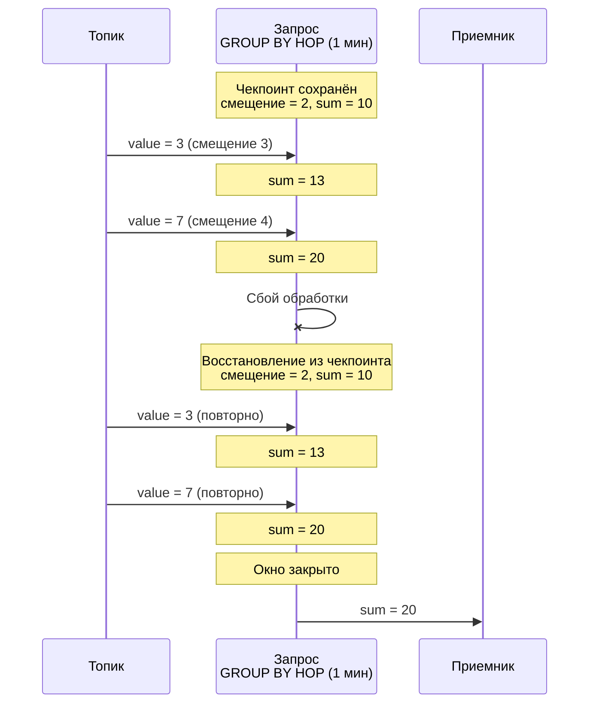
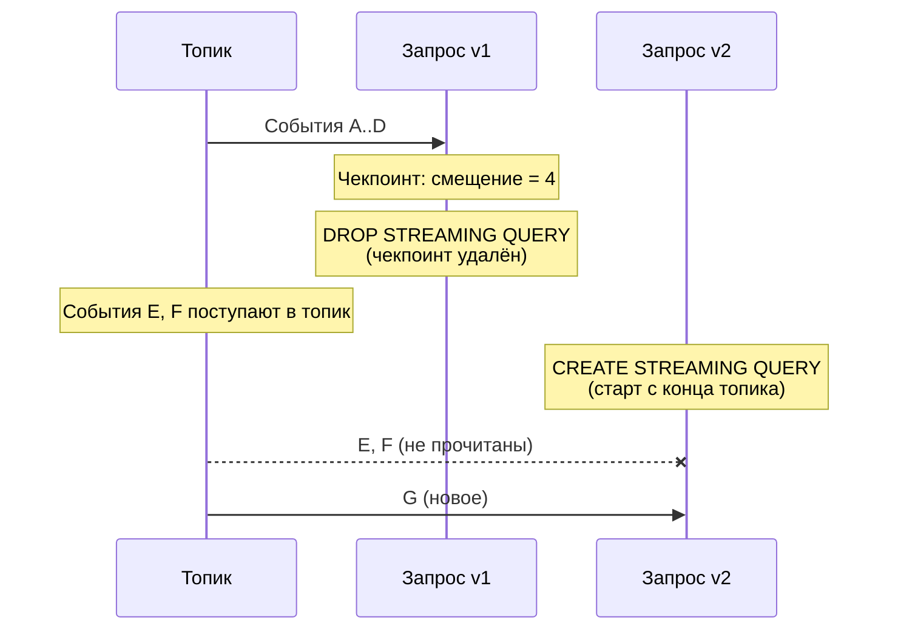

# Чекпоинты

Чекпоинт — это сохранённое состояние работающего [потокового запроса](../../concepts/streaming-query.md), необходимое для восстановления после сбоев обработки. {{ ydb-short-name }} периодически сохраняет чекпоинты всех запущенных потоковых запросов.

## Содержимое чекпоинта {#contents}

Чекпоинт содержит:

- [смещения](../../concepts/datamodel/topic.md#consumer-offset) во входных топиках — позиции, до которых события были прочитаны и обработаны;
- состояния агрегаций — промежуточные результаты операций, например накопленные значения в [GROUP BY HOP](../../yql/reference/syntax/select/group-by.md#group-by-hop).

{{ ydb-short-name }} хранит смещения чтения в собственных чекпоинтах, а не полагается на смещения [потребителя (consumer)](../../concepts/datamodel/topic.md#consumer) во внешней системе. Это означает, что при удалении запроса ([DROP STREAMING QUERY](../../yql/reference/syntax/drop-streaming-query.md)) смещения удаляются вместе с чекпоинтом — внешняя система не знает, до какого места запрос дочитал топик.

## Восстановление после сбоя {#recovery}

При сбое обработки (перезапуск вычислительного узла, сетевой разрыв, таймаут) запрос автоматически перезапускается и восстанавливает состояние из последнего чекпоинта: возобновляет чтение с сохранённых смещений и восстанавливает состояния агрегаций.



События, поступившие между последним чекпоинтом и моментом сбоя, будут обработаны повторно. Это обеспечивает гарантию [at-least-once](../../dev/streaming-query/guarantees.md#at-least-once) — каждое событие будет обработано минимум один раз.

Сохранение и выбор чекпоинта для восстановления происходит автоматически. Старые чекпоинты удаляются после успешного сохранения нового.

## Удаление чекпоинта при пересоздании запроса {#drop-checkpoint}

При удалении запроса ([DROP STREAMING QUERY](../../yql/reference/syntax/drop-streaming-query.md)) чекпоинт удаляется вместе с ним. Поскольку смещения хранятся только в чекпоинте, новый запрос ([CREATE STREAMING QUERY](../../yql/reference/syntax/create-streaming-query.md)) не имеет сохранённой позиции и начинает чтение с конца топика. Все события, поступившие в топик между удалением старого запроса и стартом нового, не будут прочитаны.



Аналогичная ситуация возникает, если данные, на которые указывает смещение в чекпоинте, уже удалены из топика по [TTL](../../concepts/datamodel/topic.md#message-retention).

Подробнее о влиянии этого поведения на гарантии доставки — в разделе [{#T}](guarantees.md#incomplete-windows-restart).

## Отключение чекпоинтов {#disable}

Для снижения накладных расходов можно отключить сохранение чекпоинтов с помощью прагмы `ydb.DisableCheckpoints`.



При отключении чекпоинтов отсутствуют гарантии консистентности данных при пользовательских или внутренних перезапусках запроса. Используйте исключительно для отладки.



```sql
CREATE STREAMING QUERY query_without_checkpoints AS
DO BEGIN

PRAGMA ydb.DisableCheckpoints = "TRUE";

INSERT INTO
    ydb_source.output_topic
SELECT
    *
FROM
    ydb_source.input_topic;

END DO
```

## См. также

- [{#T}](guarantees.md) — гарантии доставки данных и наблюдаемые аномалии.
- [{#T}](../../concepts/streaming-query.md) — общее описание потоковых запросов.
