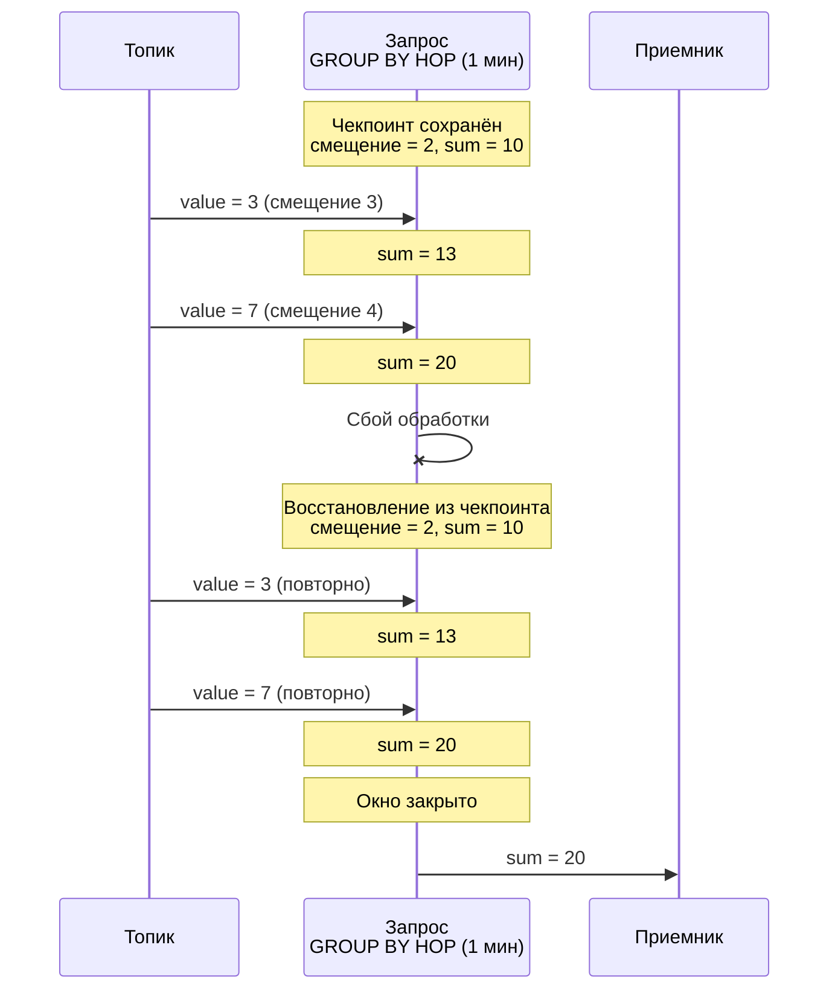
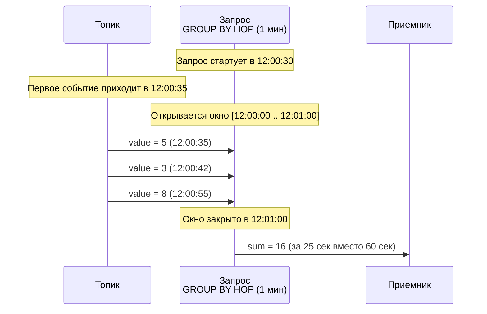
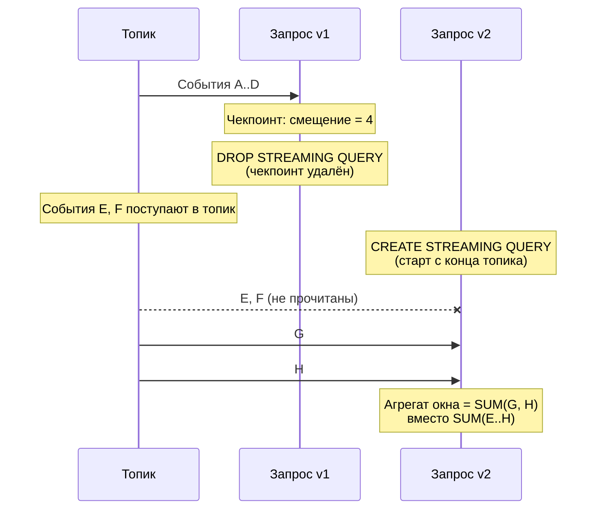
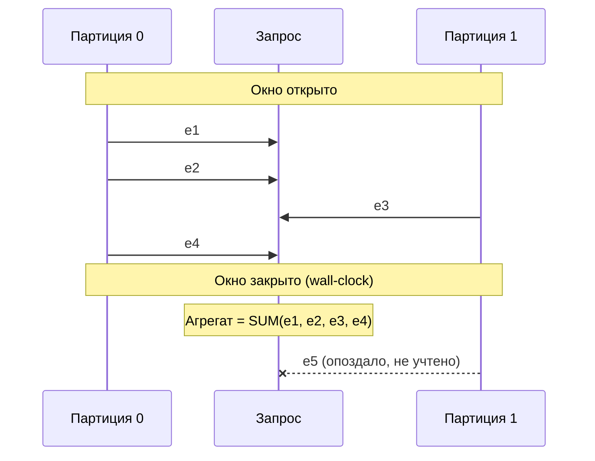

# Гарантии доставки данных

Гарантии доставки определяют, сколько раз каждое событие из входного топика будет обработано потоковым запросом. Понимание гарантий системы критически важно при проектировании конвейеров обработки данных.



Мы постоянно работаем над развитием механизмов потоковой обработки. В будущих версиях предоставляемые гарантии будут улучшены.



**Гарантии обработки данных (dataplane)**:

- [at-least-once](#at-least-once) — для всех типов запросов каждое событие обрабатывается минимум один раз.

**Аномалии при модификации запросов (control plane)**:

- [Потеря событий при пересоздании запроса](#incomplete-windows-restart) — при DROP + CREATE возникает дырка в чтении.
- [Частичное первое окно агрегаций](#partial-first-window) — при старте запроса первое окно агрегации содержит неполные данные.
- [Неполные агрегаты из-за отсутствия watermarks](#no-watermarks) — при многопартиционных топиках часть событий может не попасть в окно.

## Чекпоинты и восстановление {#checkpoints}

{{ ydb-short-name }} периодически сохраняет [чекпоинт](./checkpoints.md) — снимок состояния запроса, содержащий:

- [смещения](../../concepts/datamodel/topic.md#consumer-offset) во входных топиках — позиции, до которых события были прочитаны и обработаны;
- состояния агрегаций — промежуточные результаты операций, например накопленные значения в [GROUP BY HOP](../../yql/reference/syntax/select/group-by.md#group-by-hop).

{{ ydb-short-name }} хранит смещения чтения в собственных чекпоинтах, а не полагается на смещения [потребителя (consumer)](../../concepts/datamodel/topic.md#consumer) во внешней системе.

При восстановлении запрос откатывается к последнему чекпоинту: возобновляет чтение с сохранённых смещений и восстанавливает состояния агрегаций. События, поступившие между чекпоинтом и сбоем, будут обработаны повторно. Подробнее о механизме чекпоинтов — в разделе [{#T}](checkpoints.md).

## Гарантии обработки данных (dataplane) — at-least-once {#at-least-once}

Если в процессе обработки потока происходит сбой (перезапуск вычислительного узла, сетевой разрыв, таймаут), {{ ydb-short-name }} автоматически восстанавливает запрос из последнего чекпоинта. Гарантия [at-least-once](https://en.wikipedia.org/wiki/Reliable_messaging#At-least-once_delivery) обеспечивается для всех типов потоковых запросов — каждое событие будет обработано как минимум один раз. Запрос возобновляет чтение с сохранённого смещения и отправляет результаты обработки повторно. Это относится ко всем видам запросов: к запросам без агрегации (фильтрация, обогащение, трансформация), и к запросам с [оконной агрегацией](../../yql/reference/syntax/select/group-by.md#group-by-hop).

При записи результата в таблицу через [UPSERT](../../yql/reference/syntax/upsert_into.md) повторная обработка не приводит к дублированию: UPSERT обновляет существующую строку по первичному ключу. Данные не теряются, дубли не накапливаются.

При записи результата в выходной топик повторная обработка приводит к появлению дубликатов: одни и те же события будут записаны в топик более одного раза. Потребитель выходного топика должен учитывать это и при необходимости выполнять дедупликацию самостоятельно.

## Гарантии при модификации запроса (control plane) {#modification-anomalies}

В настоящий момент изменение текста запроса без его остановки не поддерживается. Для обновления запроса используется сочетание команд [DROP](../../yql/reference/syntax/drop-streaming-query.md) + [CREATE](../../yql/reference/syntax/create-streaming-query.md), в этом случае гарантия `at-least-once` не выполняется: часть событий может быть пропущена. Ниже описаны сценарии, в которых это происходит.

### Частичные результаты первого окна при старте запроса {#partial-first-window}

Временные окна ([GROUP BY HOP](../../yql/reference/syntax/select/group-by.md#group-by-hop)) рассчитывают свои границы по абсолютному (wall-clock) времени. Границы окон выравниваются по кратным интервалам от начала эпохи: например, при окне в 1 минуту границы всегда проходят в 12:00:00, 12:01:00, 12:02:00 и т.д., независимо от того, когда запрос был запущен. Если запрос стартует в 12:00:30, он попадает в уже идущее окно [12:00:00 .. 12:01:00], но данные начинают поступать только с 12:00:30. В результате агрегат первого окна вычисляется по данным за 30 секунд вместо полной минуты.

Это ожидаемое поведение при первом запуске — все последующие окна получат данные за полный интервал, который важно учитывать при пересоздании запроса.

### Потеря событий при пересоздании запроса {#incomplete-windows-restart}

Для изменения текста запроса используется сочетание команд [DROP](../../yql/reference/syntax/drop-streaming-query.md) + [CREATE](../../yql/reference/syntax/create-streaming-query.md). При `DROP` чекпоинт удаляется вместе с запросом, так как {{ ydb-short-name }} использует внутреннее хранение смещений чтения из источника, то эти смещения удаляются вместе с запросом. Новый запрос не имеет сохранённой позиции и начинает чтение с конца топика. Все события, поступившие в топик между удалением старого запроса и стартом нового, не будут прочитаны.

Аналогичная ситуация возникает, если данные, на которые указывает смещение в чекпоинте, уже удалены из топика по [TTL](../../concepts/datamodel/topic.md#message-retention).

Для запросов с оконной агрегацией первые окна после пересоздания будут содержать пропуски данных заниженные агрегаты.

### Неполные агрегаты из-за отсутствия watermarks {#no-watermarks}

В системах потоковой обработки [watermarks](https://en.wikipedia.org/wiki/Watermark_(data_synchronization)) — это системные метки, определяющие момент, после которого все данные для заданного временного интервала гарантированно получены. {{ ydb-short-name }} в данный момент не поддерживает этот механизм.



Watermarks будут поддержаны в версии `26.1`.



Без watermarks {{ ydb-short-name }} закрывает временное окно по wall-clock времени (системным часам), а не по полноте данных. Если топик имеет несколько [партиций](../../concepts/datamodel/topic.md#partitioning) и данные из одной партиции поступают с задержкой, часть событий может прийти после закрытия окна и не попасть в агрегат.

Когда это проявляется:

- топик содержит несколько партиций с неравномерной нагрузкой;
- продюсер записывает данные в партиции с разной задержкой;
- сеть или один из продюсеров временно замедляется.

Агрегаты в окнах могут быть занижены на долю событий из «медленных» партиций. Чем больше разброс задержек между партициями, тем заметнее эффект.

## См. также

- [{#T}](../../concepts/streaming-query.md) — общее описание потоковых запросов.
- [{#T}](checkpoints.md) — механизм чекпоинтов, обеспечивающий восстановление после сбоев.
- [{#T}](table-writing.md) — запись в таблицы и идемпотентность UPSERT.
