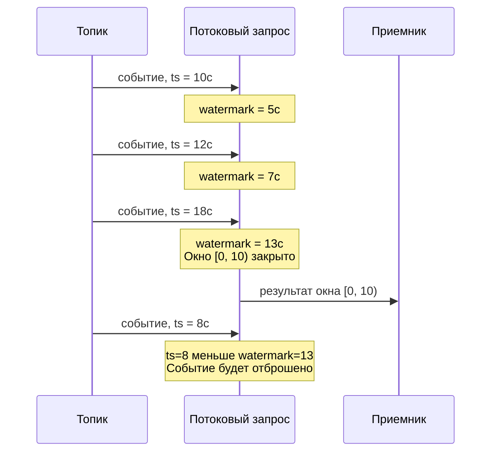

# Водяные знаки

Водяной знак (watermark) в потоковой обработке данных ([stream processing](https://en.wikipedia.org/wiki/Stream_processing)) представляет собой специальное системное событие, которое несёт нижнюю оценку временных меток во входном потоке. Водяной знак со значением X означает, что все события с временем меньше X уже получены системой. Механизм водяных знаков позволяет {{ ydb-short-name }} определять, когда временное окно агрегации можно считать завершённым и выдать результат.

В данном разделе описаны время события, принцип работы водяных знаков и их настройка в потоковых запросах {{ ydb-short-name }}.

## Время события {#event-time}

При потоковой обработке важно различать момент возникновения события в мире данных и момент его обработки системой. Эти моменты могут существенно отличаться из-за сетевых задержек, буферизации на стороне источника или временной недоступности отправителя. Для корректной работы временных окон агрегации, таких как [HoppingWindow](../../yql/reference/syntax/select/group-by.md#group-by-hopping_window), в расчётах используется **временная метка события** — значение типа `Timestamp`, по которому событие попадает в окна.

В {{ ydb-short-name }} в качестве времени события используется время записи в [топик](../../concepts/datamodel/topic.md), доступное через системную функцию `SystemMetadata("write_time")`. Это временное ограничение текущей реализации, которое планируется расширить поддержкой произвольных выражений для извлечения времени из данных события.

## Назначение водяного знака {#purpose}

Рассмотрим типичную задачу: подсчитать количество событий за каждые 10 секунд. Потоковый запрос читает события из [топика](../../concepts/datamodel/topic.md) и группирует их по временным окнам с помощью [HoppingWindow](../../yql/reference/syntax/select/group-by.md#group-by-hopping_window). Возникает вопрос: когда можно закрыть окно и выдать результат?

Без механизма водяных знаков {{ ydb-short-name }} закрывает окна по системному времени (wall-clock). Это приводит к проблемам: если данные из одной [партиции](../../concepts/datamodel/topic.md#partitioning) топика приходят с задержкой, часть событий может поступить после закрытия окна и не попасть в агрегат (подробнее: [{#T}](guarantees.md#no-watermarks)).

Водяной знак решает эту задачу. Система отслеживает прогресс времени событий и генерирует водяной знак, который сообщает: «все события до момента X получены». [HoppingWindow](../../yql/reference/syntax/select/group-by.md#group-by-hopping_window) при получении водяного знака закрывает все окна, которые полностью покрыты этим временем, и выдаёт результат.



## Отставание водяного знака {#delay}

События могут приходить не в хронологическом порядке: событие с временем 10:00:03 может быть обработано после события с временем 10:00:05. Причины: расхождение часов в распределённой системе, сетевые задержки, неравномерная нагрузка на [партиции](../../concepts/datamodel/topic.md#partitioning) топика.

Если бы водяной знак всегда совпадал с максимальным временем полученных событий, большинство задержавшихся событий было бы потеряно. Поэтому в формулу расчёта водяного знака закладывается отставание (delay):

```
watermark = max(event_time) - delay
```

Отставание задаёт допустимый «запас» времени для событий, поступающих с задержкой. Например, при отставании в 5 секунд и максимальном времени события 00:00:50 водяной знак будет равен 00:00:45. Это означает: все события до 00:00:45 считаются полученными, а события с временем между 00:00:45 и 00:00:50 ещё могут поступить.

Выбор значения отставания требует компромисса: слишком маленькое значение приведёт к потере событий, поступивших с задержкой, слишком большое увеличит задержку выдачи результатов.

## Настройка {#configuration}

Для включения механизма водяных знаков используется параметр `WATERMARK` в секции [WITH](../../yql/reference/syntax/select/with.md) при чтении из топика. Параметр задаёт выражение для вычисления водяного знака. В текущей реализации поддерживается только время записи в [топик](../../concepts/datamodel/topic.md) с константной задержкой (временное ограничение, которое планируется расширить в следующих версиях).

Параметры настройки водяного знака в секции [WITH](../../yql/reference/syntax/select/with.md):

- `WATERMARK` - выражение для вычисления водяного знака. Формат: `SystemMetadata("write_time") - Interval("<delay>")`, где `<delay>` задаётся в формате [ISO 8601](https://en.wikipedia.org/wiki/ISO_8601#Durations).
- `WATERMARK_GRANULARITY` - периодичность генерации водяных знаков. Чем меньше значение, тем больше потребление CPU и тем ниже задержка ответа. Значение по умолчанию: 1 секунда.
- `WATERMARK_IDLE_TIMEOUT` - период, после которого [партиция](../../concepts/datamodel/topic.md#partitioning) без данных будет исключена из вычисления объединённого водяного знака. Значение по умолчанию: 5 секунд.

### Требования к `HoppingWindow` {#hopping-window-requirements}

При использовании [HoppingWindow](../../yql/reference/syntax/select/group-by.md#group-by-hopping_window) первый параметр (time extractor) должен соответствовать выражению, используемому для вычисления водяного знака. В текущей реализации это `SystemMetadata("write_time")` (время записи события в [топик](../../concepts/datamodel/topic.md)).

## Пример {#example}

Ниже приведён пример потокового запроса с водяным знаком и оконной агрегацией. Запрос читает события из топика, фильтрует их по полю `pass` и агрегирует значения `payload` в окнах по 10 секунд с шагом 5 секунд. Водяной знак настроен с отставанием в 5 секунд.

### Входные данные

```json
{"pass": 1, "payload": "a"} // время записи: 1970-01-01T00:00:40Z
{"pass": 1, "payload": "b"} // время записи: 1970-01-01T00:00:42Z
{"pass": 0, "payload": "c"} // время записи: 1970-01-01T00:00:50Z
{"pass": 1, "payload": "d"} // время записи: 1970-01-01T00:00:40Z
```

### Запрос

```yql
CREATE STREAMING QUERY example AS
DO BEGIN
    $input =
        SELECT
            t.*,
            SystemMetadata("write_time") AS ts
        FROM
            input_topic
        WITH (
            FORMAT = json_each_row,
            SCHEMA = (
                pass Int64,
                payload String
            ),
            WATERMARK = SystemMetadata("write_time") - Interval("PT5S")
        ) AS t;

    SELECT
        AGGREGATE_LIST(payload) AS result,
        HOP_END() AS ts
    FROM
        $input
    WHERE pass > 0
    GROUP BY
        HoppingWindow(ts, "PT5S", "PT10S");
END DO;
```

Где:

- [`CREATE STREAMING QUERY`](../../yql/reference/syntax/create-streaming-query.md) - создаёт именованный потоковый запрос.
- `SystemMetadata("write_time")` - системная функция, возвращающая время записи события в [топик](../../concepts/datamodel/topic.md).
- `FORMAT = json_each_row` - [формат данных](streaming-query-formats.md) в топике, каждая строка содержит отдельный JSON-объект.
- `WATERMARK = SystemMetadata("write_time") - Interval("PT5S")` - водяной знак с отставанием 5 секунд. `Interval("PT5S")` задаёт интервал в формате [ISO 8601](https://en.wikipedia.org/wiki/ISO_8601#Durations).
- [`AGGREGATE_LIST`](../../yql/reference/builtins/aggregation.md#agg-list) - агрегатная функция, собирающая значения в список.
- `HOP_END()` - возвращает временную метку конца текущего окна.
- [`HoppingWindow(ts, "PT5S", "PT10S")`](../../yql/reference/syntax/select/group-by.md#group-by-hopping_window) - оконная функция с шагом 5 секунд и размером окна 10 секунд.

### Результат

```json
{"result": ["a", "b"], "ts": 45}
```

### Пояснение

1. Первое событие (`"a"`, время записи 40с) порождает водяной знак, равный 35с (`40 - 5`). Событие проходит фильтр (`pass > 0`) и попадает в окна `[35; 45)` и `[40; 50)`. Водяной знак 35с не закрывает ни одного окна.
2. Второе событие (`"b"`, время записи 42с) порождает водяной знак, равный 37с (`42 - 5`). Аналогично первому событию, попадает в окна `[35; 45)` и `[40; 50)`.
3. Третье событие (`"c"`, время записи 50с) порождает водяной знак, равный 45с (`50 - 5`). Событие отбрасывается на фильтре (`pass = 0`). Водяной знак 45с закрывает окно `[35; 45)`, результат `["a", "b"]` выдаётся.
4. Четвёртое событие (`"d"`, время записи 40с) порождает водяной знак, равный 35с (`40 - 5`). Событие проходит фильтр, но не учитывается в закрытых окнах: его время записи (40с) меньше текущего водяного знака (45с), поэтому окна, к которым оно относилось, уже закрыты.

## Поведение при нескольких партициях {#multi-partition}

Если входной топик содержит несколько [партиций](../../concepts/datamodel/topic.md#partitioning), каждая партиция генерирует свой водяной знак. Общий водяной знак вычисляется как минимум водяных знаков всех активных партиций. Если одна из партиций перестаёт получать данные, по истечении `WATERMARK_IDLE_TIMEOUT` она исключается из вычисления общего водяного знака, чтобы не блокировать продвижение окон.

## См. также

- [{#T}](../../yql/reference/syntax/select/group-by.md#group-by-hopping_window) - оконная функция, использующая водяные знаки.
- [{#T}](../../yql/reference/syntax/select/with.md) - секция WITH для настройки параметров чтения из топика.
- [{#T}](guarantees.md) - гарантии доставки данных.
- [{#T}](checkpoints.md) - механизм чекпоинтов.
