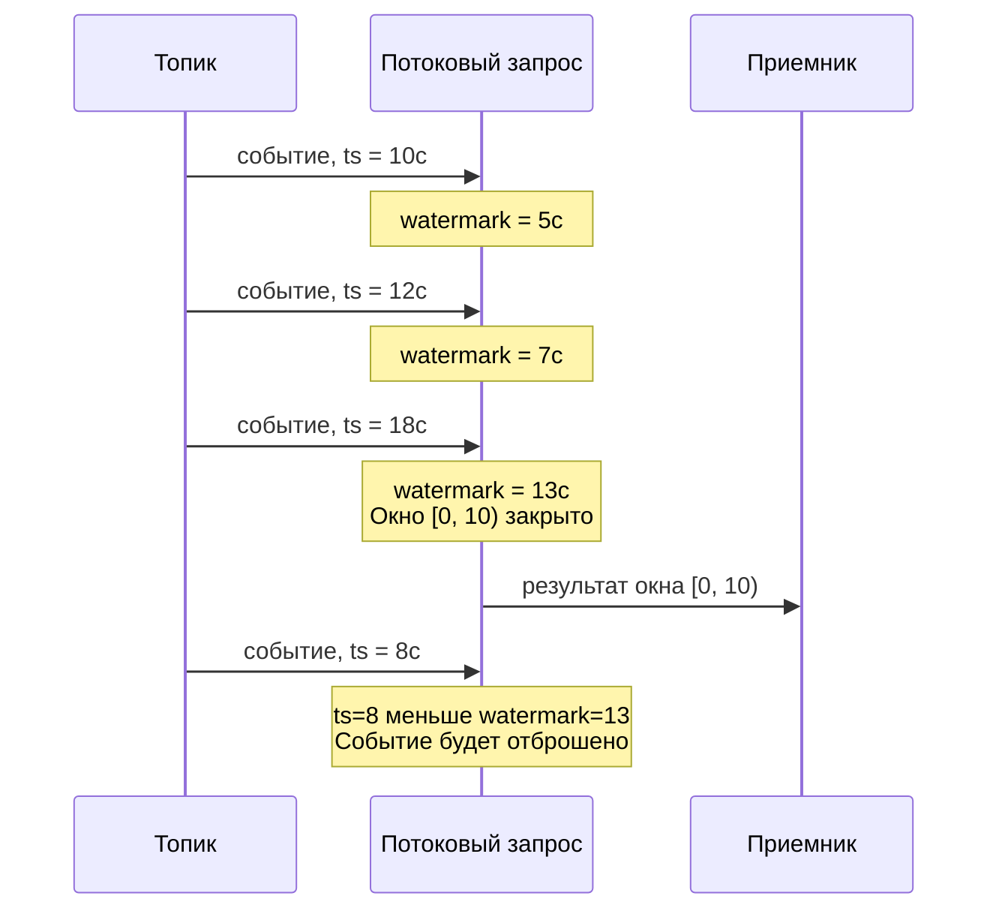

# Водяные знаки

Водяной знак (watermark) в потоковой обработке данных ([stream processing](https://en.wikipedia.org/wiki/Stream_processing)) — это монотонно возрастающая нижняя оценка времён событий, которые ещё могут поступить в поток. Когда водяной знак достигает значения X, система объявляет, что все события с временем меньше X уже получены, и может выдать результаты для временных диапазонов, заканчивающихся до X.

В данном разделе описаны время события, принцип работы водяных знаков и их настройка в потоковых запросах {{ ydb-short-name }}.

## Назначение водяного знака {#purpose}

Водяной знак позволяет системе определять, когда временное окно можно считать завершённым и выдать результат. При получении водяного знака [HoppingWindow](../../yql/reference/syntax/select/group-by.md#group-by-hopping_window) закрывает все окна, которые полностью покрыты этим временем.



## Время события {#event-time}

В потоковой обработке каждое событие имеет временную метку, по которой система отслеживает прогресс времени в потоке. Источником этой метки может служить:

- поле из самого события (например, `event.created_at`);
- время записи в [топик](../../concepts/datamodel/topic.md), которое присваивает брокер сообщений;
- текущее время обработки (момент, когда система получила событие).

Выбор источника времени влияет на все операции, зависящие от порядка событий во времени, например на оконную агрегацию ([HoppingWindow](../../yql/reference/syntax/select/group-by.md#group-by-hopping_window)).



В текущей реализации временем события может быть только время записи события в [топик](../../concepts/datamodel/topic.md), доступное через системную функцию `SystemMetadata("write_time")`. Поддержка произвольных выражений для извлечения времени из данных события планируется в следующих версиях.



## Вычисление водяного знака {#watermark-computation}

События в потоке могут приходить не в хронологическом порядке: событие с временем 10:00:03 может быть обработано после события с временем 10:00:05. Причины: расхождение часов в распределённой системе, сетевые задержки, неравномерная нагрузка на [партиции](../../concepts/datamodel/topic.md#partitioning) топика.

Чтобы не терять задержавшиеся события, водяной знак не продвигается сразу вслед за последним полученным событием, а отстаёт от него на заданный параметр — отставание (delay). Отставание задаёт допустимый «запас» времени для событий, поступающих с задержкой.

Например, при отставании в 5 секунд событие с временем 00:00:48 будет принято, даже если уже пришли события с временем 00:00:50: водяной знак ещё не дошёл до 00:00:48. Если то же событие придёт позже, когда водяной знак уже продвинулся за 00:00:48, оно будет признано опоздавшим и отброшено.

Выбор значения отставания требует компромисса: слишком маленькое значение приведёт к потере событий, поступивших с задержкой, слишком большое увеличит задержку выдачи результатов.

## Простаивающие партиции {#idle-partitions}

Если входной топик содержит несколько [партиций](../../concepts/datamodel/topic.md#partitioning), водяной знак продвигается только тогда, когда данные поступают из всех партиций. Это гарантирует, что результат не будет выдан раньше, чем все партиции достигнут соответствующего момента времени.

Если одна из партиций перестаёт получать данные, её водяной знак перестаёт продвигаться вперёд. Такая партиция называется простаивающей (idle). Пока простаивающая партиция учитывается при вычислении общего водяного знака, он тоже перестаёт продвигаться, и окна агрегации не закрываются, несмотря на поступление данных от других партиций.

Чтобы избежать этой блокировки, простаивающая партиция исключается из вычисления общего водяного знака по истечении настраиваемого периода ожидания (параметр `WATERMARK_IDLE_TIMEOUT`, подробнее в разделе [Настройка](#configuration)).

## Настройка {#configuration}

Водяные знаки включаются и настраиваются в секции [WITH](../../yql/reference/syntax/select/with.md) при чтении из топика.

Параметры настройки:

- `WATERMARK` - выражение для вычисления водяного знака. Формат: `SystemMetadata("write_time") - Interval("<delay>")`, где `<delay>` задаётся в формате [ISO 8601](https://en.wikipedia.org/wiki/ISO_8601#Durations).
- `WATERMARK_GRANULARITY` - периодичность генерации водяных знаков. Чем меньше значение, тем больше потребление CPU и тем ниже задержка ответа. Значение по умолчанию: 1 секунда.
- `WATERMARK_IDLE_TIMEOUT` - период, после которого [партиция](../../concepts/datamodel/topic.md#partitioning) без данных будет исключена из вычисления общего водяного знака. Значение по умолчанию: 5 секунд.



При использовании [HoppingWindow](../../yql/reference/syntax/select/group-by.md#group-by-hopping_window) первый параметр (time extractor) должен совпадать с выражением в `WATERMARK`. Несовпадение приведёт к некорректным результатам агрегации. В текущей реализации оба значения должны быть `SystemMetadata("write_time")`.



## Пример {#example}

Ниже приведён пример потокового запроса с водяным знаком и оконной агрегацией. Запрос читает события из топика, фильтрует их по полю `pass` и агрегирует значения `payload` в окнах по 10 секунд с шагом 5 секунд. Водяной знак настроен с отставанием в 5 секунд.

### Входные данные

```json
{"pass": 1, "payload": "a"} // время записи: 1970-01-01T00:00:40Z
{"pass": 1, "payload": "b"} // время записи: 1970-01-01T00:00:42Z
{"pass": 0, "payload": "c"} // время записи: 1970-01-01T00:00:50Z
{"pass": 1, "payload": "d"} // время записи: 1970-01-01T00:00:40Z
```

### Запрос

```yql
CREATE STREAMING QUERY example AS
DO BEGIN
    $input =
        SELECT
            t.*,
            SystemMetadata("write_time") AS ts
        FROM
            input_topic
        WITH (
            FORMAT = json_each_row,
            SCHEMA = (
                pass Int64,
                payload String
            ),
            WATERMARK = SystemMetadata("write_time") - Interval("PT5S")
        ) AS t;

    SELECT
        AGGREGATE_LIST(payload) AS result,
        HOP_END() AS ts
    FROM
        $input
    WHERE pass > 0
    GROUP BY
        HoppingWindow(ts, "PT5S", "PT10S");
END DO;
```

Где:

- [`CREATE STREAMING QUERY`](../../yql/reference/syntax/create-streaming-query.md) - создаёт именованный потоковый запрос.
- `SystemMetadata("write_time")` - системная функция, возвращающая время записи события в [топик](../../concepts/datamodel/topic.md).
- `FORMAT = json_each_row` - [формат данных](streaming-query-formats.md) в топике, каждая строка содержит отдельный JSON-объект.
- `WATERMARK = SystemMetadata("write_time") - Interval("PT5S")` - водяной знак с отставанием 5 секунд. `Interval("PT5S")` задаёт интервал в формате [ISO 8601](https://en.wikipedia.org/wiki/ISO_8601#Durations).
- [`AGGREGATE_LIST`](../../yql/reference/builtins/aggregation.md#agg-list) - агрегатная функция, собирающая значения в список.
- [`HOP_END()`](../../yql/reference/syntax/select/group-by.md#group-by-hop) - возвращает временную метку конца текущего окна.
- [`HoppingWindow(ts, "PT5S", "PT10S")`](../../yql/reference/syntax/select/group-by.md#group-by-hopping_window) - оконная функция с шагом 5 секунд и размером окна 10 секунд.

### Результат

```json
{"result": ["a", "b"], "ts": 45}
```

### Пояснение

1. Первое событие (`"a"`, время записи 40с) проходит фильтр (`pass > 0`) и попадает в окна `[35; 45)` и `[40; 50)`. Водяной знак продвигается до 35с и не закрывает ни одного окна.
2. Второе событие (`"b"`, время записи 42с) аналогично попадает в окна `[35; 45)` и `[40; 50)`. Водяной знак продвигается до 37с.
3. Третье событие (`"c"`, время записи 50с) отбрасывается на фильтре (`pass = 0`). Водяной знак продвигается до 45с и закрывает окно `[35; 45)` — результат `["a", "b"]` выдаётся.
4. Четвёртое событие (`"d"`, время записи 40с) не продвигает водяной знак: он уже находится на отметке 45с. Событие проходит фильтр, но отбрасывается как опоздавшее — его время записи (40с) меньше текущего водяного знака (45с), поэтому окна, к которым оно относилось, уже закрыты.

## См. также

- [{#T}](../../yql/reference/syntax/select/group-by.md#group-by-hopping_window) - оконная функция, использующая водяные знаки.
- [{#T}](../../yql/reference/syntax/select/with.md) - секция WITH для настройки параметров чтения из топика.
- [{#T}](guarantees.md) - гарантии доставки данных.
- [{#T}](checkpoints.md) - механизм чекпоинтов.
