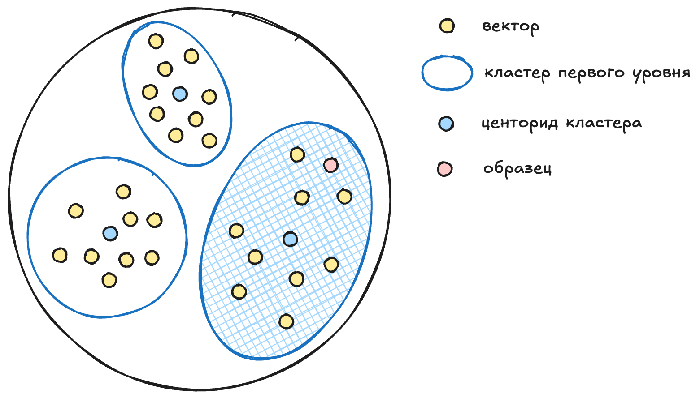

# Векторный индекс вида vector_kmeans_tree

Алгоритм `vector_kmeans_tree` представляет все вектора, по которым нужно
вести поиск, в виде дерева. Первый уровень дерева позволяет выбрать
один из нескольких кластеров, в котором содержаться вектора, похожие на
образец.

Чтобы можно было выбрать нужный кластер, для каждого кластера
рассчитывается и сохраняется центроид: среднее арифметическое всех векторов
в кластере.

YDB перебирает все центроиды первого уровня и выбирает тот кластер, центроид
которого имеет наименьшее расстояние до образца. Приближённый
поиск исходит из предположения, что если центроид кластера ближе всего к
образцу, то и вектора в таком кластере тоже будут ближе всего к образцу
(иногда это не так, и далее мы расскажем что делать в таких случаях).

Каждый кластер первого уровня разделен на кластера второго уровня и так далее.
Алгоритм последовательно "спускается" вниз по дереву, каждый раз выбирая
кластер все меньшего размера, пока не дойдет до кластера самого нижнего
уровня, который содержит уже не список центроидов, а список векторов. YDB
перебирает эти вектора и выбирает нужное количество ближайших к образцу.

## Параметры дерева: количество уровней и количество кластеров на уровень

Кластера, из которых состоит дерево векторного индекса, хранятся в
распределенном хранилище. Для каждого перехода вниз по дереву YDB выполняет
сетевой запрос к слою хранения и получает по сети бинарные данные со
списком векторов. Такой запрос, в зависимости от используемого в
дата-центре оборудования, может занимать несколько миллисекунду.

Выбор одного из кластеров на уровне требует перебрать все вектора-центроиды
этих кластеров и посчитать расстояние между ними и образцом. Чтобы оценить
скорость такого перебора на конкретном оборудовании можно использовать
вот такой [запрос](../yql/reference/udf/list/knn.md#exact-vector-search-k-nearest).

YDB позволяет настроить количество уровней в дереве векторного индекса
с помощью параметра `levels` и количество кластеров на каждом уровне
с помощью параметра `clusters`. Эти параметры нужно подобрать,
ориентируясь на ожидаемый объем хранимых векторов и характеристики
кластера: сетевую задержку между узлами, скорость передачи данных,
возможности центральных процессоров по перебору векторов.

## Как рассчитывать параметры векторного индекса

Предположим, вы планируете индексировать порядка миллиарда элементов и
замеры производительности показали, что используемые сервера способны
перебирать миллион векторов в секунду, а сетевые задержки составляют порядка
5 миллисекунд.

Если ограничиться одни уровнем дерева и разделить этот уровень на 100
кластеров, то временем перебора этих кластеров можно будет пренебречь.
Зато каждый такой кластер будет содержать десять миллионов векторов, и их
перебор займет десять секунд, плюс передача по сети такого объема данных
может занять сильно больше пяти миллисекунд.

Если использовать два уровня, то потребуются дополнительные пять миллисекунд
на переход с первого уровня на второй, зато в каждом кластере второго
уровня будет всего по 100'000 векторов, которые сервер сможет перебрать за
100 миллисекунд. Суммарное время поиска составит 120 миллисекунд: по 5
миллисекунд на получение по сети данных для каждого из двух уровней и еще
100 миллисекунд на перебор всех векторов в найденном кластере.

Добавление третьего уровня добавит еще 5 миллисекунд к суммарному времени
поиска, зато количество векторов в последнем найденном кластере упадет до
1'000 и время их перебора составит одну миллисекунду. А суммарное время
поиска снизится до 16 миллисекунд: по 5 миллисекунд на каждый из трех
уровней и 1 миллисекунду на перебор векторов.

А вот добавление четвертого уровня уже не снизит время поиска, а, наоборот,
повысит его. Временем перебора векторов моно будет пренебречь, зато
дополнительный переход на четвертый уровень займет пять миллисекунд, и
суммарное время поиска будет составлять 20 миллисекунд.

Если данных мало или в кластере высокие сетевые задержки, то параметр
`levels` можно установить в 1 уровень. А для миллиардов векторов может
потребоваться увеличить значение этого параметра до 3 уровней и выбрать
оптимальное для вашего оборудования значение параметра `clusters`.

Оптимальное количество кластеров сильно зависит от того, сколько векторов
в секунду могут перебирать сервера. Поэтому, выбрав значение `levels` на
основании ожидаемого объема данных и сетевых задержек, можно подобрать
значение `clusters` на основании тестов производительности. Для большинства
аппаратных конфигураций это значение будет в диапазоне 64-512: столько
векторов современные сервера могут перебрать менее, чем за одну миллисекунду.

## Тонкая настройка

Если центроид кластера ближе всего к образцу, то в большинстве случаев и
вектора такого кластера ближе к образцу, чем вектора из других кластеров.
В случае сложных топологий это может быть не так, поэтому YDB может перебирать
вектора более чем в одном кластере на каждом уровне дерева.

Количество кластеров указывается с помощью параметра
`KMeansTreeSearchTopSize`. По умолчанию значение этого параметра 1: YDB
выберет один ближайший кластер на первом уровне дерева, затем получит по
сети кластера второго уровня, снова выберет один ближайший и так далее.

Что произойдет, если указать более количество кластеров, например 3? Тогда
на каждом уровне YDB будет выбирать не 1 ближайший кластер, а указанное
количество, то есть три. При этом для перехода на следующий уровень нужно
будет получить по сети вектора для всех трех выбранных кластеров, из которых
затем будут выбраны три следующих. Такой подход позволяет улучшить полноту
поиска за счет увеличения количества передаваемых по сети данных и количества
перебираемых векторов.

Также важно то, что по-умолчанию последний кластер хранит не сами вектора
для поиска, а только список ключей этих векторов в таблице. Такой список
мы называем "Posting Table", это разновидность "инвертированного индекса".
Хранение ссылок на вектора вместо самих векторов позволяет минимизировать
размер векторного индекса.

Но такой подход также означает, что после нахождения последнего кластера YDB
нужно будет сделать `SELECT` запрос к таблице для получения нескольких сотен
элементов (сколько именно элементов нужно будет запросить зависит от параметра
`clusters`, который определяет одновременно и количество кластеров в каждом
уровне дерева и количество векторов в последнем кластере).

Запросы на получение векторов последнего кластера могут быть медленными, если
указано большое значение `clusters` или для таблицы настроен сложный индекс. В
таких случаях можно ускорить поиск за счет увеличения размера индекса: если
сделать индекс покрывающим, то вектора (и даже дополнительные колонки) будут
храниться вместе с индексом. Данные все еще нужно будет получить по сети со
слоя хранения, но это будет гораздо быстрее, чем полноценный запрос к таблице.
