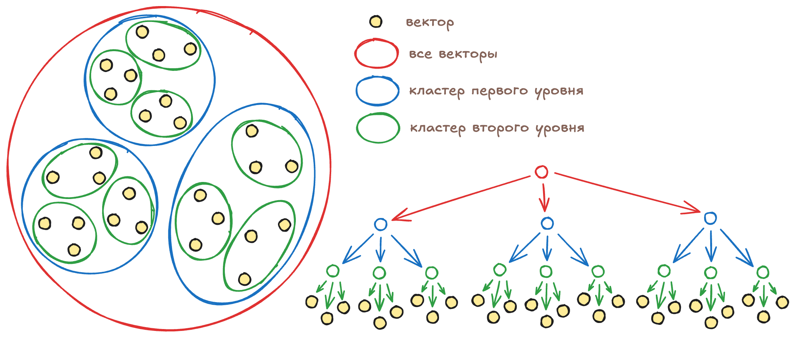
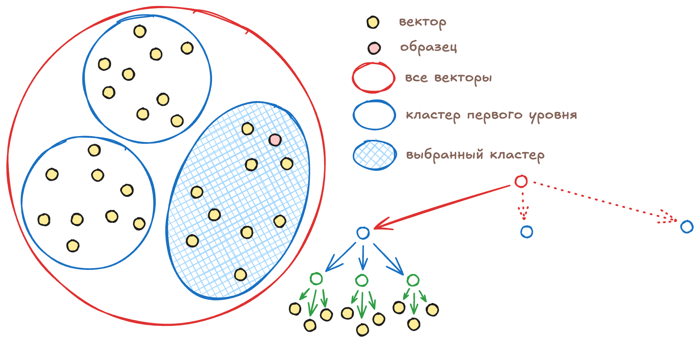

# Векторный индекс вида vector_kmeans_tree

## Создание векторного индекса {#index-create}

Алгоритм `vector_kmeans_tree` рекурсивно делит все векторы, по которым нужно вести поиск, [на кластеры](https://en.wikipedia.org/wiki/K-means_clustering). Сначала все векторы разделяются на количество кластеров, указанное при создании индекса с помощью параметра `clusters`. Например, кластеры первого уровня могут выглядеть вот так:

Затем каждый кластер в свою очередь разделяется на такое же количество кластеров. Так как каждый кластер первого уровня состоит из кластеров второго уровня, то получается дерево кластеров. Количество уровней в дереве задается с помощью параметра `levels`. Например, кластеры второго уровня будут выглядеть вот так:

Дерево векторного индекса будет содержать три кластера первого уровня, каждый из которых будет содержать три кластера второго уровня, каждый из которых, в свою очередь, будет содержать три вектора.

## Поиск в векторном индексе {#index-search}

Для поиска в векторном индексе `vector_kmeans_tree` последовательно выбирает на каждом уровне один из нескольких кластеров, в котором содержатся векторы, похожие на образец. Чтобы можно было выбрать нужный кластер, для каждого кластера рассчитывается и сохраняется центроид: среднее арифметическое всех векторов в кластере.

Выбрав кластер на одном из уровней, {{ ydb-short-name }} спускается на уровень ниже и перебирает кластеры, которые входят в выбранный на предыдущем уровне кластер. {{ ydb-short-name }} сравнивает расстояния между центроидами кластеров и образцом, выбирая тот кластер, для которого это расстояние будет минимальным. Приближённый поиск исходит из предположения, что если центроид кластера ближе всего к образцу, то и векторы в таком кластере тоже будут ближе всего к образцу.

Каждый кластер первого уровня разделён на кластеры второго уровня и так далее. Алгоритм последовательно «спускается» вниз по дереву, каждый раз выбирая кластер всё меньшего размера, пока не дойдет до кластера самого нижнего уровня, который содержит уже не список центроидов, а список векторов. {{ ydb-short-name }} перебирает эти векторы и выбирает нужное количество ближайших к образцу.

## Параметры индекса {#index-settings}

{{ ydb-short-name }} позволяет настроить количество уровней в дереве векторного индекса с помощью параметра `levels` и количество кластеров на каждом уровне с помощью параметра `clusters`. Эти параметры нужно подобрать, ориентируясь на ожидаемый объём хранимых векторов и характеристики кластера: сетевую задержку между узлами, скорость передачи данных, возможности центральных процессоров.

Кластеры, из которых состоит дерево векторного индекса, хранятся в распределённом хранилище. Для каждого перехода вниз по дереву {{ ydb-short-name }} выполняет чтение из распределённого хранилища и получает по сети бинарные данные со списком векторов. Сколько времени будет выполняться такая операция, зависит от используемого в дата-центре оборудования, нагрузки на сеть и количества кластеров, которые нужно передать по сети.

Выбор одного из кластеров на уровне требует перебрать все векторы-центроиды этих кластеров и посчитать расстояние между ними и образцом. Чтобы оценить скорость такого перебора на конкретном оборудовании можно использовать вот такой [запрос](../yql/reference/udf/list/knn.md#exact-vector-search-k-nearest).

Если данных мало, то параметр `levels` можно установить в 1 уровень. А для миллиардов векторов может потребоваться увеличить значение этого параметра до 3 уровней и выбрать оптимальное для вашего оборудования значение параметра `clusters`.

Оптимальное количество кластеров сильно зависит от того, сколько векторов в секунду могут перебирать сервера. Поэтому, выбрав значение `levels` на основании ожидаемого объёма данных и сетевых задержек, можно подобрать значение `clusters` на основании тестов производительности. 
Для большинства аппаратных конфигураций число кластеров должно быть не более 512: столько векторов современные серверы способны перебрать за время менее одной миллисекунды. 
Рекомендуется, чтобы в каждом листе дерева также содержалось количество векторов не более 512.

## Настройка полноты поиска {#search-recall}

Если центроид кластера ближе всего к образцу, то в большинстве случаев и векторы такого кластера ближе к образцу, чем векторы из других кластеров.  В случае сложных топологий это может быть не так, поэтому {{ ydb-short-name }} может перебирать векторы более чем в одном кластере на каждом уровне дерева.

Количество кластеров поиска указывается с помощью параметра `KMeansTreeSearchTopSize`. По умолчанию значение этого параметра 1: {{ ydb-short-name }} выберет один ближайший кластер на первом уровне дерева, затем получит по сети кластеры второго уровня, снова выберет один ближайший и так далее.

Если указать большее количество кластеров, например 3, то на каждом уровне {{ ydb-short-name }} будет выбирать не 1 ближайший кластер, а указанное количество. При этом для перехода на следующий уровень нужно будет получить по сети дочерние векторы для всех трёх выбранных кластеров, из которых затем будут выбраны три следующих. Такой подход позволяет улучшить полноту поиска за счёт увеличения количества передаваемых по сети данных и количества перебираемых векторов.

## Покрывающий индекс {#covering-index}

По умолчанию последний кластер хранит не сами векторы для поиска, а только список ключей этих векторов в таблице. Такой список мы называем «Posting Table», это разновидность «инвертированного индекса». Хранение ссылок на векторы вместо самих векторов позволяет минимизировать размер векторного индекса.

Но такой подход также означает, что после нахождения последнего кластера {{ ydb-short-name }} нужно будет сделать `SELECT`-запрос к таблице для получения нескольких сотен элементов (сколько именно элементов нужно будет запросить зависит от параметра `clusters`, который определяет одновременно и количество кластеров в каждом уровне дерева и количество векторов в последнем кластере).

Запросы на получение векторов последнего кластера могут быть медленными, если указано большое значение `clusters` или индекс таблицы не включает колонку с векторами. В таких случаях можно ускорить поиск за счёт увеличения размера индекса: если [сделать индекс покрывающим](vector-indexes.md#covering), то векторы будут храниться вместе с индексом. Данные всё еще нужно будет получить по сети из распределённого хранилища, но это будет гораздо быстрее, чем полноценный запрос к таблице.

Кроме векторов, в покрывающий индекс можно добавить любые другие колонки из индексируемой таблицы. Тогда `SELECT`-запросы к таким колонкам будут выполняться быстрее за счет увеличения размера индекса.

Покрывающий индекс можно дополнительно ускорить, если [включить](../yql/reference/syntax/alter_table/indexes.md#alter-index) чтение из [реплик](../concepts/datamodel/table.md#read_only_replicas).

## Внутреннее устройство индекса {#index-structure}

Индекс состоит из двух дополнительных таблиц: level table (`indexImplLevelTable`) и posting table (`indexImplPostingTable`). В таблице level table хранятся центроиды для дерева кластеров. К этой таблице {{ ydb-short-name }} делает запросы, когда переходит с уровня на уровень при векторном поиске. Например, если векторный индекс построен для 27 векторов, параметр `levels` установлен в значение 2 а параметр `clusters` в значение 3, то level table будет выглядеть вот так:

Для каждого центроида в level table также хранится информация о том, какому кластеру уровнем выше принадлежит центроид. {{ ydb-short-name }} использует эту информацию, чтобы при переходе на уровень ниже получать только те центроиды, которые принадлежат выбранным на предыдущем уровне кластерам.

Вторая таблица, posting table, используется для связи центроидов последнего уровня в level table и векторов в таблице, для которой построен индекс. Если использован покрывающий индекс, то в эту же таблицу сохраняются векторы и любые дополнительные колонки, которые указал разработчик при создании индекса:

### Структура таблицы `indexImplLevelTable`

| Колонка | Тип данных | Описание |
| --- | --- | --- |
| `__ydb_parent` | `Uint64` | Идентификатор родительского кластера |
| `__ydb_id` | `Uint64` | Идентификатор этого кластера |
| `__ydb_centroid` | `String` | Вектор центроида этого кластера |

### Структура таблицы `indexImplPostingTable`

| Колонка | Тип данных | Описание |
| --- | --- | --- |
| `__ydb_parent` | `Uint64` | Идентификатор кластера |
| `id` | `Uint64` | Первичный ключ таблицы, соответствующий одному из векторов кластера |

### Структура таблицы `indexImplPostingTable` с покрывающим индексом

| Колонка | Тип данных | Описание |
| --- | --- | --- |
| `__ydb_parent` | `Uint64` | Идентификатор кластера |
| `id` | `Uint64` | Первичный ключ таблицы, соответствующий одному из векторов кластера |
| `embedding` | `String` | Копия вектора из таблицы |
