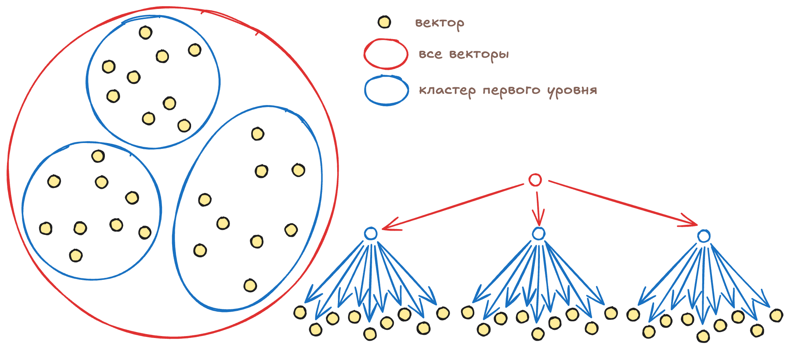

# Векторный индекс вида vector_kmeans_tree

Алгоритм `vector_kmeans_tree` представляет все вектора, по которым нужно вести поиск, в виде дерева. Каждый уровень дерева позволяет выбрать один из нескольких кластеров, в котором содержатся вектора, похожие на образец.

Чтобы можно было выбрать нужный кластер, для каждого кластера рассчитывается и сохраняется центроид: среднее арифметическое всех векторов в кластере.

Выбрав кластер на одном из уровней, {{ ydb-short-name }} спускается на уровень ниже и перебирает кластера, которые входят в выбранный на предыдущем уровне кластер. {{ ydb-short-name }} сравнивает расстояния между центроидами кластеров и образцом, выбирая тот кластер, для которого это расстояние будет минимальным. Приближённый поиск исходит из предположения, что если центроид кластера ближе всего к образцу, то и вектора в таком кластере тоже будут ближе всего к образцу (иногда это не так, и далее мы расскажем, что делать в таких случаях).

Каждый кластер первого уровня разделён на кластера второго уровня и так далее. Алгоритм последовательно «спускается» вниз по дереву, каждый раз выбирая кластер всё меньшего размера, пока не дойдет до кластера самого нижнего уровня, который содержит уже не список центроидов, а список векторов. {{ ydb-short-name }} перебирает эти вектора и выбирает нужное количество ближайших к образцу.

## Параметры дерева: количество уровней и количество кластеров на уровень

{{ ydb-short-name }} позволяет настроить количество уровней в дереве векторного индекса с помощью параметра `levels` и количество кластеров на каждом уровне с помощью параметра `clusters`. Эти параметры нужно подобрать, ориентируясь на ожидаемый объем хранимых векторов и характеристики кластера: сетевую задержку между узлами, скорость передачи данных, возможности центральных процессоров по перебору векторов.

Кластера, из которых состоит дерево векторного индекса, хранятся в распределенном хранилище. Для каждого перехода вниз по дереву {{ ydb-short-name }} выполняет чтение из распределенного хранилища и получает по сети бинарные данные со списком векторов. Сколько времени будет выполняться такая операция зависит от используемого в дата-центре оборудования, нагрузки на сеть и количества кластеров, которые нужно передать по сети.

Выбор одного из кластеров на уровне требует перебрать все вектора-центроиды этих кластеров и посчитать расстояние между ними и образцом. Чтобы оценить скорость такого перебора на конкретном оборудовании можно использовать вот такой [запрос](../yql/reference/udf/list/knn.md#exact-vector-search-k-nearest).

## Тонкая настройка

Если центроид кластера ближе всего к образцу, то в большинстве случаев и вектора такого кластера ближе к образцу, чем вектора из других кластеров.  В случае сложных топологий это может быть не так, поэтому {{ ydb-short-name }} может перебирать вектора более чем в одном кластере на каждом уровне дерева.

Количество кластеров указывается с помощью параметра `KMeansTreeSearchTopSize`. По умолчанию значение этого параметра 1: {{ ydb-short-name }} выберет один ближайший кластер на первом уровне дерева, затем получит по сети кластера второго уровня, снова выберет один ближайший и так далее.

Если указать более количество кластеров, например 3, то на каждом уровне {{ ydb-short-name }} будет выбирать не 1 ближайший кластер, а указанное количество. При этом для перехода на следующий уровень нужно будет получить по сети вектора для всех трех выбранных кластеров, из которых затем будут выбраны три следующих. Такой подход позволяет улучшить полноту поиска за счёт увеличения количества передаваемых по сети данных и количества перебираемых векторов.

Также важно то, что по-умолчанию последний кластер хранит не сами вектора для поиска, а только список ключей этих векторов в таблице. Такой список мы называем «Posting Table», это разновидность «инвертированного индекса». Хранение ссылок на вектора вместо самих векторов позволяет минимизировать размер векторного индекса.

Но такой подход также означает, что после нахождения последнего кластера {{ ydb-short-name }} нужно будет сделать `SELECT`-запрос к таблице для получения нескольких сотен элементов (сколько именно элементов нужно будет запросить зависит от параметра `clusters`, который определяет одновременно и количество кластеров в каждом уровне дерева и количество векторов в последнем кластере).

Запросы на получение векторов последнего кластера могут быть медленными, если указано большое значение `clusters` или для таблицы настроен сложный индекс. В таких случаях можно ускорить поиск за счёт увеличения размера индекса: если сделать индекс покрывающим, то вектора (и даже дополнительные колонки) будут храниться вместе с индексом. Данные всё еще нужно будет получить по сети из распределенного хранилища, но это будет гораздо быстрее, чем полноценный запрос к таблице.
