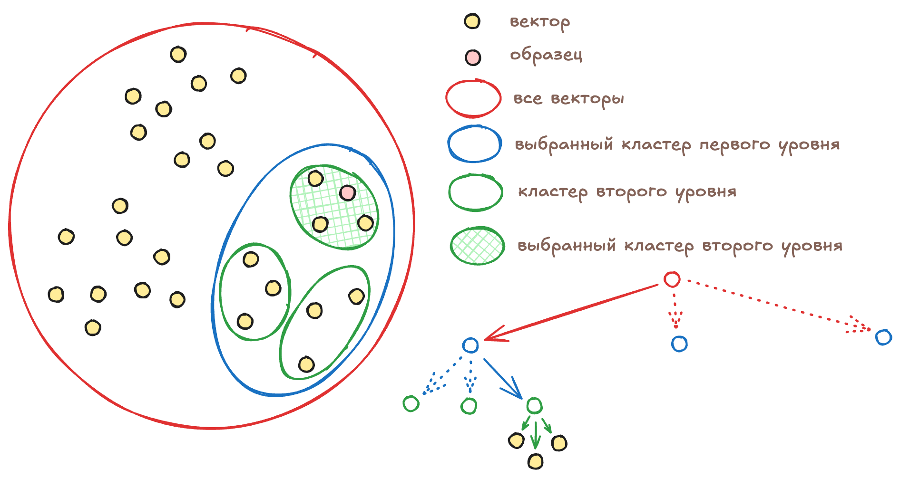
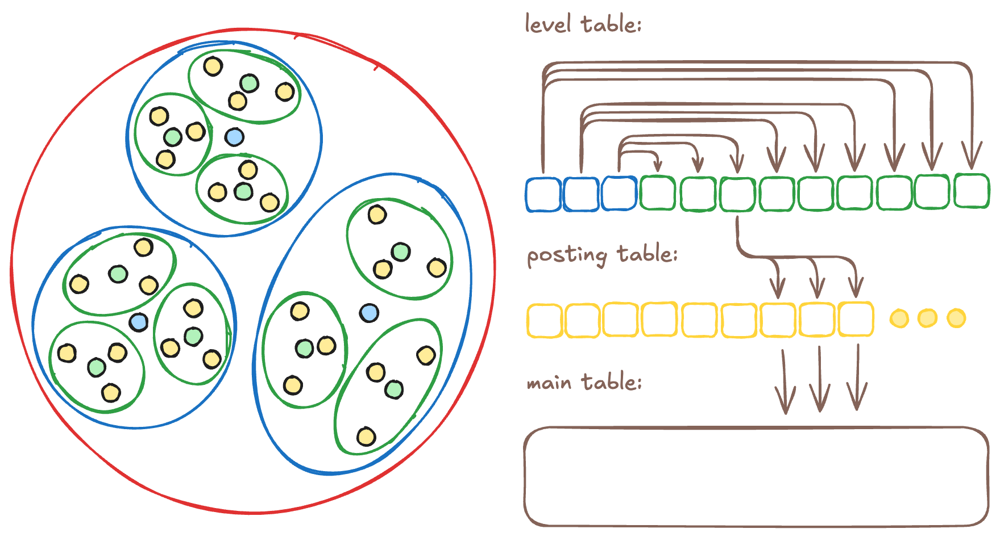

# Векторный индекс вида vector_kmeans_tree

[Векторные индексы](../concepts/glossary.md#vector-index) — это специализированные структуры данных, которые позволяют эффективно выполнять [векторный поиск](../concepts/query_execution/vector_search.md) в многомерных пространствах. Работа с ними подробно описана в [обзорной статье](vector-indexes.md), а эта статья подробно описывает работу векторного индекса вида `vector_kmeans_tree`.

## Создание векторного индекса {#index-create}

Алгоритм `vector_kmeans_tree` рекурсивно делит все векторы, по которым нужно вести поиск, на кластеры с помощью алгоритма [K-means](https://en.wikipedia.org/wiki/K-means_clustering). Сначала все векторы разделяются на количество кластеров, указанное при создании индекса с помощью [параметра векторного индекса](../yql/reference/syntax/create_table/vector_index.md) `clusters`. Например, кластеры первого уровня могут выглядеть вот так:

Затем каждый кластер, в свою очередь, разделяется на столько же кластеров. Так как каждый кластер первого уровня состоит из кластеров второго уровня, образуется дерево кластеров. Количество уровней в дереве задаётся с помощью [параметра векторного индекса](../yql/reference/syntax/create_table/vector_index.md) `levels`. Например, кластеры второго уровня будут выглядеть вот так:

Дерево векторного индекса будет содержать три кластера первого уровня, каждый из которых будет содержать три кластера второго уровня, каждый из которых, в свою очередь, будет содержать три вектора.

## Поиск в векторном индексе {#index-search}

Для поиска в векторном индексе `vector_kmeans_tree` последовательно выбирается на каждом уровне один из нескольких кластеров, в котором содержатся векторы, похожие на образец. Чтобы можно было выбрать нужный кластер, для каждого кластера рассчитывается и сохраняется центроид — среднее арифметическое всех векторов в кластере.

Выбрав кластер на одном из уровней, {{ ydb-short-name }} спускается на уровень ниже и перебирает кластеры, входящие в выбранный на предыдущем уровне кластер. {{ ydb-short-name }} сравнивает расстояния между центроидами кластеров и образцом, выбирая тот кластер, для которого это расстояние минимально. Приближённый поиск исходит из предположения, что если центроид кластера ближе всего к образцу, то и векторы в таком кластере тоже будут ближе всего к образцу.

Каждый кластер первого уровня разделён на кластеры второго уровня, и так далее. Алгоритм последовательно «спускается» по дереву, на каждом шаге выбирая кластер меньшего размера, пока не достигнет кластера самого нижнего уровня, который содержит не список центроидов, а непосредственно список векторов. {{ ydb-short-name }} перебирает эти векторы и выбирает заданное количество ближайших к образцу. Перебирая ограниченное количество кластеров на ограниченном количестве уровней, {{ ydb-short-name }} выполняет поиск со сложностью `O(1)`.

А если в кластере самого нижнего уровня меньше векторов, чем указано в запросе, то {{ ydb-short-name }} вернет все найденные векторы. Чтобы повысить полноту поиска в таких сценариях, нужно воспользоваться параметром `KMeansTreeSearchTopSize`, о котором рассказано далее.

## Параметры индекса {#index-settings}

{{ ydb-short-name }} позволяет настроить количество уровней векторного индекса с помощью параметра `levels` и количество кластеров на каждом уровне — с помощью параметра `clusters`. Эти параметры следует подбирать с учётом ожидаемого объёма хранимых векторов, а также характеристик кластера: сетевой задержки между узлами, пропускной способности сети и производительности центральных процессоров.

Кластеры, из которых состоит дерево векторного индекса, хранятся в распределённом хранилище. На каждом переходе вниз по дереву {{ ydb-short-name }} выполняет чтение из распределённого хранилища и получает по сети бинарные данные со списком векторов. Время выполнения такой операции зависит от оборудования датацентра, сетевой нагрузки и объёма данных, передаваемых между кластерами.

Выбор одного из кластеров на уровне требует перебора всех векторов-центроидов и вычисления расстояния между ними и образцом. Оценить скорость такого перебора на конкретном оборудовании можно с помощью [запроса](../yql/reference/udf/list/knn.md#exact-vector-search-k-nearest).

Если данных мало, то параметр `levels` можно установить в один уровень. А для миллиардов векторов может потребоваться увеличить значение этого параметра до четырёх уровней и подобрать оптимальное для вашего оборудования значение параметра `clusters`.

Оптимальное количество кластеров во многом зависит от производительности серверов — сколько векторов они способны перебрать в секунду. Поэтому, выбрав значение `levels` на основе ожидаемого объёма данных и сетевых задержек, значение `clusters` следует подбирать с учётом результатов тестов производительности.

Для большинства аппаратных конфигураций рекомендуется выбирать от 20 до 50 кластеров, это значение выбрано с запасом для типичных векторов длиной в 256 элементов и основано на экспериментах по балансу производительности и полноты результатов поиска.

Также рекомендуется выбирать конфигурацию, при которой в кластерах последнего уровня векторного индекса будет не более 512 векторов, чтобы их перебор укладывался в миллисекунды.

Например, если вы ожидаете, что в таблице будет 10 миллионов векторов, установили параметр `levels` в значение 3, а параметр `clusters` в значение 50, то векторный индекс будет иметь следующий вид:

* 1-й уровень дерева: 50 кластеров по 200 тысяч векторов в каждом;
* 2-й уровень дерева: каждый кластер 1-го уровня разделен на 50 кластеров по 4 тысячи векторов в каждом;
* 3-й уровень дерева: каждый кластер 2-го уровня разделен на 50 кластеров по 80 векторов в каждом.

## Настройка полноты поиска {#search-recall}

Если центроид кластера находится ближе всего к образцу, то, как правило, векторы этого кластера также ближе к образцу, чем векторы из других кластеров. Однако при сложных топологиях данных это может не выполняться, поэтому {{ ydb-short-name }} позволяет перебирать векторы более чем в одном кластере на каждом уровне дерева.

Количество кластеров, участвующих в поиске, задаётся параметром `KMeansTreeSearchTopSize`. По умолчанию он равен 1: {{ ydb-short-name }} выбирает один ближайший кластер на первом уровне дерева, затем запрашивает по сети его дочерние кластеры второго уровня, снова выбирает один ближайший и так далее. Этот параметр указывается не при создании индекса, а [для поиска](../yql/reference/syntax/select/vector_index.md#kmeanstreesearchtopsize).

Если указать большее значение, например 3, то на каждом уровне система будет выбирать не один, а три ближайших кластера. Для перехода на следующий уровень потребуется получить по сети дочерние векторы всех трёх выбранных кластеров, из которых затем будут отобраны три следующих. Такой подход повышает полноту поиска, но увеличивает объём передаваемых по сети данных и количество перебираемых векторов.

## Покрывающий индекс {#covering-index}

По умолчанию последний кластер хранит не сами векторы для поиска, а только список ключей этих векторов в таблице. Такой список называется [Posting Table](https://en.wikipedia.org/wiki/Inverted_index) — это разновидность инвертированного индекса. Хранение ссылок на векторы вместо самих векторов позволяет минимизировать размер векторного индекса.

Однако такой подход означает, что после нахождения последнего кластера {{ ydb-short-name }} должен выполнить `SELECT`-запрос к таблице, чтобы получить несколько сотен элементов (точное количество зависит от количества векторов в последнем кластере).

Запросы на получение векторов из последнего кластера могут быть медленными, если значение `clusters` слишком велико или индекс таблицы не включает колонку с векторами. В таких случаях поиск можно ускорить за счёт увеличения размера индекса: если [сделать индекс покрывающим](vector-indexes.md#covering), векторы будут храниться непосредственно в индексе. Данные по-прежнему будут передаваться по сети из распределённого хранилища, но это значительно быстрее, чем выполнение полноценного запроса к индексируемой таблице.

В покрывающий индекс можно включить не только векторы, но и любые другие колонки из индексируемой таблицы. В этом случае `SELECT`-запросы к этим колонкам будут выполняться быстрее ценой хранения избыточной копии их данных в индексе.

Покрывающий индекс можно дополнительно ускорить, если [включить](../yql/reference/syntax/alter_table/indexes.md#alter-index) чтение с [реплик](../concepts/datamodel/table.md#read_only_replicas).

## Векторный индекс с фильтрацией {#index-filter}

Часто возникает необходимость фильтровать объекты по дополнительным атрибутам или метаданным. Векторный индекс с фильтрацией ускоряет запросы с условиями WHERE, позволяя мгновенно получать похожие объекты среди подходящих по фильтру. При использовании такого индекса поиск ближайших векторов производится только среди строк, соответствующих фильтру, что обеспечивает высокую производительность на больших объёмах данных.

Быстрый и точный фильтрованный поиск поддерживается непосредственно на уровне структуры индекса. Для этого фильтруемая колонка должна быть явно указана в [SQL-запросе на создание индекса](../yql/reference/syntax/create_table/vector_index.md).

Добавление фильтрации непосредственно в векторный индекс связано с тем, что если фильтровать до поиска, то после применения фильтра останется набор строк, в которых нужно найти ближайшие к образцу векторы. Обычный векторный индекс позволяет искать ближайшие векторы только среди всех векторов в таблице, его нельзя применить к произвольному набору строк. Для нахождения ближайших векторов СУБД придётся перебрать все оставшиеся строки и для каждой из них вычислить дистанцию до образца.

Если же фильтровать после поиска, то подходящих результатов может остаться меньше, чем нужно, и качество поиска упадёт. В таком случае нужно будет повторить поиск с увеличенным лимитом, что тоже медленно. В {{ ydb-short-name }} фильтрация интегрирована прямо в структуру и алгоритм векторного индекса, так что не подходящие по условиям объекты сразу исключаются из рассмотрения.

## Внутреннее устройство индекса {#index-structure}

Индекс состоит из двух дополнительных таблиц: level table (`indexImplLevelTable`) и posting table (`indexImplPostingTable`). В таблице level table хранятся центроиды для дерева кластеров. К этой таблице {{ ydb-short-name }} делает запросы при переходе с уровня на уровень во время векторного поиска. Например, если векторный индекс построен для 27 векторов, параметр `levels` установлен в значение 2, а параметр `clusters` — в значение 3, то level table будет выглядеть следующим образом:

Для каждого центроида в level table также хранится информация о принадлежности к кластеру на вышестоящем уровне. {{ ydb-short-name }} использует эту информацию, чтобы при переходе на нижележащий уровень запрашивать только те центроиды, которые принадлежат кластерам, выбранным на предыдущем уровне.

Вторая таблица — posting table — используется для связи центроидов последнего уровня из level table с векторами в исходной таблице, для которой построен индекс. Если используется покрывающий индекс, в эту же таблицу сохраняются векторы и дополнительные колонки, указанные разработчиком при создании индекса:

При использовании индекса с фильтрацией перед векторным индексом добавляется классический вторичный индекс для указанных колонок. А для каждого уникального элемента вторичного индекса строится отдельный векторный индекс. Технически вторичный индекс помещается в дополнительную реляционную таблицу prefix table (`indexImplPrefixTable`), а все деревья векторных индексов остаются в таблице level table:

### Структура таблицы `indexImplLevelTable`

В первичный ключ этой таблицы входят колонки `__ydb_parent` и `__ydb_id`.

| Колонка | Тип данных | Описание |
| --- | --- | --- |
| `__ydb_parent` | `Uint64` | Идентификатор родительского кластера |
| `__ydb_id` | `Uint64` | Идентификатор текущего кластера |
| `__ydb_centroid` | `String` | Вектор центроида текущего кластера |

### Структура таблицы `indexImplPostingTable`

В первичный ключ этой таблицы входят колонка `__ydb_parent` и колонки, соответствующие первичному ключу индексируемой таблицы (`id` в примере ниже).

| Колонка | Тип данных | Описание |
| --- | --- | --- |
| `__ydb_parent` | `Uint64` | Идентификатор кластера, содержащего текущий вектор |
| `id` | `Uint64` | Первичный ключ индексируемой таблицы с векторами. Названия и типы колонок копируются из индексируемой таблицы. |

### Пример структуры таблицы `indexImplPostingTable` с покрывающим индексом

При использовании покрывающего индекса в таблицу `indexImplPostingTable` копируются указанные колонки из индексируемой таблицы. В первичный ключ входят те же колонки, что и для `indexImplPostingTable`. Вот так будет выглядеть таблица, если при создании покрывающего индекса указать колонку `embedding`:

| Колонка | Тип данных | Описание |
| --- | --- | --- |
| `__ydb_parent` | `Uint64` | Идентификатор кластера, содержащего текущий вектор |
| `id` | `Uint64` | Первичный ключ индексируемой таблицы с векторами. Названия и типы колонок копируются из индексируемой таблицы. |
| `embedding` | `String` | Копия вектора из индексируемой таблицы |

### Пример структуры таблицы `indexImplPrefixTable` для индекса с фильтрацией

При использовании индекса с фильтрацией в таблицу `indexImplPrefixTable` копируются названия и типы колонок из индексируемой таблицы. Вот так будет выглядеть таблица, если при создании индекса с фильтрацией указать колонку `category_id`:

| Колонка | Тип данных | Описание |
| --- | --- | --- |
| `category_id` | `Uint64` | Названия и типы колонок копируются из индексируемой таблицы |
| `__ydb_id` | `Uint64` | Идентификатор корневого кластера векторного индекса |
