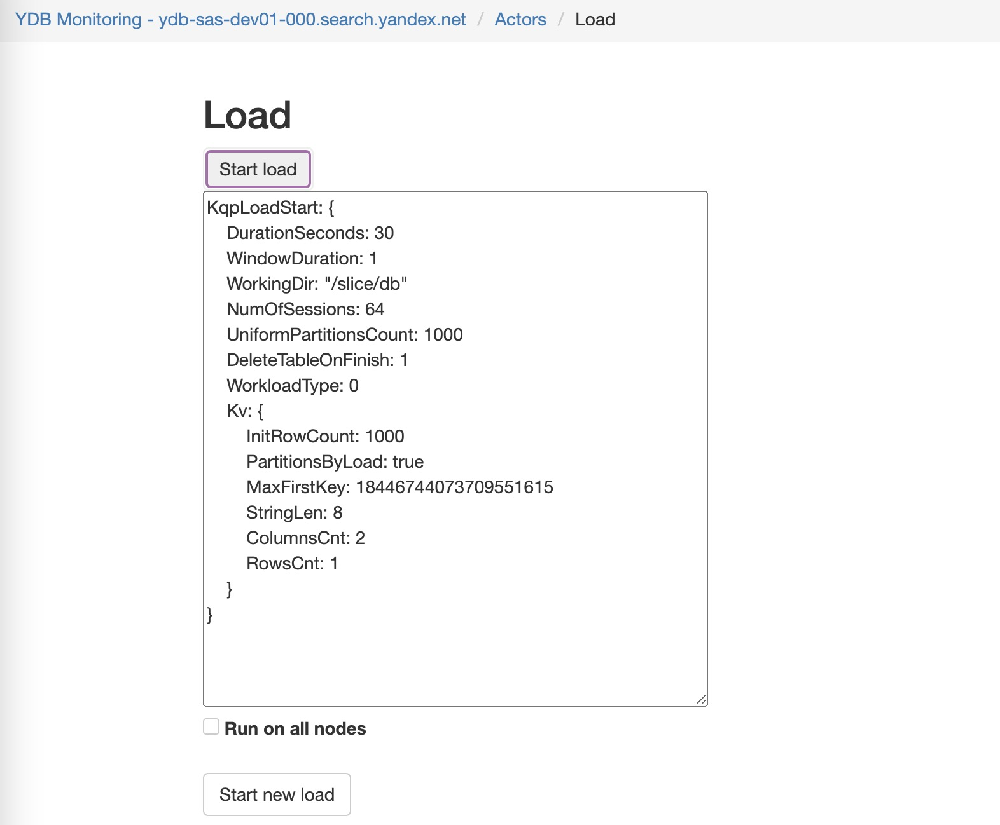

# Тестирование с помощью нагружающих акторов

С помощью нагружающих акторов вы можете запустить нагрузку изнутри системы.

На каждой ноде кластера {{ ydb-short-name }} есть актор-сервис `TLoadActor`, который получает proto с описанием нагрузки, присваивает ему Tag (если не указан явно), и создает соответствующий нагружающий актор.

Вы можете создать любое количество нагружающих акторов на любой из нод. Комбинация акторов разных [типов](#load-actor-type) позволяет запускать множество видов нагрузки. Можно комбинировать место подачи нагрузки (с одной ноды на все, со всех нод на все, со всех нод на одну), а также разные типы нагрузки (на одной ноде актор с большими редкими чтениями, на другой с частыми мелкими записями).

## Типы нагрузки {#load-actor-type}

Тип | Описание
--- | ---
[LoadStart](load-start.md) | нагружающий актор, подающий нагрузку от лица таблетки. Имитирует таблетку, создает себе TabletId и пишет в указанные storage-группы.
[PDiskLoadStart](pdisk-load-start.md) | нагружающий актор для подачи write-only нагрузки на PDisk. Имитирует VDisk.
[VDiskLoadStart](vdisk-load-start.md) | нагружающий актор для подачи нагрузки на VDisk. Имитирует DSProxy и пишет в локальный VDisk.
[PDiskReadLoadStart](pdisk-read-load-start.md) | нагружающий актор для подачи read-only нагрузки на PDisk. Имитирует VDisk.
[PDiskLogLoadStart](pdisk-log-load-start.md) | специальный нагружающий актор, написанный для тестирования вырезания из середины лога PDisk. Имитирует VDisk. Не является нагружающим, в первую очередь направлен на тестирование корректности.
[KeyValueLoadStart](key-value-load-start.md) | нагружающий актор для подачи нагрузки на KvTablet.
[KqpLoadStart](kqp-load-start.md) | нагружающий актор для подачи нагрузки на KQP часть и, соответственно, на весь кластер в целом. Аналогичен `ydb_cli workload`, есть два подвида - stock и kv.
[MemoryLoadStart](memory-load-start.md) | специальный нагружающий актор, проверяет производительность работы памяти. Кажется, используется в math bench - иногда запускается на кластере и рисует график времени работы.
[LoadStop](load-stop.md) | остановить нагрузку либо с конкретным тегом, либо со всеми.

## Запуск нагрузки {load-actor-start}

Вы можете запустить нагрузку следующими способами:

* командой через бинарник ydbd -- `ydbd bs-load-test`
* viewer UI кластера

В обоих вариантах подачи нагрузки необходимо создать proto-файл с текстовым описанием. Пример файла:

```proto
NodeId: 1
Event:
    KqpLoadStart: {
        DurationSeconds: 30
        WindowDuration: 1
        WorkingDir: "/slice/db"
        NumOfSessions: 64
        UniformPartitionsCount: 1000
        DeleteTableOnFinish: 1
        WorkloadType: 0
        Kv: {
            InitRowCount: 1000
            PartitionsByLoad: true
            MaxFirstKey: 18446744073709551615
            StringLen: 8
            ColumnsCnt: 2
            RowsCnt: 1
        }
    }
}
```


### ydbd

Запустить нагрузку можно используя бинарник `ydbd`. Для этого в нём существует команда `bs-load-test`

```bash
ydbd bs-load-test -s $SERVER --protobuf "$PROTO"
```

### Подача нагрузки через viewer UI


<br>
UI позволяет по proto-описанию создать нагружающего актора либо на одной текущей ноде, либо сразу на всех нодах тенанта (если страница принадлежит тенанту). За созданными акторами можно сделить на той же странице.

## Примеры {#load-examples}

### Запуск нагрузки {#load-examples-start}

```proto
NodeId: 1
Event: { KqpLoadStart: {
    DurationSeconds: 30
    WindowDuration: 1
    WorkingDir: "/slice/db"
    NumOfSessions: 64
    UniformPartitionsCount: 1000
    DeleteTableOnFinish: 1
    WorkloadType: 0
    Kv: {
        InitRowCount: 1000
        PartitionsByLoad: true
        MaxFirstKey: 18446744073709551615
        StringLen: 8
        ColumnsCnt: 2
        RowsCnt: 1
    }
}}
```

```proto
NodeId: 2
Event: { MemoryLoadStart: {
    DurationSeconds: 60
    IntervalUs: 1000
    BlockSize: 4096
}}
```