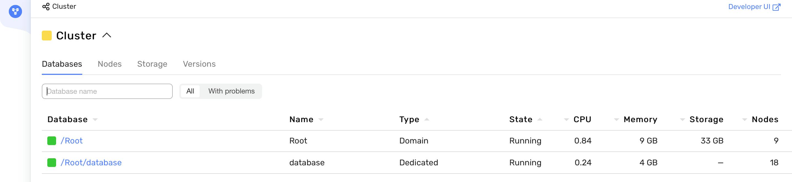
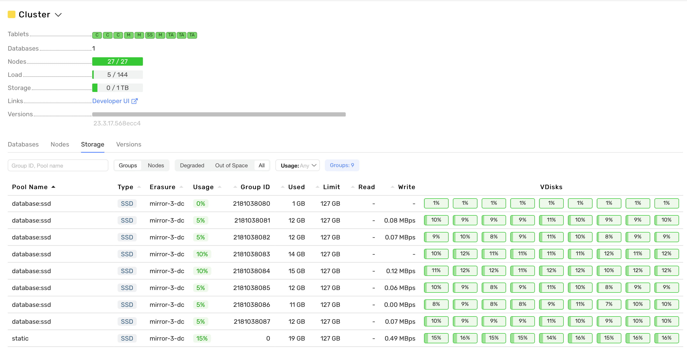

# Развёртывание {{ ydb-short-name }} кластера с помощью Ansible

В инструкции изложен процесс развёртывания {{ ydb-short-name }} кластера на группе серверов с помощью [Ansible](https://www.ansible.com). Рекомендуемая схема разворачивания кластера {{ ydb-short-name }} для начала работы состоит из 3 серверов с 3 дисками для пользовательских дисков в каждом. Для обеспечения отказоустойчивости этим серверам желательно иметь независимую инфраструктуру: располагаться в отдельных датацентрах или зонах доступностях, либо хотя бы отдельных серверных стойках.

Для более масштабных кластеров, рекомендуется использовать от 9 серверов для отказоустойчивых кластеров (`mirror-3-dc`) или 8 серверов для однодатацентровых кластеров (`block-4-2`). В обоих этих случаях серверам достаточно иметь по одному диску для пользовательских данных, но желательно также иметь отдельный небольшой диск для операционной системы. Подробнее о моделях избыточности можно узнать из статьи [{#T}](../../concepts/topology.md). В процессе эксплуатации кластер может быть [расширен](../../maintenance/manual/cluster_expansion.md) без приостановки доступа пользователей к базам данных.



**Рекомендуемые требования к серверам**:

* 16 CPU (рассчитывается исходя из утилизации 8 CPU сторадж нодой и 8 CPU динамической нодой).
* 16 GB RAM (рекомендуемый минимальный объем RAM).
* SSD-диски для пользовательских данных, размером от 120 GB.
* Доступ по SSH.
* Сетевая связность машин в кластере.
* OS: Ubuntu 18+, Debian 9+.
* Доступ в интернет для обновления репозиториев и скачивания нужных пакетов.



Скачать репозиторий с примерами для установки {{ ydb-short-name }} на кластер можно с GitHub – `git clone https://github.com/ydb-platform/ydb-ansible-examples.git`. Этот репозиторий содержит: шаблоны установки {{ ydb-short-name }} на кластер в поддиректориях, а также скрипты для генерации TLS-сертификатов и файлы requirements для установки необходимых Python пакетов. В этой статье будет использоваться поддиректория `3-nodes-mirror-3-dc` для самого простого способа развёртывания. Также можно аналогичным образом использовать директории `8-nodes-block-4-2` или `9-nodes-mirror-3-dc`, если вам доступно необходимое количество подходящих серверов.







Для работы с проектом на локальной (промежуточной или инсталляционной) машине понадобится: Python 3 версии 3.10+ и Ansible core не ниже версии 2.15.2. Ansible можно установить и запустить глобально (устанавливается в систему) или в виртуальном окружении. Если Ansible уже установлен – можно переходить к шагу [«Настройка Ansible проекта»](#ansible-project-setup), если Ansible ещё не установлен, установите его одним из предложенных способов:



- Установка Ansible в систему (глобально, Ubuntu 22.04 LTS)

  * Обновите список пакетов apt репозитория – `sudo apt update`.
  * Обновите пакеты – `sudo apt-get upgrade`.
  * Установите пакет `software-properties-common` для управления источниками программного обеспечения вашего дистрибутива – `sudo apt install software-properties-common`.
  * Добавьте новый PPA в apt – `sudo add-apt-repository --yes --update ppa:ansible/ansible`.
  * Установите Ansible – `sudo apt-get install ansible-core` (имейте ввиду, что установка просто `ansible` приведёт к неподходящей устаревшей версии).
  * Проверьте версию Ansible core – `ansible --version`

- Установка Ansible в виртуальное окружение Python

  * Обновите список пакетов apt репозитория – `sudo apt-get update`.
  * Установите пакет `venv` для Python3 – `sudo apt-get install python3-venv`
  * Создайте директорию, где будет создано виртуальное окружение и куда будут скачаны плейбуки. Например, `mkdir venv-ansible`.
  * Создайте виртуальное окружение – `python3 -m venv venv-ansible`.
  * Активируйте виртуальное окружение – `source venv-ansible/bin/activate`. В дальнейшем все действия по работе с Ansible выполняются внутри виртуального окружения. Выйти из него можно командой `deactivate`.
  * Установите Ansible рекомендуемой версии с помощью команды `pip3 install -r requirements.txt`, находясь в корневой директории скачанного репозитория.
  * Проверьте версию Ansible core – `ansible --version`



Перейдите в корневой каталог загруженного репозитория и выполните команду `ansible-galaxy install -r requirements.yaml` – она скачает коллекции Ansible `ydb_platform.ydb` и `community.general`, которые содержат роли и плагины для установки {{ ydb-short-name }}.

## Настройка проекта Ansible {#ansible-project-setup}

### Редактирование инвентори-файлов {#inventory-edit}

Независимо от выбранной топологии кластера (`3-nodes-mirror-3-dc`, `9-nodes-mirror-3-dc` или `8-nodes-block-4-2`), основные параметры для установки и настройки {{ ydb-short-name }} содержатся в инвентори-файле `50-inventory.yaml`, который находится в каталоге `inventory/`.

В инвентори-файле `50-inventory.yaml` необходимо указать текущий список FQDN серверов, на которых будет установлен {{ ydb-short-name }}. По умолчанию список выглядит следующим образом:
  ```yaml
  all:
    children:
      ydb:
        static-node-1.ydb-cluster.com:
        static-node-2.ydb-cluster.com:
        static-node-3.ydb-cluster.com:
  ```

Далее необходимо внести следующие изменения в разделе `vars` инвентори-файла:

* `ansible_user` – укажите пользователя, от имени которого Ansible будет подключаться через SSH.
* `ansible_ssh_common_args: "-o ProxyJump=<ansible_user>@<static-node-1-IP>"` – опция для подключения Ansible к серверу по IP, с которого будет установлен {{ ydb-short-name }} (включая сервер ProxyJump). Используется при установке {{ ydb-short-name }} с локальной машины, не входящей в частную DNS-зону.
* `ansible_ssh_private_key_file` – измените путь до приватного SSH-ключа  на фактическое: `"../<ssh-private-key-name>"`.
* Выберите один из доступных вариантов развёртывания исполняемых файлов {{ ydb-short-name }}:

  * `ydb_version`: автоматически загрузить один из [официальных релизов {{ ydb-short-name }}](../../downloads/index.md#ydb-server) по номеру версии. Например, `23.4.11`.
  * `ydb_git_version`: автоматически скомпилировать исполняемые файлы {{ ydb-short-name }} из исходного кода, загруженного из [официального репозитория GitHub](https://github.com/ydb-platform/ydb). Значение настройки – это имя ветки, тега или коммита. Например, `main`.
  * `ydb_archive`: локальный путь к архиву с дистрибутивом {{ ydb-short-name }}, [загруженного](../../downloads/index.md#ydb-server) или подготовленного заранее.
  * `ydbd_binary` и `ydb_cli_binary`: локальные пути к исполняемым файлам сервера и клиента {{ ydb-short-name }}, [загруженным](../../downloads/index.md#ydb-server) или подготовленным заранее.

#### Дополнительные изменения в инвентори-файлах

При необходимости можно изменить эти настройки, но это не обязательно в простых случаях:

* `ydb_cores_static` – количество процессорных ядер, выделенных для статических узлов.
* `ydb_cores_dynamic` – количество процессорных ядер, выделенных для динамических узлов.
* `ydb_tls_dir` – укажите локальный путь к папке с заранее подготовленными TLS-сертификатами. Она должна содержать файл `ca.crt` и подкаталоги с именами, соответствующими именам узлов, содержащие сертификаты для каждого узла. Если параметр не указан, самоподписанные TLS-сертификаты будут сгенерированы автоматически для всего кластера {{ ydb-short-name }}.
* `ydb_brokers` – укажите список FQDN брокерных узлов. Например:
  ```yaml
  ydb_brokers:
    - static-node-1.ydb-cluster.com
    - static-node-2.ydb-cluster.com
    - static-node-3.ydb-cluster.com
  ```

Значение переменной `ydb_database_groups` в разделе `vars` имеет фиксированное значение, которое привязано к типу избыточности и не зависит от размера кластера:

* Для типа избыточности `block-4-2` значение `ydb_database_groups` равно семи.
* Для типа избыточности `mirror-3-dc` значение `ydb_database_groups` равно восьми.

Значения переменных `system_timezone` и `system_ntp_servers` зависят от свойств инфраструктуры, на которой развёртывается YDB кластер. По умолчанию в `system_ntp_servers` указан набор NTP-серверов без учёта географического расположения инфраструктуры, на которой будет развёртываться YDB кластер. Мы настоятельно рекомендуем использовать локальный NTP-сервер для on-premise инфраструктуры и следующие NTP-серверы для облачных провайдеров:



- Yandex Cloud

  * `system_timezone`: Europe/Moscow
  * `system_ntp_servers`: [0.ru.pool.ntp.org, 1.ru.pool.ntp.org, ntp0.NL.net, ntp2.vniiftri.ru, ntp.ix.ru, ntps1-1.cs.tu-berlin.de] [Подробнее](https://cloud.yandex.ru/ru/docs/tutorials/infrastructure-management/ntp) о настройках NTP-серверов Yandex Cloud.

- AWS

  * `system_timezone`: USA/<region_name>
  * `system_ntp_servers`: [169.254.169.123, time.aws.com] [Подробнее](https://docs.aws.amazon.com/AWSEC2/latest/UserGuide/set-time.html#configure-time-sync) о настройках NTP-серверов AWS.

- Azure

  * О том, как настраивается синхронизация времени на виртуальных машинах Azure, можно прочесть в [данной](https://learn.microsoft.com/en-us/azure/virtual-machines/linux/time-sync) статье.

- Alibaba

  * Специфика подключения к NTP-серверам в Alibaba описана в этой [статье](https://www.alibabacloud.com/help/en/ecs/user-guide/alibaba-cloud-ntp-server).



Изменения других секций конфигурационного файла `50-inventory.yaml` не требуются.

#### Изменение пароля пользователя root { #change-password }

 Далее можно изменить стандартный пароль root пользователя {{ ydb-short-name }}, который содержится в зашифрованном инвентаризационном файле `99-inventory-vault.yaml` и файле `ansible_vault_password_file.txt`. Для изменения пароля укажите новый пароль в файле `ansible_vault_password_file.txt` и продублируйте его в файле `99-inventory-vault.yaml` в формате:
  ```yaml
  all:
    children:
      ydb:
        vars:
          ydb_password: <new-password>
  ```

Для шифрования `99-inventory-vault.yaml` выполните команду `ansible-vault encrypt inventory/99-inventory-vault.yaml`.

После изменения инвентаризационных файлов можно переходить к подготовке конфигурационного файла {{ ydb-short-name }}.

### Подготовка конфигурационного файла {{ ydb-short-name }} { #ydb-config-prepare }

Конфигурационный файл {{ ydb-short-name }} содержит настройки нод {{ ydb-short-name }} и располагается в поддиректории `/files/config.yaml`. С подробным описанием секций настройки конфигурационного файла {{ ydb-short-name }} можно ознакомиться в статье [{#T}](../../deploy/configuration/config.md).

Дефолтный конфигурационный файл {{ ydb-short-name }} уже содержит почти все необходимые настройки для развёртывания кластера. Необходимо заменить стандартные FQDN хостов на актуальные FQDN в разделах `hosts` и `blob_storage_config`:

* Раздел `hosts`:
  ```yaml
  ...
  hosts:
    - host: static-node-1.ydb-cluster.com #FQDN ВМ
      host_config_id: 1
      walle_location:
        body: 1
        data_center: 'zone-a'
        rack: '1'
  ...
  ```
* Раздел `blob_storage_config`:
  ```yaml
  ...
  - fail_domains:
    - vdisk_locations:
      - node_id: static-node-1.ydb-cluster.com #FQDN ВМ
        pdisk_category: SSD
        path: /dev/disk/by-partlabel/ydb_disk_1
  ...
  ```

Остальные секции и настройки конфигурационного файла остаются без изменений.


## Развёртывание кластера {{ ydb-short-name }} { #erasure-setup }



Минимальное количество серверов в кластере {{ ydb-short-name }} – восемь серверов для модели избыточности `block-4-2` и девять серверов для модели избыточности `mirror-3-dc`.



[Репозиторий](https://github.com/ydb-platform/ydb-ansible-examples) содержит два готовых набора шаблонов для развёртывания кластера {{ ydb-short-name }} из восьми (модель избыточности `block-4-2`) и девяти серверов (`mirror-3-dc`). Любой из предложенных вариантов может быть масштабирован на любое нужное количество серверов с учётом ряда технических требований.

Для подготовки собственного шаблона можно воспользоваться следующей инструкцией:

1. Создайте копию директории с готовым примером (`9-nodes-mirror-3-dc` или `8-nodes-block-4-2`).
2. Укажите FQDN серверов в файле `TLS/ydb-ca-nodes.txt` и выполните скрипт `ydb-ca-update.sh` для генерации наборов TLS сертификатов.
3. Внесите изменения в инвентаризационные файлы шаблона в соответствии с [инструкцией](#inventory-edit).
4. Внесите изменения в конфигурационный файл {{ ydb-short-name }} в соответствии с [инструкцией](#ydb-config-prepare).
5. Выполните команду `ansible-playbook ydb_platform.ydb.initial_setup`, находясь в директории клонированного шаблона.

## План выполнения сценария установки {{ ydb-short-name }} { #ydb-playbook-run }

Последовательность выполнения ролей и их краткое описание:

1. Роль `packages` настраивает репозитории, управляет предпочтениями и конфигурациями APT, а также исправляет неконфигурированные пакеты и устанавливает необходимые программные пакеты в зависимости от версии дистрибутива.
2. Роль `system` устанавливает системные настройки, включая конфигурацию часов и временной зоны, синхронизацию времени через NTP с помощью `systemd-timesyncd`, настройку `systemd-journald` для управления журналами, конфигурацию загрузки модулей ядра и оптимизацию параметров ядра через `sysctl`, а также настройку производительности процессора с использованием `cpufrequtils`.
3. Роль `ydb` выполняет задачи по проверке необходимых переменных, установке базовых компонентов и зависимостей, настройке системных пользователей и групп, развертыванию и конфигурированию {{ ydb-short-name }}, включая управление сертификатами TLS и обновление конфигурационных файлов.
4. Роль `ydb-static` отвечает за подготовку и запуск статических нод {{ ydb-short-name }}, включая проверку необходимых переменных и секретов, форматирование и подготовку дисков, создание и запуск `systemd unit` для узла хранения, а также инициализацию хранилища и управление доступом к базе данных.
5. Роль `ydb-dynamic` настраивает и управляет динамическими узлами {{ ydb-short-name }}, включая проверку необходимых переменных, создание конфигурационных файлов и `systemd unit` файлов для каждого динамического узла, запуск этих узлов, получение токена для доступа к {{ ydb-short-name }}, создание базы данных в {{ ydb-short-name }}.







В результате выполнения плейбука будет создан кластер {{ ydb-short-name }}, на котором развернута тестовая база данных – `database`, создан `root` пользователь с максимальными правами доступа и запущен Embedded UI на порту 8765. Для подключения к Embedded UI можно настроить SSH-туннелирование. Для этого на локальной машине выполните команду `ssh -L 8765:localhost:8765 -i <ssh private key> <user>@<first ydb static node ip>`. После успешного установления соединения можно перейти по URL [localhost:8765](http://localhost:8765):



## Мониторинг состояния кластера { #troubleshooting }

После успешного создания кластера {{ ydb-short-name }} проверить его состояние можно с помощью Embedded UI – [http://localhost:8765/monitoring/cluster/tenants](http://localhost:8765/monitoring/cluster/tenants):


В разделе отражены следующие параметры кластера {{ ydb-short-name }}, которые показывают состояние кластера:

* `Tablets` – список запущенных [таблеток](../../concepts/cluster/common_scheme_ydb.md#tablets). Все индикаторы состояния таблеток должны быть зелёного цвета.
* `Nodes` – количество и состояние запущенных статических и динамических нод в кластере. Индикатор состояния нод должен быть зелёным, а пропорция созданных и запущенных нод должна быть равной. Например, 27/27 для кластера из девяти нод.
* Индикаторы показателей `Load` (количество используемой RAM) и `Storage` (количество используемого дискового пространства) должны быть зелёными.

Проверить состояние сторадж группы можно в разделе `storage` – [http://localhost:8765/monitoring/cluster/storage](http://localhost:8765/monitoring/cluster/storage):



Индикаторы `VDisks` должны быть зелёными, а статус `state` (находится в всплывающей подсказке при наведении на индикатор VDisk) должен быть `Ok`. Подробнее о показателях состояния кластера и мониторинге можно прочитать в статье [{#T}](../../reference/embedded-ui/ydb-monitoring.md).

## Тестирование кластера { #testing }

Протестировать кластер можно с помощью встроенных в YDB CLI нагрузочных тестов. Для этого скачайте на машину, на которой установлен Ansible, YDB CLI версии [2.5.0](https://storage.yandexcloud.net/yandexcloud-ydb/release/2.5.0/linux/amd64/ydb). Например, с помощью wget: `wget https://storage.yandexcloud.net/yandexcloud-ydb/release/2.5.0/linux/amd64/ydb`.

Сделайте скачанный бинарный файл исполняемым – `chmod +x ydb` и создайте [профиль](../../reference/ydb-cli/profile/index.md) подключения к YDB:
```shell
./ydb \
  config profile create <profile name> \
  -d /Root/database \
  -e grpcs://<FQDN node>:2135 \
  --ca-file <path to generated certs>/CA/certs/ca.crt \
  --user root \
  --password-file <path to vault password file>/ansible_vault_password_file
```

Параметры команды и их значения:
* `config profile create` – команда создания профиля подключения. Задаётся имя профиля. Более детальную информацию о том, как создавать и изменять профили, можно найти в статье [{#T}](../../reference/ydb-cli/profile/create.md).
* `-e` – эндпоинт (endpoint), строка в формате `protocol://host:port`. Можно указать FQDN любой ноды кластера и не указывать порт. По умолчанию будет использован 2135 порт.
* `--ca-file` – путь к корневому сертификату для подключения к базе по `grpcs`. Сертификат создаётся скриптом `ydb-ca-update.sh` в директории `TLS` и располагается по пути `TLS/CA/certs/` относительно корня репозитория `ydb-ansible-examples`.
* `--user` – пользователь для подключения к БД. По умолчанию при выполнении плейбука `ydb_platform.ydb.initial_setup` создаётся пользователь root.
* `--password-file` – путь к файлу с паролем. В каждой папке с шаблоном развёртывания YDB кластера находится файл `ansible_vault_password_file`, который содержит пароль пользователя root.

Проверить, создался ли профиль, можно командой `./ydb config profile list` – будет выведен список профилей. После создания профиля его нужно активировать командой `./ydb config profile activate <profile name>`. Проверить, что профиль был активирован, можно повторным выполнением команды `./ydb config profile list` – активный профиль будет иметь отметку (active).

Теперь можно выполнить YQL запрос `./ydb yql -s 'select 1;'`, который вернёт в терминал результат выполнения команды `select 1` в табличной форме. После проверки соединения можно создать тестовую таблицу командой:
`./ydb workload kv init --init-upserts 1000 --cols 4`. Будет создана тестовая таблица `kv_test`, состоящая из 4 столбцов и 1000 строк. Проверить, что таблица `kv_test` создалась и заполнилась тестовыми данными, можно командой `./ydb yql -s 'select * from kv_test limit 10;'`.

В терминал будет выведена таблица из 10 строк. Теперь можно выполнять тестирование производительности кластера. В статье [{#T}](../../reference/ydb-cli/workload-kv.md) описаны 5 видов нагрузок (`upsert`, `insert`, `select`, `read-rows`, `mixed`) и параметры их выполнения. Пример выполнения тестовой нагрузки `upsert` с параметром вывода времени выполнения запроса `--print-timestamp` и стандартными параметрами исполнения: `./ydb workload kv run upsert --print-timestamp`.

В терминал будет выведен отчёт следующего вида:
```
Window Txs/Sec Retries Errors  p50(ms) p95(ms) p99(ms) pMax(ms)        Timestamp
1          727 0       0       11      27      71      116     2024-02-14T12:56:39Z
2          882 0       0       10      21      29      38      2024-02-14T12:56:40Z
3          848 0       0       10      22      30      105     2024-02-14T12:56:41Z
...
```

После завершения тестов удалить таблицу `kv_test` можно командой: `./ydb workload kv clean`. Подробнее об опциях создания тестовой таблицы и тестах можно прочесть в статье [{#T}](../../reference/ydb-cli/workload-kv.md).
