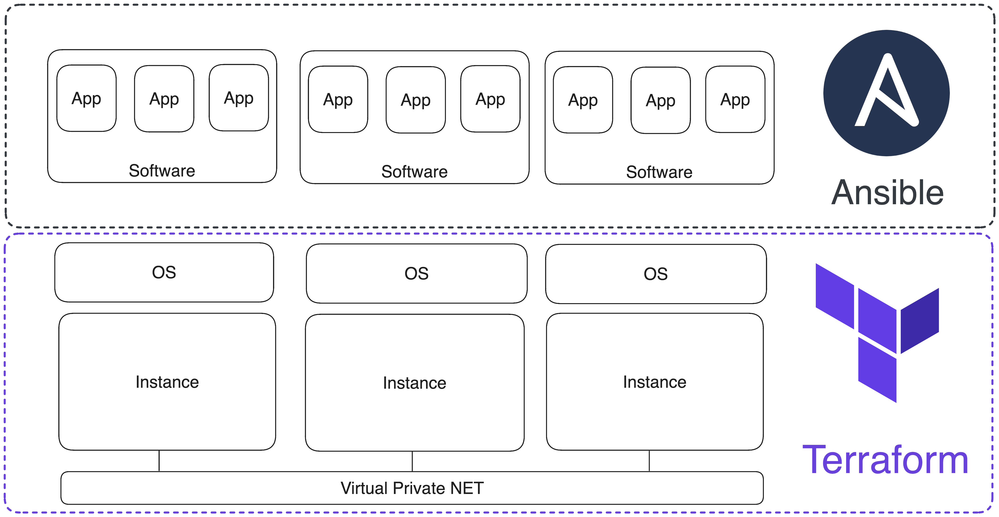

# Развёртывание инфраструктуры для кластера {{ ydb-short-name }} с помощью Terraform

Развернуть кластер {{ ydb-short-name }} для использования в production можно тремя рекомендованными способами: с помощью [Ansible](./initial-deployment.md), [Kubernetes](../kubernetes/index.md) или [вручную](../../devops/manual/index.md). Если вариант с Kubernetes практически самодостаточен, то для вариантов с Ansible и вручную нужен SSH-доступ к правильно сконфигурированным серверам или виртуальным машинам.

В статье описывается, как создать и настроить необходимый для работы кластера {{ ydb-short-name }} набор виртуальных машин у различных облачных провайдеров с помощью Terraform.

**[Terraform](https://www.terraform.io/)** – это программное обеспечение с открытым исходным кодом для управления инфраструктурой по модели «инфраструктура как код» (Infrastructure as Code). Такой же подход используется в Ansible, системе управления конфигурациями. Terraform и Ansible работают на разных уровнях: Terraform управляет инфраструктурой, а Ansible настраивает окружения на ВМ:



## Установка Terraform {#terraform-install}

Скачать и установить Terraform можно следуя [инструкции](https://developer.hashicorp.com/terraform/install) на сайте HashiCorp, однако доступ к официальным репозиториям для скачивания может быть ограничен для пользователей из России. 

Скачать и установить Terraform можно с зеркала Yandex Cloud:



- Linux/macOS

    1. Перейдите по [ссылке](https://hashicorp-releases.yandexcloud.net/terraform/) и выберите подходящую вам версию Terraform.
    1. Скачайте архив

        ```bash
        sudo curl -L -o <archive_name>.zip \
        https://hashicorp-releases.yandexcloud.net/terraform/<terraform_version>/ \
        <terraform_version_architecture_and_os>.zip
        ```

    1. Распакуйте архив с помощью команды `unzip <archive_name>.zip`. Будет распакован бинарный файл Terraform и сопроводительные файлы. Установить `unzip` можно командой `apt update && apt install unzip`.
    1. Создайте _alias_ для Terraform (способ создания сокращений для команд):
        * Откройте в текстовом редакторе конфигурационный файл оболочки (`~/.bashrc` или `~/.zshrc`) и добавьте в конец файла `alias terraform='<path_to_binary_file_terraform>'`;
        * Сохраните изменения и перечитайте конфигурацию командой `source ~/.bashrc` или `source ~/.zshrc`
    1. Проверьте работоспособность Terraform, выполнив команду `terraform -version`.

- macOS

    1. Перейдите по [ссылке](https://hashicorp-releases.yandexcloud.net/terraform/) и выберите подходящую вам версию Terraform.
    1. Скачайте архив

        ```bash
        sudo curl -L -o <archive_name>.zip \
        https://hashicorp-releases.yandexcloud.net/terraform/<terraform_version>/ \
        <terraform_version_architecture_and_os>.zip
        ```

    1. Распакуйте архив с помощью встроенного архиватора в macOS. Будет распакован бинарный файл Terraform и сопроводительные файлы.
    1. Создайте _alias_ для Terraform (способ создания сокращений для команд):
        * Откройте в текстовом редакторе конфигурационный файл оболочки (`~/.bashrc` или `~/.zshrc`) и добавьте в конец файла `alias terraform='<path_to_binary_file_terraform>'`;
        * Сохраните изменения и перечитайте конфигурацию командой `source ~/.bashrc` или `source ~/.zshrc`;
    1. Проверьте работоспособность Terraform, выполнив команду `terraform -version`.

- Windows

    1. Перейдите по [ссылке](https://hashicorp-releases.yandexcloud.net/terraform/) и выберите подходящую вам версию Terraform и скачайте архив.
    1. Распакуйте архив стандартными средствами Windows в удобную вам директорию.
    1. Откройте командную строку PowerShell и проверьте работоспособность terraform, выполнив команду `terraform -version` в директории, куда был распакован Terraform.



## Структура файлов Terraform и их синтаксис {#terraform-files-structure}

Конфигурация настройки окружения ВМ описывается в YAML-формате, а инфраструктурный код пишется на [HCL](https://github.com/hashicorp/hcl) (язык конфигурации Terraform). Основной логической единицей записи в HCL является «блок». Блок состоит из ключевого слова, идентифицирующего его тип, названия и фигурных скобок, обозначающих тело блока. Например, так может выглядеть блок управления виртуальным сервером в AWS:

<!-- markdownlint-disable blanks-around-fences -->

```tf
resource "aws_instance" "ydb-vm" {
  count                  = var.instance_count
  ami                    = "ami-008fe2fc65df48dac"
  instance_type          = "t2.micro"
  key_name               = var.req_key_pair
  vpc_security_group_ids = [var.input_security_group_id]
  subnet_id              = element(var.input_subnet_ids, count.index % length(var.input_subnet_ids))
  tags = {
    Name                 = "ydb-node-${count.index +1}"
    Username             = "ubuntu"
  }
}
```

<!-- markdownlint-enable blanks-around-fences -->

Блоки могут располагаться друг за другом в одном файле и быть независимыми, могут ссылаться друг на друга и быть зависимыми, а также могут вкладываться друг в друга.

Основные типы блоков:

* `resource` – блок инициализации ресурса инфраструктуры (ВМ, сеть, подсеть, диск, DNS-зона и т.д.);
* `provider` – блок инициализации провайдера, версии API и данных для аутентификации;
* `variable` – переменная как со значением по умолчанию, так и пустая для хранения данных, введённых пользователем или переданных другими блоками;
* `output` – вывод данных в терминал и сохранение в переменной;
* `data` – переменная для запроса данных от внешних облачных ресурсов, не представленных в создаваемой инфраструктуре;
* `module` – логическая группировка ресурсов, которые можно переиспользовать несколько раз в рамках одного или разных проектов;
* `terraform` – блок настройки поведения самого Terraform, включая версию Terraform и используемых провайдеров, а также настройки бэкенда, который используется для хранения состояния Terraform.

Блоки записываются в файлы с расширением `.tf` и логически группируются в директориях, которые в терминологии Terraform называют модулями. Модуль обычно состоит из следующих файлов:

* `main.tf` – основной файл, в котором находится код инфраструктуры. Может быть несколько файлов, содержащих инфраструктурный код.
* `variables.tf` – локальные переменные модуля, которые принимают данные от других модулей или имеют значения по умолчанию.
* `outputs.tf` – переменные, которые содержат результаты работы ресурса (IP-адреса ВМ, ID сетей/подсетей и т.д.).

Модули подключаются к проекту в корневом файле `main.tf` следующим образом:

```tf
module "vpc" {
  source                     = "./modules/vpc"
  subnets_count              = var.subnets_count
  subnets_availability_zones = var.availability_zones
}
```

В примере подключается модуль `vpc` (имя модуля назначается при подключении). Обязательный параметр – это `source`, путь к директории, где располагается модуль. `subnets_count` и `subnets_availability_zones` – это переменные внутри модуля `vpc`, которые принимают значения из переменных глобального уровня `var.subnets_count` и `var.availability_zones`.

Модули, как и блоки, располагаются друг за другом в корневом `main.tf` проекта. Основное преимущество модульного подхода организации проекта – возможность легко управлять логически связанными наборами ресурсов. Поэтому [репозиторий](https://github.com/ydb-platform/ydb-terraform) с готовыми Terraform-сценариями организован следующим образом:

```text
.
├── README.md
├── README_RU.md
├── aws
│   ├── README.md
│   ├── README_RU.md
│   ├── main.tf
│   ├── modules
│   │   ├── dns
│   │   ├── eip
│   │   ├── instance
│   │   ├── key_pair
│   │   ├── security
│   │   └── vpc
│   └── variables.tf
├── azure
│   ├── README.md
│   ├── README_RU.md
│   ├── main.tf
│   ├── modules
│   │   ├── dns
│   │   ├── resource_group
│   │   ├── security
│   │   ├── vm
│   │   └── vpc
│   └── variables.tf
├── ...
```

Поддиректории содержат два `readme`, файл `variables.tf` с локальными переменными модуля и основной файл `main.tf`, который подключает модули из поддиректории `modules`. Набор модулей зависит от облачного провайдера. Базовые модули, функционально одинаковые для всех провайдеров, имеют одинаковые названия:

* `vpc` – модуль управления облачной сетью и подсетями;
* `dns` – модуль управления DNS-зоной и DNS-записями;
* `security` – модуль управления группами безопасности;
* `instance` – модуль управления ВМ.

Чтобы воспользоваться готовыми Terraform-сценариями из репозитория, нужно скачать репозиторий командой `git clone https://github.com/ydb-platform/ydb-terraform.git`, внести изменения в конфигурационный файл Terraform `~/.terraformrc`, задать актуальные значения глобальных переменных сценария и скачать CLI того облачного провайдера, где будет создана инфраструктура.

Если вы планируете использовать несколько провайдеров, можно добавить следующий код в `~/.terraformrc`, который установит пути скачивания для всех провайдеров, описанных ниже:

```tf
provider_installation {
  network_mirror {
    url     = "https://terraform-mirror.yandexcloud.net/"
    include = ["registry.terraform.io/*/*"]
  }
  direct {
    exclude = ["registry.terraform.io/*/*"]
    exclude = ["terraform.storage.ydb.tech/*/*"]
  }
}  
```

Если уже используются Terraform-провайдеры, представленные в [официальном репозитории](https://registry.terraform.io/browse/providers), они продолжат работать.

## Обзор разворачиваемой инфраструктуры {#infrastructure-review}

Далее приведены пошаговые инструкции создания инфраструктуры в [AWS](#aws-cluster), [Azure](#azure-cluster), [GCP](#gcp-cluster), [Yandex Cloud](#yc-cluster). Предложенные примеры Terraform-сценариев развертывают однотипную инфраструктуру:

* Виртуальные машины в трёх зонах доступности;
* Облачная сеть, публичные и приватные подсети (по подсети на зону доступности);
* Приватная DNS-зона;
* Группы безопасности, разрешающие ICMP и трафик на портах: 22, 65535, 19001, 8765, 2135.

Большинство параметров кластера регулируются (количество ВМ, объём и тип подключаемого диска, количество сетей, домен DNS-зоны и т.д.), однако значения по умолчанию являются минимально рекомендованными. Их изменение в меньшую сторону может привести к проблемам.

## Создание инфраструктуры в AWS для развертывания {{ ydb-short-name }} кластера {#aws-cluster}



## Создание инфраструктуры в Azure для развертывания {{ ydb-short-name }} кластера {#azure-cluster}



## Создание инфраструктуры в Google Cloud Platform для развертывания {{ ydb-short-name }} кластера {#gcp-cluster}



## Создание инфраструктуры в Yandex Cloud для развертывания {{ ydb-short-name }} кластера {#yc-cluster}


