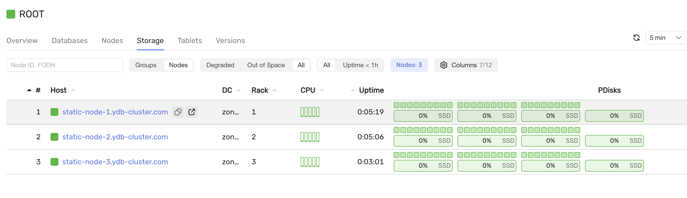
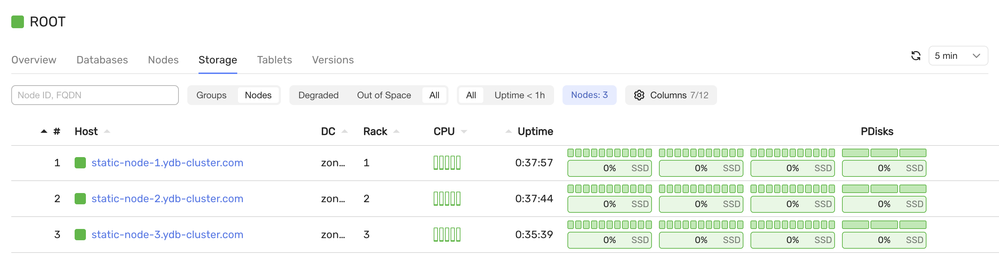

# Добавление нового диска в кластер {{ ydb-short-name }} (конфигурация V1)

В этом разделе описано, как добавить новый жёсткий диск в кластер {{ ydb-short-name }}, развёрнутый по топологии `3-nodes-mirror-3-dc` (конфигурация V1), с помощью Ansible.

## Требования

Перед началом работы убедитесь, что выполнены условия:

- Кластер {{ ydb-short-name }} развернут по топологии `3-nodes-mirror-3-dc` (конфигурация V1).

- На каждом сервере кластера добавлен новый жесткий диск `/dev/vde`.

## Порядок действий

### Обновите inventory/50-inventory.yaml

Откройте `inventory/50-inventory.yaml` и добавьте новый диск в переменную `ydb_disks`, указав для него новый `label`.

Этот `label` потребуется для выполнения следующих шагов.

### Обновите files/config.yaml

Откройте `files/config.yaml` и добавьте `label` нового диска в секцию `host_configs`.

`Label` должен совпадать с тем, который вы указали в `inventory/50-inventory.yaml`.

### Подготовьте новый диск к использованию

Подготовьте диск к работе с помощью плейбука:

```bash
ansible-playbook ydb_platform.ydb.prepare_drives \
  --extra-vars "ydb_disk_prepare=ydb_disk_4"
```  

Значение `ydb_disk_prepare` должно содержать `label` нового диска.

### Обновите конфигурацию и перезапустите кластер

Примените изменения конфигурации на всех узлах и при необходимости перезапустите кластер:

```bash
ansible-playbook ydb_platform.ydb.update_config
```

### Проверьте состояние кластера

Убедитесь, что кластер работает корректно:

```bash
ansible-playbook ydb_platform.ydb.healthcheck
```

### Разрешите использование новых дисков

Выдайте разрешение на использование новых дисков подсистемой хранения:

```bash
ansible-playbook ydb_platform.ydb.update_config \
  --extra-vars "ydb_storage_update_config=true" \
  --tag storage \
  --skip-tags restart
```  



### Добавьте дополнительные группы хранения

Добавьте дополнительные `storage groups` в базу данных:

```bash
ansible-playbook ydb_platform.ydb.run_ydbd \
  --extra-vars 'cmd="admin database /Root/db pools add ssd:1"'
```  


