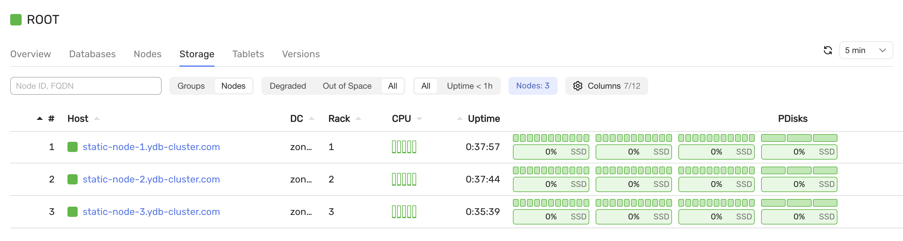

# Добавление нового диска в кластер {{ ydb-short-name }} (конфигурация V1)

Перед началом работы ознакомьтесь с документом [{#T}](disk-addition-preparation.md).

Добавление дисков увеличивает ёмкость и производительность хранилища кластера и используется, когда текущих дисков недостаточно под данные или планируется рост нагрузки. Общие сценарии расширения кластера описаны в разделе [{#T}](../../../devops/configuration-management/configuration-v1/cluster-expansion.md).

## Порядок действий

### Обновите inventory/50-inventory.yaml

Откройте `inventory/50-inventory.yaml` (см. [создание инвентаря](../../../devops/deployment-options/ansible/initial-deployment/deployment-configuration-v1.md#inventory-create)) и добавьте новый диск в переменную `ydb_disks`, указав для него новый `label`.

Этот `label` потребуется для выполнения следующих шагов.

### Обновите files/config.yaml

Откройте `files/config.yaml` (см. [подготовку конфигурации](../../../devops/deployment-options/ansible/initial-deployment/deployment-configuration-v1.md#ydb-config-prepare)) и добавьте `label` нового диска в секцию `host_configs`.

`Label` должен совпадать с тем, который вы указали в `inventory/50-inventory.yaml`.

### Подготовьте новый диск к использованию

Подготовьте диск к работе с помощью плейбука:

```bash
ansible-playbook ydb_platform.ydb.prepare_drives \
  --extra-vars "ydb_disk_prepare=ydb_disk_4"
```  

В примере вместо `ydb_disk_4` укажите `label` нового диска, заданный в инвентаре и в `files/config.yaml`.

После выполнения команды вы должны увидеть новый `label` среди разделов дисков:

```bash
root@static-node-1:/opt/ydb# ls /dev/disk/by-partlabel/
ydb_disk_1 ydb_disk_2 ydb_disk_3 ydb_disk_4
```

### Обновите конфигурацию на узлах

Плейбук [update_config](../../../devops/deployment-options/ansible/update-config.md) доставляет изменения на **все** узлы кластера из инвентаря. Поскольку список дисков в инвентаре и `host_configs` обычно одинаков для каждого узла хранения, после успешного выполнения новый диск должен быть подготовлен и учтён в конфигурации на **каждом** таком узле (node); при необходимости проверьте `ls /dev/disk/by-partlabel/` на серверах.

Перезапуск процессов выполняется не всегда: плейбук сам запланирует перезапуск только если изменения этого требуют. При необходимости явного перезапуска используйте [{#T}](../../../devops/deployment-options/ansible/restart.md).

```bash
ansible-playbook ydb_platform.ydb.update_config
```

На скриншоте ниже — пример интерфейса мониторинга после применения конфигурации: убедитесь, что узлы и диски хранилища без критических ошибок (индикация соответствует штатной работе в вашей среде).


### Проверьте состояние кластера

Убедитесь, что кластер работает корректно после внесенных изменений:

```bash
ansible-playbook ydb_platform.ydb.healthcheck
```

В конце вывода в блоке `PLAY RECAP` у всех хостов поля `failed` и `unreachable` должны быть равны `0`. На скриншоте — пример успешного прохождения проверки.


### Разрешите использование новых дисков

Выдайте разрешение на использование новых дисков подсистемой хранения:

```bash
ansible-playbook ydb_platform.ydb.update_config \
  --extra-vars "ydb_storage_update_config=true" \
  --tag storage \
  --skip-tags restart
```  

На странице Configs Dispatcher убедитесь, что обновление конфигурации хранилища прошло без ошибок (нет отказов в статусе связанных компонентов).


### Добавьте дополнительные группы хранения

Добавьте дополнительные `storage groups` в базу данных:

```bash
ansible-playbook ydb_platform.ydb.run_ydbd \
  --extra-vars 'cmd="admin database /Root/db pools add ssd:1"'
```  

После добавления групп хранения проверьте в интерфейсе, что пулы и группы отображаются с ожидаемыми параметрами.


