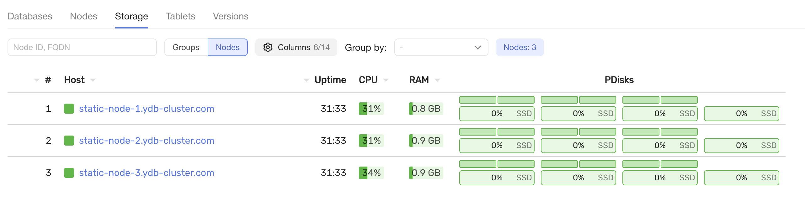
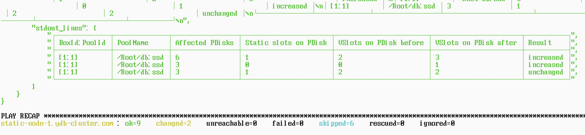
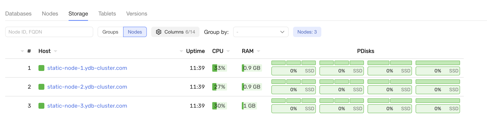

# Добавление нового диска в кластер {{ ydb-short-name }} (конфигурация V2)

## Порядок действий

### Обновите inventory/group_vars/ydb/all.yaml

Откройте файл `inventory/group_vars/ydb/all.yaml` (ссылка) и добавьте новый диск в переменную `ydb_disks` с новым `label`.

Этот `label` потребуется для выполнения следующих шагов.

### Обновите files/config.yaml

Откройте `files/config.yaml` (ссылка) и добавьте `label` нового диска в секцию `config.host_configs`.

Убедитесь, что `label` совпадает со значением, указанным в `ydb_disks` в `inventory/group_vars/ydb/all.yaml`.

### Подготовьте новый диск к использованию

Подготовьте новый диск с помощью плейбука:

```bash
ansible-playbook ydb_platform.ydb.prepare_drives \
  --extra-vars "ydb_disk_prepare=ydb_disk_4"
```  

Переменная `ydb_disk_prepare` должна содержать `label` нового диска.

После выполнения команды вы должны увидеть новый `label` среди разделов дисков:

```bash
root@static-node-1:/opt/ydb# ls /dev/disk/by-partlabel/
ydb_disk_1 ydb_disk_2 ydb_disk_3 ydb_disk_4
```

### Обновите конфигурацию на узлах

Примените изменения конфигурации на всех узлах и при необходимости перезапустите кластер:

```bash
ansible-playbook ydb_platform.ydb.update_config
```



### Проверьте состояние кластера

Убедитесь, что кластер работает корректно после внесенных изменений:

```bash
ansible-playbook ydb_platform.ydb.healthcheck
```



### Добавьте дополнительные группы хранения в базу данных

Добавьте дополнительные `storage groups` в базу данных с помощью `dstool`:

```bash
ansible-playbook ydb_platform.ydb.run_dstool \
  --extra-vars 'cmd="group add --pool-name /Root/db:ssd --groups 1"'
```  


