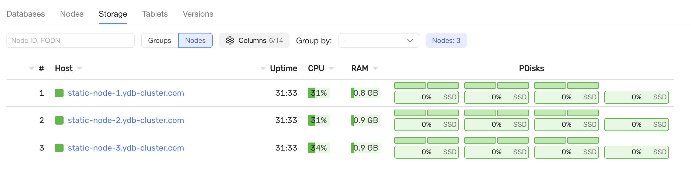
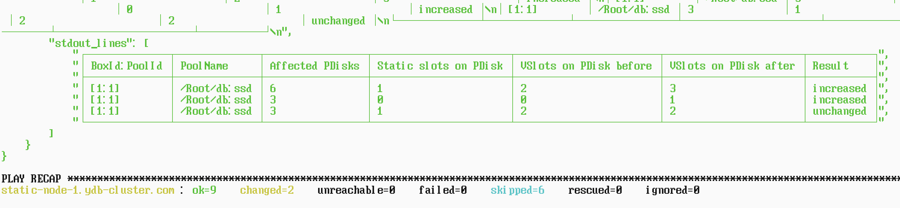
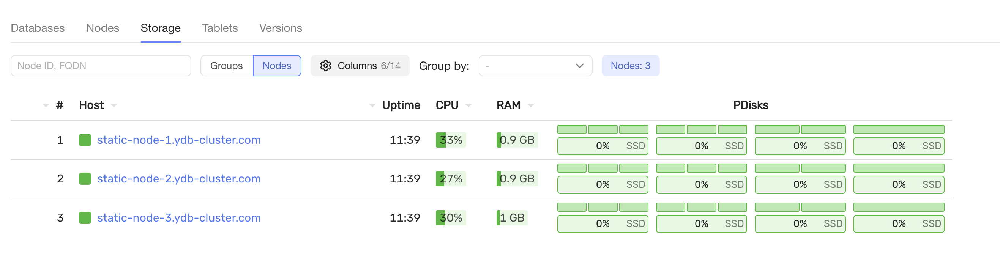

# Добавление нового диска в кластер {{ ydb-short-name }} (конфигурация V2)

Перед началом работы ознакомьтесь с документом [{#T}](disk-addition-preparation.md).

Добавление дисков увеличивает ёмкость хранилища кластера. Сценарии расширения для конфигурации V2 описаны в разделе [{#T}](../../../devops/configuration-management/configuration-v2/cluster-expansion.md).

## Порядок действий

### Обновите inventory/group_vars/ydb/all.yaml

Откройте файл `inventory/group_vars/ydb/all.yaml` в каталоге проекта Ansible и добавьте новый диск в переменную `ydb_disks` с новым `label`. Структуру репозитория и расположение файлов см. в [руководстве по развёртыванию](../../../devops/deployment-options/ansible/initial-deployment/index.md) и [обзоре конфигурации V2](../../../devops/configuration-management/configuration-v2/config-overview.md).

Этот `label` потребуется для выполнения следующих шагов.

### Обновите files/config.yaml

Откройте `files/config.yaml` (см. [подготовку конфигурации](../../../devops/deployment-options/ansible/initial-deployment/deployment-configuration-v2.md#ydb-config-prepare)) и добавьте `label` нового диска в секцию `config.host_configs`.

Убедитесь, что `label` совпадает со значением, указанным в `ydb_disks` в `inventory/group_vars/ydb/all.yaml`.

### Подготовьте новый диск к использованию

Подготовьте новый диск с помощью плейбука:

```bash
ansible-playbook ydb_platform.ydb.prepare_drives \
  --extra-vars "ydb_disk_prepare=ydb_disk_4"
```  

В примере вместо `ydb_disk_4` укажите `label` нового диска из инвентаря и `files/config.yaml`.

После выполнения команды вы должны увидеть новый `label` среди разделов дисков:

```bash
root@static-node-1:/opt/ydb# ls /dev/disk/by-partlabel/
ydb_disk_1 ydb_disk_2 ydb_disk_3 ydb_disk_4
```

### Обновите конфигурацию на узлах

Плейбук [update_config](../../../devops/deployment-options/ansible/update-config.md) применяет изменения на **всех** узлах из инвентаря. Новый диск должен быть подготовлен и отражён в конфигурации на **каждом** узле хранения с тем же набором дисков; проверьте при необходимости `ls /dev/disk/by-partlabel/` на серверах.

Перезапуск выполняется только если изменения этого требуют; при необходимости явного перезапуска см. [{#T}](../../../devops/deployment-options/ansible/restart.md).

```bash
ansible-playbook ydb_platform.ydb.update_config
```

На скриншоте — пример мониторинга после применения конфигурации: узлы и хранилище должны быть без критических ошибок.



### Проверьте состояние кластера

Убедитесь, что кластер работает корректно после внесенных изменений:

```bash
ansible-playbook ydb_platform.ydb.healthcheck
```

В `PLAY RECAP` у всех хостов `failed` и `unreachable` должны быть `0`. Ниже — пример успешного результата.



### Добавьте дополнительные группы хранения в базу данных

Добавьте дополнительные `storage groups` в базу данных с помощью `dstool`:

```bash
ansible-playbook ydb_platform.ydb.run_dstool \
  --extra-vars 'cmd="group add --pool-name /Root/db:ssd --groups 1"'
```  

Проверьте в интерфейсе или через `dstool`, что добавленные группы хранения отображаются ожидаемым образом.


