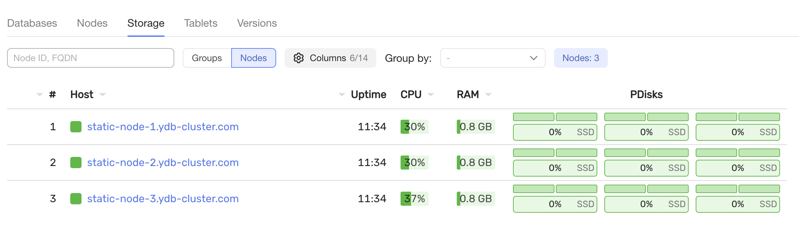

# Подготовка к добавлению нового диска

## Предварительные требования

Перед началом работы убедитесь, что выполнены условия:

- кластер {{ ydb-short-name }} развернут по топологии `3-nodes-mirror-3-dc`;

- на каждом сервере кластера установлен новый жесткий диск `/dev/vde`.

  

Выберите инструкцию в соответствии с вашей конфигурацией:

- [{#T}](add-new-disk-v1.md)
- [{#T}](add-new-disk-v2.md)

