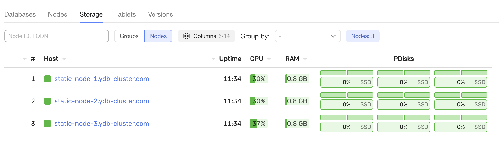

# Подготовка к добавлению нового диска

## Предварительные требования

Перед началом работы убедитесь, что выполнены условия:

- кластер {{ ydb-short-name }} развернут по топологии `3-nodes-mirror-3-dc` (см. [топологии кластера](../../../concepts/topology.md));

- на каждом сервере кластера установлен новый жесткий диск `/dev/vde`.

  

Инструкции ниже различаются для [конфигурации V1](../../configuration-management/configuration-v1/index.md) и [конфигурации V2](../../configuration-management/configuration-v2/index.md) кластера: в V1 основные переменные Ansible задаются в `inventory/50-inventory.yaml`, в V2 — в том числе в `inventory/group_vars/ydb/all.yaml`, а структура `files/config.yaml` также отличается. Выберите подходящий вариант:

- [{#T}](add-new-disk-v1.md)
- [{#T}](add-new-disk-v2.md)

