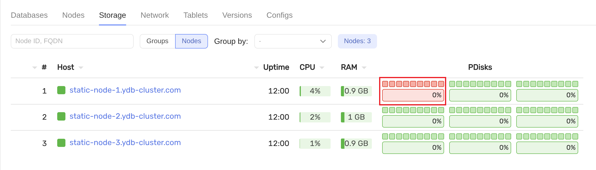
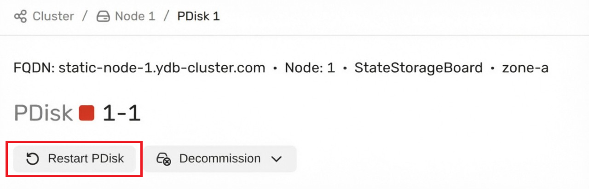
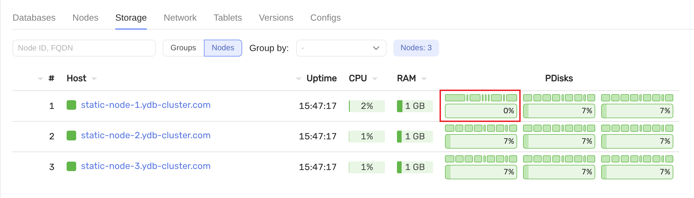

# Замена диска в кластере {{ ydb-short-name }}

В этом руководстве описана замена диска на хосте со [статическим узлом хранения](../../concepts/glossary.md#static-node) в кластере {{ ydb-short-name }}, развернутом по топологии `3-nodes-mirror-3-dc`.

Команды [Ansible](../deployment-options/ansible/index.md) выполняются с машины развёртывания кластера.

В примерах указан один целевой хост (`-l`).

## Порядок замены {#procedure}

### Проверьте состояние диска и определите label {#check-disk}

Значение `label` потребуется при выполнении следующих шагов.



  - Откройте `https://ваш_ip_адрес:8765/monitoring/`.

  - Нажмите **Storage** → **Nodes** → **PDisks**.

  - Убедитесь, что нужный **PDisks** отображается с красной индикацией — это признак неисправности или недоступности диска до замены.

  - Запишите `label` из строки **Path** (в этом примере `ydb_disk_1`).

  



### Замените диск физически {#physical-replacement}

Замените неисправный диск на хосте, не меняя слот и `label` раздела.

### Подготовьте диск {#prepare-disk}

Выполните команду:

   ```bash
   ansible-playbook ydb_platform.ydb.prepare_drives -l static-node-1.ydb-cluster.com --extra-vars "ydb_disk_prepare=ydb_disk_1"
   ```

Замените значения параметров:

- `static-node-1.ydb-cluster.com` — на адрес хоста, на котором выполняется замена диска;

- в аргументе `ydb_disk_prepare` значение `ydb_disk_1` — на фактический `label` заменяемого диска.

### Перезапустите узел хранения {#restart}

  

  - Через интерфейс мониторинга

    

  - С помощью команды

    ```bash
    ansible-playbook ydb_platform.ydb.rolling_restart_static -l static-node-1.ydb-cluster.com
    ```

  

### Проверьте результат {#verify}

  

  После подготовки диска и перезапуска узла в том же разделе **PDisks** диск с новым разделом должен отображаться с зелёной индикацией — признак того, что узел видит диск и он участвует в хранилище без ошибок на уровне мониторинга.

  

  

## См. также {#see-also}

- [{#T}](../deployment-options/ansible/restart.md)
- [{#T}](../../concepts/topology.md)
- [{#T}](index.md)
