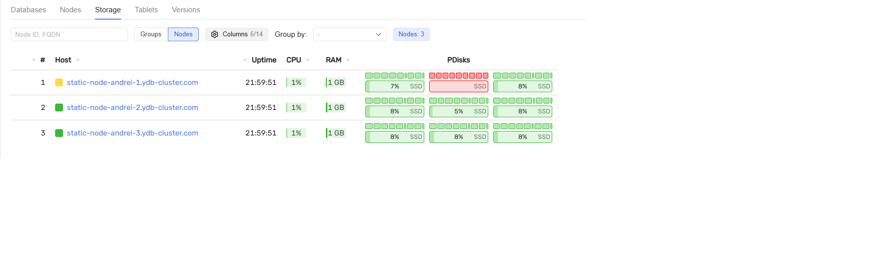
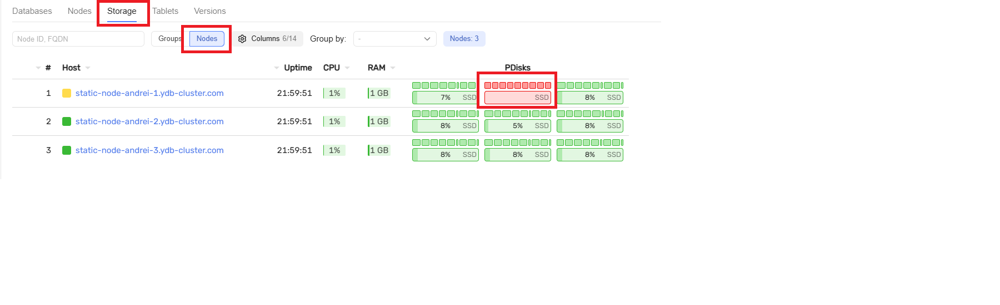
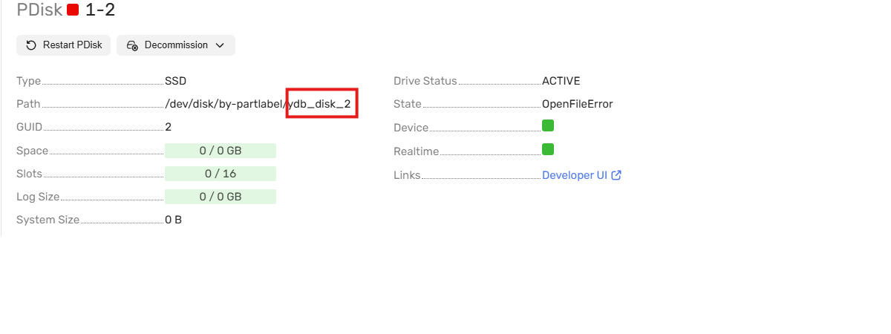
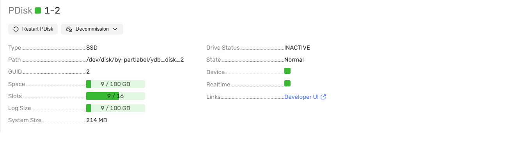
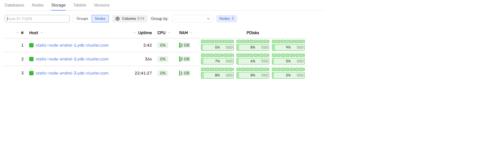

# Замена диска в кластере {{ ydb-short-name }}

В этом руководстве описан процесс замены диска в кластер YDB, который развернут в соответствии с топологией `3-nodes-mirror-3-dc`, с помощью Ansible (ссылка).

## Подготовка к замене диска

### Перед началом работы убедитесь, что выполнены условия

- кластер {{ ydb-short-name }} развернут по топологии `3-nodes-mirror-3-dc` (ссылка);

- на сервере кластера установлен жесткий диск на замену старому.



### Определите `label` заменяемого диска



- UI

  
  
  `https://ваш_ip_адрес:8765/monitoring/`

      

      

      

  
  
  

- Командная строка

  Команда и результат выполнения:

  ```bash
  root@static-node-1:/opt/ydb# ls /dev/disk/by-partlabel/
  ydb_disk_1 ydb_disk_2 ydb_disk_3 ydb_disk_4
  ```  
  


Этот `label` потребуется для выполнения следующего шага.

## Порядок действий

### Подготовьте диск к использованию

Перейдите на управляющую ноду, в директорию, с которой происходила установка и развертывание {{ ydb-short-name }}. Выполните команду:

```bash
ansible-playbook ydb_platform.ydb.prepare_drives -l static-node.ydb-cluster.com 
--extra-vars "ydb_disk_prepare=ydb_disk_2"
```

Замените значения параметров:

- `static-node.ydb-cluster.com` на адрес ноды, на которой будет происходить замена диска;

- `ydb_disk_prepare` на значение `label` заменяемого диска.

### Обновите конфигурацию на узлах

```bash
ansible-playbook ydb_platform.ydb.update_config
```








