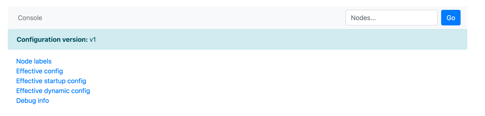

# Проверка версии конфигурации

Существует два основных способа проверить, какую версию механизма конфигурации ([V1](../configuration-management/configuration-v1/config-overview.md) или [V2](../configuration-management/configuration-v2/config-overview.md)) используют узлы вашего кластера {{ ydb-short-name }}:

1. [Через Embedded UI](#embedded-ui)
2. [Через метрики кластера](#metrics)

## Через Embedded UI {#embedded-ui}

Данный способ может быть применен, если сбор метрик с кластера {{ ydb-short-name }} в систему мониторинга не настроен. Вы можете проверить версию конфигурации для конкретного узла или переключаться между узлами через встроенный веб-интерфейс [Embedded UI](../../reference/embedded-ui/index.md):

1. Откройте в браузере страницу актора `configs_dispatcher` для любого узла кластера. URL имеет вид:

    ```text
    http://<endpoint>:8765/actors/configs_dispatcher
    ```

    где `<endpoint>` - адрес произвольного узла кластера {{ ydb-short-name }}.

2. В верхней части открывшейся страницы найдите поле `Configuration version`. В нем будет указана версия конфигурации (`v1` или `v2`), используемая данным узлом.

    Так выглядит страница узла, использующего конфигурацию V1:

    

3. Чтобы проверить другие узлы, используйте поле поиска `Nodes...` в правом верхнем углу страницы для переключения между узлами.

## Через метрики кластера {#metrics}

Данный способ удобен при наличии большого числа узлов в кластере {{ ydb-short-name }}. Если у вас настроен [сбор метрик с кластера {{ ydb-short-name }} в систему мониторинга](../../reference/observability/metrics/index.md), проделайте следующие действия:

1. Найдите дашборд, отображающий метрики кластера.
2. Перейдите к группе сенсоров `config` и подсистеме `configs_dispatcher`.
3. Обратите внимание на сенсоры `ConfigurationV1` и `ConfigurationV2`. Значения этих сенсоров показывают количество узлов кластера, работающих с конфигурацией V1 и V2 соответственно.

Например, если `ConfigurationV1 > 0`, значит в кластере есть узлы, которые используют конфигурацию v1. Если `ConfigurationV2 = 0` и `ConfigurationV2` равен общему числу узлов, значит, все узлы используют конфигурацию V2.
