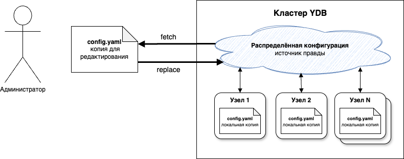
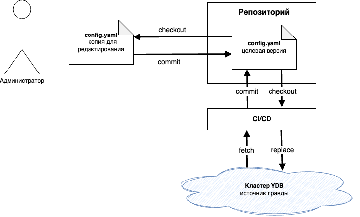

# Обзор конфигурации V2

Для развёртывания кластера {{ ydb-short-name }}, добавления в кластер новых узлов и изменения параметров требуется конфигурация.



Конфигурация кластера {{ ydb-short-name }} V2 представляет собой текстовый файл в формате [YAML](https://en.wikipedia.org/wiki/YAML). В минимальном варианте он содержит секцию `config` с различными параметрами, необходимыми для запуска и настройки узлов кластера, а также секцию с метаданными `metadata`. Расширенные возможности для гибкого конфигурирования описаны в статье [{#T}](dynamic-config-selectors.md). Подробнее о доступных параметрах можно узнать в [справке по конфигурации](config-settings.md).



```yaml
metadata:
  cluster: ""
  version: 0
config:
  hosts:
    - host: localhost
  drive:
    - type: RAM
  grpc_config:
    port: 2136
  monitoring_config:
    monitoring_port: 8765
```



## Управление конфигурацией



За управление состоянием конфигурационного файла отвечает сам кластер {{ ydb-short-name }}, и он же является единственным источником правды о том, как он сейчас сконфигурирован. За надёжное сохранение текущего состояния, являющегося источником правды, отвечает механизм [распределённой конфигурации](../../../concepts/glossary.md#distributed-configuration); как это работает технически, подробнее описано в статье [{#T}](../../../contributor/configuration-v2.md). Узнать текущее состояние конфигурации кластера можно с помощью консольной команды [ydb admin cluster config fetch](../../../reference/ydb-cli/commands/configuration/cluster/fetch.md), а состояние каждого конкретного узла — через его [Embedded UI](../../../reference/embedded-ui/index.md).

Изменение конфигурации кластера {{ ydb-short-name }} осуществляется администратором следующим образом:

1. Сохранение текущего состояния конфигурации кластера в локальный файл через [ydb admin cluster config fetch](../../../reference/ydb-cli/commands/configuration/cluster/fetch.md).
2. Редактирование нужных параметров в файле в текстовом редакторе или любым другим удобным способом.
3. Загрузка изменений обратно на кластер посредством вызова команды [ydb admin cluster config replace](../../../reference/ydb-cli/commands/configuration/cluster/replace.md).



```bash
$ ydb -e grpc://<ydb.example.com>:2135 admin cluster config fetch > config.yaml     # 1
$ vim config.yaml                                                                   # 2
$ ydb -e grpc://<ydb.example.com>:2135 admin cluster config replace -f config.yaml  # 3
```



Загрузка изменений обратно на кластер не всегда проходит успешно. Помимо базовой валидации корректности конфигурационного файла, у системы есть защита от конкурентного изменения несколькими администраторами. Система инкрементирует поле `metadata.version` при каждом изменении конфигурации и отказывается принимать новую версию, если её номер не совпадает с ожидаемым, так как это означает, что между `fetch` и `replace` было другое изменение, и `replace` его бы стёр. Чтобы минимизировать такие конфликты, можно использовать подход [«Инфраструктура как код»](https://ru.wikipedia.org/wiki/%D0%98%D0%BD%D1%84%D1%80%D0%B0%D1%81%D1%82%D1%80%D1%83%D0%BA%D1%82%D1%83%D1%80%D0%B0_%D0%BA%D0%B0%D0%BA_%D0%BA%D0%BE%D0%B4): хранить копию конфигурационного файла в репозитории [системы управления версиями](https://ru.wikipedia.org/wiki/%D0%A1%D0%B8%D1%81%D1%82%D0%B5%D0%BC%D0%B0_%D1%83%D0%BF%D1%80%D0%B0%D0%B2%D0%BB%D0%B5%D0%BD%D0%B8%D1%8F_%D0%B2%D0%B5%D1%80%D1%81%D0%B8%D1%8F%D0%BC%D0%B8) (например, [Git](https://git-scm.com/)) и запускать команды `fetch` и `replace` не вручную, а только из привязанной к этому репозиторию системы [непрерывной интеграции](https://ru.wikipedia.org/wiki/Непрерывная_интеграция) и [доставки](https://ru.wikipedia.org/wiki/Непрерывная_доставка) (CI/CD), реагирующей на изменения конфигурационного файла {{ ydb-short-name }} в репозитории и обеспечивающей последовательную отправку всех изменений на кластер {{ ydb-short-name }}.







Каждый узел кластера {{ ydb-short-name }} сохраняет локально копию конфигурации в директорию, указанную в аргументе запуска `ydbd --config-dir`. Эта локальная копия используется в следующих ситуациях:

1. Для применения настроек, которые нужны на самом старте работы узла, ещё до того, как у него появляется возможность начать общаться с другими узлами кластера. Изменение таких настроек может требовать перезапуска узла.
2. Для [первоначального развёртывания](#initial-deployment) и [расширения](#cluster-expansion) кластера.
3. В случае форс-мажора, если с основным механизмом управления конфигурацией возникли проблемы, требующие ручного вмешательства.

Выше описан основной механизм управления конфигурацией V2 {{ ydb-short-name }}. В зависимости от предпочитаемого [способа управления инфраструктурой](../../deployment-options/index.md) может предоставляться дополнительная автоматизация.

## Базовые сценарии использования конфигурации

### Первоначальное развёртывание кластера {{ ydb-short-name }} {#initial-deployment}

Для конфигурации кластера при первоначальном развёртывании рекомендуется использовать инструкции для выбранного способа управления инфраструктурой:

- [{#T}](../../deployment-options/ansible/initial-deployment/index.md);
- [{#T}](../../deployment-options/kubernetes/initial-deployment.md);
- [{#T}](../../deployment-options/manual/initial-deployment/index.md).

### Обновление конфигурации {#update-config}

Для обновления конфигурации на уже развёрнутом кластере необходимо воспользоваться соответствующими командами в зависимости от способа развёртывания:

- [{#T}](../../deployment-options/ansible/update-config.md);
- [{#T}](../../deployment-options/manual/update-config.md).

Если изменения конфигурации затрагивают параметры, требующие перезапуска узлов кластера, воспользуйтесь процедурой [rolling restart](../../../reference/ydbops/rolling-restart-scenario.md). Подробнее о ней в зависимости от способа развёртывания:

- [Перезапуск кластера, развёрнутого с помощью Ansible](../../deployment-options/ansible/restart.md);
- [Перезапуск кластера, развёрнутого вручную](../../../reference/ydbops/rolling-restart-scenario.md).

### Расширение кластера {#cluster-expansion}

При [расширении кластера](cluster-expansion.md) конфигурация доставляется на старые и новые узлы по-разному:

- На узлы, существовавшие до расширения, изменения доставляются автоматически при вызове [ydb admin cluster config replace](../../../reference/ydb-cli/commands/configuration/cluster/replace.md).
- Перед первым запуском новых узлов локальная копия доставляется специальной командой [ydb admin node config init](../../../reference/ydb-cli/commands/configuration/node/init.md), а не самим узлом.

## Смотрите также

* [Справка по параметрам конфигурации](config-settings.md)
* [{#T}](../compare-configs.md)