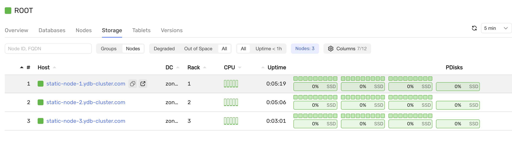

# Добавление нового диска

## Требования

- предустановленный кластер с конфигурацией `3-nodes-mirror-3-dc`
- новый диск /dev/vde на каждом сервере

## Шаги

1. Обновите `inventory/50-inventory.yaml` и добавьте новый диск в переменную `ydb_disks` с новым label

2. Обновите `files/config.yaml` и добавьте новую метку диска в раздел `host_configs`

3. Подготовьте новый диск к использованию, где `ydb_disk_prepare` должен содержать новый label диска:

   ```bash
   ansible-playbook ydb_platform.ydb.prepare_drives --extra-vars "ydb_disk_prepare=ydb_disk_4"
   ```

4. Обновите конфигурацию для каждого узла и перезапустите кластер:

   ```bash
   ansible-playbook ydb_platform.ydb.update_config
   ```

5. Проверьте работоспособность кластера:

   ```bash
   ansible-playbook ydb_platform.ydb.healthcheck
   ```

6. Предоставьте разрешение на использование новых дисков:

   ```bash
   ansible-playbook ydb_platform.ydb.update_config --extra-vars "ydb_storage_update_config=true" --tag storage --skip-tags restart 
   ```

   

7. Добавьте дополнительные группы хранилища в базу данных:

   ```bash
   ansible-playbook ydb_platform.ydb.run_ydbd --extra-vars 'cmd="admin database /Root/db pools add ssd:1"' 
   ```

   
