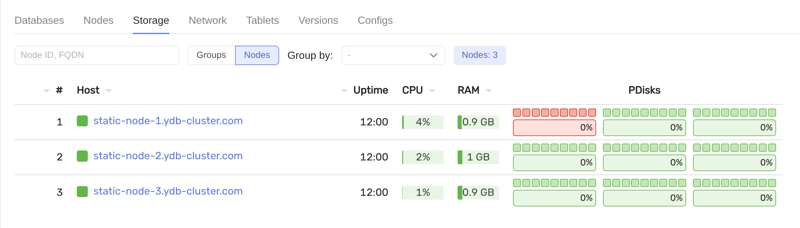
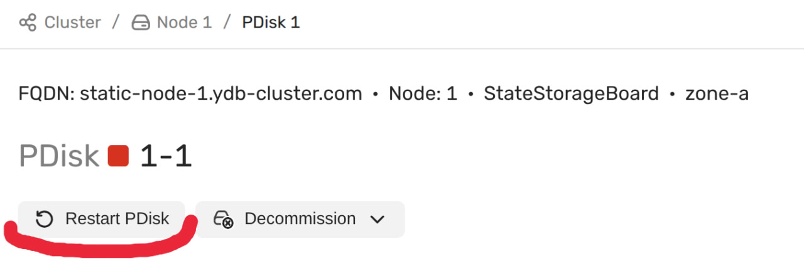
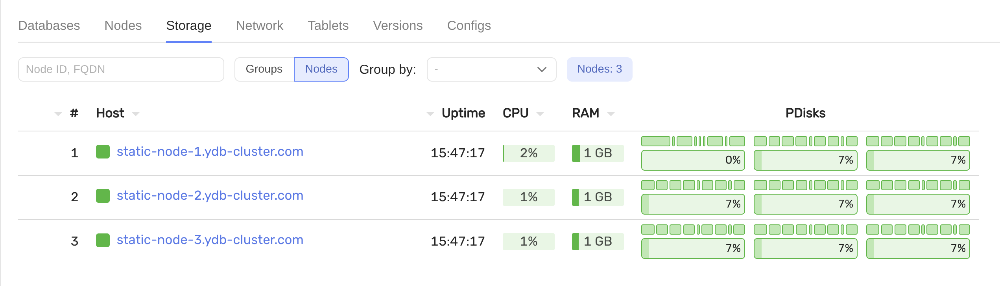

# Замена диска

## Требования

- предустановленный кластер с конфигурацией `3-nodes-mirror-3-dc`
- неисправный диск на одном или нескольких серверах (в данном примере `/dev/vdb` с label `ydb_disk_1` на `static-node-1.ydb-cluster.com`)

## Шаги

1. Убедитесь, что диск не работает, в интерфейсе мониторинга
   

2. Выполните физическую замену диска

3. Подготовьте замененный диск:

   ```bash
   ansible-playbook ydb_platform.ydb.prepare_drives -l static-node-1.ydb-cluster.com --extra-vars "ydb_disk_prepare=ydb_disk_1"
   ```

4. Перезапустите неисправный диск через интерфейс мониторинга:
   

   или с помощью команды:

   ```bash
   ansible-playbook ydb_platform.ydb.rolling_restart_static -l static-node-1.ydb-cluster.com
   ```

5. Убедитесь, что диск работает, в интерфейсе мониторинга:
    