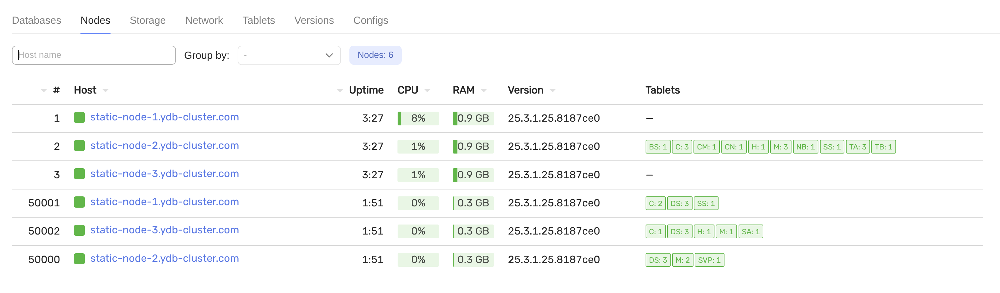
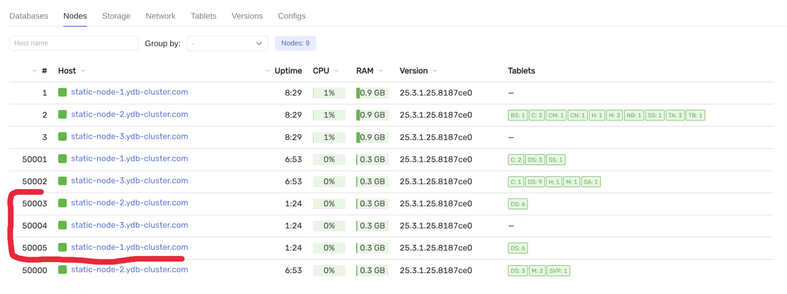

# Добавление динамической ноды

## Требования

- предустановленный кластер с конфигурацией `3-nodes-mirror-3-dc`
- работающие существующие динамические ноды (в данном примере запущены экземпляры `a`, а будут добавлены экземпляры `b`)


## Шаги

1. Обновите `inventory/50-inventory.yaml` и добавьте новую запись в переменную `ydb_dynnodes` с новым именем экземпляра и смещением:

   ```yaml
    ydb_dynnodes:
      - { instance: 'a', offset: 1 }
      - { instance: 'b', offset: 2 }  # должно быть добавлено
   ```

2. Разверните новый экземпляр динамической ноды на всех хостах:

   ```bash
   ansible-playbook ydb_platform.ydb.install_dynamic --skip-tags password,create_database
   ```

   и убедитесь, что новый экземпляр работает в интерфейсе мониторинга
   

3. Проверьте работоспособность кластера:

   ```bash
   ansible-playbook ydb_platform.ydb.healthcheck
   ```

## Альтернатива: добавление динамических нод без обновления inventory

Передайте `ydb_dynnodes` напрямую через `--extra-vars`, чтобы избежать редактирования файла inventory:

```bash
ansible-playbook ydb_platform.ydb.install_dynamic \
  --skip-tags password,create_database \
  --extra-vars '{
    "ydb_dynnodes": [
      {"instance": "a", "offset": 1, "dbname": "database"},
      {"instance": "b", "offset": 2, "dbname": "database"}
    ]}'
  # -l static-node-1.ydb-cluster.com  # для конкретного хоста
```

## Альтернатива: добавление динамической ноды и создание новой базы данных одновременно

> Кластер должен быть инициализирован с параметром `ydb_database_groups`, установленным в значение, оставляющее место для второй базы данных.

Чтобы добавить экземпляр динамической ноды для новой базы данных `database2`:

```bash
ansible-playbook ydb_platform.ydb.install_dynamic \
  --skip-tags password \
  --extra-vars '{
    "ydb_dynnodes": [
      {"instance": "a", "offset": 1, "dbname": "database"},
      {"instance": "b", "offset": 2, "dbname": "database2"},
    ],
    "ydb_dbname": "database2",
    "ydb_database_groups": 8  # ваше количество групп хранилища для новой базы данных
  }'
  # -l static-node-1.ydb-cluster.com  # для конкретного хоста
```