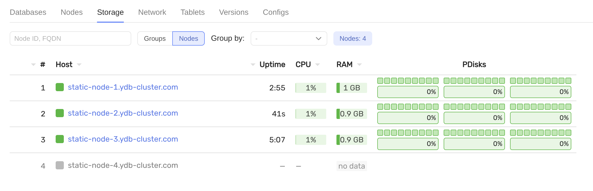
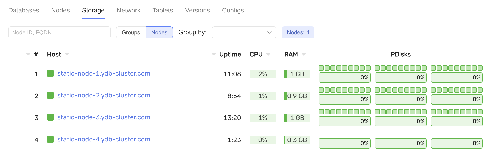
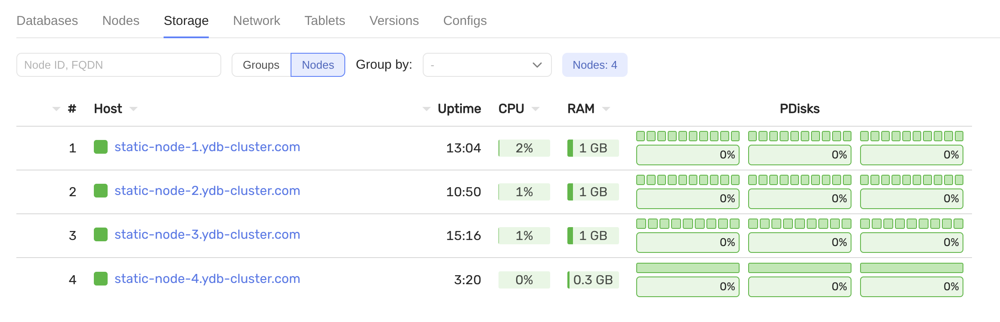

# Добавление нового хоста (сторадж ноды)

## Требования

- предустановленный кластер с конфигурацией `3-nodes-mirror-3-dc`
- новый сервер `static-node-4.ydb-cluster.com` с 3 дисками (`/dev/vdb`, `/dev/vdc`, `/dev/vdd`)
- TLS-сертификат для `static-node-4.ydb-cluster.com`, подписанный тем же центром сертификации (CA), что и сертификаты существующих узлов кластера, размещенный в папке `certs/static-node-4.ydb-cluster.com/`

## Шаги

 1. Обновите `files/config.yaml`: добавьте `static-node-4.ydb-cluster.com` в раздел `hosts` с соответствующим параметром `walle_location`:

    ```yaml
    - host: static-node-4.ydb-cluster.com
    host_config_id: 1
    walle_location:
        body: 4
        data_center: 'zone-d'  # ваша зона
        rack: '4'
    ```

 2. Отправьте обновленную конфигурацию на все существующие узлы и выполните поэтапный перезапуск:

    ```bash
    ansible-playbook ydb_platform.ydb.update_config
    ```

 3. Убедитесь, что новый хост появился в интерфейсе мониторинга:
    

 4. Обновите `inventory/50-inventory.yaml` — добавьте `static-node-4.ydb-cluster.com` в раздел `hosts`.

 5. Подготовьте диски для YDB:

    ```bash
    ansible-playbook ydb_platform.ydb.prepare_drives -l static-node-4.ydb-cluster.com --extra-vars "ydb_disk_prepare=ydb_disk_1,ydb_disk_2,ydb_disk_3"
    ```

 6. Подготовьте хост для YDB:

    ```bash
    ansible-playbook ydb_platform.ydb.prepare_host -l static-node-4.ydb-cluster.com -e "ydb_tools_install=false"
    ```

 7. Обновите `files/config.yaml`: значение `storage_config_generation` должно быть увеличено на 1.

 8. Установите YDB на новый хост и запустите статический узел:

    ```bash
    ansible-playbook ydb_platform.ydb.install_static -l static-node-4.ydb-cluster.com --skip-tags password,bootstrap
    ```

 9. Убедитесь, что новый хост активен в интерфейсе мониторинга:
    

10. Разрешите кластеру использовать новые диски (обновление конфигурации blobstorage):

    ```bash
    ansible-playbook ydb_platform.ydb.update_config --extra-vars "ydb_storage_update_config=true" --tags storage --skip-tags restart
    ```

11. Добавьте дополнительные группы хранения в базу данных:

    ```bash
    ansible-playbook ydb_platform.ydb.run_dstool --extra-vars 'cmd="group add --pool-name /Root/database:ssd --groups 1"'
    ```

    