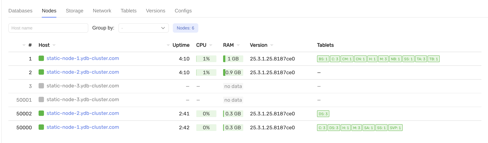
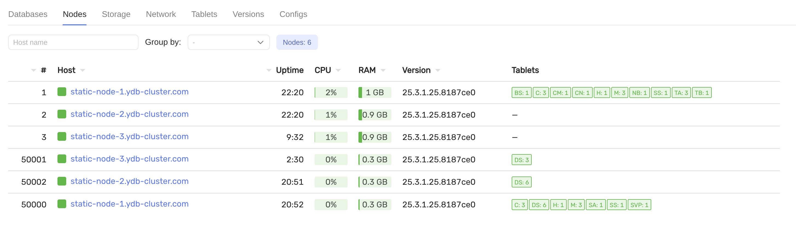

# Замена неисправного хоста

## Требования

- предустановленный кластер с конфигурацией `3-nodes-mirror-3-dc`
- неисправный хост `static-node-3.ydb-cluster.com`
- новый сервер с тем же FQDN `static-node-3.ydb-cluster.com` с 3 дисками (`/dev/vdb`, `/dev/vdc`, `/dev/vdd`)

## Шаги

1. Убедитесь, что старый хост неисправен, в интерфейсе мониторинга и при необходимости удалите его из кластера:
   

2. Подготовьте диски для YDB на новом хосте:

   ```bash
   ansible-playbook ydb_platform.ydb.prepare_drives -l static-node-3.ydb-cluster.com --extra-vars "ydb_disk_prepare=ydb_disk_1,ydb_disk_2,ydb_disk_3"
   ```

3. Подготовьте хост для YDB:

   ```bash
   ansible-playbook ydb_platform.ydb.prepare_host -l static-node-3.ydb-cluster.com -e "ydb_tools_install=false"
   ```

4. Обновите `files/config.yaml`: значение `storage_config_generation` должно быть увеличено на 1.

5. Установите YDB на новый хост и запустите статические ноды:

   ```bash
   ansible-playbook ydb_platform.ydb.install_static -l static-node-3.ydb-cluster.com --skip-tags password,bootstrap
   ```

   При необходимости запустите динамические ноды:

   ```bash
   ansible-playbook ydb_platform.ydb.install_dynamic --skip-tags password,create_database
   ```

6. Убедитесь, что хост активен в интерфейсе мониторинга:
   