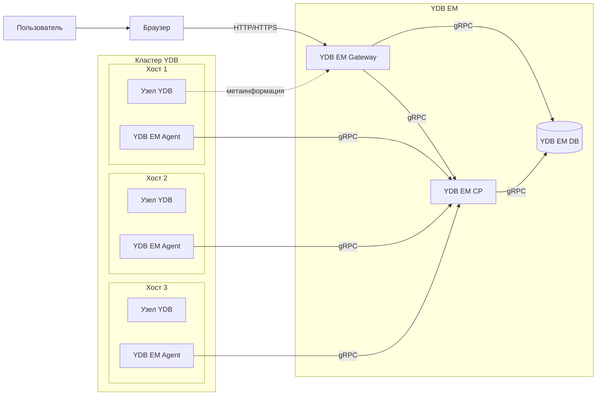

# Развёртывание {{ ydb-short-name }} Enterprise Manager

{{ ydb-short-name }} Enterprise Manager (далее — YDB EM) — это инструмент управления кластерами {{ ydb-short-name }}, предоставляющий веб-интерфейс и API для администрирования баз данных. YDB EM позволяет централизованно управлять ресурсами кластера, базами данных и динамическими узлами.

YDB EM состоит из трёх основных компонентов:

* **Gateway** — веб-интерфейс и API-бэкенд для взаимодействия пользователей с системой.
* **Control Plane (CP)** — непосредственное управление кластером {{ ydb-short-name }}, ресурсами и базами данных.
* **Agent** — служба, устанавливаемая на хосты кластера {{ ydb-short-name }} для управления узлами.

## Архитектура {#architecture}

Общая схема взаимодействия компонентов YDB EM:

## Основные материалы {#materials}

- [{#T}](initial-deployment.md)
