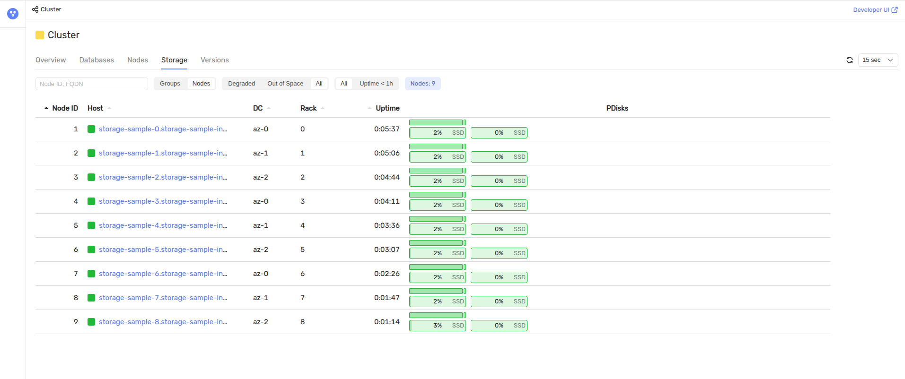
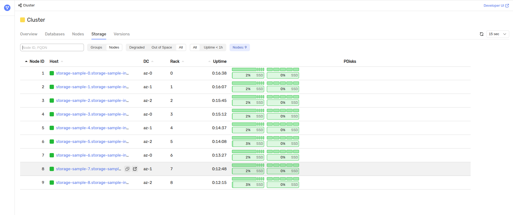

# Добавление диска в кластер {{ ydb-short-name }}, развёрнутый в {{ k8s }}

Добавление диска — это операция, которая увеличивает объём [распределённого хранилища](../../../concepts/glossary.md#distributed-storage) работающего кластера {{ ydb-short-name }}. Каждый [узел хранения](../../../concepts/glossary.md#storage-node) получает дополнительное блочное устройство, кластер регистрирует его как новый [PDisk](../../../concepts/glossary.md#pdisk), а на появившемся свободном месте создаются новые [группы хранения](../../../concepts/glossary.md#storage-group), которые и дают базам данных дополнительную ёмкость.

Эта статья описывает, как выполнить такую операцию в кластере {{ ydb-short-name }}, развёрнутом в {{ k8s }} при помощи [{{ ydb-short-name }} {{ k8s }} оператора](initial-deployment.md). Порядок действий отличается от [добавления диска в кластер, развёрнутый вручную](../../../maintenance/manual/disk-add/index.md): в {{ k8s }} диски не размечаются администратором на серверах, а заказываются у кластера {{ k8s }} через манифест, поэтому вместо разметки диска потребуется пересоздать объект `StatefulSet`.

В статье последовательно рассматриваются устройство дисковой подсистемы узлов хранения в {{ k8s }}, предварительные требования, редактирование манифеста и конфигурации, пересоздание `StatefulSet`, перезапуск узлов хранения, инициализация конфигурации и добавление групп хранения.

## Как устроено дисковое пространство узлов хранения в {{ k8s }} {#how-it-works}

Узлы хранения {{ ydb-short-name }} работают в {{ k8s }} как поды объекта [StatefulSet](https://kubernetes.io/docs/concepts/workloads/controllers/statefulset/), который создаёт {{ ydb-short-name }} {{ k8s }} оператор по ресурсу `Storage`. Диски узлов хранения описываются в поле `spec.dataStore` этого ресурса:

```yaml
dataStore:
  - volumeMode: Block
    accessModes:
      - ReadWriteOnce
    resources:
      requests:
        storage: 80Gi
```

Каждый элемент списка `dataStore` превращается в отдельный шаблон запроса тома (`volumeClaimTemplates` объекта `StatefulSet`), по которому {{ k8s }} выделяет каждому поду по одному [PersistentVolume](https://kubernetes.io/docs/concepts/storage/persistent-volumes/). Оператор подключает выделенные тома в контейнер узла хранения как блочные устройства с предсказуемыми именами по порядку элементов `dataStore`: первый элемент доступен в контейнере как `/dev/kikimr_ssd_00`, второй как `/dev/kikimr_ssd_01` и так далее.

Само по себе появление блочного устройства не делает его частью хранилища. Путь к устройству должен быть описан в конфигурации кластера {{ ydb-short-name }}, которая хранится в поле `spec.configuration` ресурса `Storage` в разделе `host_configs`. Таким образом, добавление диска в {{ k8s }} состоит из двух согласованных изменений одного манифеста: нового элемента в `dataStore` и нового пути в `host_configs`.

Оба изменения не применяются к работающему кластеру автоматически по двум причинам:

* Список `volumeClaimTemplates` объекта `StatefulSet` неизменяем: {{ k8s }} отклоняет попытку его отредактировать, так как шаблоны томов участвуют в идентификации уже созданных объектов PersistentVolumeClaim. Это архитектурное ограничение {{ k8s }}, поэтому объект `StatefulSet` требуется пересоздать.
* Список томов запущенного пода тоже неизменяем: новый том появляется в поде только при его создании. Поэтому после пересоздания объекта `StatefulSet` требуется поочерёдный перезапуск подов узлов хранения.



Описанная процедура затрагивает все узлы хранения кластера и включает их поочерёдный перезапуск. Выполняйте её только на исправном кластере и не удаляйте объекты PersistentVolumeClaim: их удаление приведёт к потере данных на существующих дисках.



## Предварительные требования {#prerequisites}

Перед началом работы убедитесь, что выполнены следующие условия.

1. Кластер {{ ydb-short-name }} развёрнут в {{ k8s }} в соответствии с документом [{#T}](initial-deployment.md) и находится в рабочем состоянии. Проверьте состояние ресурса `Storage`:

    ```bash
    kubectl get storages.ydb.tech
    ```

    В колонке `Status` должно быть значение `Ready`.

2. Все поды узлов хранения находятся в состоянии `Running`:

    ```bash
    kubectl get pods -o wide
    ```

3. Утилита [kubectl](https://kubernetes.io/docs/tasks/tools/install-kubectl) установлена и настроена на работу с нужным кластером {{ k8s }}. Проверьте текущий контекст и пространство имён командой:

    ```bash
    kubectl config get-contexts
    ```

    Все приведённые ниже команды выполняются в текущем пространстве имён. Если ресурсы {{ ydb-short-name }} размещены в другом пространстве имён, добавьте к каждой команде параметр `-n <namespace>`, где `<namespace>` — имя пространства имён, например `default`.

4. Утилита [jq](https://jqlang.github.io/jq/) установлена. Она используется для чтения и изменения манифеста ресурса `Storage` в формате JSON. Проверьте установку командой:

    ```bash
    jq --version
    ```

5. В кластере {{ k8s }} достаточно свободных ресурсов для выделения новых томов: требуется по одному тому нужного объёма на каждый узел хранения. Способ проверки зависит от используемого класса хранилища и облачного провайдера.

## Проверьте текущее состояние кластера {#check-initial-state}

Зафиксируйте состояние дисковой подсистемы до изменений, чтобы после добавления диска убедиться в успешности операции. Текущий набор PDisk каждого узла показывает [{{ ydb-ui-name }}](../../../reference/ydb-ui/ydb-monitoring.md), доступный на порту мониторинга узла хранения.

1. Пробросьте порт мониторинга на рабочую машину:

    ```bash
    kubectl port-forward pod/<storage-name>-0 8765:8765
    ```

    В примере команды выше используются следующие параметры:

    * `<storage-name>` — имя ресурса `Storage`, например `storage-sample`; имя пода узла хранения складывается из имени ресурса и порядкового номера узла;
    * `8765` — номер порта HTTP-интерфейса мониторинга узла хранения.

2. Откройте в браузере страницу `http://localhost:8765/monitoring/cluster/storage` и переключитесь на отображение по узлам. В колонке `PDisks` показаны диски каждого узла хранения. Запомните их количество: после добавления диска на каждом узле должно стать на один PDisk больше.

Команда `port-forward` работает, пока запущена, поэтому оставьте её выполняться в отдельном терминале.

## Получите текущий манифест ресурса Storage {#fetch-manifest}

Изменения вносятся в манифест работающего ресурса `Storage`, поэтому его нужно выгрузить из кластера, а не брать образец из репозитория оператора. Выгрузите манифест и извлеките из него конфигурацию {{ ydb-short-name }}:

```bash
kubectl get storage <storage-name> -o json > storage.json
jq -r '.spec.configuration' storage.json > config.yaml
cp config.yaml updated_config.yaml
```

В примере команд выше используются следующие параметры:

* `<storage-name>` — имя ресурса `Storage`, например `storage-sample`;
* `storage.json` — имя файла, в который сохраняется текущий манифест ресурса `Storage`;
* `config.yaml` — имя файла, в который сохраняется текущая конфигурация {{ ydb-short-name }} из поля `spec.configuration`;
* `updated_config.yaml` — имя файла с конфигурацией, которую предстоит отредактировать на следующем шаге.

Исходный файл `config.yaml` пригодится, чтобы сравнить конфигурации до и после изменений.

## Опишите новый диск в конфигурации {{ ydb-short-name }} {#edit-config}

Конфигурация {{ ydb-short-name }} перечисляет доступные узлам хранения блочные устройства в разделе `host_configs`. Если кластер развёрнут по [документации](initial-deployment.md) без изменений в описании дисков, раздел имеет вид:

```yaml
host_configs:
    - drive:
        - path: /dev/kikimr_ssd_00
          type: SSD
      host_config_id: 1
```

Внесите в файл `updated_config.yaml` следующие изменения.

1. Добавьте описание нового диска в конец списка `drive` раздела `host_configs`:

    ```yaml
    host_configs:
        - drive:
            - path: /dev/kikimr_ssd_00
              type: SSD
            - path: /dev/kikimr_ssd_01
              type: SSD
          host_config_id: 1
    ```

    В примере файла выше используются следующие параметры:

    * `/dev/kikimr_ssd_01` — путь к новому блочному устройству внутри контейнера узла хранения; номер в имени соответствует порядковому номеру нового элемента `dataStore`, нумерация начинается с нуля;
    * `SSD` — тип устройства, который должен соответствовать типу выделяемых томов.

2. Установите на верхнем уровне конфигурации номер изменения конфигурации хранилища:

    ```yaml
    storage_config_generation: 1
    ```

    В примере файла выше используется следующий параметр:

    * `storage_config_generation: 1` — номер изменения конфигурации хранилища, целое число; при первоначальной установке значение равно `0` или не указано, при первом добавлении дисков `1`, при втором `2` и так далее. Кластер применяет конфигурацию с новыми дисками, только если её номер изменения больше номера уже применённой конфигурации.

    Номер изменения применённой конфигурации содержится в выгруженном на предыдущем шаге файле `config.yaml`. Узнайте его командой:

    ```bash
    grep storage_config_generation config.yaml
    ```

    Если команда ничего не вывела, конфигурация ещё не изменялась и её номер изменения равен `0`. Увеличьте найденное значение на единицу. Если указать номер неверно, команда инициализации конфигурации вернёт ошибку сверки номера конфигурации, текст которой содержит ожидаемое значение; подробнее об этом читайте в разделе [Добавление статических узлов](../../configuration-management/configuration-v1/cluster-expansion.md#add-static-node).

Остальные разделы и настройки конфигурации остаются без изменений.



Не добавляйте новый диск в раздел `blob_storage_config.service_set.groups`. Он описывает [статическую группу](../../../concepts/glossary.md#static-group), которая хранит служебную информацию кластера и формируется при его создании. Изменение состава статической группы в работающем кластере приведёт к потере доступа к служебным данным.



Проверьте, что в конфигурации изменились только ожидаемые строки:

```bash
diff config.yaml updated_config.yaml
```

## Примените обновлённый манифест {#apply-manifest}

Новый диск нужно описать в манифесте дважды: путь к устройству в конфигурации {{ ydb-short-name }} и запрос тома в списке `dataStore`. Оба изменения вносятся одной командой, чтобы кластер {{ k8s }} не получил промежуточное несогласованное состояние.

1. Выгрузите манифест ресурса `Storage` заново, подставьте в него отредактированную конфигурацию и добавьте новый элемент `dataStore`:

    ```bash
    kubectl get storage <storage-name> -o json > storage.json

    jq --rawfile config updated_config.yaml \
      '.spec.configuration = $config |
       .spec.dataStore += [(.spec.dataStore[0] | .resources.requests.storage = "<disk-size>")]' \
      storage.json > storage_new.json
    ```

    В примере команд выше используются следующие параметры:

    * `<storage-name>` — имя ресурса `Storage`, например `storage-sample`;
    * `<disk-size>` — объём нового диска в нотации {{ k8s }}, например `80Gi`;
    * `storage.json` — имя файла с текущим манифестом ресурса `Storage`;
    * `updated_config.yaml` — имя файла с отредактированной конфигурацией {{ ydb-short-name }};
    * `storage_new.json` — имя файла, в который записывается обновлённый манифест.

    Новый элемент `dataStore` копируется с первого, поэтому он наследует значения `volumeMode`, `accessModes` и `storageClassName`, если последний задан. Выполняйте команду на манифесте с исходным количеством дисков: при повторном запуске на уже изменённом ресурсе `Storage` добавится ещё один элемент `dataStore`.

2. Примените обновлённый манифест:

    ```bash
    kubectl apply -f storage_new.json
    ```

Если команда завершается ошибкой `the object has been modified`, значит сохранённый манифест устарел: значение `metadata.resourceVersion` в файле не совпадает со значением объекта в кластере {{ k8s }}. Повторите оба шага этого раздела, начиная с выгрузки манифеста.

После применения манифеста оператор попытается обновить объект `StatefulSet` и получит отказ, так как список шаблонов томов неизменяем. В событиях объекта появится сообщение `FailedUpdate` с текстом `pod updates may not change fields`. Это ожидаемое поведение, описанное в разделе [{#T}](#how-it-works); работа кластера при этом не нарушается. Пересоздание объекта `StatefulSet` выполняется на следующем шаге.

## Пересоздайте StatefulSet {#recreate-statefulset}

Чтобы объект `StatefulSet` получил новый шаблон тома, его нужно удалить и дать оператору создать объект заново. Удаление выполняется без удаления подов, поэтому узлы хранения продолжают работать.

1. Переведите оператор на стратегию обновления `OnDelete`, при которой поды пересоздаются только по явной команде администратора:

    ```bash
    kubectl annotate storage <storage-name> \
      ydb.tech/update-strategy-on-delete=true --overwrite
    ```

    В примере команды выше используются следующие параметры:

    * `<storage-name>` — имя ресурса `Storage`, например `storage-sample`;
    * `ydb.tech/update-strategy-on-delete` — аннотация {{ ydb-short-name }} {{ k8s }} оператора, которая задаёт объекту `StatefulSet` стратегию обновления `OnDelete`.

    Стратегия `OnDelete` нужна, чтобы пересозданный объект `StatefulSet` не начал перезапускать поды самостоятельно и все узлы хранения не оказались перезапущены одновременно.

2. Запомните идентификатор текущего объекта `StatefulSet`, он потребуется, чтобы отличить пересозданный объект от исходного:

    ```bash
    OLD_UID=$(kubectl get statefulset <storage-name> -o jsonpath='{.metadata.uid}')
    ```

3. Удалите объект `StatefulSet`, оставив его поды работать:

    ```bash
    kubectl delete statefulset <storage-name> --cascade=orphan --wait=true
    ```

    В примере команды выше используются следующие параметры:

    * `<storage-name>` — имя ресурса `Storage`, оно же имя объекта `StatefulSet`, например `storage-sample`;
    * `--cascade=orphan` — режим удаления, при котором удаляется только сам объект `StatefulSet`, а его поды и подключённые к ним тома продолжают работать;
    * `--wait=true` — ожидание фактического удаления объекта перед возвратом управления.

    

    Не удаляйте объект `StatefulSet` без параметра `--cascade=orphan`. По умолчанию {{ k8s }} удаляет вместе с объектом все его поды, что означает одновременную остановку всех узлов хранения и недоступность кластера {{ ydb-short-name }}.

    

    После удаления оператор обнаруживает отсутствие принадлежащего ресурсу `Storage` объекта `StatefulSet` и создаёт новый объект с тем же именем, новым идентификатором и двумя шаблонами томов. Новый объект принимает работающие поды по своему селектору. Обычно это занимает несколько секунд.

4. Убедитесь, что объект пересоздан и содержит новый шаблон тома:

    ```bash
    kubectl get statefulset <storage-name> -o json | jq --arg old "$OLD_UID" \
      '{recreated: (.metadata.uid != $old),
        strategy: .spec.updateStrategy.type,
        claims: [.spec.volumeClaimTemplates[].metadata.name]}'
    ```

    Ожидаемый результат:

    ```json
    {
      "recreated": true,
      "strategy": "OnDelete",
      "claims": [
        "<storage-name>-00",
        "<storage-name>-01"
      ]
    }
    ```

    В примере результата выше используются следующие значения:

    * `recreated: true` — объект `StatefulSet` пересоздан оператором;
    * `strategy: "OnDelete"` — применена стратегия обновления из первого шага;
    * `<storage-name>-00` и `<storage-name>-01` — имена шаблонов томов для исходного и нового дисков, где `<storage-name>` — имя ресурса `Storage`, например `storage-sample`.

Если через две минуты новый объект `StatefulSet` не появился, это ошибка синхронизации ресурса, а не ожидание. Изучите состояние ресурса и события кластера {{ k8s }}:

```bash
kubectl describe storage <storage-name>
kubectl get events --sort-by=.lastTimestamp | tail -n 30
```

Не переходите к следующему разделу, пока объект `StatefulSet` не пересоздан с двумя шаблонами томов: без этого поды будут пересозданы со старым набором дисков.

## Перезапустите узлы хранения {#restart-nodes}

Новый том подключается к поду только при его создании, поэтому узлы хранения нужно перезапустить. Перезапускайте поды по одному, дожидаясь готовности каждого: одновременный перезапуск нескольких узлов хранения нарушает отказоустойчивость кластера, заданную его [топологией](../../../concepts/topology.md).

```bash
for ordinal in $(seq 0 <last-ordinal>); do
  pod="<storage-name>-${ordinal}"
  kubectl delete pod "$pod" --wait=true
  until kubectl get pod "$pod" >/dev/null 2>&1; do sleep 1; done
  kubectl wait --for=condition=Ready "pod/$pod" --timeout=15m
done
```

В примере команды выше используются следующие параметры:

* `<storage-name>` — имя ресурса `Storage`, например `storage-sample`;
* `<last-ordinal>` — порядковый номер последнего пода узла хранения, на единицу меньше значения `spec.nodes` ресурса `Storage`, например `8` для кластера из 9 узлов хранения;
* `--timeout=15m` — максимальное время ожидания готовности пода.

Удаление пода приводит к созданию нового пода с тем же именем, к которому подключены оба тома. Если под с очередным номером не переходит в состояние `Ready` за отведённое время, прервите цикл и разберитесь с причиной, прежде чем перезапускать следующие узлы.



Состояние `Ready` пода означает, что процесс узла хранения запущен и отвечает по сети, но не гарантирует завершения репликации данных внутри {{ ydb-short-name }}. Перед перезапуском следующего пода дополнительно убедитесь по странице `http://localhost:8765/monitoring/cluster/storage`, что группы хранения не находятся в состоянии `Degraded`.



## Инициализируйте конфигурацию с новыми дисками {#init-config}

После перезапуска подов новые блочные устройства доступны узлам хранения, а обновлённая конфигурация смонтирована в контейнер как `/opt/ydb/cfg/config.yaml`. Чтобы кластер зарегистрировал новые устройства как PDisk, конфигурацию нужно применить к дисковой подсистеме.

Набор параметров команды зависит от того, включены ли в ресурсе `Storage` TLS и аутентификация. Проверьте их командой:

```bash
jq '{tls: .spec.service.grpc.tls.enabled, auth: .spec.operatorConnection}' storage.json
```

Значение `tls: false` означает, что подключаться нужно по протоколу `grpc://` без сертификата, значение `auth: null` означает, что токен аутентификации не требуется. Если аутентификация включена, оператор сохраняет токен в секрете `<storage-name>-operator-token` под ключом `token-file`. Сохраните токен в локальный файл и скопируйте его в под узла хранения:

```bash
kubectl get secret <storage-name>-operator-token -o json | \
  jq -r '.data["token-file"]' | base64 -d > auth_token
kubectl cp auth_token <storage-name>-0:/tmp/auth_token -c ydb-storage
```

В примере команд выше используются следующие параметры:

* `<storage-name>` — имя ресурса `Storage`, например `storage-sample`;
* `auth_token` — имя локального файла, в который сохраняется токен аутентификации;
* `ydb-storage` — имя контейнера узла хранения в поде;
* `/tmp/auth_token` — путь к файлу с токеном аутентификации внутри контейнера.

Выполните инициализацию на любом поде узла хранения, выбрав вариант команды по настройкам ресурса `Storage`:



- Без TLS и аутентификации

  Выполните команду:

  ```bash
  kubectl exec <storage-name>-0 -c ydb-storage -- \
    /opt/ydb/bin/ydbd \
    -s grpc://<storage-name>-grpc:2135 \
    admin blobstorage config init --yaml-file /opt/ydb/cfg/config.yaml
  ```

- С аутентификацией

  Выполните команду:

  ```bash
  kubectl exec <storage-name>-0 -c ydb-storage -- \
    /opt/ydb/bin/ydbd \
    -f /tmp/auth_token \
    -s grpc://<storage-name>-grpc:2135 \
    admin blobstorage config init --yaml-file /opt/ydb/cfg/config.yaml
  ```

- С аутентификацией и TLS

  Выполните команду:

  ```bash
  kubectl exec <storage-name>-0 -c ydb-storage -- \
    /opt/ydb/bin/ydbd \
    -f /tmp/auth_token \
    --ca-file /etc/ssl/certs/ca-certificates.crt \
    -s grpcs://<storage-name>-grpc:2135 \
    admin blobstorage config init --yaml-file /opt/ydb/cfg/config.yaml
  ```



В примерах команд выше используются следующие параметры:

* `<storage-name>` — имя ресурса `Storage`, например `storage-sample`; из него складываются имя пода `<storage-name>-0` и имя сервиса `<storage-name>-grpc`;
* `ydb-storage` — имя контейнера узла хранения в поде;
* `2135` — номер порта gRPC сервиса узлов хранения;
* `/opt/ydb/bin/ydbd` — путь к исполняемому файлу `ydbd` внутри контейнера;
* `admin blobstorage config init` — команда `ydbd`, которая применяет конфигурацию дисковой подсистемы к работающему кластеру и регистрирует описанные в ней устройства как PDisk;
* `/opt/ydb/cfg/config.yaml` — путь к файлу конфигурации внутри контейнера, куда оператор монтирует поле `spec.configuration`;
* `auth_token` — имя локального файла с токеном аутентификации;
* `/tmp/auth_token` — путь к файлу с токеном аутентификации внутри контейнера;
* `/etc/ssl/certs/ca-certificates.crt` — путь к системному набору корневых сертификатов внутри контейнера.

Пример результата выполнения команды:

```text
Status {
  Success: true
}
Success: true
ConfigTxSeqNo: 13
```

Об успешной инициализации говорит `Success: true`. Значение `ConfigTxSeqNo` в примере приведено для иллюстрации: это номер транзакции изменения конфигурации, в вашем кластере он будет другим.

Проверьте, что кластер видит новые диски: на странице `http://localhost:8765/monitoring/cluster/storage` у каждого узла хранения в колонке `PDisks` должно стать на один диск больше.



Новые PDisk отображаются с нулевым заполнением, потому что на них ещё нет ни одного [VDisk](../../../concepts/glossary.md#vdisk). Доступное базам данных место появится после добавления групп хранения.

## Добавьте новые группы хранения {#add-storage-groups}

Регистрация PDisk увеличивает суммарный объём дисков кластера, но не увеличивает ёмкость баз данных: данные размещаются в группах хранения, а их количество задаётся отдельно. Новые группы хранения создаются утилитой [ydb-dstool](../../../reference/ydb-dstool/index.md), которая работает с кластером по протоколу gRPC.

1. Установите утилиту в соответствии с документом [{#T}](../../../reference/ydb-dstool/install.md).

2. Пробросьте порт gRPC узла хранения на рабочую машину, выполнив команду в отдельном терминале:

    ```bash
    kubectl port-forward pod/<storage-name>-0 2135:2135
    ```

    В примере команды выше используются следующие параметры:

    * `<storage-name>` — имя ресурса `Storage`, например `storage-sample`;
    * `2135` — номер порта gRPC сервиса узлов хранения.

3. Проверьте состояние PDisk кластера:

    ```bash
    ydb-dstool -e grpc://localhost:2135 pdisk list
    ```

    В выводе команды должны присутствовать новые PDisk. Значение `ACTIVE` в колонке `Status` означает, что кластер готов размещать на диске VDisk. Проверьте статус всех PDisk, а не только новых: после перезапуска узлов хранения в статусе `INACTIVE` могут оказаться и ранее добавленные диски.

4. Если какие-либо PDisk имеют статус `INACTIVE`, переведите их в состояние `ACTIVE`:

    ```bash
    ydb-dstool -e grpc://localhost:2135 pdisk set --pdisk-ids <pdisk-ids> --status ACTIVE
    ```

    В примере команды выше используется следующий параметр:

    * `<pdisk-ids>` — разделённый пробелами список идентификаторов PDisk в формате `[NodeId:PDiskId]`, взятых из вывода команды `pdisk list`, например `[1:2] [2:2] [3:2]`. Перечислите все PDisk со статусом `INACTIVE`.

    Повторно выполните команду `pdisk list` и убедитесь, что все PDisk имеют статус `ACTIVE`. Диск со статусом `INACTIVE` остаётся зарегистрированным в кластере, но новые VDisk на нём не размещаются, поэтому добавление групп хранения завершится ошибкой.

5. Добавьте группы хранения:

    ```bash
    ydb-dstool --verbose -e grpc://localhost:2135 group add --pool-name <database>:<storage-pool> --groups <groups-count>
    ```

    В примере команды выше используются следующие параметры:

    * `<database>` — путь к базе данных, которой добавляется ёмкость, например `/Root/database-sample`;
    * `<storage-pool>` — имя [пула хранения](../../../concepts/glossary.md#storage-pool) базы данных, например `ssd`; список доступных пулов возвращает команда `ydb-dstool -e grpc://localhost:2135 pool list`;
    * `<groups-count>` — количество добавляемых групп хранения, например `8`;
    * `--verbose` — режим подробного вывода, в котором команда печатает таблицу с результатом по каждому пулу хранения.

    Пример результата выполнения команды:

    ```text
    ┌──────────────┬───────────────────────────┬─────────────────┬───────────────────────┬────────────────────────┬───────────────────────┬───────────┐
    │ BoxId:PoolId │ PoolName                  │ Affected PDisks │ Static slots on PDisk │ VSlots on PDisk before │ VSlots on PDisk after │ Result    │
    ├──────────────┼───────────────────────────┼─────────────────┼───────────────────────┼────────────────────────┼───────────────────────┼───────────┤
    │ [1:1]        │ /Root/database-sample:ssd │ 9               │ 1                     │ 4                      │ 8                     │ increased │
    │ [1:1]        │ /Root/database-sample:ssd │ 9               │ 0                     │ 0                      │ 4                     │ increased │
    └──────────────┴───────────────────────────┴─────────────────┴───────────────────────┴────────────────────────┴───────────────────────┴───────────┘
    ```

6. Проверьте количество групп хранения в пуле:

    ```bash
    ydb-dstool -e grpc://localhost:2135 pool list --show-group-status
    ```

    Значение в колонке `Groups_TOTAL` увеличилось на число добавленных групп, а значение в колонке `Groups_FULL` совпадает с ним: все группы пула работоспособны.

Проверьте результат на странице `http://localhost:8765/monitoring/cluster/storage`: на новых PDisk каждого узла хранения появились VDisk.



Количество групп хранения, которое можно разместить на дисках кластера, ограничено объёмом дисков и [топологией](../../../concepts/topology.md) кластера. Если команда `group add` возвращает ошибку нехватки места, уменьшите значение `<groups-count>`. Подробнее об управлении группами хранения читайте в документе [{#T}](../../../maintenance/manual/adding_storage_groups.md).

## Дальнейшие шаги {#next-steps}

Если понадобится добавить ещё один диск, повторите процедуру, увеличив на единицу номер в пути `/dev/kikimr_ssd_<NN>` и значение параметра `storage_config_generation`.
