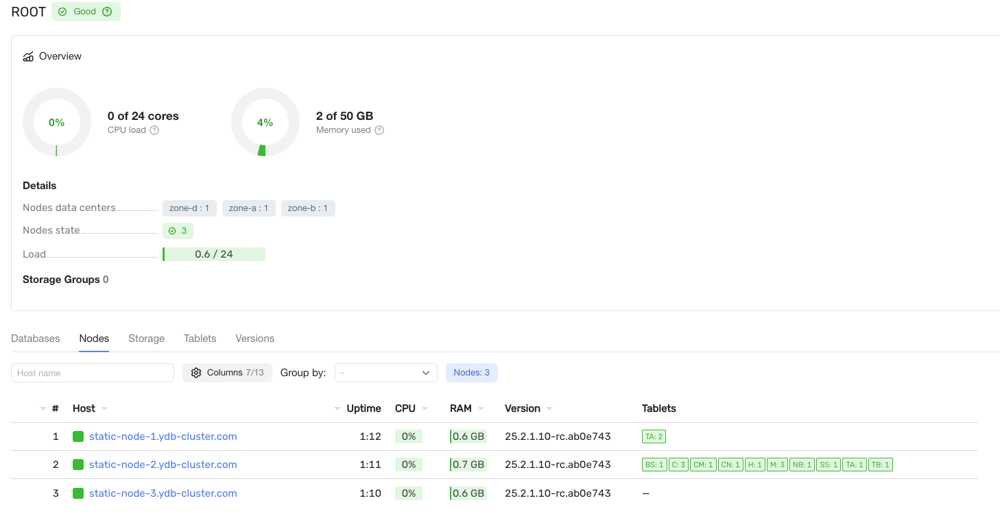

# Развёртывание кластера с использованием конфигурации V1

## Подготовьте окружение {#deployment-preparation}

Перед развёртыванием системы обязательно выполните подготовительные действия. Ознакомьтесь с документом [{#T}](deployment-preparation.md).

## Подготовьте конфигурационные файлы {#config}

Подготовьте конфигурационный файл {{ ydb-short-name }} в зависимости от выбранной вами топологии (см. [выбор топологии](../../../deployment-options/ansible/initial-deployment/deployment-preparation.md#topology-select)). Примеры для каждой поддерживаемой топологии приведены ниже во вкладках — выберите и используйте подходящий для вашего случая.



- mirror-3-dc-3nodes

  ```yaml
  static_erasure: mirror-3-dc
  host_configs:
    - drive:
        - path: /dev/disk/by-partlabel/ydb_disk_ssd_01
          type: SSD
        - path: /dev/disk/by-partlabel/ydb_disk_ssd_02
          type: SSD
        - path: /dev/disk/by-partlabel/ydb_disk_ssd_03
          type: SSD
      host_config_id: 1
    hosts:
    - host: static-node-1.ydb-cluster.com
      host_config_id: 1
      walle_location:
        body: 1
        data_center: "zone-a"
        rack: "1"
    - host: static-node-2.ydb-cluster.com
      host_config_id: 1
      walle_location:
        body: 2
        data_center: "zone-b"
        rack: "2"
    - host: static-node-3.ydb-cluster.com
      host_config_id: 1
      walle_location:
        body: 3
        data_center: "zone-d"
        rack: "3"
    domains_config:
    security_config:
    enforce_user_token_requirement: true
    default_users:
      - name: "root"
        password: ""
    default_access:
      - "+(F):root"
    domain:
    - name: Root
    storage_pool_types:
    - kind: ssd
    pool_config:
    box_id: 1
    erasure_species: mirror-3-dc
    kind: ssd
    geometry:
      realm_level_begin: 10
      realm_level_end: 20
      domain_level_begin: 10
      domain_level_end: 256
    pdisk_filter:
      - property:
          - type: SSD
    vdisk_kind: Default
   state_storage:
    - ring:
        node: [1, 2, 3]
        nto_select: 3
        ssid: 1
    table_service_config:
    sql_version: 1
    actor_system_config:
    executor:
      - name: System
        threads: 2
        type: BASIC
      - name: User
        threads: 3
        type: BASIC
      - name: Batch
        threads: 2
        type: BASIC
      - name: IO
        threads: 1
        time_per_mailbox_micro_secs: 100
        type: IO
      - name: IC
        spin_threshold: 10
        threads: 1
        time_per_mailbox_micro_secs: 100
        type: BASIC
    scheduler:
      progress_threshold: 10000
      resolution: 256
      spin_threshold: 0
   blob_storage_config:
    service_set:
      groups:
        - erasure_species: mirror-3-dc
          rings:
            - fail_domains:
                - vdisk_locations:
                    - node_id: static-node-1.ydb-cluster.com
                      pdisk_category: SSD
                      path: /dev/disk/by-partlabel/ydb_disk_ssd_01
                    - node_id: static-node-1.ydb-cluster.com
                      pdisk_category: SSD
                      path: /dev/disk/by-partlabel/ydb_disk_ssd_02
                    - node_id: static-node-1.ydb-cluster.com
                      pdisk_category: SSD
                      path: /dev/disk/by-partlabel/ydb_disk_ssd_03
                - vdisk_locations:
                    - node_id: static-node-2.ydb-cluster.com
                      pdisk_category: SSD
                      path: /dev/disk/by-partlabel/ydb_disk_ssd_01
                    - node_id: static-node-2.ydb-cluster.com
                      pdisk_category: SSD
                      path: /dev/disk/by-partlabel/ydb_disk_ssd_02
                    - node_id: static-node-2.ydb-cluster.com
                      pdisk_category: SSD
                      path: /dev/disk/by-partlabel/ydb_disk_ssd_03
                - vdisk_locations:
                    - node_id: static-node-3.ydb-cluster.com
                      pdisk_category: SSD
                      path: /dev/disk/by-partlabel/ydb_disk_ssd_01
                    - node_id: static-node-3.ydb-cluster.com
                      pdisk_category: SSD
                      path: /dev/disk/by-partlabel/ydb_disk_ssd_02
                    - node_id: static-node-3.ydb-cluster.com
                      pdisk_category: SSD
                      path: /dev/disk/by-partlabel/ydb_disk_ssd_03
    channel_profile_config:
    profile:
      - channel:
          - erasure_species: mirror-3-dc
            pdisk_category: 1
            storage_pool_kind: ssd
          - erasure_species: mirror-3-dc
            pdisk_category: 1
            storage_pool_kind: ssd
          - erasure_species: mirror-3-dc
            pdisk_category: 1
            storage_pool_kind: ssd
        profile_id: 0
    interconnect_config:
    start_tcp: true
    encryption_mode: OPTIONAL
    path_to_certificate_file: "/opt/ydb/certs/node.crt"
    path_to_private_key_file: "/opt/ydb/certs/node.key"
    path_to_ca_file: "/opt/ydb/certs/ca.crt"
   grpc_config:
    cert: "/opt/ydb/certs/node.crt"
    key: "/opt/ydb/certs/node.key"
    ca: "/opt/ydb/certs/ca.crt"
    services_enabled:
      - legacy
    client_certificate_authorization:
      request_client_certificate: true
      client_certificate_definitions:
        - member_groups: ["registerNode@cert"]
          subject_terms:
            - short_name: "O"
              values: ["YDB"]
            ```

- mirror-3-dc-9nodes

  ```yaml
  static_erasure: mirror-3-dc
  host_configs:
    - drive:
        - path: /dev/disk/by-partlabel/ydb_disk_ssd_01
          type: SSD
        - path: /dev/disk/by-partlabel/ydb_disk_ssd_02
          type: SSD
      host_config_id: 1
  hosts:
    - host: ydb-node-zone-a-1.local
      host_config_id: 1
      walle_location:
        body: 1
        data_center: 'zone-a'
        rack: '1'
    - host: ydb-node-zone-a-2.local
      host_config_id: 1
      walle_location:
        body: 2
        data_center: 'zone-a'
        rack: '2'
    - host: ydb-node-zone-a-3.local
      host_config_id: 1
      walle_location:
        body: 3
        data_center: 'zone-a'
        rack: '3'
    - host: ydb-node-zone-b-1.local
      host_config_id: 1
      walle_location:
        body: 4
        data_center: 'zone-b'
        rack: '4'
    - host: ydb-node-zone-b-2.local
      host_config_id: 1
      walle_location:
        body: 5
        data_center: 'zone-b'
        rack: '5'
    - host: ydb-node-zone-b-3.local
      host_config_id: 1
      walle_location:
        body: 6
        data_center: 'zone-b'
        rack: '6'
    - host: ydb-node-zone-d-1.local
      host_config_id: 1
      walle_location:
        body: 7
        data_center: 'zone-d'
        rack: '7'
    - host: ydb-node-zone-d-2.local
      host_config_id: 1
      walle_location:
        body: 8
        data_center: 'zone-d'
        rack: '8'
    - host: ydb-node-zone-d-3.local
      host_config_id: 1
      walle_location:
        body: 9
        data_center: 'zone-d'
        rack: '9'
  domains_config:
    security_config:
    enforce_user_token_requirement: true
    default_users:
      - name: "root"
        password: ""
    default_access:
      - "+(F):root"
  domain:
    - name: Root
  storage_pool_types:
    - kind: ssd
  pool_config:
    box_id: 1
    erasure_species: mirror-3-dc
    kind: ssd
    pdisk_filter:
      - property:
          - type: SSD
    vdisk_kind: Default
  state_storage:
    - ring:
        node: [1, 2, 3, 4, 5, 6, 7, 8, 9]
        nto_select: 9
        ssid: 1
  table_service_config:
    sql_version: 1
  actor_system_config:
    executor:
      - name: System
        threads: 2
        type: BASIC
      - name: User
        threads: 3
        type: BASIC
      - name: Batch
        threads: 2
        type: BASIC
      - name: IO
        threads: 1
        time_per_mailbox_micro_secs: 100
        type: IO
      - name: IC
        spin_threshold: 10
        threads: 1
        time_per_mailbox_micro_secs: 100
        type: BASIC
    scheduler:
      progress_threshold: 10000
      resolution: 256
      spin_threshold: 0
  blob_storage_config:
    service_set:
      groups:
        - erasure_species: mirror-3-dc
          rings:
            - fail_domains:
                - vdisk_locations:
                    - node_id: "ydb-node-zone-a-1.local"
                      pdisk_category: SSD
                      path: /dev/disk/by-partlabel/ydb_disk_ssd_01
                - vdisk_locations:
                    - node_id: "ydb-node-zone-a-2.local"
                      pdisk_category: SSD
                      path: /dev/disk/by-partlabel/ydb_disk_ssd_01
                - vdisk_locations:
                    - node_id: "ydb-node-zone-a-3.local"
                      pdisk_category: SSD
                      path: /dev/disk/by-partlabel/ydb_disk_ssd_01
                - vdisk_locations:
                    - node_id: "ydb-node-zone-b-1.local"
                      pdisk_category: SSD
                      path: /dev/disk/by-partlabel/ydb_disk_ssd_01
                - vdisk_locations:
                    - node_id: "ydb-node-zone-b-2.local"
                      pdisk_category: SSD
                      path: /dev/disk/by-partlabel/ydb_disk_ssd_01
                - vdisk_locations:
                    - node_id: "ydb-node-zone-b-3.local"
                      pdisk_category: SSD
                      path: /dev/disk/by-partlabel/ydb_disk_ssd_01
                - vdisk_locations:
                    - node_id: "ydb-node-zone-d-1.local"
                      pdisk_category: SSD
                      path: /dev/disk/by-partlabel/ydb_disk_ssd_01
                - vdisk_locations:
                    - node_id: "ydb-node-zone-d-2.local"
                      pdisk_category: SSD
                      path: /dev/disk/by-partlabel/ydb_disk_ssd_01
                - vdisk_locations:
                    - node_id: "ydb-node-zone-d-3.local"
                      pdisk_category: SSD
                      path: /dev/disk/by-partlabel/ydb_disk_ssd_01
  channel_profile_config:
    profile:
      - channel:
          - erasure_species: mirror-3-dc
            pdisk_category: 1
            storage_pool_kind: ssd
          - erasure_species: mirror-3-dc
            pdisk_category: 1
            storage_pool_kind: ssd
          - erasure_species: mirror-3-dc
            pdisk_category: 1
            storage_pool_kind: ssd
        profile_id: 0
  interconnect_config:
    start_tcp: true
    encryption_mode: OPTIONAL
    path_to_certificate_file: "/opt/ydb/certs/node.crt"
    path_to_private_key_file: "/opt/ydb/certs/node.key"
    path_to_ca_file: "/opt/ydb/certs/ca.crt"
  grpc_config:
    cert: "/opt/ydb/certs/node.crt"
    key: "/opt/ydb/certs/node.key"
    ca: "/opt/ydb/certs/ca.crt"
    services_enabled:
      - legacy
    client_certificate_authorization:
      request_client_certificate: true
      client_certificate_definitions:
        - member_groups: ["registerNode@cert"]
          subject_terms:
            - short_name: "O"
              values: ["YDB"]
  ```

- block-4-2

  ```yaml
  static_erasure: block-4-2
  host_configs:
    - drive:
        - path: /dev/disk/by-partlabel/ydb_disk_ssd_01
          type: SSD
        - path: /dev/disk/by-partlabel/ydb_disk_ssd_02
          type: SSD
      host_config_id: 1
  hosts:
    - host: ydb-node-zone-a-1.local
      host_config_id: 1
      walle_location:
        body: 1
        data_center: 'zone-a'
        rack: '1'
    - host: ydb-node-zone-a-2.local
      host_config_id: 1
      walle_location:
        body: 2
        data_center: 'zone-a'
        rack: '2'
    - host: ydb-node-zone-a-3.local
      host_config_id: 1
      walle_location:
        body: 3
        data_center: 'zone-a'
        rack: '3'
    - host: ydb-node-zone-a-4.local
      host_config_id: 1
      walle_location:
        body: 4
        data_center: 'zone-a'
        rack: '4'
    - host: ydb-node-zone-a-5.local
      host_config_id: 1
      walle_location:
        body: 5
        data_center: 'zone-a'
        rack: '5'
    - host: ydb-node-zone-a-6.local
      host_config_id: 1
      walle_location:
        body: 6
        data_center: 'zone-a'
        rack: '6'
    - host: ydb-node-zone-a-7.local
      host_config_id: 1
      walle_location:
        body: 7
        data_center: 'zone-a'
        rack: '7'
    - host: ydb-node-zone-a-8.local
      host_config_id: 1
      walle_location:
        body: 8
        data_center: 'zone-a'
        rack: '8'
  domains_config:
    security_config:
    enforce_user_token_requirement: true
    default_users:
      - name: "root"
        password: ""
    default_access:
      - "+(F):root"
  domain:
    - name: Root
  storage_pool_types:
    - kind: ssd
  pool_config:
    box_id: 1
    erasure_species: block-4-2
    kind: ssd
    pdisk_filter:
      - property:
          - type: SSD
    vdisk_kind: Default
  state_storage:
    - ring:
        node: [1, 2, 3, 4, 5, 6, 7, 8]
        nto_select: 5
        ssid: 1
  table_service_config:
    sql_version: 1
  actor_system_config:
    executor:
      - name: System
        threads: 2
        type: BASIC
      - name: User
        threads: 3
        type: BASIC
      - name: Batch
        threads: 2
        type: BASIC
      - name: IO
        threads: 1
        time_per_mailbox_micro_secs: 100
        type: IO
      - name: IC
        spin_threshold: 10
        threads: 1
        time_per_mailbox_micro_secs: 100
        type: BASIC
    scheduler:
      progress_threshold: 10000
      resolution: 256
      spin_threshold: 0
  blob_storage_config:
    service_set:
      groups:
        - erasure_species: block-4-2
          rings:
            - fail_domains:
                - vdisk_locations:
                    - node_id: "ydb-node-zone-a-1.local"
                      pdisk_category: SSD
                      path: /dev/disk/by-partlabel/ydb_disk_ssd_01
                - vdisk_locations:
                    - node_id: "ydb-node-zone-a-2.local"
                      pdisk_category: SSD
                      path: /dev/disk/by-partlabel/ydb_disk_ssd_01
                - vdisk_locations:
                    - node_id: "ydb-node-zone-a-3.local"
                      pdisk_category: SSD
                      path: /dev/disk/by-partlabel/ydb_disk_ssd_01
                - vdisk_locations:
                    - node_id: "ydb-node-zone-a-4.local"
                      pdisk_category: SSD
                      path: /dev/disk/by-partlabel/ydb_disk_ssd_01
                - vdisk_locations:
                    - node_id: "ydb-node-zone-a-5.local"
                      pdisk_category: SSD
                      path: /dev/disk/by-partlabel/ydb_disk_ssd_01
                - vdisk_locations:
                    - node_id: "ydb-node-zone-a-6.local"
                      pdisk_category: SSD
                      path: /dev/disk/by-partlabel/ydb_disk_ssd_01
                - vdisk_locations:
                    - node_id: "ydb-node-zone-a-7.local"
                      pdisk_category: SSD
                      path: /dev/disk/by-partlabel/ydb_disk_ssd_01
                - vdisk_locations:
                    - node_id: "ydb-node-zone-a-8.local"
                      pdisk_category: SSD
                      path: /dev/disk/by-partlabel/ydb_disk_ssd_01
  channel_profile_config:
    profile:
      - channel:
          - erasure_species: block-4-2
            pdisk_category: 1
            storage_pool_kind: ssd
          - erasure_species: block-4-2
            pdisk_category: 1
            storage_pool_kind: ssd
          - erasure_species: block-4-2
            pdisk_category: 1
            storage_pool_kind: ssd
        profile_id: 0
  interconnect_config:
    start_tcp: true
    encryption_mode: OPTIONAL
    path_to_certificate_file: "/opt/ydb/certs/node.crt"
    path_to_private_key_file: "/opt/ydb/certs/node.key"
    path_to_ca_file: "/opt/ydb/certs/ca.crt"
  grpc_config:
    cert: "/opt/ydb/certs/node.crt"
    key: "/opt/ydb/certs/node.key"
    ca: "/opt/ydb/certs/ca.crt"
    services_enabled:
      - legacy
    client_certificate_authorization:
      request_client_certificate: true
      client_certificate_definitions:
        - member_groups: ["registerNode@cert"]
          subject_terms:
            - short_name: "O"
              values: ["YDB"]
  ```



Для ускорения и упрощения первичного развёртывания {{ ydb-short-name }} конфигурационный файл уже содержит большинство настроек для установки кластера. Достаточно заменить стандартные хосты FQDN на актуальные в разделах `hosts` и `blob_storage_config`.

- Раздел `hosts`:

  ```yaml
  ...
  hosts:
    - host: static-node-1.ydb-cluster.com #FQDN ВМ
      host_config_id: 1
      walle_location:
        body: 1
        data_center: 'zone-a'
        rack: '1'
  ...
  ```

- Раздел `blob_storage_config`:

  ```yaml
  ...
  - fail_domains:
    - vdisk_locations:
      - node_id: static-node-1.ydb-cluster.com #FQDN ВМ
        pdisk_category: SSD
        path: /dev/disk/by-partlabel/ydb_disk_1
  ...
  ```

Остальные секции и настройки конфигурационного файла остаются без изменений.

Сохраните конфигурационный файл {{ydb-short-name}} под именем `/opt/ydb/cfg/config.yaml` на каждом сервере кластера.

Более подробная информация по созданию файла конфигурации приведена в разделе [{#T}](../../../../reference/configuration/index.md).

## Скопируйте ключи и сертификаты TLS на каждый сервер {#tls-copy-cert}

Подготовленные ключи и сертификаты TLS необходимо скопировать в защищенный каталог на каждом из узлов кластера {{ ydb-short-name }}. Ниже приведен пример команд для создания защищенного каталога и копирования файлов с ключами и сертификатами.

```bash
sudo mkdir -p /opt/ydb/certs
sudo cp -v ca.crt /opt/ydb/certs/
sudo cp -v node.crt /opt/ydb/certs/
sudo cp -v node.key /opt/ydb/certs/
sudo cp -v web.pem /opt/ydb/certs/
sudo chown -R ydb:ydb /opt/ydb/certs
sudo chmod 700 /opt/ydb/certs
```

## Запустите статические узлы {#start-storage}



- Вручную

  Запустите сервис хранения данных {{ ydb-short-name }} на каждом статическом узле кластера:

  ```bash
  sudo su - ydb
  cd /opt/ydb
  export LD_LIBRARY_PATH=/opt/ydb/lib
  /opt/ydb/bin/ydbd server --log-level 3 --syslog --tcp --yaml-config  /opt/ydb/cfg/config.yaml \
      --grpcs-port 2135 --ic-port 19001 --mon-port 8765 --mon-cert /opt/ydb/certs/web.pem --node static &
  ```

- С использованием systemd

  Создайте на каждом сервере, где будет размещен статический узел кластера, конфигурационный файл systemd `/etc/systemd/system/ydbd-storage.service` по приведенному ниже образцу. Образец файла также можно [скачать из репозитория](https://github.com/ydb-platform/ydb/blob/main/ydb/deploy/systemd_services/ydbd-storage.service).

  ```ini
  [Unit]
  Description=YDB storage node
  After=network-online.target rc-local.service
  Wants=network-online.target
  StartLimitInterval=10
  StartLimitBurst=15

  [Service]
  Restart=always
  RestartSec=1
  User=ydb
  PermissionsStartOnly=true
  StandardOutput=syslog
  StandardError=syslog
  SyslogIdentifier=ydbd
  SyslogFacility=daemon
  SyslogLevel=err
  Environment=LD_LIBRARY_PATH=/opt/ydb/lib
  ExecStart=/opt/ydb/bin/ydbd server --log-level 3 --syslog --tcp \
      --yaml-config  /opt/ydb/cfg/config.yaml \
      --grpcs-port 2135 --ic-port 19001 --mon-port 8765 \
      --mon-cert /opt/ydb/certs/web.pem --node static
  LimitNOFILE=65536
  LimitCORE=0
  LimitMEMLOCK=3221225472

  [Install]
  WantedBy=multi-user.target
  ```

  Запустите сервис на каждом статическом узле {{ ydb-short-name }}:

  ```bash
  sudo systemctl start ydbd-storage
  ```



После запуска статических узлов проверьте их работоспособность через встроенный веб-интерфейс {{ ydb-short-name }} (Embedded UI):

1. Откройте в браузере адрес `https://<node.ydb.tech>:8765`, где `<node.ydb.tech>` — FQDN сервера, на котором запущен любой статический узел;
2. Перейдите на вкладку **Nodes**;
3. Убедитесь, что в списке отображаются все 3 статических узла.



## Инициализируйте кластер {#initialize-cluster}

Операция инициализации кластера осуществляет настройку набора статических узлов, перечисленных в конфигурационном файле кластера, для хранения данных {{ ydb-short-name }}.

Для инициализации кластера потребуется файл сертификата центра регистрации `ca.crt`, путь к которому должен быть указан при выполнении соответствующих команд. Перед выполнением соответствующих команд скопируйте файл `ca.crt` на сервер, на котором эти команды будут выполняться.

На одном из серверов хранения в составе кластера выполните команды:

Сначала получите авторизационный токен для регистрации запросов. Для этого выполните приведённую ниже команду.

```bash
/opt/ydb/bin/ydb --ca-file ca.crt -e grpcs://`hostname -f`:2135 -d /Root --user root --no-password auth get-token -f > auth_token
```

Инициализируйте кластер, используя полученный токен

```bash
export LD_LIBRARY_PATH=/opt/ydb/lib
/opt/ydb/bin/ydbd --ca-file ca.crt -s grpcs://`hostname -f`:2135 -f auth_token \
    admin blobstorage config init --yaml-file  /opt/ydb/cfg/config.yaml
echo $?
```

При успешном выполнении инициализации кластера выведенный на экран код завершения команды инициализации кластера должен быть нулевым.

## Создайте базу данных {#create-db}

Для работы со строковыми или колоночными таблицами необходимо создать как минимум одну базу данных и запустить процесс или процессы, обслуживающие эту базу данных (динамические узлы).

Для выполнения административной команды создания базы данных потребуется файл сертификата центра регистрации `ca.crt`, аналогично описанному выше порядку выполнения действий по инициализации кластера.

При создании базы данных устанавливается первоначальное количество используемых групп хранения, определяющее доступную пропускную способность ввода-вывода и максимальную емкость хранения. Количество групп хранения может быть при необходимости увеличено после создания базы данных.

На одном из серверов хранения в составе кластера выполните команды:

```bash
export LD_LIBRARY_PATH=/opt/ydb/lib
/opt/ydb/bin/ydbd --ca-file ca.crt -s grpcs://`hostname -f`:2135 -f auth_token \
    admin database /Root/testdb create ssd:8
echo $?
```

При успешном создании базы данных, выведенный на экран код завершения команды должен быть нулевым.

В приведенном выше примере команд используются следующие параметры:

- `/Root` - имя корневого домена, сгенерированного автоматически при инициализации кластера;
- `testdb` - имя создаваемой базы данных;
- `ssd:8` - задает пул хранения для базы данных и количество групп в нем. Имя пула (`ssd`) должно соответствовать типу диска, указанному в конфигурации кластера (например, в `default_disk_type`), и является регистронезависимым. Число после двоеточия — это количество выделяемых групп хранения.

## Запустите динамические узлы {#start-dynnode}



- Вручную

  Запустите динамический узел {{ ydb-short-name }} для базы `/Root/testdb`:

  ```bash
  sudo su - ydb
  cd /opt/ydb
  export LD_LIBRARY_PATH=/opt/ydb/lib
  /opt/ydb/bin/ydbd server --grpcs-port 2136 --grpc-ca /opt/ydb/certs/ca.crt \
      --ic-port 19002 --ca /opt/ydb/certs/ca.crt \
      --mon-port 8766 --mon-cert /opt/ydb/certs/web.pem \
      --yaml-config  /opt/ydb/cfg/config.yaml \
      --tenant /Root/testdb \
      --grpc-cert /opt/ydb/certs/node.crt \
      --grpc-key /opt/ydb/certs/node.key \
      --node-broker grpcs://<ydb-static-node1>:2135 \
      --node-broker grpcs://<ydb-static-node2>:2135 \
      --node-broker grpcs://<ydb-static-node3>:2135 &
  ```

  В примере команды выше `<ydb-static-node1>`, `<ydb-static-node2>`, `<ydb-static-node3>` — FQDN трех любых серверов, на которых запущены статические узлы кластера.

- С использованием systemd

  Создайте конфигурационный файл systemd `/etc/systemd/system/ydbd-testdb.service` по приведенному ниже образцу. Образец файла также можно [скачать из репозитория](https://github.com/ydb-platform/ydb/blob/main/ydb/deploy/systemd_services/ydbd-testdb.service).

  ```ini
  [Unit]
  Description=YDB testdb dynamic node
  After=network-online.target rc-local.service
  Wants=network-online.target
  StartLimitInterval=10
  StartLimitBurst=15

  [Service]
  Restart=always
  RestartSec=1
  User=ydb
  PermissionsStartOnly=true
  StandardOutput=syslog
  StandardError=syslog
  SyslogIdentifier=ydbd
  SyslogFacility=daemon
  SyslogLevel=err
  Environment=LD_LIBRARY_PATH=/opt/ydb/lib
  ExecStart=/opt/ydb/bin/ydbd server \
      --grpcs-port 2136 --grpc-ca /opt/ydb/certs/ca.crt \
      --ic-port 19002 --ca /opt/ydb/certs/ca.crt \
      --mon-port 8766 --mon-cert /opt/ydb/certs/web.pem \
      --yaml-config  /opt/ydb/cfg/config.yaml \
      --tenant /Root/testdb \
      --grpc-cert /opt/ydb/certs/node.crt \
      --grpc-key /opt/ydb/certs/node.key \
      --node-broker grpcs://<ydb-static-node1>:2135 \
      --node-broker grpcs://<ydb-static-node2>:2135 \
      --node-broker grpcs://<ydb-static-node3>:2135
  LimitNOFILE=65536
  LimitCORE=0
  LimitMEMLOCK=32212254720

  [Install]
  WantedBy=multi-user.target
  ```

  В примере команды выше `<ydb-static-node1>`, `<ydb-static-node2>`, `<ydb-static-node3>` — FQDN трех любых серверов, на которых запущены статические узлы кластера.

  Запустите динамический узел {{ ydb-short-name }} для базы `/Root/testdb`:

  ```bash
  sudo systemctl start ydbd-testdb
  ```



Запустите дополнительные динамические узлы на других серверах для масштабирования и обеспечения отказоустойчивости базы данных.

## Настройка учетных записей {#security-setup}

1. Установите {{ ydb-short-name }} CLI, как описано в [документации](../../../../reference/ydb-cli/install.md).

1. Установите пароль для учетной записи `root`, используя полученный ранее токен:

    ```bash
    ydb --ca-file ca.crt -e grpcs://<node.ydb.tech>:2136 -d /Root/testdb --token-file auth_token \
        yql -s 'ALTER USER root PASSWORD "passw0rd"'
    ```

    Вместо значения `passw0rd` подставьте необходимый пароль. Сохраните пароль в отдельный файл. Последующие команды от имени пользователя `root` будут выполняться с использованием пароля, передаваемого с помощью ключа `--password-file <path_to_user_password>`. Также пароль можно сохранить в профиле подключения, как описано в [документации {{ ydb-short-name }} CLI](../../../../reference/ydb-cli/profile/index.md).

1. Создайте дополнительные учетные записи:

    ```bash
    ydb --ca-file ca.crt -e grpcs://<node.ydb.tech>:2136 -d /Root/testdb --user root --password-file <path_to_root_pass_file> \
        yql -s 'CREATE USER user1 PASSWORD "passw0rd"'
    ```

1. Установите права учетных записей, включив их во встроенные группы:

    ```bash
    ydb --ca-file ca.crt -e grpcs://<node.ydb.tech>:2136 -d /Root/testdb --user root --password-file <path_to_root_pass_file> \
        yql -s 'ALTER GROUP `ADMINS` ADD USER user1'
    ```

В перечисленных выше примерах команд `<node.ydb.tech>` — FQDN сервера, на котором запущен любой динамический узел, обслуживающий базу `/Root/testdb`. При подключении по SSH к динамическому узлу {{ ydb-short-name }} удобно использовать конструкцию `grpcs://$(hostname -f):2136` для получения FQDN.

При выполнении команд создания учётных записей и присвоения групп клиент {{ ydb-short-name }} CLI будет запрашивать ввод пароля пользователя `root`. Избежать многократного ввода пароля можно, создав профиль подключения, как описано в [документации {{ ydb-short-name }} CLI](../../../../reference/ydb-cli/profile/index.md).

## Протестируйте работу с созданной базой {#try-first-db}

1. Установите {{ ydb-short-name }} CLI, как описано в [документации](../../../../reference/ydb-cli/install.md).

1. Создайте тестовую строковую (`test_row_table`) или колоночную таблицу (`test_column_table`):



- Создание строковой таблицы

    ```bash
    ydb --ca-file ca.crt -e grpcs://<node.ydb.tech>:2136 -d /Root/testdb --user root \
        yql -s 'CREATE TABLE `testdir/test_row_table` (id Uint64, title Utf8, PRIMARY KEY (id));'
    ```

- Создание колоночной таблицы

    ```bash
    ydb --ca-file ca.crt -e grpcs://<node.ydb.tech>:2136 -d /Root/testdb --user root \
        yql -s 'CREATE TABLE `testdir/test_column_table` (id Uint64 NOT NULL, title Utf8, PRIMARY KEY (id)) WITH (STORE = COLUMN);'
    ```



Где `<node.ydb.tech>` — FQDN сервера, на котором запущен динамический узел, обслуживающий базу `/Root/testdb`.

## Проверка доступа ко встроенному web-интерфейсу

Для проверки доступа ко встроенному web-интерфейсу {{ ydb-short-name }} достаточно открыть в Web-браузере страницу с адресом `https://<node.ydb.tech>:8765`, где `<node.ydb.tech>` — FQDN сервера, на котором запущен любой статический узел {{ ydb-short-name }}.

В Web-браузере должно быть настроено доверие в отношении центра регистрации, выпустившего сертификаты для кластера {{ ydb-short-name }}, в противном случае будет отображено предупреждение об использовании недоверенного сертификата.

Если в кластере включена аутентификация, в Web-браузере должен отобразиться запрос логина и пароля. После ввода верных данных аутентификации должна отобразиться начальная страница встроенного web-интерфейса. Описание доступных функций и пользовательского интерфейса приведено в разделе [{#T}](../../../../reference/embedded-ui/index.md).



Обычно для обеспечения доступа ко встроенному web-интерфейсу {{ ydb-short-name }} настраивают отказоустойчивый HTTP-балансировщик на базе программного обеспечения `haproxy`, `nginx` или аналогов. Детали настройки HTTP-балансировщика выходят за рамки стандартной инструкции по установке {{ ydb-short-name }}.



## Особенности установки {{ ydb-short-name }} в незащищенном режиме



Мы не рекомендуем использовать незащищенный режим работы {{ ydb-short-name }} ни при эксплуатации, ни при разработке приложений.



Описанная выше процедура установки предусматривает развёртывание {{ ydb-short-name }} в стандартном защищенном режиме.

Незащищённый режим работы {{ ydb-short-name }} предназначен для решения тестовых задач, преимущественно связанных с разработкой и тестированием программного обеспечения {{ ydb-short-name }}. В незащищенном режиме:

- трафик между узлами кластера, а также между приложениями и кластером использует незашифрованные соединения;
- не используется аутентификация пользователей (включение аутентификации при отсутствии шифрования трафика не имеет смысла, поскольку логин и пароль в такой конфигурации передавались бы через сеть в открытом виде).

Установка {{ ydb-short-name }} для работы в незащищенном режиме производится в порядке, описанном выше, со следующими исключениями:

1. При подготовке к установке не требуется формировать сертификаты и ключи TLS, и не выполняется копирование сертификатов и ключей на узлы кластера.
1. Из конфигурационных файлов кластерных узлов исключаются секции `security_config`, `interconnect_config` и `grpc_config`.
1. Используются упрощенный вариант команд запуска статических и динамических узлов кластера: исключаются опции с именами файлов сертификатов и ключей, используется протокол `grpc` вместо `grpcs` при указании точек подключения.
1. Пропускается ненужный в незащищенном режиме шаг по получению токена аутентификации перед выполнением инициализации кластера и созданием базы данных.
1. Команда инициализации кластера выполняется в следующей форме:

```bash
export LD_LIBRARY_PATH=/opt/ydb/lib
/opt/ydb/bin/ydbd admin blobstorage config init --yaml-file  /opt/ydb/cfg/config.yaml
echo $?
```

6. Команда создания базы данных выполняется в следующей форме:

```bash
export LD_LIBRARY_PATH=/opt/ydb/lib
/opt/ydb/bin/ydbd admin database /Root/testdb create ssd:1
```

7. При обращении к базе данных из {{ ydb-short-name }} CLI и приложений используется протокол grpc вместо grpcs, и не используется аутентификация.
