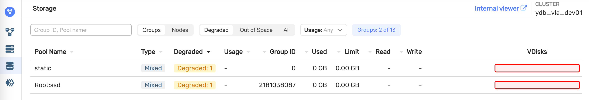

# Обновление исполняемого файла {{ ydb-short-name }}

{{ ydb-short-name }} распределенная система, поддерживающая плавное обновление (rolling restart) без даунтайма и деградации производительности.



## Порядок обновления {#upgrade-order}

Базовым сценарием является обновление исполняемого файла и затем последовательный рестарт каждого узла:

1. Обновление и рестарт [узлов хранения](../../../concepts/glossary.md#storage-node);
2. Обновление и рестарт [узлов баз данных](../../../concepts/glossary.md#database-node).

Процесс остановки и запуска описан на странице [Безопасные рестарт и выключение узлов](../../../maintenance/manual/node_restarting.md).
Узлы {{ ydb-short-name }} следует обновлять последовательно по одному, после каждого шага контролировать состояние кластера через [{{ ydb-short-name }} Monitoring](../../../reference/embedded-ui/ydb-monitoring.md) - на вкладке `Storage` не должно быть пулов в состоянии `Degraded` (как на примере ниже). В противном случае обновление необходимо остановить.

## Проверка результата обновления {#upgrade_check}

Проверить версии узлов после обновления можно на странице `Nodes` мониторинга.