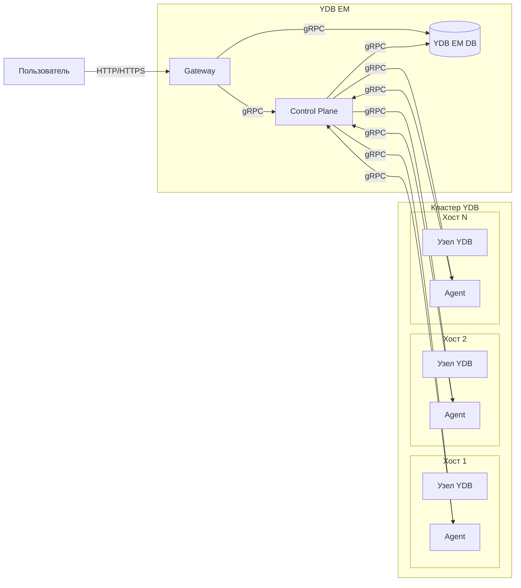

# {{ ydb-short-name }} Enterprise Manager

{{ ydb-short-name }} Enterprise Manager (далее — YDB EM) — это инструмент для централизованного управления кластерами {{ ydb-short-name }} через веб-интерфейс и API.



Развёртывание кластеров {{ ydb-short-name }} возможно без YDB EM — с помощью [Ansible](../deployment-options/ansible/index.md), [Kubernetes](../deployment-options/kubernetes/index.md) или [вручную](../deployment-options/manual/index.md). YDB EM предоставляет удобный веб-интерфейс поверх уже существующих кластеров.



## Назначение {#purpose}

YDB EM подключается к существующим кластерам {{ ydb-short-name }} и предоставляет графический интерфейс и API для решения следующих задач:

* централизованный доступ к базам данных и кластерам {{ ydb-short-name }} из единого интерфейса;
* управление динамическими узлами кластера — запуск, остановка, масштабирование;
* управление базами данных — создание, удаление, изменение параметров;
* мониторинг состояния кластера и узлов;
* управление ресурсами (CPU, RAM), выделенными для динамических узлов;
* адвизор — диагностика и рекомендации по устранению наиболее распространённых проблем;
* расширенный SQL-редактор для выполнения запросов к базам данных;
* AI-ассистент для работы с {{ ydb-short-name }}.



YDB EM не развёртывает кластер {{ ydb-short-name }}. Перед использованием YDB EM кластер должен быть развёрнут одним из [способов развёртывания](../deployment-options/index.md).



## Архитектура {#architecture}

YDB EM состоит из трёх компонентов:

* **Gateway** — веб-интерфейс и API-бэкенд. Принимает запросы от пользователей (через браузер или API) и взаимодействует с Control Plane и базой данных YDB EM.
* **Control Plane (CP)** — координирует управление кластером. Получает команды от Gateway, хранит конфигурацию в базе данных YDB EM и отправляет задания агентам.
* **Agent** — запускается на каждом хосте кластера {{ ydb-short-name }}, на котором работают динамические узлы. Агент выполняет команды Control Plane: запускает и останавливает процессы узлов {{ ydb-short-name }}, следит за их состоянием и передаёт информацию о доступных ресурсах хоста.

Для хранения собственных метаданных (конфигурация кластеров, состояние узлов) YDB EM использует базу данных {{ ydb-short-name }} — она может располагаться в том же кластере, которым управляет EM.

### Схема взаимодействия {#interaction-diagram}

Пользователь взаимодействует с Gateway через браузер или API. Gateway передаёт запросы в Control Plane, который координирует работу агентов на хостах кластера. Агенты управляют процессами узлов {{ ydb-short-name }} и сообщают о состоянии хостов.

## Основные материалы {#materials}

- [{#T}](initial-deployment.md)
