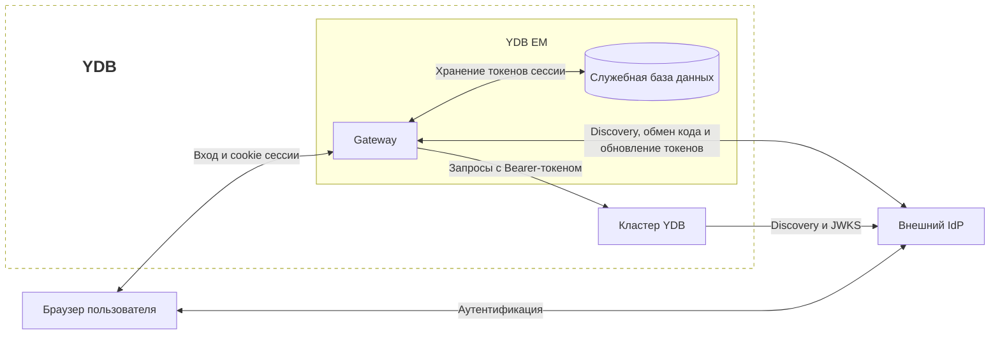
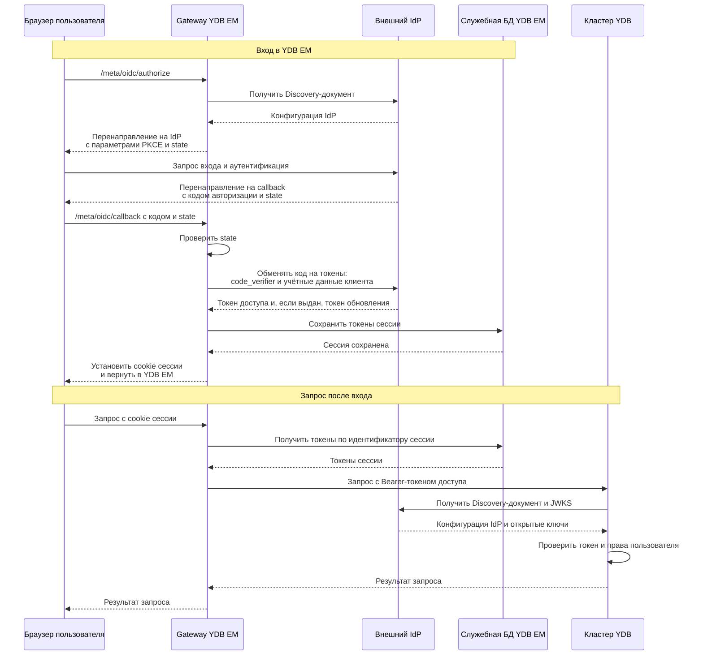

# Настройка SSO в YDB EM

{{ ydb-short-name }} Enterprise Manager (далее — YDB EM) поддерживает единый вход (Single Sign-On, SSO) через внешний [провайдер идентификации](https://csrc.nist.gov/glossary/term/identity_provider) (Identity Provider, IdP) по протоколу [OpenID Connect](https://openid.net/developers/how-connect-works/) (OIDC). Для работы в веб-интерфейсе YDB EM пользователь может войти с корпоративной учётной записью на странице IdP. Если у пользователя уже есть активная сессия у IdP, повторный ввод учётных данных зависит от политики провайдера.

SSO в веб-интерфейсе поддерживается с помощью YDB EM. При этом сервер {{ ydb-short-name }} поддерживает [аутентификацию через внешний IdP](../../security/authentication.md#external-idp) по [JWT-токенам](https://www.rfc-editor.org/rfc/rfc7519.html), переданным [Gateway](index.md#architecture), CLI или другим клиентом.

## Компоненты SSO {#sso-components}

В едином входе участвуют браузер пользователя, IdP, Gateway, служебная база данных YDB EM и кластер {{ ydb-short-name }}, к которому обращается пользователь.

На схеме используются следующие термины:

- [OIDC Discovery](https://openid.net/specs/openid-connect-discovery-1_0.html#ProviderConfig) — получение конфигурации IdP из JSON-документа по известному адресу. Документ содержит адреса сервисов аутентификации, выдачи токенов и набора ключей.
- [JWKS (JSON Web Key Set)](https://www.rfc-editor.org/rfc/rfc7517.html#section-5) — набор ключей в формате JSON. IdP публикует в нём открытые ключи, с помощью которых {{ ydb-short-name }} проверяет подпись JWT-токенов.



## Как работает SSO {#how-it-works}

[Gateway](index.md#architecture) — компонент YDB EM, который обслуживает веб-интерфейс и API. Он выполняет вход по схеме [Authorization Code](https://www.rfc-editor.org/rfc/rfc6749.html#section-4.1) с [PKCE (Proof Key for Code Exchange)](https://www.rfc-editor.org/rfc/rfc7636.html), используя метод `S256`:

1. Браузер обращается к `/meta/oidc/authorize` на Gateway. Gateway получает адреса сервисов IdP из [Discovery-документа](https://openid.net/specs/openid-connect-discovery-1_0.html#ProviderConfig) `<issuer>/.well-known/openid-configuration` и перенаправляет браузер на страницу входа провайдера.
2. Пользователь проходит аутентификацию у IdP. Провайдер возвращает браузер на `/meta/oidc/callback` с кодом авторизации и параметром состояния `state`.
3. Gateway сопоставляет `state` с начатым входом и обменивает код на токены, передавая IdP учётные данные OIDC-клиента и проверочный код PKCE `code_verifier`. Это случайная секретная строка, созданная Gateway при начале входа; она подтверждает, что код авторизации обменивает тот же клиент, который начал вход.
4. Gateway сохраняет токены в служебной базе данных YDB EM и устанавливает в браузере cookie с непрозрачным идентификатором сессии. Сами токены в cookie не передаются. Cookie имеет префикс `__Host-` и атрибуты `Secure`, `HttpOnly`, `SameSite=Strict`.
5. При последующих запросах браузер передаёт cookie, а Gateway получает из сессии [токен доступа (access token)](https://www.rfc-editor.org/rfc/rfc6749.html#section-1.4) и использует его как `Bearer`-токен для запросов к {{ ydb-short-name }}. Сервер {{ ydb-short-name }} проверяет JWT-токен и определяет пользователя и его группы для [авторизации](../../security/authorization.md).

Диаграмма показывает успешный вход и последующий запрос к кластеру. Конфигурация IdP и ключи могут использоваться из кеша; их получение показано для случая, когда они ещё не загружены.



Префикс и атрибуты cookie ограничивают доступ к идентификатору сессии:

- `__Host-` требует HTTPS, атрибута `Secure`, пути `Path=/` и отсутствия атрибута `Domain`. Cookie привязана к конкретному хосту Gateway; поддомены не могут установить такую cookie для него.
- `Secure` разрешает передачу cookie только по HTTPS.
- `HttpOnly` запрещает JavaScript читать или изменять cookie через API браузера, снижая риск кражи идентификатора сессии скриптом.
- `SameSite=Strict` запрещает отправлять cookie в межсайтовых запросах, снижая риск подделки запросов от имени пользователя (CSRF).

Подробнее см. в разделе [Cookie Security документа OAuth 2.0 for Browser-Based Applications (RFC 10017)](https://www.rfc-editor.org/rfc/rfc10017.html#section-6.1.3.2) и в [описании заголовка `Set-Cookie`](https://developer.mozilla.org/en-US/docs/Web/HTTP/Reference/Headers/Set-Cookie).

Если IdP выдал [токен обновления (refresh token)](https://www.rfc-editor.org/rfc/rfc6749.html#section-1.5), Gateway автоматически обновляет истекающий токен доступа. Если сессию нельзя продолжить, пользователю необходимо войти снова.

При выходе через YDB EM Gateway удаляет серверную сессию и cookie и запрашивает отзыв токенов, если IdP предоставляет адрес сервиса отзыва токенов `revocation_endpoint`.

## Перед началом работы {#before-start}

Для настройки необходимы:

- [Развёрнутый YDB EM](initial-deployment.md).
- IdP с поддержкой [OIDC Discovery](https://openid.net/specs/openid-connect-discovery-1_0.html), Authorization Code, PKCE с методом `S256` и аутентификации клиента методом `client_secret_basic`.
- HTTPS-доступ к Gateway и IdP. Браузер должен доверять сертификату Gateway, а Gateway и узлы {{ ydb-short-name }} — сертификатам IdP.
- Сетевой доступ от Gateway к Discovery-документу и сервису выдачи токенов IdP, а от узлов {{ ydb-short-name }} — к Discovery-документу и JWKS. Браузер должен иметь доступ к странице входа IdP и адресу возврата на Gateway.
- Поддержка аутентификации через внешний IdP на кластерах {{ ydb-short-name }}, к которым YDB EM обращается с пользовательскими токенами, включая кластер, через который выполняется вход в YDB EM.

## Настройка IdP {#configure-idp}

Области доступа (scopes) определяют, какие сведения о пользователе и возможности клиент запрашивает у IdP. Например, `profile` и `email` используются для запроса данных профиля и адреса электронной почты. Необходимые области доступа зависят от настроек IdP.

Зарегистрируйте в IdP конфиденциальный OIDC-клиент для YDB EM:

1. Включите Authorization Code и PKCE с методом `S256`.
2. Разрешите аутентификацию клиента на сервисе выдачи токенов методом `client_secret_basic`: Gateway передаёт `client_id` и `client_secret` в заголовке HTTP Basic.
3. Укажите разрешённый адрес возврата (redirect URI). Например, для Gateway по адресу `https://em.example.com:8789`:

   ```text
   https://em.example.com:8789/meta/oidc/callback
   ```

4. Сохраните `client_id` и `client_secret` для конфигурации Gateway.
5. Настройте выдачу JWT-токенов доступа с нужными `iss` (issuer, издатель токена), `aud` (audience, получатели токена), идентификатором пользователя и группами. Значение `iss` должно совпадать с `issuer` в [конфигурации проверки токенов {{ ydb-short-name }}](../../reference/configuration/auth_config.md#external-idp-auth-config). Поле `aud` задаёт, для каких получателей выпущен токен: если на кластере задан параметр `audience`, его значение должно присутствовать в `aud`. Пример такой проверки приведён [ниже](#audience-example). Именно токен доступа передаётся в {{ ydb-short-name }}; настройка этих полей только в токене идентификации (ID token) недостаточна. Требования к подписи, ключам и полям JWT-токена описаны в разделе [аутентификации через внешний IdP](../../security/authentication.md#external-idp).
6. Если требуется автоматическое продление сессии, разрешите выдачу токена обновления. Необходимые разрешения и области доступа зависят от IdP.

Используйте один и тот же `issuer` в настройках Gateway и {{ ydb-short-name }}, например `https://idp.example.com/realms/company`. Укажите HTTPS-адрес без завершающего `/`, совпадающий с `issuer` в Discovery-документе и `iss` в JWT-токене.

Gateway получает `authorization_endpoint` и `token_endpoint` из Discovery-документа. Их URL должны начинаться со значения `issuer`. Необязательный `revocation_endpoint` используется только при соблюдении того же условия.

## Настройка Gateway {#configure-gateway}

Добавьте секцию `security.oidc` в YAML-конфигурацию Gateway. Если секция `security` уже существует, дополните её:

```yaml
security:
  oidc:
    issuer: "https://idp.example.com/realms/company"
    client_id: "ydb-em"
    client_secret: "<client-secret>"
    scopes:
      - openid
      - profile
      - email
    redirect_to_idp_on_unauthorized: true
```

Замените `<client-secret>` секретом, выданным IdP при регистрации OIDC-клиента YDB EM. Секрет клиента (`client_secret`) — конфиденциальная строка, которой Gateway вместе с `client_id` подтверждает свою подлинность перед IdP при обмене кода на токены и их обновлении. Это учётные данные приложения YDB EM, а не пароль пользователя. Ограничьте доступ к конфигурационному файлу, поскольку он содержит секрет.

| Параметр | Описание |
| --- | --- |
| `security.oidc.issuer` | HTTPS-адрес издателя токенов, используемый для OIDC Discovery. Обязательный параметр. |
| `security.oidc.client_id` | Идентификатор клиента YDB EM в IdP. Обязательный параметр. |
| `security.oidc.client_secret` | Секрет клиента YDB EM в IdP. Обязательный параметр. |
| `security.oidc.scopes` | Список запрашиваемых областей доступа. По умолчанию пустой; `openid` Gateway добавляет автоматически. Дополнительные области доступа, например `profile`, `email` или необходимые для получения групп и токена обновления, согласуйте с настройками IdP. |
| `security.oidc.redirect_to_idp_on_unauthorized` | По умолчанию `true`: при получении ответа `401 Unauthorized`, UI выполняет редирект пользователя на страницу аутентификации IdP. При `false` редирект не происходит, но `/meta/oidc/authorize` остаётся доступен для явного начала входа. |

Если секция `security.oidc` присутствует, все три поля `issuer`, `client_id` и `client_secret` должны быть непустыми, иначе Gateway не загрузит конфигурацию. Чтобы отключить OIDC, удалите секцию целиком.

Изменение `issuer` или `client_id` в конфигурации Gateway требует повторного входа пользователей, поскольку от этих параметров зависит имя cookie сессии.

### HTTPS и балансировщик {#https-and-balancer}

Gateway формирует redirect URI из заголовка `Host`, признака TLS входящего соединения и пути `/meta/oidc/callback`. Поэтому адрес должен совпадать с зарегистрированным в IdP, включая схему, имя хоста и порт.

Если перед Gateway расположен обратный прокси или балансировщик, сохраните внешний `Host` и используйте HTTPS-соединение до Gateway. Одного заголовка `X-Forwarded-Proto` недостаточно: при формировании redirect URI Gateway определяет схему по собственному входящему соединению. Доступ браузера по HTTPS также необходим для cookie с атрибутом `Secure`.

Если работают несколько экземпляров Gateway, обеспечьте попадание запросов `/meta/oidc/authorize` и `/meta/oidc/callback` одного входа на один экземпляр. Незавершённый обмен кодом хранится в памяти этого экземпляра; общей служебной базы данных недостаточно для переноса начатого входа между экземплярами.

В конфигурации Gateway необходимо включить маршрутизатор и добавить маршрут для OIDC-запросов:

```yaml
router:
  enabled: true
  routes_to_handle:
    - path: /meta/oidc
```

Если секция `router` уже существует, дополните список `routes_to_handle`, сохранив остальные маршруты.

## Настройка {{ ydb-short-name }} {#configure-ydb}

В конфигурации кластеров, принимающих пользовательский токен доступа от YDB EM, настройте проверку JWT-токенов. Например, для кластера `prod`, который доверяет IdP из примера [настройки Gateway](#configure-gateway), добавьте следующие параметры в секцию `auth_config`:

```yaml
auth_config:
  external_idp_config:
    issuer: "https://idp.example.com/realms/company"
    audience: "prod"
    subject_claim_name: "preferred_username"
    groups_claim_name: "groups"
  external_idp_authentication_domain: "sso"
  use_access_service: false
```

Настройте IdP так, чтобы токен доступа, выдаваемый клиенту `ydb-em`, содержал соответствующие поля. Пример фрагмента полезной нагрузки токена:

```json
{
  "iss": "https://idp.example.com/realms/company",
  "aud": ["prod"],
  "preferred_username": "alice",
  "groups": ["developers"]
}
```

В этом примере `issuer` одинаков в настройках Gateway и кластера и совпадает с `iss` в токене. Значение `audience: "prod"` входит в список `aud`. Параметры `subject_claim_name` и `groups_claim_name` задают поля, из которых {{ ydb-short-name }} получает имя пользователя и его группы. С учётом домена `sso` будут сформированы [SID](../../concepts/glossary.md#access-sid) `alice@sso` и `developers@sso`.

Описание всех параметров и ограничений совместимости приведено в разделе [«Конфигурация аутентификации с использованием внешнего IdP»](../../reference/configuration/auth_config.md#external-idp-auth-config).

Предоставьте пользователям или группам [права на нужные объекты](../../security/authorization.md). Успешный вход через IdP сам по себе не выдаёт права в {{ ydb-short-name }}.

Настройки подключения самого Gateway к служебной базе данных сохраняются отдельно: пользовательская OIDC-сессия не заменяет сервисные учётные данные YDB EM.

### Пример проверки получателя токена {#audience-example}

Предположим, YDB EM подключён к трём кластерам, которые доверяют одному IdP с одинаковым `issuer`. На первом кластере параметр `auth_config.external_idp_config.audience` не задан, на втором он равен `prod`, а на третьем — `preprod`. IdP включает в поле `aud` токена список получателей, для которых разрешено использовать этот токен.

В таблице показано, на каких кластерах токен будет принят при условии, что его подпись, издатель, срок действия и остальные проверяемые поля корректны:

| Поле `aud` в токене | Первый кластер: `audience` не задан | Второй кластер: `audience: prod` | Третий кластер: `audience: preprod` |
| --- | --- | --- | --- |
| Поле отсутствует | Да | Нет | Нет |
| `["other"]` | Да | Нет | Нет |
| `["prod"]` | Да | Да | Нет |
| `["preprod"]` | Да | Нет | Да |
| `["prod", "preprod"]` | Да | Да | Да |

Первый кластер принимает корректные токены всех пользователей этого IdP независимо от `aud`. Второй и третий принимают токен только при наличии соответственно `prod` или `preprod` в списке `aud`. Поэтому рекомендуется задавать `audience`, чтобы кластер не принимал токены, выпущенные для других получателей.

Успешная проверка токена позволяет аутентифицировать пользователя, но доступ к данным по-прежнему определяется его правами и правами его групп в {{ ydb-short-name }}.

## Применение настройки и проверка входа {#verify}

1. Примените конфигурацию {{ ydb-short-name }} штатным способом для вашего развёртывания.
2. Разверните обновлённую конфигурацию Gateway и перезапустите его.
3. Проверьте регистрацию OIDC-обработчиков:

   ```bash
   curl --fail https://em.example.com:8789/capabilities
   ```

   В объекте `Capabilities` должны присутствовать `/meta/oidc/authorize` и `/meta/oidc/callback` со значением `1`.

4. Откройте в браузере адрес начала входа:

   ```text
   https://em.example.com:8789/meta/oidc/authorize?return_to=%2Fui%2Fclusters
   ```

   Параметр `return_to` задаёт локальный путь для возврата после входа. Если параметр отсутствует или содержит недопустимый путь, используется `/`.

5. Войдите на странице IdP и убедитесь, что браузер вернулся в YDB EM на `/ui/clusters`.
6. Откройте доступную пользователю базу данных и выполните запрос на чтение данных из таблицы, на которую ему выданы права чтения. Это проверяет не только вход в YDB EM, но и передачу токена и авторизацию в {{ ydb-short-name }}.
