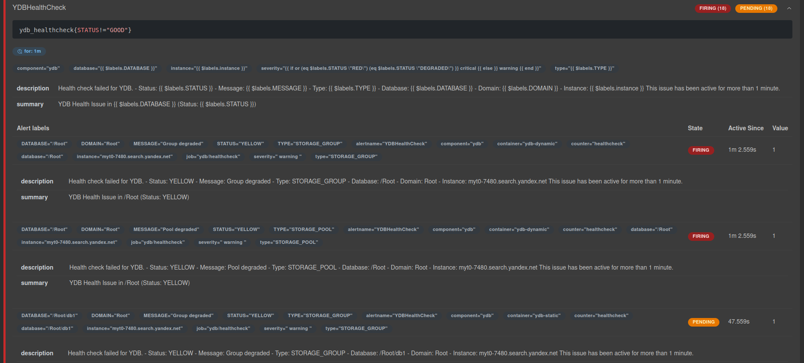
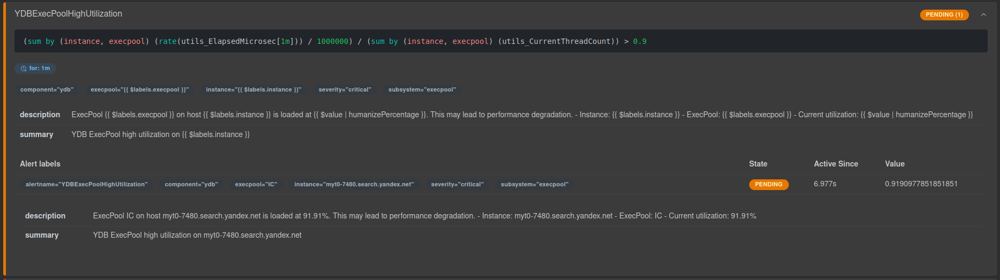
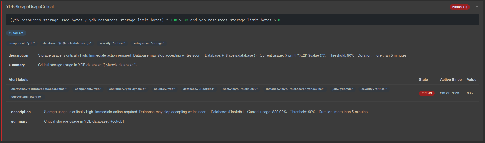

<!-- markdownlint-disable MD014, MD031, MD038, MD040, MD046, MD048 -->

# Алертинг

Алертинг — это механизм автоматических оповещений, предназначенный для информирования администраторов или специалистов DevOps о событиях, требующих их внимания или вмешательства.

Он позволяет в реальном времени отслеживать критически важные параметры работы базы данных (такие как общее состояние системы, утилизация CPU, ошибки аутентификации, использование дискового пространства), а также быстро реагировать на сбои, ошибки или превышения допустимых порогов нагрузки.

Ниже приведены примеры настраиваемых правил алертинга и особенности их реализации в {{ ydb-short-name }}.

## Алертинг в {{ ydb-short-name }} с использованием Prometheus Alerting Rules

[Prometheus Alerting Rules](https://prometheus.io/docs/prometheus/latest/configuration/alerting_rules/) — это набор правил, написанных в формате YAML, которые определяют условия для генерации оповещений (алертов). Эти правила основаны на языке запросов PromQL (Prometheus Query Language) и позволяют автоматически выявлять проблемы на основе собранных метрик. Например, вы можете настроить правило, которое сработает, если CPU нагрузка превысит 70% или если диск заполнен более чем на 60%.

## Перед началом работы

- Необходим базово настроенный сервер Prometheus. Подробнее об установке можно прочитать [здесь](https://prometheus.io/docs/prometheus/latest/installation/)
- Требуется базовое понимание написания и использования [правил записи](https://prometheus.io/docs/prometheus/latest/configuration/recording_rules/#rule)
- Настроенные уведомления, чтобы получать оповещения в удобные для вас каналы. Подробнее про настройку в [документации](https://prometheus.io/docs/alerting/latest/alertmanager/)

**Ключевые параметры правил:**

```yaml
- alert: YDBHealthCheck -- Название алерта
  expr: ydb_healthcheck{STATUS!="GOOD"} -- Условие срабатывания алерта
  for: 1m -- Время, в течение которого условие должно выполняться для активации алерта
  ...
```

- **Где они хранятся?** Правила обычно определяются в отдельных файлах (например, rules.yml) и загружаются в конфигурацию Prometheus.
- **Как они оцениваются?** Сервер Prometheus периодически (по умолчанию каждые 1-2 минуты) вычисляет выражения `expr`, указанные в правилах. Если условие истинно в течение заданного времени `for`, генерируется алерт.

**Состояния алерта:**

  - **Pending** (ожидание): Условие `expr` для срабатывания алерта выполняется (вычисление `expr` вернуло `true`), но заданный промежуток времени `for` ещё не истёк.
  - **Firing** (активный): Условие `expr` продолжает выполняться на протяжении всего времени, указанного в параметре `for`, и алерт считается активным.
  - **Resolved** (решён): Условие `expr` больше не выполняется, и алерт считается закрытым.

Более подробно об особенности системы и структуре правил смотрите в [официальной документации](https://prometheus.io/docs/prometheus/latest/configuration/alerting_rules/).

## Примеры правил алертинга, которые рекомендуются к настройке для каждого кластера

### {{ ydb-short-name }} Health Check

**Описание:** Правило отслеживает общее состояние здоровья {{ ydb-short-name }} кластера. Срабатывает, когда статус здоровья отличается от `GOOD`, что может указывать на проблемы с доступностью или производительностью базы данных.
**Что делать:** Это общий алерт системы самодиагностики, в сообщении будет указана причина, по которой сработал алерт. Подробнее про механизм Health Check можно прочитать [здесь](../../reference/ydb-sdk/health-check-api.md#selfcheck-result)

```yaml
- alert: YDBHealthCheck
  expr: ydb_healthcheck{STATUS!="GOOD"}
  for: 1m
  labels:
    severity: '{{ if or (eq $labels.STATUS "RED") (eq $labels.STATUS "DEGRADED") }} critical {{ else }} warning {{ end }}'
    component: ydb
    database: "{{ $labels.DATABASE }}"
    type: "{{ $labels.TYPE }}"
    instance: "{{ $labels.instance }}"
  annotations:
    summary: "YDB Health Issue in {{ $labels.DATABASE }} (Status: {{ $labels.STATUS }})"
    description: |
      Health check failed for YDB.
      - Status: {{ $labels.STATUS }}
      - Message: {{ $labels.MESSAGE }}
      - Type: {{ $labels.TYPE }}
      - Database: {{ $labels.DATABASE }}
      - Domain: {{ $labels.DOMAIN }}
      - Instance: {{ $labels.instance }}
      This issue has been active for more than 1 minute.
```

**Пример сработавшего алерта:**



### {{ ydb-short-name }} ExecPool High Utilization

**Описание:** Правило контролирует загрузку [пулов](../../concepts/glossary.md#resource-pool) в {{ ydb-short-name }}. Срабатывает при превышении 90% утилизации, что может привести к деградации производительности и увеличению времени отклика запросов.
**Что делать:** Проанализировать нагрузку. В сообщении алерта будет указано название пула, в котором превышена нагрузка. Подробнее про диагностику проблем с CPU можно прочитать в [статье](../../troubleshooting/performance/hardware/cpu-bottleneck.md)


Если вы меняете конфигурацию алерта, обязательно обновляйте параметр for вместе с аргументом utils_ElapsedMicrosec, чтобы их значения соответствовали друг другу.


```yaml
- alert: YDBExecPoolHighUtilization
  expr: |
    (
      sum by (instance, execpool) (
        rate(utils_ElapsedMicrosec[1m])
      ) / 1000000
    ) / (
      sum by(instance, execpool) (
        utils_CurrentThreadCount
      ) 
    ) > 0.9
  for: 1m
  labels:
    severity: critical
    component: ydb
    subsystem: execpool
    instance: "{{ $labels.instance }}"
    execpool: "{{ $labels.execpool }}"
  annotations:
    summary: "YDB ExecPool high utilization on {{ $labels.instance }}"
    description: |
      ExecPool {{ $labels.execpool }} on host {{ $labels.instance }}
      is loaded at {{ $value | humanizePercentage }}.
      This may lead to performance degradation.
      - Instance: {{ $labels.instance }}
      - ExecPool: {{ $labels.execpool }}
      - Current utilization: {{ $value | humanizePercentage }}
```

**Пример сработавшего алерта:**



### {{ ydb-short-name }} Authentication Errors

**Описание:** Правило отслеживает ошибки аутентификации в {{ ydb-short-name }}. Срабатывает при появлении более 2 ошибок за период `for`. Это может означать, что кто-то неправильно вводит пароль, есть проблемы с настройками безопасности или что-то не так с конфигурацией системы.
**Что делать:** Искать в [логах](./logging.md) ошибки аутентификации и разбираться в причинах.

```yaml
- alert: YDBAuthTicketErrors
  expr: auth_TicketsErrors > 2
  for: 1m
  labels:
    severity: critical
    component: ydb
    subsystem: auth
    instance: "{{ $labels.instance }}"
  annotations:
    summary: "YDB authentication ticket errors on {{ $labels.instance }}"
    description: |
      Authentication errors detected in YDB.
      This may indicate security issues or misconfiguration.
      - Current error count: {{ $value }}
      - Instance: {{ $labels.instance }}
      - Host: {{ $labels.host }}
```

**Пример сработавшего алерта:**


### {{ ydb-short-name }} Storage Usage

**Описание:** Это правило отслеживает уровень использования дискового пространства. Оно срабатывает, когда заполненность хранилища достигает критических значений. Рекомендуется настроить два порога: уведомление при использовании 80% диска и критическое оповещение — при 90%.
**Что делать:** Найти причину превышения базой ожидаемого размера. Удалить ненужные записи (например, старые логи) или увеличить лимит на размер базы, если это требуется. Подробнее про диагностику проблем с дисковым пространством можно прочитать в [статье](../../troubleshooting/performance/hardware/disk-space.md)

#### Warning Storage Usage (80%)

```yaml
- alert: YDBStorageUsageWarning
  expr: |
    (ydb_resources_storage_used_bytes / ydb_resources_storage_limit_bytes) * 100 > 80
    and ydb_resources_storage_limit_bytes > 0
  for: 5m
  labels:
    severity: warning
    component: ydb
    subsystem: storage
    database: "{{ $labels.database }}"
  annotations:
    summary: "High storage usage in YDB database {{ $labels.database }}"
    description: |
      Storage usage is above warning threshold.
      Consider cleaning up old data or increasing storage capacity.
      - Database: {{ $labels.database }}
      - Current usage: {{ printf "%.2f" $value }}%
      - Threshold: 80%
      - Duration: more than 5 minutes
```

#### Critical Storage Usage (90%)

```yaml
- alert: YDBStorageUsageCritical
  expr: |
    (ydb_resources_storage_used_bytes / ydb_resources_storage_limit_bytes) * 100 > 90
    and ydb_resources_storage_limit_bytes > 0
  for: 5m
  labels:
    severity: critical
    component: ydb
    subsystem: storage
    database: "{{ $labels.database }}"
  annotations:
    summary: "Critical storage usage in YDB database {{ $labels.database }}"
    description: |
      Storage usage is critically high. Immediate action required!
      Database may stop accepting writes soon.
      - Database: {{ $labels.database }}
      - Current usage: {{ printf "%.2f" $value }}%
      - Threshold: 90%
      - Duration: more than 5 minutes
```

**Пример сработавшего алерта:**



## Полный конфигурационный файл

Полный конфигурационный файл со всеми правилами указанными выше доступен по [ссылке](https://github.com/ydb-platform/ydb/blob/main/ydb/deploy/helm/ydb-prometheus/examples/ydb_prometheus_example.yaml)

## Рекомендации по настройке

- **Пороговые значения:** Настройте пороги в параметре `expr` в соответствии с вашими SLA и характеристиками нагрузки.
- **Время ожидания:** Увеличьте параметр `for` для менее критичных алертов, чтобы избежать ложных срабатываний.
