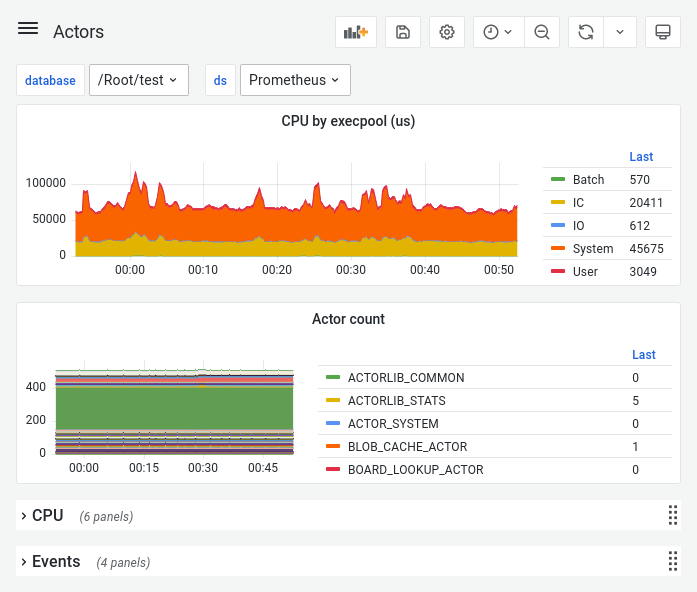

# Настройка мониторинга кластера {{ ydb-short-name }}

На этой странице рассказано, как настроить мониторинг кластера {{ ydb-short-name }}.

{{ ydb-short-name }} предоставляет множество метрик состояния системы. Мгновенные значения метрик можно посмотреть в веб-интерфейсе:

```text
http://<ydb-server-address>:<ydb-port>/counters/
```

где:

- `<ydb-server-address>` – адрес сервера {{ ydb-short-name }}.

  Для локального однонодового кластера {{ ydb-short-name }}, запущенного с помощью инструкции по [Быстрому началу работы](../../quickstart.md), используйте адрес `localhost`.

- `<ydb-port>` – порт {{ ydb-short-name }}. Значение по умолчанию: 8765.

Связанные метрики объединены в подгруппы (например `counters auth`). Чтобы посмотреть значения метрик только определенной подгруппы, перейдите по URL следующего вида:

```text
http://<ydb-server-address>:<ydb-port>/counters/counters=<servicename>/
```

- `<servicename>` — имя подгруппы метрик.

Например, данные об утилизации аппаратных ресурсов сервера доступны по следующему URL:

```text
http://<ydb-server-address>:<ydb-port>/counters/counters=utils
```

Для сбора значений метрик вы можете использовать популярный инструмент с открытым исходным кодом [Prometheus](https://prometheus.io/) или любую другую систему с поддержкой этого формата. Значения метрик {{ ydb-short-name }} в [формате Prometheus](https://prometheus.io/docs/instrumenting/exposition_formats/) доступны по URL следующего вида:

```text
http://<ydb-server-address>:<ydb-port>/counters/counters=<servicename>/prometheus
```

- `<servicename>` — имя подгруппы метрик.

Визуализировать данные можно с помощью любой системы, которая поддерживает формат Prometheus, например [Grafana](https://grafana.com/), [Zabbix](https://www.zabbix.com/ru/) или [Amazon CloudWatch](https://aws.amazon.com/ru/cloudwatch/):



## Настройка мониторинга с помощью Prometheus и Grafana {#prometheus-grafana}

Чтобы настроить мониторинг кластера {{ ydb-short-name }} с помощью [Prometheus](https://prometheus.io/) и [Grafana](https://grafana.com/):

1. [Установите](https://prometheus.io/docs/prometheus/latest/getting_started) Prometheus.

1. Отредактируйте [файлы конфигурации](https://github.com/ydb-platform/ydb/tree/main/ydb/deploy/prometheus) Prometheus:

    1. В файле [`ydbd-storage.yml`](https://github.com/ydb-platform/ydb/tree/main/ydb/deploy/prometheus/ydbd-storage.yml) в секции `targets` укажите адреса всех серверов кластера {{ ydb-short-name }} и порты узлов хранения, работающих на серверах.

        ```json
        - labels:
            container: ydb-static
          targets:
          - "ydb-s1.example.com:8765"
          - "ydb-s2.example.com:8765"
          - "ydb-s3.example.com:8765"
        ```

        Для локального однонодового кластера YDB в секции `targets` укажите один адрес:

        ```json
        - labels:
            container: ydb-static
          targets:
          - "localhost:8765"
        ```

    1. В файле [`ydbd-database.yml`](https://github.com/ydb-platform/ydb/tree/main/ydb/deploy/prometheus/ydbd-database.yml) в секции `targets` укажите адреса всех серверов кластера {{ ydb-short-name }} и порты узлов баз данных, работающих на серверах.

        ```json
        - labels:
            container: ydb-dynamic
          targets:
          - "ydb-s1.example.com:31002"
          - "ydb-s1.example.com:31012"
          - "ydb-s1.example.com:31022"
          - "ydb-s2.example.com:31002"
          - "ydb-s2.example.com:31012"
          - "ydb-s2.example.com:31022"
          - "ydb-s3.example.com:31002"
          - "ydb-s3.example.com:31012"
          - "ydb-s3.example.com:31022"
        ```

        Для локального однонодового кластера YDB, в секции `targets` укажите один адрес:

        ```json
        - labels:
            container: ydb-dynamic
          targets:
          - "localhost:8765"
        ```

    1. В файле [`prometheus_ydb.yml`](https://github.com/ydb-platform/ydb/tree/main/ydb/deploy/prometheus/prometheus_ydb.yml) при необходимости в секции `tls_config` укажите [сертификат центра регистрации](../deployment-options/manual/initial-deployment/index.md#tls-certificates) (Certification Authority, CA), которым подписаны остальные сертификаты TLS кластера {{ ydb-short-name }}:

       ```json
       scheme: https
       tls_config:
           ca_file: '<ydb-ca-file>'
       ```

1. Разместите отредактированные файлы в одной директории и [запустите](https://prometheus.io/docs/prometheus/latest/getting_started/#starting-prometheus) Prometheus, указав в опциях запуска файл конфигурации `prometheus_ydb.yml`.

1. [Установите и запустите](https://grafana.com/docs/grafana/latest/getting-started/getting-started/) Grafana.

1. [Создайте](https://prometheus.io/docs/visualization/grafana/#creating-a-prometheus-data-source) источник данных с типом `prometheus` в Grafana и подсоедините его к запущенному экземпляру Prometheus.

1. Загрузите [дашборды {{ ydb-short-name }}](https://github.com/ydb-platform/ydb/tree/main/ydb/deploy/helm/ydb-prometheus/dashboards) в Grafana.

    Вы можете загрузить дашборды с помощью инструмента [Import](https://grafana.com/docs/grafana/latest/dashboards/export-import/#import-dashboard) Grafana UI или выполнить [скрипт](https://github.com/ydb-platform/ydb/tree/main/ydb/deploy/grafana_dashboards/local_upload_dashboards.sh). Обратите внимание, что скрипт использует [базовую аутентификацию](https://grafana.com/docs/grafana/latest/http_api/create-api-tokens-for-org/#authentication) в Grafana. Для других случаев модифицируйте скрипт.

    Ознакомьтесь со [справочником по дашбордам Grafana](../../reference/observability/metrics/grafana-dashboards.md).
