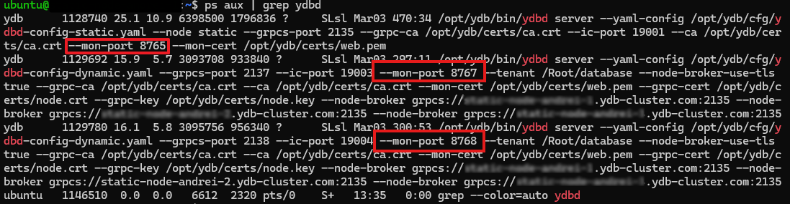
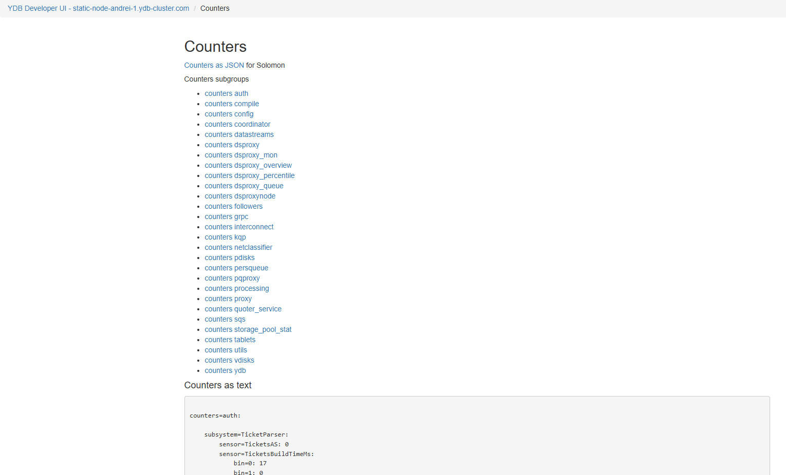
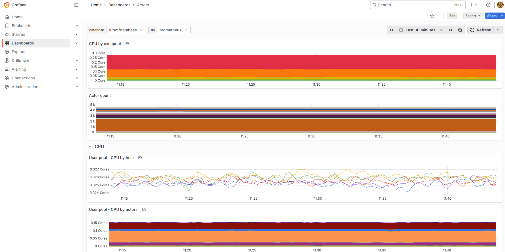

# Настройка мониторинга кластера {{ ydb-short-name }}

В этом разделе приведён обзор различных способов мониторинга состояния и производительности кластера {{ ydb-short-name }}, а также рекомендации по использованию доступных инструментов и интерфейсов для отслеживания ключевых метрик.

## Доступ к метрикам через веб-интерфейс



Перед началом работы ознакомьтесь с [описанием метрик](../../reference/observability/metrics/index.md).



{{ ydb-short-name }} предоставляет множество метрик состояния системы. Мгновенные значения метрик можно посмотреть в веб-интерфейсе:

```text
http://<ydb-server-address>:<ydb-port>/counters/
```

где:

- `<ydb-server-address>` – адрес сервера {{ ydb-short-name }};
- `<ydb-port>` – порт {{ ydb-short-name }}, указанный в параметре `--mon -port` при запуске узла. Значение по умолчанию: `8765`.



Определите значение параметра `<ydb-port>` командой:

```bash
ps aux | grep ydbd
```



Возьмите значение, указанное в параметре `--mon -port`.









Связанные метрики объединены в подгруппы (например, `counters auth`). Чтобы посмотреть значения метрик только определенной подгруппы, перейдите по URL следующего вида:

```text
http://<ydb-server-address>:<ydb-port>/counters/counters=<servicename>/
```

- `<servicename>` — имя подгруппы метрик.

Например, данные об утилизации аппаратных ресурсов сервера доступны по следующему URL:

```text
http://<ydb-server-address>:<ydb-port>/counters/counters=utils
```

Для сбора значений метрик используйте популярный инструмент с открытым исходным кодом [Prometheus](https://prometheus.io/) или любую другую систему с поддержкой этого формата. Значения метрик {{ ydb-short-name }} в [формате Prometheus](https://prometheus.io/docs/instrumenting/exposition_formats/) доступны по URL следующего вида:

```text
http://<ydb-server-address>:<ydb-port>/counters/counters=<servicename>/prometheus
```

- `<servicename>` — имя подгруппы метрик.

Визуализировать данные можно с помощью любой системы, которая поддерживает формат Prometheus, например:

- [Grafana](https://grafana.com/);
- [Zabbix](https://www.zabbix.com/ru/);
- [Amazon CloudWatch](https://aws.amazon.com/ru/cloudwatch/).

## Настройка мониторинга с помощью Prometheus и Grafana {#prometheus-grafana}

Для настройки мониторинга кластера {{ ydb-short-name }} с использованием [Prometheus](https://prometheus.io/) и [Grafana](https://grafana.com/) выполните следующие шаги.



Перед началом работы ознакомьтесь со [справочником по дашбордам Grafana](../../reference/observability/metrics/grafana-dashboards.md).



### Подготовка к установке

- [Установите](https://prometheus.io/docs/prometheus/latest/getting_started) Prometheus.

- [Установите](https://grafana.com/docs/grafana/latest/setup-grafana/) Grafana.

### Подготовьте файлы конфигурации Prometheus

Отредактируйте [файлы конфигурации](https://github.com/ydb-platform/ydb/tree/main/ydb/deploy/prometheus) Prometheus:

Файл [`ydbd-storage.yml`](https://github.com/ydb-platform/ydb/tree/main/ydb/deploy/prometheus/ydbd-storage.yml)



- Обычная установка

  В секции `targets` укажите адреса всех серверов кластера {{ ydb-short-name }} и порты узлов хранения, работающих на серверах.

    ```yaml
    - labels:
        container: ydb-static
      targets:
      - "ydb-s1.example.com:8765"
      - "ydb-s2.example.com:8765"
      - "ydb-s3.example.com:8765"
    ```

- Быстрая установка

  Для локального однонодового кластера YDB в секции `targets` укажите один адрес:

    ```yaml
    - labels:
        container: ydb-static
      targets:
      - "localhost:8765"
    ```



Файл [`ydbd-database.yml`](https://github.com/ydb-platform/ydb/tree/main/ydb/deploy/prometheus/ydbd-database.yml)

- Обычная установка

  В секции `targets` укажите адреса всех серверов кластера {{ ydb-short-name }} и порты узлов баз данных, работающих на серверах.

  

    Определите значения портов узлов баз данных командой:

    ```bash
      ps aux | grep ydbd
    ```

    

    Возьмите значение, указанное в параметре `--mon -port`.

  

    ```yaml
    - labels:
        container: ydb-dynamic
      targets:
      - "ydb-s1.example.com:31002"
      - "ydb-s1.example.com:31012"
      - "ydb-s1.example.com:31022"
      - "ydb-s2.example.com:31002"
      - "ydb-s2.example.com:31012"
      - "ydb-s2.example.com:31022"
      - "ydb-s3.example.com:31002"
      - "ydb-s3.example.com:31012"
      - "ydb-s3.example.com:31022"
    ```

- Быстрая установка

  Для локального однонодового кластера YDB, в секции `targets` укажите один адрес:

    ```yaml
    - labels:
        container: ydb-dynamic
      targets:
      - "localhost:8765"
    ```



Файл [`prometheus_ydb.yml`](https://github.com/ydb-platform/ydb/tree/main/ydb/deploy/prometheus/prometheus_ydb.yml)

При необходимости в секции `tls_config` укажите [сертификат центра регистрации](../deployment-options/manual/initial-deployment/index.md#tls-certificates) (Certification Authority, CA), которым подписаны остальные сертификаты TLS кластера {{ ydb-short-name }}:

  ```yaml
  scheme: https
  tls_config:
      ca_file: '<ydb-ca-file>'
  ```

Разместите отредактированные файлы в одной директории и [запустите](https://prometheus.io/docs/prometheus/latest/getting_started/#starting-prometheus) Prometheus, указав в опциях запуска файл конфигурации `prometheus_ydb.yml`.

### Настройка интеграции Grafana с Prometheus

#### Создание источника данных в Grafana

[Создайте](https://prometheus.io/docs/visualization/grafana/#creating-a-prometheus-data-source) источник данных с типом `Prometheus` в Grafana и подключите его к работающему экземпляру Prometheus.

#### Импорт дашбордов в Grafana

Импортируйте необходимые [дашборды {{ ydb-short-name }}](https://github.com/ydb-platform/ydb/tree/main/ydb/deploy/helm/ydb-prometheus/dashboards) в Grafana.

Для импорта дашбордов воспользуйтесь одним из следующих способов:

- Используйте функцию [Import](https://grafana.com/docs/grafana/latest/dashboards/export-import/#import-dashboard) в интерфейсе Grafana.

- Выполните [скрипт для загрузки дашбордов](https://github.com/ydb-platform/ydb/tree/main/ydb/deploy/grafana_dashboards/local_upload_dashboards.sh). Обратите внимание, что скрипт использует [базовую аутентификацию](https://grafana.com/docs/grafana/latest/http_api/create-api-tokens-for-org/#authentication) и при необходимости может быть модифицирован для других способов интеграции.

### Результат






