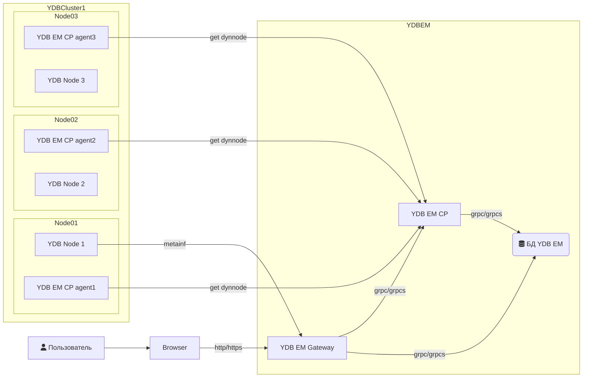

# Обзор YDB Enterprise Manager

YDB Enterprise Manager (YDB EM) — это система для управления кластерами YDB, ресурсами, базами данных и динамическими слотами на хостах.

## Компоненты

YDB EM состоит из следующих основных компонентов:

- **Gateway**: Предоставляет пользовательский интерфейс (UI) и API бэкенд для него.
- **Control Plane (CP)**: Отвечает за управление кластером YDB, управление ресурсами и настройку баз данных.
- **Agent**: Система для управления динамическими слотами на хосте.

## Архитектура

На диаграмме ниже показана высокоуровневая архитектура YDB EM и его взаимодействие с браузером и кластерами YDB.

## Использование

<!-- TODO: Добавьте здесь более подробные инструкции по использованию или обзорную информацию, если необходимо -->

Для доступа к пользовательскому интерфейсу YDB Enterprise Manager откройте следующий URL в вашем браузере:

`https://<fqdn>:8789/ui/clusters`

*Примечание*: Замените `<fqdn>` на полное доменное имя (Fully Qualified Domain Name) любого хоста из группы хостов `ydb_em` (например, `ydb-node01.ru-central1.internal`).
