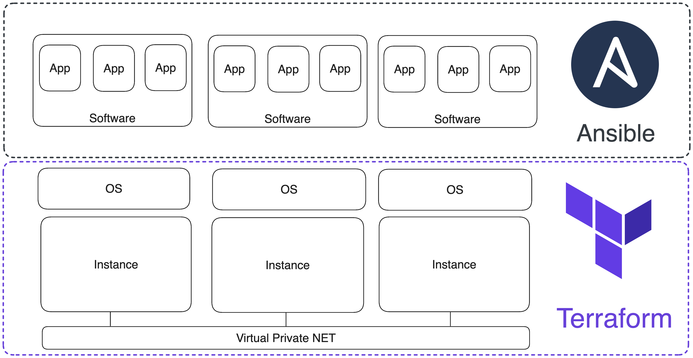

# Развертывание инфраструктуры для кластера {{ ydb-short-name }} с помощью Terraform

Развернуть кластер {{ ydb-short-name }} для production использования можно тремя рекомендованными способами: c помощью [Ansible](ansible.md), [Kubernetes](kubernetes.md) или [вручную](../deploy/index.md). Если вариант с Kubernetes практически самодостаточен, то для вариантов с Ansible и вручную нужен ssh доступ на правильно сконфигурированные серверы или виртуальные машины. 

В статье описывается как можно создать и сконфигурировать необходимый для работы кластера {{ ydb-short-name }} набор виртуальных машин в различных облачных провайдерах с помощью Terraform.

**[Terraform](https://www.terraform.io/)** – это программное обеспечение с открытым исходным кодом для управления инфраструктурой по модели "инфраструктура как код" (Infrastructure as Code). Такой же подход используется в Ansible, в системе управления конфигурациями. Terraform и Ansible работают на разных уровнях: Terraform управляет инфраструктурой, а Ansible настраивает окружения на ВМ:



Конфигурация настройки окружения ВМ описывается в YAML формате, а инфраструктурный код пишется на [HCL](https://github.com/hashicorp/hcl) (язык конфигурации Terraform). Основной логической единицей записи в HCL является "блок". Блок состоит из ключевого слова, идентифицирующего его тип, названия и фигурных скобок, обозначающих тело блока. Например, так может выглядеть блок управления виртуальным сервером в AWS: 
```hcl
resource "aws_instance" "ydb-vm" {
  count                  = var.instance_count
  ami                    = "ami-008fe2fc65df48dac"
  instance_type          = "t2.micro"
  key_name               = var.req_key_pair
  vpc_security_group_ids = [var.input_security_group_id]
  subnet_id              = element(var.input_subnet_ids, count.index % length(var.input_subnet_ids))
  
  tags = {
    Name                 = "ydb-node-${count.index +1}"
    Username             = "ubuntu"
  }

}
```

Блоки могут располагаться друг за другом в одном файле и быть независимыми, могут ссылать друг на друга и быть зависимыми, а также могут вкладываться друг в друга.

Основные типы блоков:
* `resource` – блок инициализация ресурса инфраструктуры (ВМ, сеть, подсеть, диск, DNS-зона и т.д.);
* `provider` – блок инициализация провайдера, версии API и данных для аутентификации;
* `variable` – переменная как со значением по умолчанию, так и пустая для хранения данных, введенных пользователем или переданных другими блоками;
* `output` – вывод данных в терминал и сохранение в переменной;
* `data` – переменная для запроса данных от внешних облачных ресурсов, не представленных в создаваемой инфраструктуре;
* `module` – логическая группировка ресурсов, которые можно переиспользовать несколько раз в рамках одного или разных проектов;
* `terraform` – блок настройки поведения самого Terraform, включая версию Terraform и используемых провайдеров, а также настройки бэкенда, который используется для хранения состояния Terraform.  

Блоки записываются в файлы с расширением `.tf` и логически группируются в директориях, которые в терминологии Terraform называют модулями. Модуль обычно состоит из следующих файлов: 
* `main.tf` – основной файл, в котором находится код инфраструктуры. Может быть несколько файлов, содержащих инфраструктурный код.
* `variables.tf` – локальные переменные модуля, которые принимают данные от других модулей или имеют дефолтные значения.
* `outputs.tf` – переменные, которые содержат результаты работы ресурса (IP адреса ВМ, ID сетей/подсетей и т.д).

Модули подключаются к проекту в корневом файле `main.tf` следующим образом:
```
module "vpc" {
  source                     = "./modules/vpc"
  subnets_count              = var.subnets_count
  subnets_availability_zones = var.availability_zones
}
```
В примере подключается модуль `vpc` (имя модуля назначается при подключении). Обязательный параметр – это `source` – путь к директории, где располагается модуль. `subnets_count` и `subnets_availability_zones` – это переменные внутри модуля `vpc`, которые принимают значения из переменных глобального уровня `var.subnets_count`, `var.availability_zones`.

Модули так же как и блоки располагаются друг за другом в корневом `main.tf` проекта. Основное преимущество модульного подхода организации проекта – возможность легко управлять логически связанными наборами ресурсов. Поэтому наш [репозиторий](https://github.com/ydb-platform/ydb-terraform) с готовыми Terraform сценариями организован следующим образом: 
```txt
.
├── README.md
├── README_RU.md
├── aws
│   ├── README.md
│   ├── README_RU.md
│   ├── main.tf
│   ├── modules
│   │   ├── dns
│   │   ├── eip
│   │   ├── instance
│   │   ├── key_pair
│   │   ├── security
│   │   └── vpc
│   └── variables.tf
├── azure
│   ├── README.md
│   ├── README_RU.md
│   ├── main.tf
│   ├── modules
│   │   ├── dns
│   │   ├── resource_group
│   │   ├── security
│   │   ├── vm
│   │   └── vpc
│   └── variables.tf
├── ...
```

Поддиректории содержат два `readme`, файл `variables.td` с локальными переменными модуля и основной файл `main.tf`, который подключает модули из поддиректории `modules`. Набор модулей зависит от облачного провайдера. Базовые модули, функционально одинаковые для всех провайдеров имеют одинаковые названия:
* `vpc` – модуль управления облачной сетью и подсетями.
* `dns` – модуль управления DNS-зоной и DNS-записями.
* `security` – модуль управления группами безопасности.
* `instance` – модуль управления ВМ.

Для того, чтобы воспользоваться готовыми Terraform сценариями из репозитория, нужно скачать репозиторий командой `git clone https://github.com/ydb-platform/ydb-terraform.git`, внести изменения в конфигурационный файл Terraform `~/.terraformrc`, задать актуальные значения глобальных переменных сценария и скачать CLI того облачного провайдера, где будет создана инфраструктура.

Если вы планируете использовать несколько провайдеров, можно добавить следующий код в `~/.terraformrc`, который установит пути скачивания для всех провайдеров описанных ниже:
```
provider_installation {
  network_mirror {
    url     = "https://terraform-mirror.yandexcloud.net/"
    include = ["registry.terraform.io/*/*"]
  }
  direct {
    exclude = ["registry.terraform.io/*/*"]
    exclude = ["terraform.storage.ydb.tech/*/*"]
  }

  filesystem_mirror {
    path    = "/Applications/
    }
  }
```

Если уже используются Terraform провайдеры, представленные в [официальном репозитории](https://registry.terraform.io/browse/providers), они продолжат работать. 

Далее приведены пошаговые инструкции создания инфраструктуры в [AWS](#aws-cluster), [Azure](#aws-cluster), [GCP](#gcp-cluster), [Yandex Cloud](#gcp-cluster). Предложенные Terraform сценарии развертывают однотипную инфраструктуру:

* Девять ВМ (16 CPU, 32 GB RAM, дополнительный диск на 200 GB).
* Облачная сеть, публичные и приватные подсети (по подсети на зону доступности).
* Приватная DNS-зона.
* Группы безопасности, разрешающие трафик на портах: 22, icmp, 65535, 19001, 8765, 2135.

Большинство параметров кластера регулируется (количество ВМ, объём и тип подключаемого диска, количество сетей, домен DNS-зоны и т.д.), однако обратите внимание на то, что есть рекомендуемые значения параметров кластера, которые уже определены как дефолтные значения. Их изменения в меньшую сторону может привести кластер в нерабочее состояние. 

**Рекомендуемые значения параметров кластера**:
* Количество ядер CPU. Минимальное рекомендуемое количество ядер CPU – 16 штук.
* Размер RAM. Минимальный рекомендуемый объём RAM – 32 GB.
* Объём присоединенного диска. Минимальный рекомендуемый объём присоединенного диска  – 200 GB.

## Создание инфраструктуры в AWS для развертывания {{ ydb-short-name }} кластера {#aws-cluster}

 

## Создание инфраструктуры в Azure для развертывания {{ ydb-short-name }} кластера {#azure-cluster}

 

## Создание инфраструктуры в Google Cloud Platform для развертывания {{ ydb-short-name }} кластера {#gcp-cluster}

 

## Создание инфраструктуры в Yandex Cloud для развертывания {{ ydb-short-name }} кластера {#yc-cluster}

 

С помощью Yandex Cloud провайдера можно не только создавать инфраструктуру для дальнейшего развертывания на ней {{ ydb-short-name }} кластера с помощью [Ansible](./ansible.md), но и управлять [serverless или dedicated](https://cloud.yandex.ru/ru/services/ydb) версией {{ ydb-short-name }} прямо из Terraform. О возможностях работы с {{ ydb-short-name }} в Yandex Cloud читайте в разделе [Работа с YDB через Terraform](https://cloud.yandex.ru/ru/docs/ydb/terraform/intro) документации Yandex Cloud.
