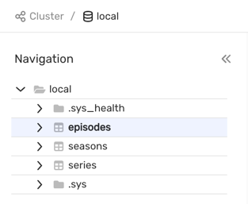
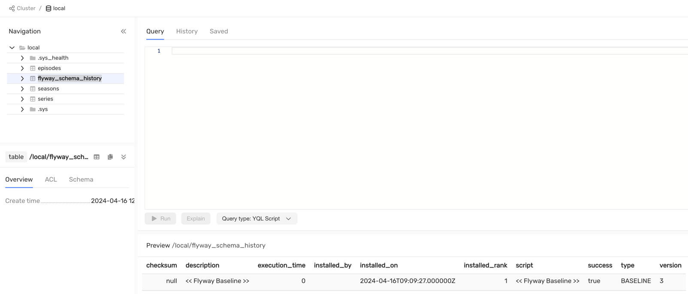
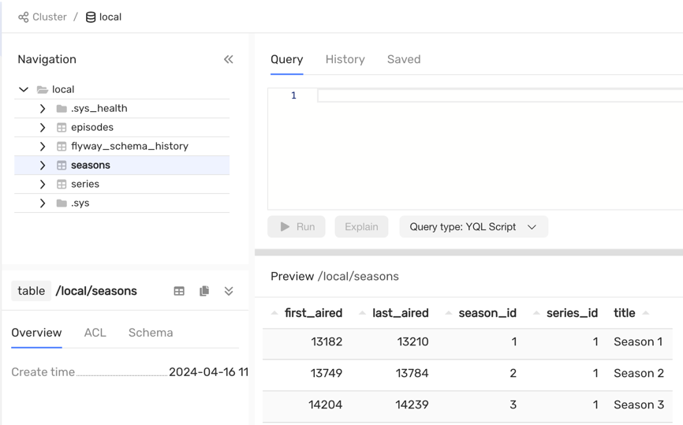

# Миграции схемы данных {{ ydb-short-name }} с помощью Flyway

## Введение {#introduction}

[Flyway](https://documentation.red-gate.com/fd/) - это инструмент для миграции баз данных с открытым исходным кодом. Она имеет расширения для различных систем управления базами данных (СУБД), включая {{ ydb-short-name }}.

## Установка {#install}

Чтобы использовать Flyway вместе с {{ ydb-short-name }} в Java / Kotlin приложении или в Gradle / Maven плагине, требуется зависимости Flyway core, расширения Flyway для {{ ydb-short-name }} и [{{ ydb-short-name }} JDBC Driver](https://github.com/ydb-platform/ydb-jdbc-driver):



- Maven

  ```xml
  <!-- Set actual versions -->
  <dependency>
      <groupId>org.flywaydb</groupId>
      <artifactId>flyway-core</artifactId>
      <version>${flyway.core.version}</version>
  </dependency>
  
  <dependency>
      <groupId>tech.ydb.jdbc</groupId>
      <artifactId>ydb-jdbc-driver</artifactId>
      <version>${ydb.jdbc.version}</version>
  </dependency>
  
  <dependency>
      <groupId>tech.ydb.dialects</groupId>
      <artifactId>flyway-ydb-dialect</artifactId>
      <version>${flyway.ydb.dialect.version}</version>
  </dependency>
  ```

- Gradle

  ```groovy
  dependencies {
      // Set actual versions
      implementation "org.flywaydb:flyway-core:$flywayCoreVersion"
      implementation "tech.ydb.dialects:flyway-ydb-dialect:$flywayYdbDialecVersion"
      implementation "tech.ydb.jdbc:ydb-jdbc-driver:$ydbJdbcVersion"
  }
  ```



Для работы с {{ ydb-short-name }} через Flyway CLI требуется установить `flyway` утилиту [любым из рекомендованных способов](https://documentation.red-gate.com/fd/command-line-184127404.html). 

Затем утилита должна быть расширена с помощью диалекта {{ ydb-short-name }} и драйвера JDBC:

```bash
# install flyway
# cd $(which flyway) // prepare this command for your environment

cd libexec
# set actual versions of .jar files

cd drivers && curl -L -o ydb-jdbc-driver-shaded-2.1.0.jar https://repo.maven.apache.org/maven2/tech/ydb/jdbc/ydb-jdbc-driver-shaded/2.1.0/ydb-jdbc-driver-shaded-2.1.0.jar

cd ..

cd lib && curl -L -o flyway-ydb-dialect.jar https://repo.maven.apache.org/maven2/tech/ydb/dialects/flyway-ydb-dialect/1.0.0-RC0/flyway-ydb-dialect-1.0.0-RC0.jar
```



[Flyway Desktop](https://documentation.red-gate.com/fd/flyway-desktop-138346953.html) в настоящее время не поддерживается.



## Управление миграциями с помощью Flyway {#flyway-main-commands}

### baseline {#flyway-baseline}

Команда [baseline](https://documentation.red-gate.com/flyway/flyway-cli-and-api/usage/command-line/command-line-baseline) инициализируют Flyway в существующей базе данных, исключающая все миграции вплоть до `baselineVersion` включительно.

Предположим, что мы имеем существующий проект с текущей схемой базы данных:



Запишем наши существующие миграции следующим образом:

```
db/migration:
  V1__create_series.sql
  V2__create_seasons.sql
  V3__create_episodes.sql
```

Содержимое `SQL` файлов:



- V1__create_series.sql

  ```sql
  CREATE TABLE series -- series is the table name.
  (                           -- Must be unique within the folder.
      series_id    Int64,
      title        Text,
      series_info  Text,
      release_date Int64,
      PRIMARY KEY (series_id) -- The primary key is a column or
      -- combination of columns that uniquely identifies
      -- each table row (contains only
      -- non-repeating values). A table can have
      -- only one primary key. For every table
      -- in {{ ydb-short-name }}, the primary key is required.
  );
  ```

- V2__create_seasons.sql

  ```sql
  CREATE TABLE seasons
  (
      series_id Uint64,
      season_id Uint64,
      title Utf8,
      first_aired Uint64,
      last_aired Uint64,
      PRIMARY KEY (series_id, season_id)
  );
  ```
  
- V3__create_episodes.sql

```sql
CREATE TABLE episodes
(
    series_id Uint64,
    season_id Uint64,
    episode_id Uint64,
    title Utf8,
    air_date Uint64,
    PRIMARY KEY (series_id, season_id, episode_id)
);
```



Установим `baselineVersion = 3`, затем выполним следующую команду:

```bash
flyway -url=jdbc:ydb:grpc://localhost:2136/local -locations=db/migration -baselineVersion=3 baseline
```



Все примеры использует докер контейнер, для которого не требуется дополнительных параметров для аутентификации. 

Как подключится к {{ ydb-short-name }} можно посмотреть в [следующем разделе](./liquibase.md#connect-to-ydb).



В результате будет создана таблица с именем `flyway_schema_history`, которая будет содержать запись `baseline`:



### migrate {#flyway-migrate}

Команда [migrate](https://documentation.red-gate.com/flyway/flyway-cli-and-api/usage/command-line/command-line-migrate) эволюционирует схему базы данных до последней версии. Если таблица истории схемы не была создана, то Flyway создаст ее автоматически.

Добавим к предыдущему примеру миграцию загрузки данных:

```
db/migration:
  V1__create_series.sql
  V2__create_seasons.sql
  V3__create_episodes.sql
  V4__load_data.sql
```



```sql
INSERT INTO series (series_id, title, release_date, series_info)
VALUES

    -- By default, numeric literals have type Int32
    -- if the value is within the range.
    -- Otherwise, they automatically expand to Int64.
    (1,
     "IT Crowd",
     CAST(Date ("2006-02-03") AS Uint64), -- CAST converts one datatype into another.
        -- You can convert a string
        -- literal into a primitive literal.
        -- The Date() function converts a string
        -- literal in ISO 8601 format into a date.

     "The IT Crowd is a British sitcom produced by Channel 4, written by Graham Linehan, produced by Ash Atalla and starring Chris O'Dowd, Richard Ayoade, Katherine Parkinson, and Matt Berry."),
    (2,
     "Silicon Valley",
     CAST(Date ("2014-04-06") AS Uint64),
     "Silicon Valley is an American comedy television series created by Mike Judge, John Altschuler and Dave Krinsky. The series focuses on five young men who founded a startup company in Silicon Valley.")
;

INSERT INTO seasons (series_id, season_id, title, first_aired, last_aired)
VALUES (1, 1, "Season 1", CAST(Date ("2006-02-03") AS Uint64), CAST(Date ("2006-03-03") AS Uint64)),
       (1, 2, "Season 2", CAST(Date ("2007-08-24") AS Uint64), CAST(Date ("2007-09-28") AS Uint64)),
       (1, 3, "Season 3", CAST(Date ("2008-11-21") AS Uint64), CAST(Date ("2008-12-26") AS Uint64)),
       (1, 4, "Season 4", CAST(Date ("2010-06-25") AS Uint64), CAST(Date ("2010-07-30") AS Uint64)),
       (2, 1, "Season 1", CAST(Date ("2014-04-06") AS Uint64), CAST(Date ("2014-06-01") AS Uint64)),
       (2, 2, "Season 2", CAST(Date ("2015-04-12") AS Uint64), CAST(Date ("2015-06-14") AS Uint64)),
       (2, 3, "Season 3", CAST(Date ("2016-04-24") AS Uint64), CAST(Date ("2016-06-26") AS Uint64)),
       (2, 4, "Season 4", CAST(Date ("2017-04-23") AS Uint64), CAST(Date ("2017-06-25") AS Uint64)),
       (2, 5, "Season 5", CAST(Date ("2018-03-25") AS Uint64), CAST(Date ("2018-05-13") AS Uint64))
;

INSERT INTO episodes (series_id, season_id, episode_id, title, air_date)
VALUES (1, 1, 1, "Yesterday's Jam", CAST(Date ("2006-02-03") AS Uint64)),
       (1, 1, 2, "Calamity Jen", CAST(Date ("2006-02-03") AS Uint64)),
       (1, 1, 3, "Fifty-Fifty", CAST(Date ("2006-02-10") AS Uint64)),
       (1, 1, 4, "The Red Door", CAST(Date ("2006-02-17") AS Uint64)),
       (1, 1, 5, "The Haunting of Bill Crouse", CAST(Date ("2006-02-24") AS Uint64)),
       (1, 1, 6, "Aunt Irma Visits", CAST(Date ("2006-03-03") AS Uint64)),
       (1, 2, 1, "The Work Outing", CAST(Date ("2006-08-24") AS Uint64)),
       (1, 2, 2, "Return of the Golden Child", CAST(Date ("2007-08-31") AS Uint64)),
       (1, 2, 3, "Moss and the German", CAST(Date ("2007-09-07") AS Uint64)),
       (1, 2, 4, "The Dinner Party", CAST(Date ("2007-09-14") AS Uint64)),
       (1, 2, 5, "Smoke and Mirrors", CAST(Date ("2007-09-21") AS Uint64)),
       (1, 2, 6, "Men Without Women", CAST(Date ("2007-09-28") AS Uint64)),
       (1, 3, 1, "From Hell", CAST(Date ("2008-11-21") AS Uint64)),
       (1, 3, 2, "Are We Not Men?", CAST(Date ("2008-11-28") AS Uint64)),
       (1, 3, 3, "Tramps Like Us", CAST(Date ("2008-12-05") AS Uint64)),
       (1, 3, 4, "The Speech", CAST(Date ("2008-12-12") AS Uint64)),
       (1, 3, 5, "Friendface", CAST(Date ("2008-12-19") AS Uint64)),
       (1, 3, 6, "Calendar Geeks", CAST(Date ("2008-12-26") AS Uint64)),
       (1, 4, 1, "Jen The Fredo", CAST(Date ("2010-06-25") AS Uint64)),
       (1, 4, 2, "The Final Countdown", CAST(Date ("2010-07-02") AS Uint64)),
       (1, 4, 3, "Something Happened", CAST(Date ("2010-07-09") AS Uint64)),
       (1, 4, 4, "Italian For Beginners", CAST(Date ("2010-07-16") AS Uint64)),
       (1, 4, 5, "Bad Boys", CAST(Date ("2010-07-23") AS Uint64)),
       (1, 4, 6, "Reynholm vs Reynholm", CAST(Date ("2010-07-30") AS Uint64)),
       (2, 1, 1, "Minimum Viable Product", CAST(Date ("2014-04-06") AS Uint64)),
       (2, 1, 2, "The Cap Table", CAST(Date ("2014-04-13") AS Uint64)),
       (2, 1, 3, "Articles of Incorporation", CAST(Date ("2014-04-20") AS Uint64)),
       (2, 1, 4, "Fiduciary Duties", CAST(Date ("2014-04-27") AS Uint64)),
       (2, 1, 5, "Signaling Risk", CAST(Date ("2014-05-04") AS Uint64)),
       (2, 1, 6, "Third Party Insourcing", CAST(Date ("2014-05-11") AS Uint64)),
       (2, 1, 7, "Proof of Concept", CAST(Date ("2014-05-18") AS Uint64)),
       (2, 1, 8, "Optimal Tip-to-Tip Efficiency", CAST(Date ("2014-06-01") AS Uint64)),
       (2, 2, 1, "Sand Hill Shuffle", CAST(Date ("2015-04-12") AS Uint64)),
       (2, 2, 2, "Runaway Devaluation", CAST(Date ("2015-04-19") AS Uint64)),
       (2, 2, 3, "Bad Money", CAST(Date ("2015-04-26") AS Uint64)),
       (2, 2, 4, "The Lady", CAST(Date ("2015-05-03") AS Uint64)),
       (2, 2, 5, "Server Space", CAST(Date ("2015-05-10") AS Uint64)),
       (2, 2, 6, "Homicide", CAST(Date ("2015-05-17") AS Uint64)),
       (2, 2, 7, "Adult Content", CAST(Date ("2015-05-24") AS Uint64)),
       (2, 2, 8, "White Hat/Black Hat", CAST(Date ("2015-05-31") AS Uint64)),
       (2, 2, 9, "Binding Arbitration", CAST(Date ("2015-06-07") AS Uint64)),
       (2, 2, 10, "Two Days of the Condor", CAST(Date ("2015-06-14") AS Uint64)),
       (2, 3, 1, "Founder Friendly", CAST(Date ("2016-04-24") AS Uint64)),
       (2, 3, 2, "Two in the Box", CAST(Date ("2016-05-01") AS Uint64)),
       (2, 3, 3, "Meinertzhagen's Haversack", CAST(Date ("2016-05-08") AS Uint64)),
       (2, 3, 4, "Maleant Data Systems Solutions", CAST(Date ("2016-05-15") AS Uint64)),
       (2, 3, 5, "The Empty Chair", CAST(Date ("2016-05-22") AS Uint64)),
       (2, 3, 6, "Bachmanity Insanity", CAST(Date ("2016-05-29") AS Uint64)),
       (2, 3, 7, "To Build a Better Beta", CAST(Date ("2016-06-05") AS Uint64)),
       (2, 3, 8, "Bachman's Earnings Over-Ride", CAST(Date ("2016-06-12") AS Uint64)),
       (2, 3, 9, "Daily Active Users", CAST(Date ("2016-06-19") AS Uint64)),
       (2, 3, 10, "The Uptick", CAST(Date ("2016-06-26") AS Uint64)),
       (2, 4, 1, "Success Failure", CAST(Date ("2017-04-23") AS Uint64)),
       (2, 4, 2, "Terms of Service", CAST(Date ("2017-04-30") AS Uint64)),
       (2, 4, 3, "Intellectual Property", CAST(Date ("2017-05-07") AS Uint64)),
       (2, 4, 4, "Teambuilding Exercise", CAST(Date ("2017-05-14") AS Uint64)),
       (2, 4, 5, "The Blood Boy", CAST(Date ("2017-05-21") AS Uint64)),
       (2, 4, 6, "Customer Service", CAST(Date ("2017-05-28") AS Uint64)),
       (2, 4, 7, "The Patent Troll", CAST(Date ("2017-06-04") AS Uint64)),
       (2, 4, 8, "The Keenan Vortex", CAST(Date ("2017-06-11") AS Uint64)),
       (2, 4, 9, "Hooli-Con", CAST(Date ("2017-06-18") AS Uint64)),
       (2, 4, 10, "Server Error", CAST(Date ("2017-06-25") AS Uint64)),
       (2, 5, 1, "Grow Fast or Die Slow", CAST(Date ("2018-03-25") AS Uint64)),
       (2, 5, 2, "Reorientation", CAST(Date ("2018-04-01") AS Uint64)),
       (2, 5, 3, "Chief Operating Officer", CAST(Date ("2018-04-08") AS Uint64)),
       (2, 5, 4, "Tech Evangelist", CAST(Date ("2018-04-15") AS Uint64)),
       (2, 5, 5, "Facial Recognition", CAST(Date ("2018-04-22") AS Uint64)),
       (2, 5, 6, "Artificial Emotional Intelligence", CAST(Date ("2018-04-29") AS Uint64)),
       (2, 5, 7, "Initial Coin Offering", CAST(Date ("2018-05-06") AS Uint64)),
       (2, 5, 8, "Fifty-One Percent", CAST(Date ("2018-05-13") AS Uint64));
```



Применим последнюю миграцию следующей командой:

```bash
flyway -url=jdbc:ydb:grpc://localhost:2136/local -locations=db/migration migrate
```

В результате будут созданы таблицы `series`, `seasons` и `episodes`, которые будут заполнены данными:



Затем мы изменяем схему, добавляя [вторичный индекс](../yql/reference/syntax/alter_table.md) в таблицу `series`:

```
db/migration:
  V1__create_series.sql
  V2__create_seasons.sql
  V3__create_episodes.sql
  V4__load_data.sql
  V5__create_series_title_index.sql
```



```sql
ALTER TABLE `series` ADD INDEX `title_index` GLOBAL ON (`title`);
```



Применим последнюю миграцию следующей командой:

```bash
flyway -url=jdbc:ydb:grpc://localhost:2136/local -locations=db/migration migrate
```

В результате будет создан вторичный индекс для таблицы `series`:


### info {#flyway-info}

Команда [info](https://documentation.red-gate.com/flyway/flyway-cli-and-api/usage/command-line/command-line-info) печатает подробные сведения и информацию о состоянии всех миграций.

Добавим еще одну миграцию, которая переименовывает раннее добавленный вторичный индекс: 

```
db/migration:
  V1__create_series.sql
  V2__create_seasons.sql
  V3__create_episodes.sql
  V4__load_data.sql
  V5__create_series_title_index.sql
  V6__rename_series_title_index.sql
```



```sql
ALTER TABLE `series` RENAME INDEX `title_index` TO `title_index_new`;
```



Результатом исполнения команды `flyway -url=jdbc:ydb:grpc://localhost:2136/local -locations=db/migration info` будет подробная информация о состоянии миграций:

```
+-----------+---------+---------------------------+----------+---------------------+--------------------+----------+
| Category  | Version | Description               | Type     | Installed On        | State              | Undoable |
+-----------+---------+---------------------------+----------+---------------------+--------------------+----------+
| Versioned | 1       | create series             | SQL      |                     | Below Baseline     | No       |
| Versioned | 2       | create seasons            | SQL      |                     | Below Baseline     | No       |
| Versioned | 3       | create episodes           | SQL      |                     | Ignored (Baseline) | No       |
|           | 3       | << Flyway Baseline >>     | BASELINE | 2024-04-16 12:09:27 | Baseline           | No       |
| Versioned | 4       | load data                 | SQL      | 2024-04-16 12:35:12 | Success            | No       |
| Versioned | 5       | create series title index | SQL      | 2024-04-16 12:59:20 | Success            | No       |
| Versioned | 6       | rename series title index | SQL      |                     | Pending            | No       |
+-----------+---------+---------------------------+----------+---------------------+--------------------+----------+
```

### validate {#flyway-validate}

Команда [validate](https://documentation.red-gate.com/flyway/flyway-cli-and-api/usage/command-line/command-line-validate) проверяет соответствие примененных миграций к миграциям, которые находятся в файловой системе пользователя.

После применения к текущим миграциям команды `flyway -url=jdbc:ydb:grpc://localhost:2136/local -locations=db/migration validate`, в логах будет написано, что последняя миграция не была применена к нашей базе данных:

```bash
ERROR: Validate failed: Migrations have failed validation
Detected resolved migration not applied to database: 6.
To fix this error, either run migrate, or set -ignoreMigrationPatterns='*:pending'.
```

Давайте исправим эту ошибку, выполнив `flyaway .. migrate` еще раз. Теперь проверка пройдет успешно, и вторичный индекс будет переименован.

Далее изменим файл уже ранее примененной миграции `V4__load_date.sql`, удалив комментарии в SQL скрипте.

После исполнения команды валидации, получим закономерную ошибку о том, что `checksum` различается в измененной миграции:

```bash
ERROR: Validate failed: Migrations have failed validation
Migration checksum mismatch for migration version 4
-> Applied to database : 591649768
-> Resolved locally    : 1923849782
```

### repair {#flyway-repair}

Команда [repair](https://documentation.red-gate.com/flyway/flyway-cli-and-api/usage/command-line/command-line-repair) пытается исправить выявленные ошибки и несоответствия в таблице истории схемы базы данных.

Устраним проблему с разными `checksum`, выполнив следующую команду:

```bash
flyway -url=jdbc:ydb:grpc://localhost:2136/local -locations=db/migration repair
```

Результатом будет обновление колонки `checksum` в таблице `flyway_schema_history` у записи, отвечающей за миграцию `V4__load_data.sql`:


После восстановления таблицы лога, валидация проходит успешно. 

Также с помощью команды `repair` можно удалить не удавшийся DDL скрипт.

### clean {#flyway-repair}

Команда [clean](https://documentation.red-gate.com/flyway/flyway-cli-and-api/usage/command-line/command-line-clean) удаляет все таблицы в схеме базы данных.



В отличие от других систем управления базами данных, {{ ydb-short-name }} не имеет такую сущность как `SCHEMA`. Таким образом, команда `clean` удалит все пользовательские таблицы в вашей базе данных.



Удалим все таблицы в нашей базе данных следующей командой:

```bash
flyway -url=jdbc:ydb:grpc://localhost:2136/local -locations=db/migration -cleanDisabled=false clean
```

Результатом будет пустая база данных:


