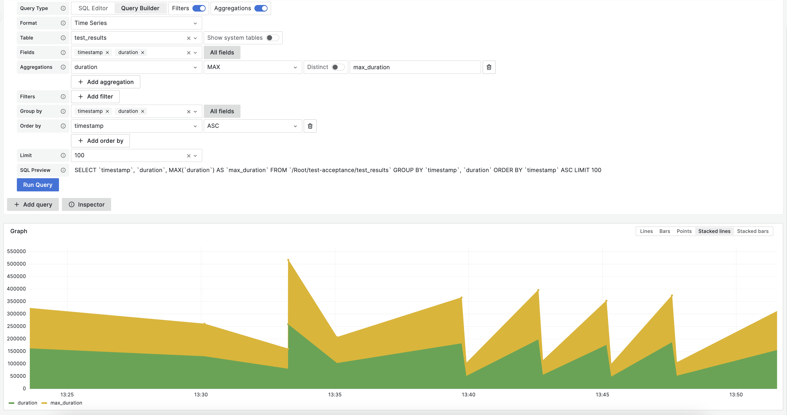
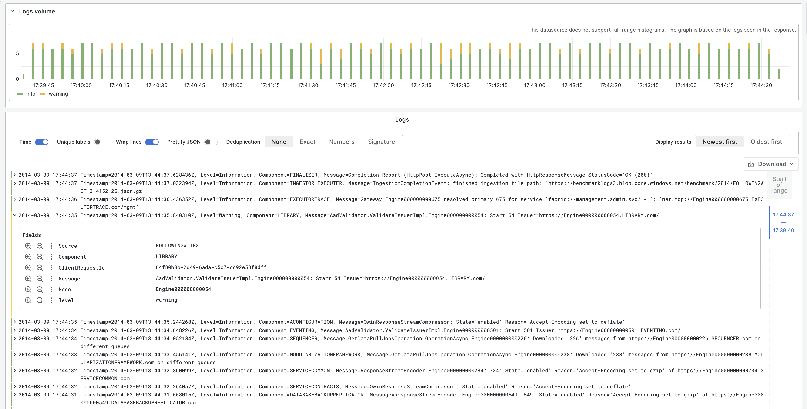

# Плагин-источник данных Grafana для интеграции с {{ ydb-short-name }}

[{{ ydb-short-name }} data source plugin](https://grafana.com/grafana/plugins/ydbtech-ydb-datasource/) позволяет использовать [Grafana](https://grafana.com) для запросов и визуализации данных из {{ ydb-short-name }}.

## Установка

Для работы плагина понадобится [Grafana](https://grafana.com/grafana/download?pg=get&plcmt=selfmanaged-box1-cta1) версии не ниже `9.2`.

Следуйте [документации Grafana](https://grafana.com/docs/grafana/latest/plugins/installation/), чтобы установить плагин под названием `ydb-grafana-datasource-plugin`.

## Конфигурация

### {{ ydb-short-name }} пользователь для источника данных

Настройте аккаунт пользователя {{ ydb-short-name }} с правами **только на чтение** [(подробнее об уровнях доступа)](../security/access-management.md) и доступом до баз данных и таблиц, к которым потребуется делать запросы.



 Обратите внимание, что Grafana не валидирует запросы с точки зрения их безопасности. Запросы могут содержать в себе любые SQL выражения, включая модифицирующие данные инструкции.



### Протокол передачи данных

Плагин поддерживает транспортные протоколы [gRPC и gRPCS](https://grpc.io/).


### Настройка через UI

После установки плагина следуйте [этим инструкциям](https://grafana.com/docs/grafana/latest/datasources/add-a-data-source/), чтобы добавить новый источник данных {{ ydb-short-name }}, а затем укажите настройки для соединения с кластером.

## Настройка через файл конфигурации

Источник данных можно настроить с помощью файла конфигурации. Как это сделать описано в [документации  Grafana](https://grafana.com/docs/grafana/latest/administration/provisioning/#data-sources).

### Аутентификация

Плагин поддерживает следующие [типы аутентификации](../reference/ydb-sdk/auth.md) в {{ ydb-short-name }}: Anonymous, Access Token, Metadata, Service Account Key и Static Credentials.

Пример настройки источника данных {{ ydb-short-name }} с использованием аутентификации в через логин/пароль:

```yaml
apiVersion: 1
datasources:
  - name: YDB
    type: ydbtech-ydb-datasource
    jsonData:
      authKind: '<password>'
      endpoint: 'grpcs://<hostname>:2135'
      dbLocation: '<location_to_db>'
      user: '<username>'
    secureJsonData:
      password: '<userpassword>'
      certificate: |
        <full content of *.pem file>
```

Поддерживаемые поля для создания соединения:

| Имя  | Описание         |         Тип          |
| :---- | :------------------ | :-------------------: |
| authKind | Тип аутентификации |        `"Anonymous"`, `"ServiceAccountKey"`, `"AccessToken"`, `"UserPassword"`, `"MetaData"`        |
| endpoint | Эндпоинт  | `string` |
| dbLocation | Путь к базе  | `string` |
| user | Имя пользователя  | `string` |
| serviceAccAuthAccessKey | Ключ доступа для сервисного аккаунта  | `string` (защищенное поле) |
| accessToken | Access токен  | `string` (защищенное поле) |
| password | Пароль  | `string` (защищенное поле) |
| certificate | Если на вашем кластере {{ ydb-short-name }} используются самоподписанные сертификаты TLS, то для соединения с {{ ydb-short-name }} необходимо указать сертификат [сертификационного центра](https://en.wikipedia.org/wiki/Certificate_authority), через который они были выпущены | `string` (защищенное поле) |

## Написание запросов

Для запроса данных из баз {{ ydb-short-name }} используется [YQL](../yql/reference/index.md).

Редактор запросов позволяет получать данные в следующих представлениях: временные ряды, таблицы и логи.

### Временные ряды

Визуализировать данные как временные ряды возможно при условии наличия в результатах запроса одного поля с типами `Date`, `Datetime` или `Timestamp` (на текущий момент поддержана работа со временем только во временной зоне UTC) и как минимум одного поля с типом `Int64`, `Int32`, `Int16`, `Int8`, `Uint64`, `Uint32`, `Uint16`, `Uint8`, `Double` или `Float`. Визуализацию в виде временных рядов можно выбрать с помощью настроек. Все остальные колонки интерпретируются как значения.



#### Многострочные временные ряды

Чтобы создать многострочный временной ряд, результаты запроса должны содержать в себе как минимум три поля:
* поле с типом данных `Date`, `Datetime` или `Timestamp` (на текущий момент поддержана работа со временем только во временной зоне UTC)
* метрика - поле с типом `Int64`, `Int32`, `Int16`, `Int8`, `Uint64`, `Uint32`, `Uint16`, `Uint8`, `Double` или `Float`
* либо метрика, либо поле с типом `String` или `Utf8` - значение для разбиения метрик по отдельным рядам.

Например:

```sql
SELECT
    `timestamp`,
    `responseStatus`
    AVG(`requestTime`) AS `avgReqTime`
FROM `/database/endpoint/my-logs`
GROUP BY `responseStatus`, `timestamp`
ORDER BY `timestamp`
```

### Таблицы { #tables }

Табличное представление доступно для любого валидного {{ ydb-short-name }} запроса, возвращающего ровно один набор результатов.


### Визуализация логов

Для визуализации данных в виде логов запрос должен возвращать поле с типом данных `Date`, `Datetime` или `Timestamp` и прое с типом `String`. Выбрать тип визуализации можно с помощью настроек. По умолчанию только первое встреченное текстовое поле трактуется как строка лога, но это поведение может быть изменено с помощью конструктора запросов.



### Макросы

Чтобы упростить синтаксис и получить возможность динамически изменять параметры (например, значение временного диапазона), запрос может содержать в себе макросы.

В запросе могут содержаться два вида макросов - [уровня Grafana](#macros) и уровня YQL. Перед отправкой запроса в {{ ydb-short-name }}, плагин проанализирует текст запроса и заменит макросы уровня Grafana на конкретные значения. После этого макросы уровня YQL будут обработаны на сервере {{ ydb-short-name }}.

Пример запроса с макросом, который позволяет использовать временной фильтр Grafana.

```sql
SELECT `timeCol`
FROM `/database/endpoint/my-logs`
WHERE $__timeFilter(`timeCol`)
```

```sql
SELECT `timeCol`
FROM `/database/endpoint/my-logs`
WHERE $__timeFilter(`timeCol` + Interval("PT24H"))
```

| Макрос | Описание | Пример вывода |
| ------ | ---------| -------------|
| `$__timeFilter(columnName)`  | Заменяется условием, которое фильтрует данные в указанной колонке или результате выражения на основании временного диапазона, заданного на панели в микросекундах  | `foo >= CAST(1636717526371000 AS Timestamp) AND foo <=  CAST(1668253526371000 AS Timestamp)' )` |
| `$__fromTimestamp` | Заменяется временем начала диапазона, заданного на панели в формате Timestamp | `CAST(1636717526371000 AS Timestamp)` |
| `$__toTimestamp` | Заменяется временем окончания диапазона, заданного на панели в формате Timestamp | `CAST(1636717526371000 AS Timestamp)` |
| `$__varFallback(condition, $templateVar)` | Заменяется первым параметром в том случае, если второй параметр не определен. | `$__varFallback('foo', $bar)` `foo` если переменная `bar` не определена, или значение переменной `$bar`  |

### Шаблоны и переменные

Чтобы добавить новую переменную для {{ ydb-short-name }} запроса, следуйте
[инструкции](https://grafana.com/docs/grafana/latest/variables/variable-types/add-query-variable/).
После создания переменная может быть использована в запросе к {{ ydb-short-name }} с помощью [специального синтаксиса](https://grafana.com/docs/grafana/latest/variables/syntax/).
Для более подробной информации о переменных, см. [документацию Grafana](https://grafana.com/docs/grafana/latest/variables/).

## Дополнительная информация

* Добавить [Аннотации](https://grafana.com/docs/grafana/latest/dashboards/annotations/).
* Настроить и использовать [Шаблоны и переменные](https://grafana.com/docs/grafana/latest/variables/).
* Добавить [Трансформации](https://grafana.com/docs/grafana/latest/panels/transformations/).
* Настроить [Уведомления](https://grafana.com/docs/grafana/latest/alerting/).
