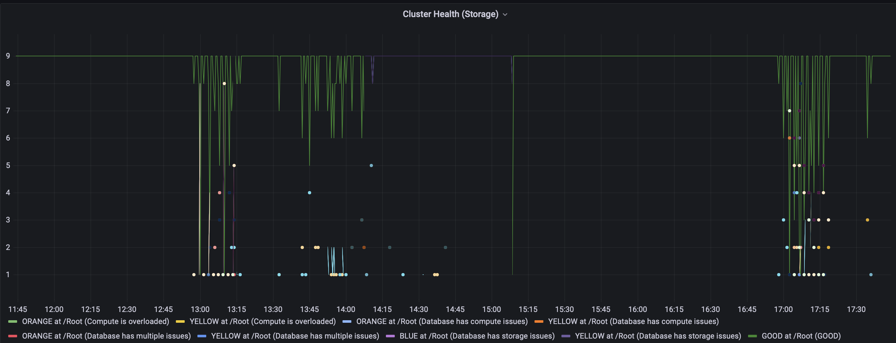

# Мониторинг подсистем кластера {{ ydb-short-name }} (HealthCheck)

Инструкция по построению системы мониторинга {{ydb-short-name}} с использованием **[HealthCheck API](../reference/ydb-sdk/health-check-api.md)** на базе следующих компонент:

* [Prometheus - Monitoring system & time series database](https://prometheus.io/) - система сбора метрик.
* [Alertmanager | Prometheus](https://prometheus.io/docs/alerting/latest/alertmanager/) - система оповещений на основе Prometheus.
* [Grafana: The open observability platform](https://grafana.com/) - система визуализации результатов.

## Описание API для Prometheus со стороны {{ydb-short-name}}

Для получения информации `HealthCheck` в формате Prometheus, в {{ydb-short-name}} используется следующий endpoint сервиса мониторинга:

```text
http://[server_name]:[mon_port]/healthcheck/?format=prometheus
```

где `server_name` - имя балансировщика нагрузки над хостами кластера или имя любого хоста кластера, на котором запущен процесс `ydbd` сервер, а `mon_port` - порт мониторинга `ydbd` сервера.

Пример ответа {{ydb-short-name}} healthcheck API:

```text
# TYPE ydb_healthcheck gauge
ydb_healthcheck{DOMAIN="test_cluster", DATABASE="/test_cluster/db1", MESSAGE="Database has storage issues", STATUS="YELLOW", TYPE="DATABASE", } 1
ydb_healthcheck{DOMAIN="test_cluster", DATABASE="/test_cluster/db1", MESSAGE="Group degraded", STATUS="YELLOW", TYPE="STORAGE_GROUP", } 2
ydb_healthcheck{DOMAIN="test_cluster", DATABASE="/test_cluster/db1", MESSAGE="Storage degraded", STATUS="YELLOW", TYPE="STORAGE", } 1
ydb_healthcheck{DOMAIN="test_cluster", DATABASE="/test_cluster/db1", MESSAGE="VDisk state is LocalRecoveryError", STATUS="RED", TYPE="VDISK", } 2
ydb_healthcheck{DOMAIN="test_cluster",DATABASE="/test_cluster", MESSAGE="PDisk state is DeviceIoError", STATUS="RED", TYPE="PDISK", } 1
ydb_healthcheck{DOMAIN="test_cluster", DATABASE="/test_cluster/db1", MESSAGE="Pool degraded", STATUS="YELLOW", TYPE="STORAGE_POOL", } 1
```

Описание лейблов сенсора healthcheck API в формате Prometheus:

* `ydb_healthcheck` - имя сенсора Prometheus.
* `DOMAIN` – [имя корневого домена](../deploy/configuration/config#domains-config) {{ydb-short-name}}.
* `DATABASE` - имя базы {{ydb-short-name}}, в которой возникла проблема.
* `MESSAGE` - текстовое сообщение о возникшей [проблеме](../reference/ydb-sdk/health-check-api.md#problems).
* `STATUS` - уровень критичности проблемы:
  * `BLUE` - информационное сообщение, вмешательство оператора не требуется (например: диск находится в состоянии репликации).
  * `YELLOW` - есть некритичные проблемы, оператору нужно обратить внимание.
  * `ORANGE` - есть проблемы, требуется вмешательство оператора.
  * `RED` - произошла потеря доступности компоненты системы, требуется срочное вмешательство оператора.
* `TYPE` - тип подсистемы, в которой возникла проблема:
  * `DATABASE` - общая проблема с базой.
  * `COMPUTE` - проблема в вычислительной части.
  * `SYSTEM_TABLET` - проблема с системными таблетками.
  * `TABLET` - проблема с пользовательскими таблетками.
  * `COMPUTE_NODE` - проблема в вычислительной части конкретной ноды {{ydb-short-name}}.
  * `COMPUTE_POOL` - перегрузка в вычислительном пуле ноды.
  * `LOAD_AVERAGE` - перегрузка на хосте.
  * `STORAGE` - общая проблема подсистемны хранения данных.
  * `STORAGE_POOL` - проблема в пуле хранения данных конкретной базы.
  * `STORAGE_GROUP` - проблема с конкретной группой хранения данных.
  * `VDISK` - проблема с виртуальным диском на конкретном физическом диске хоста.
  * `PDISK` - проблема с физическим диском на хосте.
  * `STORAGE_NODE` - проблема с конкретной нодой стораджа.
  * `NODES_SYNC` - расхождение времени между нодами (критично для распределенных транзакций).
* счётчик в конце строки сообщения означает количество проблемных событий данного `TYPE`.

Если проблема возникла на уровне кластера – в `DATABASE` будет указано название кластера, например, `/test_cluster`. Если же проблема возникла в конкретной базы – в `DATABASE` будет указан путь до этой базы: `/test_cluster/db1`.

## Конфигурация Prometheus для сбора метрик из {{ydb-short-name}} HealthCheck API



* Kubernetes(K8S)

  Для мониторинга инсталляции [{{ ydb-short-name }} в Kubernetes] рекомендуется использовать [ydb-operator](../getting_started/kubernetes.md). С его помощью можно сгенерировать все необходимые объекты PrometheusRules для мониторинга состояния {{ ydb-short-name }}. Примеры конфигурации описаны [здесь](https://github.com/ydb-platform/ydb-kubernetes-operator/tree/master/samples)

* BareMetal

  Для сбора метрик {{ ydb-short-name }} (HealthCheck API) можно использовать следующую конфигурацию Prometheus (секция [scrape_configs](https://prometheus.io/docs/prometheus/latest/configuration/configuration/#scrape_config)):

  ```yaml
  scrape_configs:
  - job_name: ydb/static/test_cluster-storage/counter/healthcheck
    metrics_path: /healthcheck
    params:
      format:
      - prometheus
    relabel_configs:
    - regex: ([^:]+)(:[0-9]+)?
      replacement: ${1}
      source_labels:
      - __address__
      target_label: instance
    static_configs:
    - labels:
        container: ydb-dynamic
        counter: healthcheck
      targets:
      - [server_name]:[mon_port]
  ```



## Конфигурация Grafana для визуализации метрик на основе данных Prometheus

  Для визуализации значения метрик можно использовать следующее выражение:

  ```python
  count(ydb_healthcheck{counter="healthcheck"}) by (MESSAGE, STATUS, DATABASE)
  ```

  Пример графика:

  

  По данному графику видно число нод:

* находящихся в состоянии GOOD (полностью работоспособных).
* число нод в различных других состояниях (когда в различных компонентах кластера существуют неисправности).

Пример дашборда **Grafana {{ ydb-short-name }} HealthCheck**:

  

## Конфигурация Prometheus Alertmanager для заведения алертов на события

  Следующие alerting rules можно использовать для реакции на состояние кластера YDB:

```yaml
  - alert: YDBHealthCheckAlertCritical
    annotations:
      description: YDB has critical issue with message {{ $labels.MESSAGE }}
      summary: YDB or one of it's subsystem has critical issues.
    expr: sum(ydb_healthcheck{DOMAIN="test_cluster", DATABASE="/test_cluster/db1", STATUS="RED"}) by (MESSAGE) > 0
    for: 1m
    labels:
      cluster: ydb-oss
      database: /Root/testdb
      severity: critical

  - alert: YDBHealthCheckAlertWarning
    annotations:
      description: YDB has issue with status {{ $labels.STATUS }} with message {{ $labels.MESSAGE }}
      summary: YDB or one of it's subsystem has issues.
    expr: sum(ydb_healthcheck{DOMAIN="test_cluster", DATABASE="/test_cluster/db1", STATUS=~"YELLOW|ORANGE"}) by (STATUS, MESSAGE) > 0
    for: 5m
    labels:
      cluster: ydb-oss
      database: /Root/testdb
      severity: warning
```

  Здесь определено два алерта:

* Один с severity warning. В этом случае в системе есть некритичные неисправности, не оказывающие существенное влияние на работу кластера.

* Второй с severity critical. В этом случае требуется немедленное ручное вмешательство.
