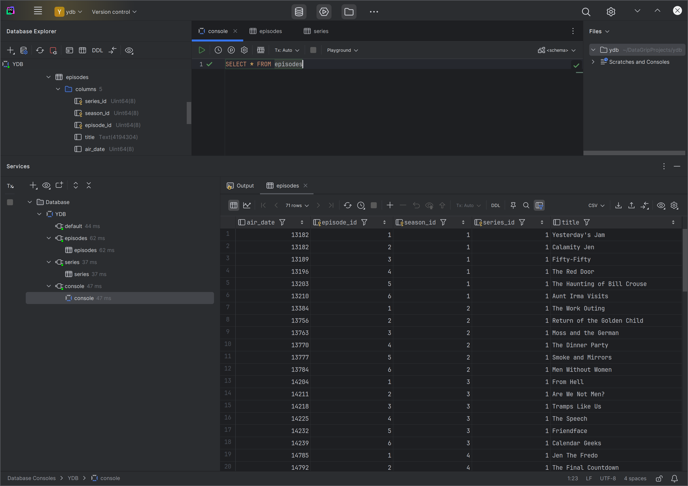

# Подключение к {{ ydb-short-name }} с помощью DataGrip

[DataGrip](https://www.jetbrains.com/datagrip/) — это эффективный кросс-платформенный инструмент для работы с реляционными базами данных и NoSQL.

DataGrip позволяет работать с {{ ydb-short-name }} по протоколу Java Database Connectivity ([JDBC](https://ru.wikipedia.org/wiki/Java_Database_Connectivity)). Данная статья демонстрирует, как настроить такую интеграцию.

### Подключение JDBC-драйвера {{ ydb-name }} к DataGrip {#datagrip_ydb}

Для подключения к {{ ydb-name }} из DataGrip понадобится JDBC-драйвер. Для загрузки JDBC-драйвера выполните следующие шаги:
1. Перейдите в [репозиторий ydb-jdbc-driver](https://github.com/ydb-platform/ydb-jdbc-driver/releases).
1. Выберите последний релиз (отмечен тегом `Latest`) и сохраните файл `ydb-jdbc-driver-shaded-<driver-version>.jar`.

Для подключения загруженного JDBC-драйвера выполните следующие шаги:

1. Выберите в верхнем меню DataGrip пункт **File**, а затем подпункт **Data Sources…**.

   Откроется диалоговое окно **Data Sources and Drivers**.

1. Чтобы создать новый драйвер, в открывшемся окне **Data Sources and Drivers** перейдите на вкладку **Drivers** и нажмите кнопку **+**.

1. В поле **Name**, укажите `YDB`.

1. В разделе **Driver Files**, нажмите кнопку **+**, в выпадающем списке выберите **Custom JARs…**, укажите путь к скачанному ранее JDBC-драйверу {{ ydb-short-name }} (файлу `ydb-jdbc-driver-shaded-<driver-version>.jar`) и нажмите кнопку **OK**.

1. В выпадающем списке **Class** выберите `tech.ydb.jdbc.YdbDriver`.

   

1. Нажмите кнопку **OK**.

### Создание подключения к {{ ydb-name }} {#datagrip_ydb_connection}

Для создания подключения необходимо выполнить следующие шаги:

1. Выберите в верхнем меню DataGrip пункт **File**, а затем подпункт **Data Sources…**.

   Откроется диалоговое окно **Data Sources and Drivers**.

1. Чтобы создать новое соединение, в открывшемся окне **Data Sources and Drivers** на вкладке **Data Sources** нажмите кнопку **+** и укажите тип соединения `YDB`.

1. В выпадающем списке **Authentication** укажите тип аутентификации.

1. Если вы выбрали `User & Password` в качестве метода аутентификации, в поля **User** и **Password** введите логин и пароль для подключения к базе данных {{ ydb-name }}.

1. В поле **URL**, укажите следующую строку соединения:

    ```
    jdbc:ydb:<ydb_endpoint>/<ydb_database>?useQueryService=true
    ```

    Где:
    - `ydb_endpoint` — [эндпойнт](../../concepts/connect.md#endpoint) кластера {{ydb-name}}, к которому будут выполняться подключение.
    - `ydb_database` — путь к [базе данных](../../concepts/glossary.md#database) в кластере {{ydb-name}}, к которой будут выполняться запросы.

1. Нажмите кнопку **Test Connection** для проверки настроек.

    Если все настройки указаны верно, то появится сообщение об успешном тестировании соединения.

    

1. Нажмите кнопку **OK** для сохранения соединения.

### Работа с {{ ydb-name }} {#dbeaver_ydb_connection}

С помощью DataGrip можно просматривать список и структуру таблиц:


А также выполнять запросы к данным:


