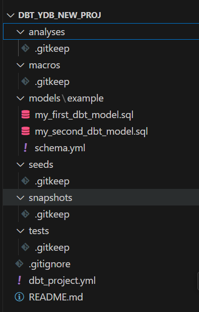

# Интеграция {{ dbt }} с {{ ydb }}

## Введение

[{{ dbt }}](https://www.getdbt.com) (data build tool) - инструмент для трансформации данных в аналитических хранилищах, предназначенный для организации процессов разработки моделей данных по аналогии с разработкой программного обеспечения. Он охватывает этап трансформации (T) в ETL-пайплайнах и позволяет структурировать логику преобразований  -  от сырых данных до витрин  -  с поддержкой тестирования, документирования и [data lineage](https://en.wikipedia.org/wiki/Data_lineage) - сквозной прослеживаемости данных от источника до конечной модели.

Модели в {{ dbt }} определяются единообразно - как `SELECT`-выражения, что упрощает их сопровождение и композицию. Инструмент обеспечивает их материализацию в хранилище данных, а также отслеживает зависимости между моделями, в том числе в процессе эволюции одних и тех же данных через стадии преобразований.

Для интеграции {{ dbt }} с {{ ydb }} используется коннектор [{{ dbt-ydb }}](https://github.com/ydb-platform/dbt-ydb). Он обеспечивает подключение к {{ ydb }} в качестве целевой платформы и поддерживает материализацию моделей в виде таблиц и представлений, работу с инкрементальными данными, загрузку тестовых датасетов (seeds), а также выполнение тестов и генерацию документации.

В этом разделе описаны возможности коннектора, а также шаги по его первоначальной настройке и запуску.



Коннектор {{ dbt-ydb }} находится в стадии Preview и, в настоящий момент, не обеспечивает поддержку всех возможностей {{ dbt }}. Ниже приводится список возможностей и ограничений.



## Возможности

### Модели и их материализация

Ключевое понятие {{ dbt }} — [модель данных](https://docs.getdbt.com/docs/build/sql-models). По своей сути, это SQL‑выражение, в котором могут быть использованы все источники данных внутри вашего хранилища, включая другие модели. Существуют разные подходы к физическому созданию модели (ее материализации) внутри {{ ydb }}, которые поддерживает коннектор {{ dbt-ydb }}:

1. Представление (view) — сохраняется как [представление {{ ydb }}](../../concepts/datamodel/view.md)представление {{ ydb }}.
2. Таблица (table) — сохраняется как [таблица](../../concepts/datamodel/table.md) внутри {{ ydb }} и пересоздаётся при каждом обновлении модели силами {{ dbt }}.

   {{ dbt-ydb }} коннектор поддерживает возможность определять следующие параметры таблицы через [конфигурацию модели](https://docs.getdbt.com/reference/model-configs):


   | Параметр                            | Обязательность | Значение по умолчанию     | Описание                                                            |
   |-------------------------------------|----------------|---------------------------|---------------------------------------------------------------------|
   | primary_key                         | Да             |                           | [Первичный ключ](../../dev/primary-key/index.md) таблицы |
   | store_type                          | Нет            | row                       | Тип таблицы. 'row' - для [строковой таблицы](../../concepts/datamodel/table.md#row-oriented-tables) и 'column' для [колоночной таблицы](../../concepts/datamodel/table.md#column-oriented-tables)      |
   | auto_partitioning_by_size           | Нет            |                           | [Автоматическое партиционирование по размеру](../../concepts/datamodel/table.md#auto_partitioning_by_size)      |
   | auto_partitioning_partition_size_mb | Нет            |                           | [Порог размера партиции](../../concepts/datamodel/table.md#auto_partitioning_partition_size_mb)      |
   | ttl                                 | Нет            |                           | Правило [Time-To-Live](../../concepts/ttl.md)       |

   Пример модели, материализуемой как таблица на основе другой модели (связаны через [ref](https://docs.getdbt.com/reference/dbt-jinja-functions/ref)).
   Заданы первичный ключ, TTL и автоматическое партиционирование по размеру.

   ```text
   {{ config(
      primary_key='id, created_at',
      store_type='row',
      auto_partitioning_by_size='ENABLED',
      auto_partitioning_partition_size_mb=256,
      ttl='Interval("P30D") on created_at'
   ) }}

   select
      id,
      name,
      created_at
   from {{ ref('source_table') }}
   ```

3. [Инкрементальное представление](https://docs.getdbt.com/docs/build/incremental-models-overview) (incremental model) — создаётся как таблица внутри {{ ydb }}, но при обновлении не пересоздаётся, а обновляется изменившимися и новыми строками.

   {{ dbt-ydb }} коннектор поддерживает те же параметры, что определены для табличной материализации, а также уникальные параметры инкрементального представления:

   | Параметр                            | Обязательность | Значение по умолчанию     | Описание                                                            |
   |-------------------------------------|----------------|---------------------------|---------------------------------------------------------------------|
   | incremental_strategy                | Нет            | MERGE                     | [Стратегия инкрементальной материлазации](https://docs.getdbt.com/docs/build/incremental-strategy). Поддерживается стратегия MERGE, использующая {{ ydb }} операцию [UPSERT](../../yql/reference/syntax//upsert_into.md). Поддержка стратегии APPEND находится в разработке  |




Еще один тип материализации, [эфемерное представление](https://docs.getdbt.com/docs/build/materializations#ephemeral), в данный момент не поддерживается коннектором.



### Снепшоты

Механизм [снепшотов](https://docs.getdbt.com/docs/build/snapshots) в данный момент не поддерживается {{ dbt-ydb }}.

### Тестовые/справочные данные, создаваемые из файлов CSV (сиды)

{{ dbt-ydb }} коннектор поддерживает возможность {{ dbt }} определять [сиды](https://docs.getdbt.com/docs/build/seeds) для загрузки справочных и тестовых данных из CSV‑файлов в ваш проект и их использование в других моделях.

### Тестирование данных

{{ dbt-ydb }} поддерживает стандартные [тесты данных dbt](https://docs.getdbt.com/docs/build/data-tests#generic-data-tests), а также [специфичные тесты](https://docs.getdbt.com/docs/build/data-tests#singular-data-tests) в рамках возможностей [YQL](../../yql/reference/index.md).

### Генерация документации

{{ dbt-ydb }} поддерживает создание [документации](https://docs.getdbt.com/docs/build/documentation) из проектов {{ dbt }} для {{ ydb }}.

## Подготовка к использованию

### Зависимости

Для начала работы с {{ dbt }} на {{ ydb }} вам понадобятся:

- Python 3.10+;
- dbt Core (1.8+);
- Существующий кластер {{ ydb-short-name }}, однонодовая инсталляция из [быстрого старта](../../quickstart.md) будет достаточной.



Внимание! dbt Fusion (2.0) в данный момент не поддерживается.



### Установка

Для установки {{ dbt-ydb }} выполните

```bash
pip install dbt-ydb
```

### Подключение {{ dbt }} к {{ ydb }} кластеру

{{ dbt }} подключается к {{ ydb }} через {{ dbt-ydb }} коннектор [стандартным](../../concepts/connect.md) для {{ ydb }} образом. Для успешного подключения требуется указать эндпоинт, путь к базе данных, а также параметры аутентификации в файле [профилей](https://docs.getdbt.com/docs/core/connect-data-platform/connection-profiles) dbt.

Пример файла профилей с возможными вариантами аутентификации, а также значениями по умолчанию (в квадратных скобках)

```yml
profile_name:
target: dev
outputs:
   dev:
      type: ydb
      host: [localhost] # YDB host
      port: [2136] # YDB port
      database: [/local] # YDB database
      schema: [<empty string>] # Optional subfolder for DBT models
      secure: [False] # If enabled, grpcs protocol will be used
      root_certificates_path: [<empty string>] # Optional path to root certificates file

      # Static Credentials
      username: [<empty string>]
      password: [<empty string>]

      # Access Token Credentials
      token: [<empty string>]

      # Service Account Credentials
      service_account_credentials_file: [<empty string>]
```

## Создание проекта "c нуля" через команду {{ dbt }} init

1. Инициализация проекта

   ```bash
   dbt init
   ```

2. Cледуйте интерактивным подсказкам dbt для выбора коннектора {{ dbt-ydb }} и настроек аутентификации, подходящих для вашего кластера {{ ydb }}

3. В результате директория с вашим проектом, а также файл [профилей](https://docs.getdbt.com/docs/core/connect-data-platform/connection-profiles) {{ dbt }} в домашней директории пользователя будет создан или обновлен новым соединением к {{ ydb }}

   ```bash
   ~/.dbt/profiles.yml
   ```

4. Запустите команду {{ dbt }} debug для проверки соединения

   ```bash
   dbt debug
   ```

5. Внутри директории вашего проекта, вы увидите следующую структуру

   

6. Адаптация модели my_first_dbt_model

   В данный момент {{ dbt }} не поддерживает возможности модификации автоматически генерируемого примера индивидуально под коннектор, поэтому, для запуска данной модели через {{ dbt-ydb }} требуется ее обновить следующим образом:

   ```text
   /*
      Welcome to your first dbt model!
      Did you know that you can also configure models directly within SQL files?
      This will override configurations stated in dbt_project.yml

      Try changing "table" to "view" below
   */

   {{ config(materialized='table', primary_key='id') }}

   select *
   from (
      select 1 as id
      union all
      select null as id
   )
   ```

7. Теперь вы можете запустить ваш проект

   ```bash
   dbt run
   ```

## Запуск тестового примера

Вместе с коннектором {{ dbt-ydb }} поставляется [пример](https://github.com/ydb-platform/dbt-ydb/tree/main/examples/jaffle_shop), который можно использовать для быстрой проверки возможностей {{ dbt }} для {{ ydb }}

1. Клонирование репозитория

   ```bash
   git clone https://github.com/ydb-platform/dbt-ydb.git
   cd dbt-ydb/examples/jaffle_shop
   ```

2. Настройка файла профиля подключения к вашей {{ ydb }} в файле `profiles.yml`. Для однонодовой инсталляции из [быстрого старта](../../quickstart.md) файл будет выглядеть следующим образом

   ```yaml
   profile_name:
      target: dev
      outputs:
     dev:
        type: ydb
        host: localhost # Хост YDB
        port: 2136 # Порт YDB
        database: /local # База данных YDB
        schema: jaffle_shop
   ```

3. Проверьте подключение

   ```bash
   dbt debug
   ```

4. Подготовьте тестовые данные через seeds

   Эта команда загрузит CSV-файлы из директории `data/` в таблицы `raw_*` {{ ydb-short-name }}.

   ```bash
   dbt seed
   ```

5. Запустите выполнение моделей

   Будут созданы таблицы и представления на основе примеров моделей проекта.

   ```bash
   dbt run
   ```

6. Протестируйте данные в моделях

   Данная команда выполнит стандартные проверки данных, описанные в тестовом примере — проверки на `null`, на допустимые значения списка и другие.

   ```bash
   dbt test
   ```

7. Сгенерируйте документацию и запустите локальный веб-сервер для её просмотра

   Документация по проекту будет доступна в браузере: [http://localhost:8080](http://localhost:8080).

   ```bash
   dbt docs generate
   dbt docs serve --port 8080
   ```

## Дальнейшие шаги

Официальную документацию {{ dbt }} можно найти по [ссылке](https://docs.getdbt.com/docs).
Дополнительно вы можете изучить исходный код коннектора, а также поучаствовать в его развитии в публичном репозитории [{{ dbt-ydb }}](https://github.com/ydb-platform/dbt-ydb) на GitHub.
