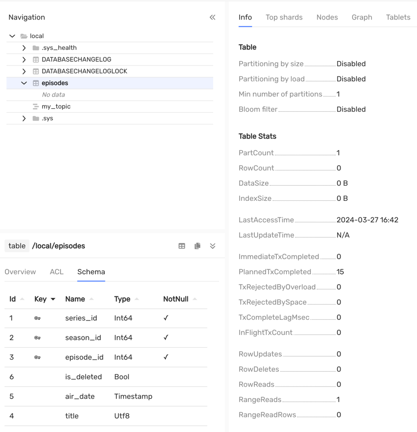
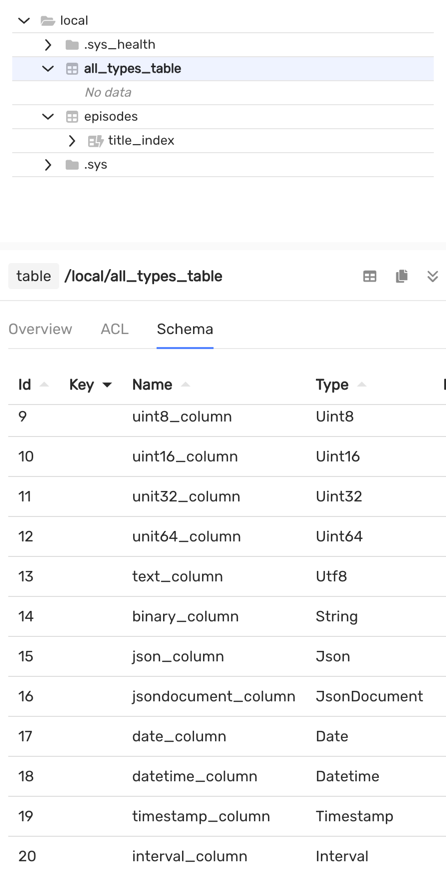

# Миграции схемы данных {{ ydb-short-name }} с помощью Liquibase

## Введение {#introduction}

[Liquibase](https://www.liquibase.com/) – это библиотека с открытым исходным кодом для отслеживания, управления и применения изменений схемы базы данных. Она расширяется диалектами для различных систем управления базами данных (СУБД), включая {{ ydb-short-name }}.

Диалект - это основная сущность в фреймворке Liquibase, которая помогает формировать SQL запросы к базе данных, учитывая специфику той или иной СУБД.

## Возможности диалекта {{ ydb-short-name }} {#ydb-dialect}

Основной функциональностью Liquibase является абстрактное описание схемы базы данных в `.xml`, `.json` или `.yaml` форматах. Что обеспечивает переносимость при смене одной СУБД на другую.

В диалекте поддержаны основные конструкции стандарта описания миграций (changeset).

### Создание таблицы

Changeset `createTable` отвечает за создание таблицы. Описание типов из SQL стандарта сопоставляется с примитивными типами {{ ydb-short-name }}. К примеру тип bigint будет конвертирован в Int64.



Вы также можете явно указать имя исходного типа, например `Int32`, `Json`, `JsonDocument`, `Bytes` или `Interval`. Однако в этом случае схема не будет переносимой.



Таблица сравнения описаний типов Liquibase с [типами {{ ydb-short-name }}](../../yql/reference/types/primitive.md):

| Liquibase типы                                                                                                                                                                                                                                                                                                                                                                                                                                                                                                | {{ ydb-short-name }} тип   |
|---------------------------------------------------------------------------------------------------------------------------------------------------------------------------------------------------------------------------------------------------------------------------------------------------------------------------------------------------------------------------------------------------------------------------------------------------------------------------------------------------------------|----------------------------|
| `boolean`, `java.sql.Types.BOOLEAN`, `java.lang.Boolean`, `bit`, `bool`                                                                                                                                                                                                                                                                                                                                                                                                                                       | `Bool`                     |
| `blob`, `longblob`, `longvarbinary`, `String`, `java.sql.Types.BLOB`, `java.sql.Types.LONGBLOB`, `java.sql.Types.LONGVARBINARY`, `java.sql.Types.VARBINARY`,`java.sql.Types.BINARY`, `varbinary`, `binary`, `image`, `tinyblob`, `mediumblob`, `long binary`, `long varbinary`                                                                                                                                                                                                                                | `Bytes` (синоним `String`) |
| `java.sql.Types.DATE`, `smalldatetime`, `date`                                                                                                                                                                                                                                                                                                                                                                                                                                                                | `Date`                     |
| `decimal`, `java.sql.Types.DECIMAL`, `java.math.BigDecimal`                                                                                                                                                                                                                                                                                                                                                                                                                                                   | `Decimal(22,9)`            |
| `double`, `java.sql.Types.DOUBLE`, `java.lang.Double`                                                                                                                                                                                                                                                                                                                                                                                                                                                         | `Double`                   |
| `float`, `java.sql.Types.FLOAT`, `java.lang.Float`, `real`, `java.sql.Types.REAL`                                                                                                                                                                                                                                                                                                                                                                                                                             | `Float`                    |
| `int`, `integer`, `java.sql.Types.INTEGER`, `java.lang.Integer`, `int4`, `int32`                                                                                                                                                                                                                                                                                                                                                                                                                              | `Int32`                    |
| `bigint`, `java.sql.Types.BIGINT`, `java.math.BigInteger`, `java.lang.Long`, `integer8`, `bigserial`, `long`                                                                                                                                                                                                                                                                                                                                                                                                  | `Int64`                    |
| `java.sql.Types.SMALLINT`, `int2`, `smallserial`, `smallint`                                                                                                                                                                                                                                                                                                                                                                                                                                                  | `Int16`                    |
| `java.sql.Types.TINYINT`, `tinyint`                                                                                                                                                                                                                                                                                                                                                                                                                                                                           | `Int8`                     |
| `char`, `java.sql.Types.CHAR`, `bpchar`, `character`, `nchar`, `java.sql.Types.NCHAR`, `nchar2`, `text`, `varchar`, `java.sql.Types.VARCHAR`, `java.lang.String`, `varchar2`, `character varying`, `nvarchar`, `java.sql.Types.NVARCHAR`, `nvarchar2`, `national`, `clob`, `longvarchar`, `longtext`, `java.sql.Types.LONGVARCHAR`, `java.sql.Types.CLOB`, `nclob`, `longnvarchar`, `ntext`, `java.sql.Types.LONGNVARCHAR`, `java.sql.Types.NCLOB`, `tinytext`, `mediumtext`, `long varchar`, `long nvarchar` | `Text` (синоним `Utf8`)    |
| `timestamp`, `java.sql.Types.TIMESTAMP`, `java.sql.Timestamp`                                                                                                                                                                                                                                                                                                                                                                                                                                                 | `Timestamp`                |
| `datetime`, `time`, `java.sql.Types.TIME`, `java.sql.Time`                                                                                                                                                                                                                                                                                                                                                                                                                                                    | `Datetime`                 |



В YDB тип данных `Timestamp` хранит дату с точностью до микросекунд, в то время как `java.sql.Timestamp` или `java.time.Instant` хранят временную метку с точностью до наносекунд. Обратите на это внимание при работе с этим типом данных.

Имена типов не чувствительны к регистру.



`dropTable` - удаление таблицы. Пример: `<dropTable tableName="episodes"/>`

### Изменение структуры таблицы

`addColumn` - добавление колонки. Пример:



- xml

  ```xml
  <addColumn tableName="seasons">
      <column name="is_deleted" type="bool"/>
  </addColumn>
  ```

- json

  ```json
  "changes": [
      {
        "addColumn": {
          "tableName": "seasons",
          "columns": [
            {
              "column": {
                "name": "is_deleted",
                "type": "bool"
              }
            }
          ]
        }
      }
    ]
  ```

- yaml

  ```yaml
  changes:
  - addColumn:
      tableName: seasons
      columns:
      - column:
          name: is_deleted
          type: bool
  ```



`createIndex` - создание вторичного индекса. Пример:



- xml

  ```xml
  <createIndex tableName="episodes" indexName="episodes_index" unique="false">
      <column name="title"/>
  </createIndex>
  ```

- json

  ```json
  "changes": [
      {
        "createIndex": {
          "tableName": "episodes",
          "indexName": "episodes_index",
          "unique": "false",
          "columns": {
            "column": {
              "name": "title"
            }
          }
        }
      }
  ```

- yaml

  ```yaml
  changes:
  - createIndex:
      tableName: episodes
      indexName: episodes_index
      unique: false
      columns:
      - column:
          name: title
  ```





YDB не поддерживает уникальный вторичный индекс.





Создание асинхронных индексов нужно делать через [нативные SQL миграции](https://docs.liquibase.com/concepts/changelogs/sql-format.html).



`dropIndex` - удаление вторичного индекса. Пример:



- xml

  ```xml
  <dropIndex tableName="series" indexName="series_index"/>
  ```

- json

  ```json
  "changes": [
    {
      "dropIndex": {
        "tableName": "series",
        "indexName": "series_index"
      }
    }
  ]
  ```

- yaml

  ```yaml
  changes:
  - dropIndex:
      tableName: series
      indexName: series_index
  ```



### Ввод данных в таблицу

`loadData`, `loadUpdateData` - загрузка данных из `CSV` файла. `loadUpdateData` загружает данные командой [{#T}](../../yql/reference/syntax/upsert_into.md).

`insert` - changeset, который осуществляет единичный insert в таблицу командой [{#T}](../../yql/reference/syntax/insert_into.md). Например:



- xml

  ```xml
  <insert tableName="episodes">
      <column name="series_id" valueNumeric="1"/>
      <column name="season_id" valueNumeric="1"/>
      <column name="episode_id" valueNumeric="1"/>
      <column name="title" value="Yesterday's Jam"/>
      <column name="air_date" valueDate="2023-04-03T08:46:23.456"/>
  </insert>
  ```

- json

  ```json
  "changes": [
    {
      "insert": {
        "tableName": "episodes",
        "columns": [
          {
            "column": {
              "name": "series_id",
              "valueNumeric": "1"
            }
          },
          {
            "column": {
              "name": "season_id",
              "valueNumeric": "1"
            }
          },
          {
            "column": {
              "name": "episode_id",
              "valueNumeric": "1"
            }
          },
          {
            "column": {
              "name": "title",
              "value": "Yesterday's Jam"
            }
          },
          {
            "column": {
              "name": "air_date",
              "valueDate": "2023-04-03T08:46:23.456"
            }
          }
        ]
      }
    }
  ]
  ```

- yaml

  ```yaml
  changes:
  - insert:
      tableName: episodes
      columns:
        - column:
            name: series_id
            valueNumeric: 1
        - column:
            name: season_id
            valueNumeric: 1
        - column:
            name: episode_id
            valueNumeric: 1
        - column:
            name: title
            value: Yesterday's Jam
        - column:
            name: air_date
            valueDate: 2023-04-03T08:46:23.456
  ```



Вы также можете указать любое значение в поле `value`. Данные из поля `value` в наборе изменений `insert` или `CSV` файлов будут автоматически преобразованы в требуемые типы с учетом строгой типизации в {{ ydb-short-name }}.

Таблица форматирования типов для загрузки в таблицу:

| YDB тип                                 | Формат описания                                                                                                                                                                                                                                           |
|-----------------------------------------|-----------------------------------------------------------------------------------------------------------------------------------------------------------------------------------------------------------------------------------------------------------|
| `Bool`                                  | `true` или `false`                                                                                                                                                                                                                                        |
| `Int8`, `Int16`, `Int32`, `Int64`       | Целочисленное число                                                                                                                                                                                                                                       |
| `Uint8`, `Uint16`, `Uint32`, `Uint64`   | Целое число без знака                                                                                                                                                                                                                                     |
| `Text`, `Bytes`, `Json`, `JsonDocument` | Строковое описание                                                                                                                                                                                                                                        |
| `Float`, `Double`, `Decimal(22, 9)`     | Вещественное число                                                                                                                                                                                                                                        |
| `Interval`                              | [ISO-8601](https://en.wikipedia.org/wiki/ISO_8601#Durations), соответствует классу `java.time.Duration` в Java.                                                                                                                                           |
| `Date`                                  | Шаблон `YYYY-MM-DD` календарной даты из стандарта [ISO-8601](https://ru.wikipedia.org/wiki/ISO_8601)                                                                                                                                                      |
| `Datetime`                              | Шаблон `YYYY-MM-DDThh:mm:ss`, timezone будет установлена `UTC`                                                                                                                                                                                            |
| `Timestamp`                             | Временная метка из стандарта [ISO-8601](https://ru.wikipedia.org/wiki/ISO_8601) соответствует классу `java.time.Instant` в Java, timezone будет установлена `UTC` (точность в микросекундах - ограничение типа данных `Timestamp` в {{ ydb-short-name }}) |                                                                               |

Пример `CSV` файла:

```csv
id,bool,bigint,smallint,tinyint,float,double,decimal,uint8,uint16,uint32,uint64,text,binary,json,jsondocument,date,datetime,timestamp,interval
2,true,123123,13000,112,1.123,1.123123,1.123123,12,13,14,15,kurdyukov-kir,binary,{"asd": "asd"},{"asd": "asd"},2014-04-06,2023-09-16T12:30,2023-07-31T17:00:00.00Z,PT10S
```



Чтобы понять, какие SQL-конструкции может выполнять {{ ydb-short-name }} и какие существуют ограничения на типы данных, ознакомьтесь с документацией по языку запросов [YQL](](../../yql/reference/index.md)).





Важно отметить, что кастомные инструкции YQL могут быть применены с помощью [нативных SQL-запросов](https://docs.liquibase.com/concepts/changelogs/sql-format.html).



## Как воспользоваться? {#using}

Есть два способа:



- Программно из Java / Kotlin приложения

  Как воспользоваться из Java / Kotlin подробно описано в [README](https://github.com/ydb-platform/ydb-java-dialects/tree/main/liquibase-dialect) проекта. Также есть [пример приложения Spring Boot](https://github.com/ydb-platform/ydb-java-examples/tree/master/jdbc/spring-liquibase-app), использующего его.

- Liquibase CLI

  Для начала нужно установить саму утилиту liquibase [любым из рекомендуемых способов](https://docs.liquibase.com/start/install/home.html). Затем нужно подложить актуальные .jar архивы [{{ ydb-short-name }} JDBC драйвера](https://github.com/ydb-platform/ydb-jdbc-driver/releases) и Liquibase [диалекта {{ ydb-short-name }}](https://mvnrepository.com/artifact/tech.ydb.dialects/liquibase-ydb-dialect/1.0.0) в папку `internal/lib`.

  ```bash
  # $(which liquibase)
  cd ./internal/lib/

  # you may need to sudo
  # set actual versions of .jar files
  curl -L -o ydb-jdbc-driver.jar https://repo.maven.apache.org/maven2/tech/ydb/jdbc/ydb-jdbc-driver-shaded/2.0.7/ydb-jdbc-driver-shaded-2.0.7.jar
  curl -L -o liquibase-ydb-dialect.jar https://repo.maven.apache.org/maven2/tech/ydb/dialects/liquibase-ydb-dialect/1.0.0/liquibase-ydb-dialect-1.0.0.jar
  ```

  Более подробное описание в разделе [manual library management](https://docs.liquibase.com/start/install/home.html) в документации Liquibase.

  Теперь утилиту командной строки liquibase можно использовать с {{ ydb-short-name }}.



## Сценарии использования liquibase

### Инициализация liquibase на пустой {{ ydb-short-name }}

Основной командой является `liquibase update`, которая применяет миграции, если текущая схема {{ ydb-short-name }} отстает от пользовательского описания.

Далее в примерах предполагается, использование следующего файла настроек `liquibase.properties`:

```properties
changelog-file=changelogs.xml
url=jdbc:ydb:grpc://localhost:2136/local
```

Применим к пустой базе данных следующий changeset:

```xml
<?xml version="1.0" encoding="UTF-8"?>
<databaseChangeLog
        xmlns="http://www.liquibase.org/xml/ns/dbchangelog"
        xmlns:xsi="http://www.w3.org/2001/XMLSchema-instance"
        xsi:schemaLocation="http://www.liquibase.org/xml/ns/dbchangelog
                      http://www.liquibase.org/xml/ns/dbchangelog/dbchangelog-3.8.xsd">

    <changeSet id="episodes" author="kurdyukov-kir">
        <comment>Table episodes.</comment>

        <createTable tableName="episodes">
            <column name="series_id" type="bigint">
                <constraints primaryKey="true"/>
            </column>
            <column name="season_id" type="bigint">
                <constraints primaryKey="true"/>
            </column>
            <column name="episode_id" type="bigint">
                <constraints primaryKey="true"/>
            </column>

            <column name="title" type="text"/>
            <column name="air_date" type="timestamp"/>
        </createTable>
        <rollback>
            <dropTable tableName="episodes"/>
        </rollback>
    </changeSet>
    <changeSet id="index_episodes_title" author="kurdyukov-kir">
        <createIndex tableName="episodes" indexName="index_episodes_title" unique="false">
            <column name="title"/>
        </createIndex>
    </changeSet>
</databaseChangeLog>
```

После исполнения команды `liquibase update`, liquibase напечатает следующий лог:

```bash
UPDATE SUMMARY
Run:                          2
Previously run:               0
Filtered out:                 0
-------------------------------
Total change sets:            2

Liquibase: Update has been successful. Rows affected: 2
Liquibase command 'update' was executed successfully.
```

После применения миграций схемы данных выглядит следующим образом:


Можно увидеть, что Liquibase создал две служебные таблицы `DATABASECHANGELOG` - лог миграций, `DATABASECHANGELOGLOCK` - таблица для взятия распределенной блокировки.

Содержимое таблицы DATABASECHANGELOG:

| AUTHOR        | COMMENTS        | CONTEXTS | DATEEXECUTED | DEPLOYMENT_ID | DESCRIPTION                                                    | EXECTYPE | FILENAME               | ID                   | LABELS | LIQUIBASE | MD5SUM                             | ORDEREXECUTED | TAG |
|:--------------|:----------------|:---------|:-------------|:--------------|:---------------------------------------------------------------|:---------|:-----------------------|:---------------------|:-------|:----------|:-----------------------------------|:--------------|:----|
| kurdyukov-kir | Table episodes. |          | 12:53:27     | 1544007500    | createTable tableName=episodes                                 | EXECUTED | migration/episodes.xml | episodes             |        | 4.25.1    | 9:4067056a5ab61db09b379a93625870ca | 1             |
| kurdyukov-kir | ""              |          | 12:53:28     | 1544007500    | createIndex indexName=index_episodes_title, tableName=episodes | EXECUTED | migration/episodes.xml | index_episodes_title |        | 4.25.1    | 9:49b8b0b22d18c7fd90a3d6b2c561455d | 2             |

### Эволюция схемы базы данных

Допустим нам нужно создать {{ ydb-short-name }} топик и выключить параметр `AUTO_PARTITIONING_BY_SIZE` таблицы. Это можно сделать нативным SQL скриптом:

```sql
--liquibase formatted sql

--changeset kurdyukov-kir:create-a-topic
CREATE TOPIC `my_topic` (
    CONSUMER my_consumer
) WITH (
     retention_period = Interval('P1D')
);

--changeset kurdyukov-kir:auto-partitioning-disabled
ALTER TABLE episodes SET (AUTO_PARTITIONING_BY_SIZE = DISABLED);
```

Также добавим новую колонку `is_deleted` и удалим индекс `index_episodes_title`:

```xml

<changeSet id="alter-episodes" author="kurdyukov-kir">
    <comment>Alter table episodes.</comment>

    <dropIndex tableName="episodes" indexName="index_episodes_title"/>

    <addColumn tableName="episodes">
        <column name="is_deleted" type="bool"/>
    </addColumn>
</changeSet>
<include file="/migration/sql/yql.sql" relativeToChangelogFile="true"/>
```

После исполнения `liquibase update` схема базы успешно обновится.

```bash
UPDATE SUMMARY
Run:                          3
Previously run:               2
Filtered out:                 0
-------------------------------
Total change sets:            5

Liquibase: Update has been successful. Rows affected: 3
Liquibase command 'update' was executed successfully.
```

Результатом будет удаление индекса, добавление колонки `is_deleted`, выключение параметра `AUTO_PARTITIONING_BY_SIZE`, а также создание топика:



### Инициализация liquibase в проекте с непустой схемой данных

Предположим, что я имею существующий проект с текущей схемой базы данных:



Чтобы начать использовать liquibase, требуется выполнить:

```bash
liquibase generate-changelog --changelog-file=changelog.xml
```

Содержимое сгенерированного changelog.xml:

```xml
<changeSet author="kurdyukov-kir (generated)" id="1711556283305-1">
    <createTable tableName="all_types_table">
        <column name="id" type="INT32">
            <constraints nullable="false" primaryKey="true"/>
        </column>
        <column name="bool_column" type="BOOL"/>
        <column name="bigint_column" type="INT64"/>
        <column name="smallint_column" type="INT16"/>
        <column name="tinyint_column" type="INT8"/>
        <column name="float_column" type="FLOAT"/>
        <column name="double_column" type="DOUBLE"/>
        <column name="decimal_column" type="DECIMAL(22, 9)"/>
        <column name="uint8_column" type="UINT8"/>
        <column name="uint16_column" type="UINT16"/>
        <column name="unit32_column" type="UINT32"/>
        <column name="unit64_column" type="UINT64"/>
        <column name="text_column" type="TEXT"/>
        <column name="binary_column" type="BYTES"/>
        <column name="json_column" type="JSON"/>
        <column name="jsondocument_column" type="JSONDOCUMENT"/>
        <column name="date_column" type="DATE"/>
        <column name="datetime_column" type="DATETIME"/>
        <column name="timestamp_column" type="TIMESTAMP"/>
        <column name="interval_column" type="INTERVAL"/>
    </createTable>
</changeSet>
<changeSet author="kurdyukov-kir (generated)" id="1711556283305-2">
    <createTable tableName="episodes">
        <column name="series_id" type="INT64">
            <constraints nullable="false" primaryKey="true"/>
        </column>
        <column name="season_id" type="INT64">
            <constraints nullable="false" primaryKey="true"/>
        </column>
        <column name="episode_id" type="INT64">
            <constraints nullable="false" primaryKey="true"/>
        </column>
        <column name="title" type="TEXT"/>
        <column name="air_date" type="DATE"/>
    </createTable>
</changeSet>
<changeSet author="kurdyukov-kir (generated)" id="1711556283305-3">
    <createIndex indexName="title_index" tableName="episodes">
        <column name="title"/>
    </createIndex>
</changeSet>
```

Затем нужно синхронизировать сгенерированный changelog.xml файл, делается это командой:

```bash
liquibase changelog-sync --changelog-file=dbchangelog.xml
```

Результатом будет синхронизация liquibase в вашем проекте:


## Подключение к {{ ydb-short-name }} {#connect-to-ydb}

В вышеуказанных примерах мы использовали Docker контейнер, для которого не требовалось дополнительных параметров для аутентификации.

Существуют различные варианты настройки аутентификации через параметр URL:

* Docker контейнер (anonymous authentication):<br/>`jdbc:ydb:grpc://localhost:2136/local`
* Self-hosted кластер:<br/>`jdbc:ydb:grpcs://<host>:2135/Root/testdb?secureConnectionCertificate=file:~/myca.cer`
* Подключение с использованием токена:<br/>`jdbc:ydb:grpcs://<host>:2135/path/to/database?token=file:~/my_token`
* Подключение с использованием сервисного аккаунта:<br/>`jdbc:ydb:grpcs://<host>:2135/path/to/database?saFile=file:~/sa_key.json`

Если ваш кластер настроен с использованием логина и пароля, процесс аутентификации происходит через параметры Liquibase.

За дополнительной информацией о различных настройках аутентификации обратитесь к соответствующему [разделу](../../concepts/auth.md).
