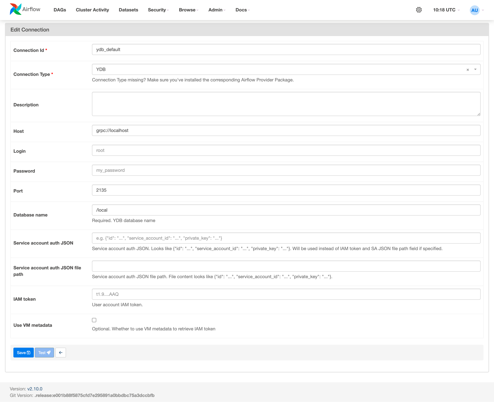
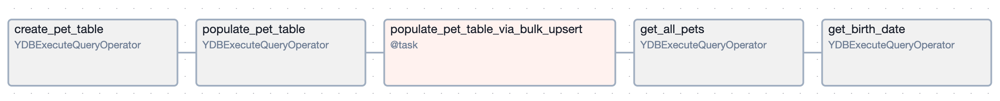

# {{ airflow-name }}

Интеграция {{ ydb-short-name }} с [{{ airflow-name }}](https://airflow.apache.org) позволяет автоматизировать сложные рабочие процессы и управлять ими. {{ airflow-name }} предоставляет возможности для планирования задач, мониторинга их выполнения и управления зависимостями между ними — оркестрацией. Использование Airflow для оркестрации задач, таких как загрузка данных в {{ydb-short-name}}, выполнение запросов и управление транзакциями, позволяет автоматизировать и оптимизировать операционные процессы. Это особенно важно для задач ETL, где данные больших объемов требуют регулярного извлечения, преобразования и загрузки.

Для работы под управлением {{ airflow-name }} {{ ydb-full-name }} предоставляет пакет [провайдера](https://airflow.apache.org/docs/apache-airflow-providers) [apache-airflow-providers-ydb](https://pypi.org/project/apache-airflow-providers-ydb/). [Задания {{ airflow-name }}](https://airflow.apache.org/docs/apache-airflow/stable/index.html) представляют собой приложения на языке Python, состоящие из набора [операторов {{ airflow-name }}](https://airflow.apache.org/docs/apache-airflow/stable/core-concepts/operators.html) и их [зависимостей](https://airflow.apache.org/docs/apache-airflow/stable/core-concepts/dags.html), определяющих порядок выполнения.

## Установка {#setup}

Для корректной работы пакета `apache-airflow-providers-ydb` необходимо на всех хостах {{ airflow-name }} выполнить следующие команды:

```shell
pip install ydb apache-airflow-providers-ydb
```

Для работы требуется Python версии не ниже, чем 3.8.

## Объектная модель {#object_model}

Пакет `airflow.providers.ydb` содержит набор компонентов для взаимодействия с {{ ydb-full-name }}:

- Оператор [YDBExecuteQueryOperator](#ydb_execute_query_operator) для интеграции задач в планировщик {{ airflow-name }}.
- Хук [YDBHook](#ydb_hook) для прямого взаимодействия с {{ ydb-name }}.

### YDBExecuteQueryOperator {#ydb_execute_query_operator}

Для выполнения запросов к {{ ydb-full-name }} используется {{ airflow-name }} оператор `YDBExecuteQueryOperator`.

Обязательные аргументы:

* `task_id` — название задания {{ airflow-name }}.
* `sql` — текст SQL-запроса, который необходимо выполнить в {{ ydb-full-name }}.

Опциональные аргументы:

* `ydb_conn_id` — идентификатор подключения с типом `YDB`, содержащий параметры соединения с {{ ydb-full-name }}. Если не указан, то используется соединение с именем [`ydb_default`](#ydb_default). Соединение `ydb_default` предустанавливается в составе {{ airflow-name }}, отдельно его заводить не нужно.
* `is_ddl` — признак, что выполняется [SQL DDL](https://en.wikipedia.org/wiki/Data_definition_language) запрос. Если аргумент не указан, или установлен в `False`, то будет выполняться [SQL DML](https://ru.wikipedia.org/wiki/Data_Manipulation_Language) запрос.
* `params` — словарь [параметров запроса](https://airflow.apache.org/docs/apache-airflow/stable/core-concepts/params.html).

Пример:

```python
ydb_operator = YDBExecuteQueryOperator(task_id="ydb_operator", sql="SELECT 'Hello, world!'")
```

В данном примере создается задание {{ airflow-name }} с идентификатором `ydb_operator`, которое выполняет запрос `SELECT 'Hello, world!'`.


### YDBHook {#ydb_hook}

Для выполнения низкоуровневых команд в {{ ydb-full-name }} используется {{ airflow-name }} класс `YDBHook`.

Опциональные аргументы:

* `ydb_conn_id` — идентификатор подключения с типом `YDB`, содержащий параметры соединения с {{ ydb-full-name }}. Если не указан, то используется соединение с именем [`ydb_default`](#ydb_default). Соединение `ydb_default` предустанавливается в составе {{ airflow-name }}, отдельно его заводить не нужно.
* `is_ddl` — признак, что выполняется [SQL DDL](https://en.wikipedia.org/wiki/Data_definition_language) запрос. Если аргумент не указан, или установлен в `False`, то будет выполняться [SQL DML](https://ru.wikipedia.org/wiki/Data_Manipulation_Language) запрос.

`YDBHook` поддерживает следующие методы:

- [bulk_upsert](#bulk_upsert);
- [get_conn](#get_conn).

#### bulk_upsert {#bulk_upsert}

Выполняет [пакетную вставку данных](../../recipes/ydb-sdk/bulk-upsert.md) в таблицы {{ ydb-full-name }}.

Обязательные аргументы:

* `table_name` — название таблицы {{ ydb-full-name }}, куда будет выполняться вставка данных.
* `rows` — массив строк для вставки.
* `column_types` — описание типов колонок.


Пример:

```python
hook = YDBHook(ydb_conn_id=...)
column_types = (
        ydb.BulkUpsertColumns()
        .add_column("pet_id", ydb.OptionalType(ydb.PrimitiveType.Int32))
        .add_column("name", ydb.PrimitiveType.Utf8)
        .add_column("pet_type", ydb.PrimitiveType.Utf8)
        .add_column("birth_date", ydb.PrimitiveType.Utf8)
        .add_column("owner", ydb.PrimitiveType.Utf8)
    )

rows = [
    {"pet_id": 3, "name": "Lester", "pet_type": "Hamster", "birth_date": "2020-06-23", "owner": "Lily"},
    {"pet_id": 4, "name": "Quincy", "pet_type": "Parrot", "birth_date": "2013-08-11", "owner": "Anne"},
]
hook.bulk_upsert("pet", rows=rows, column_types=column_types)
```

В данном примере создается объект `YDBHook`, через который выполняется операция пакетной вставки данных `bulk_upsert`.

#### get_conn {#get_conn}

Возвращает объект `YDBConnection`, реализующий интерфейс [`DbApiConnection`](https://peps.python.org/pep-0249/#connection-objects) для работы с данными. Класс `DbApiConnection` обеспечивает стандартизированный интерфейс для взаимодействия с базой данных, позволяющий выполнять такие операции, как подключение, выполнение SQL-запросов и управление транзакциями, независимо от конкретной системы управления базами данных.

Пример:

```python
hook = YDBHook(ydb_conn_id=...)

# Выполняем SQL-запрос и получаем курсор
connection = hook.get_conn()
cursor = connection.cursor()
cursor.execute("SELECT * from pet;")

# Извлекаем результат и имена колонок
result = cursor.fetchall()
columns = [desc[0] for desc in cursor.description]

# Закрываем курсор и соединение
cursor.close()
connection.close()
```

В данном примере создается объект `YDBHook`, у созданного объекта запрашивается объект `YDBConnection`, через который выполняется чтение данных и получение списка колонок.

## Подключение к {{ ydb-full-name }} {#ydb_default}

Для подключения к {{ ydb-full-name }} необходимо создать новое или отредактировать существующее [подключение {{ airflow-name }}](https://airflow.apache.org/docs/apache-airflow/stable/howto/connection.html) с типом `YDB`.



Где:

- `Connection Id` - название подключения {{ airflow-name }}.
- `Host` - протокол и адрес кластера {{ ydb-full-name }}.
- `Port` - порт для подключения к кластеру {{ ydb-full-name }}.
- `Database name` - название базы данных {{ ydb-full-name }}.

Укажите реквизиты для одного из следующих способов аутентификации на кластере {{ ydb-full-name }}:

- `Login` и `Password` - укажите реквизиты пользователя для аутентификации [по логину и паролю](../../security/authentication.md#static-credentials).
- `Service account auth JSON` - укажите значение [`Service Account Key`](../../security/authentication.md#iam).
- `Service account auth JSON file path` - укажите путь к файлу, содержащему `Service Account Key`.
- `IAM token` - укажите [IAM токен](../../security/authentication.md#iam).
- `Use VM metadata` - указание использовать [метаданные виртуальной машины](../../security/authentication.md#iam).

## Соответствие YQL и Python-типов

Ниже приведены правила преобразования YQL-типов в Python-результаты. Типы, не указанные в списке ниже, не поддерживаются.

### Скалярные типы {#scalars-types}

| YQL-тип | Python-тип | Пример в Python |
| --- | --- | --- |
| `Int8`, `Int16`, `Int32`, `Uint8`, `Uint16`, `Uint32`, `Int64`, `Uint64` | `int` | `647713` |
| `Bool` | `bool` | True |
| `Float`, `float` | `float`<br/>NaN и Inf представляются в виде `None` | `7.88731023`<br/>`None` |
| `Decimal` | `Decimal` | `45.23410083` |
| `Utf8` | `str` | `Текст строки` |
| `String` | `str` | `Текст строки` |

### Сложные типы {#complex-types}

| YQL-тип | Python-тип | Пример в Python |
| --- | --- | --- |
| `Json`, `JsonDocument` | `str` (весь узел вставляется как строка) | `{"a":[1,2,3]}` |
| `Date` | `datetime.date` | `2022-02-09` |
| `Datetime`, `Timestamp` | `datetime.datetime` | `2022-02-09 10:13:11` |

### Опциональные типы {#optional-types}

| YQL-тип | Python-тип | Пример в Python |
| --- | --- | --- |
| `Optional` | Оригинальный тип или None | `1` |

### Контейнеры {#containers}

| YQL-тип | Python-тип | Пример в Python |
| --- | --- | --- |
| `List<Type>` | `list` | `[1,2,3,4]` |
| `Dict<KeyType, ValueType>` | `dict` | `{key1: "value1", key2: "value2"}` |
| `Set<KeyType>` | `set` | `set(key_value1, key_value2)` |
| `Tuple<Type1, Type2>` | `tuple` | `(element1, element2)` |
| `Struct<Name:Utf8,Age:Int32>`| `dict` | `{ "Name": "value1", "Age": value2 }` |

### Специальные типы {#special-types}

| YQL-тип | Python-тип |
| --- | --- |
| `Void`, `Null` | `None` |
| `EmptyList` | `[]` |
| `EmptyDict` | `{}` |

## Пример {#example}

Для выполнения запросов к {{ ydb-full-name }} в составе пакета содержится оператор {{ airflow-name }} [`YDBExecuteQueryOperator`](https://airflow.apache.org/docs/apache-airflow-providers-ydb/stable/_api/airflow/providers/ydb/operators/ydb/index.html) и хук [`YDBHook`](https://airflow.apache.org/docs/apache-airflow-providers-ydb/stable/_api/airflow/providers/ydb/hooks/ydb/index.html).

В примере ниже создается задание `create_pet_table`, создающее таблицу в {{ ydb-full-name }}. После успешного создания таблицы вызывается задание `populate_pet_table`, заполняющее таблицу данными с помощью команд `UPSERT`, и задание `populate_pet_table_via_bulk_upsert`, заполняющее таблицу с помощью команд пакетной вставки данных [`bulk_upsert`](../../recipes/ydb-sdk/bulk-upsert.md). После выполнения вставки данных выполняется операция чтения с помощью задания `get_all_pets` и задание для параметризованного чтения данных `get_birth_date`.



Для выполнения запросов к базе данных {{ ydb-short-name }} используется предварительно созданное соединение c {{ ydb-short-name }} типа [YDB Connection](https://airflow.apache.org/docs/apache-airflow-providers-ydb/stable/connections/ydb.html) c именем `test_ydb_connection`.

```python
from __future__ import annotations

import datetime

import ydb
from airflow import DAG
from airflow.decorators import task
from airflow.providers.ydb.hooks.ydb import YDBHook
from airflow.providers.ydb.operators.ydb import YDBExecuteQueryOperator

@task
def populate_pet_table_via_bulk_upsert():
    hook = YDBHook(ydb_conn_id="test_ydb_connection")
    column_types = (
        ydb.BulkUpsertColumns()
        .add_column("pet_id", ydb.OptionalType(ydb.PrimitiveType.Int32))
        .add_column("name", ydb.PrimitiveType.Utf8)
        .add_column("pet_type", ydb.PrimitiveType.Utf8)
        .add_column("birth_date", ydb.PrimitiveType.Utf8)
        .add_column("owner", ydb.PrimitiveType.Utf8)
    )

    rows = [
        {"pet_id": 3, "name": "Lester", "pet_type": "Hamster", "birth_date": "2020-06-23", "owner": "Lily"},
        {"pet_id": 4, "name": "Quincy", "pet_type": "Parrot", "birth_date": "2013-08-11", "owner": "Anne"},
    ]
    hook.bulk_upsert("pet", rows=rows, column_types=column_types)


with DAG(
    dag_id="ydb_demo_dag",
    start_date=datetime.datetime(2020, 2, 2),
    schedule="@once",
    catchup=False,
) as dag:
    create_pet_table = YDBExecuteQueryOperator(
        task_id="create_pet_table",
        sql="""
            CREATE TABLE pet (
            pet_id INT,
            name TEXT NOT NULL,
            pet_type TEXT NOT NULL,
            birth_date TEXT NOT NULL,
            owner TEXT NOT NULL,
            PRIMARY KEY (pet_id)
            );
          """,
        is_ddl=True,  # must be specified for DDL queries
        ydb_conn_id="test_ydb_connection"
    )

    populate_pet_table = YDBExecuteQueryOperator(
        task_id="populate_pet_table",
        sql="""
              UPSERT INTO pet (pet_id, name, pet_type, birth_date, owner)
              VALUES (1, 'Max', 'Dog', '2018-07-05', 'Jane');

              UPSERT INTO pet (pet_id, name, pet_type, birth_date, owner)
              VALUES (2, 'Susie', 'Cat', '2019-05-01', 'Phil');
            """,
        ydb_conn_id="test_ydb_connection"
    )

    get_all_pets = YDBExecuteQueryOperator(task_id="get_all_pets", sql="SELECT * FROM pet;", ydb_conn_id="test_ydb_connection")

    get_birth_date = YDBExecuteQueryOperator(
        task_id="get_birth_date",
        sql="SELECT * FROM pet WHERE birth_date BETWEEN 'not_var{{params.begin_date}}' AND 'not_var{{params.end_date}}'",
        params={"begin_date": "2020-01-01", "end_date": "2020-12-31"},
        ydb_conn_id="test_ydb_connection"
    )

    (
        create_pet_table
        >> populate_pet_table
        >> populate_pet_table_via_bulk_upsert()
        >> get_all_pets
        >> get_birth_date
    )
```
