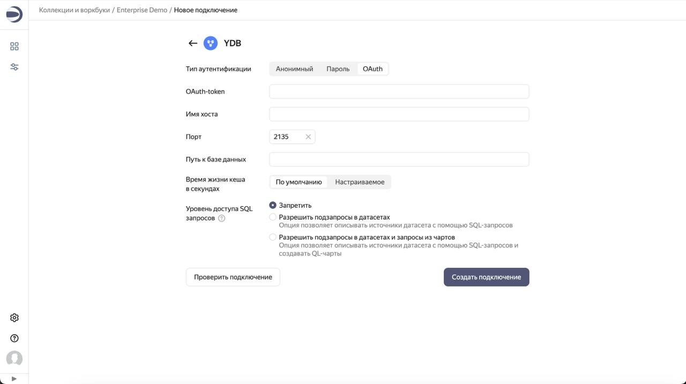

# DataLens

[DataLens](https://datalens.tech) — инструмент бизнес-аналитики (BI) и визуализации данных с открытым исходным кодом, который позволяет анализировать и отображать данные из различных источников, включая {{ ydb-short-name }}. DataLens позволяет описывать модели данных, строить графики и визуализации, собирать дашборды и обеспечивать коллективный доступ к аналитике.

## Предварительные требования

DataLens должен быть [развёрнут и настроен](https://datalens.tech/docs/ru/quickstart.html).



В этой статье рассматривается интеграция {{ ydb-short-name }} и DataLens, развёрнутых самостоятельно. Документацию по интеграции соответствующих управляемых сервисов см. в [документации Yandex Cloud](https://yandex.cloud/ru/docs/datalens/operations/connection/create-ydb).



## Добавление подключения к базе данных {{ ydb-short-name }} {#add-database-connection}

Чтобы создать подключение к {{ ydb-short-name }}:

1. Перейдите на страницу [воркбука](https://datalens.tech/docs/ru/workbooks-collections/index.html) или создайте новый.
2. В правом верхнем углу нажмите **Создать** → **Подключение**.
3. Выберите тип подключения **{{ ydb-short-name }}**.
4. Укажите тип аутентификации:

   

   - Анонимный {#anonymous}

     * **Имя хоста** — хостнейм для подключения к {{ ydb-short-name }}.
     * **Порт** — порт подключения к {{ ydb-short-name }}. По умолчанию — 2135.
     * **Путь к базе данных** — имя базы данных для подключения.

   - Пароль {#password}

     * **Имя хоста** — хостнейм для подключения к {{ ydb-short-name }}.
     * **Порт** — порт подключения к {{ ydb-short-name }}. По умолчанию — 2135.
     * **Путь к базе данных** — имя базы данных для подключения.
     * **Имя пользователя** — имя пользователя для подключения к {{ ydb-short-name }}.
     * **Пароль** — пароль пользователя.

   - OAuth {#oauth}

     * **OAuth-токен** — OAuth-токен для доступа к {{ ydb-short-name }}.
     * **Имя хоста** — хостнейм для подключения к {{ ydb-short-name }}.
     * **Порт** — порт подключения к {{ ydb-short-name }}. По умолчанию — 2135.
     * **Путь к базе данных** — имя базы данных для подключения.

   

   * **Время жизни кэша в секундах** — установите время жизни кэша или оставьте значение по умолчанию. Рекомендуемое значение — 300 секунд (5 минут).
   * **Уровень доступа к SQL-запросам** — позволяет использовать собственные SQL-запросы для создания датасета.

5. Нажмите **Создать подключение**.
6. Укажите имя подключения и нажмите **Создать**.
7. Перейдите к [созданию датасета](https://datalens.tech/docs/ru/dataset/index.html).

## Пример

